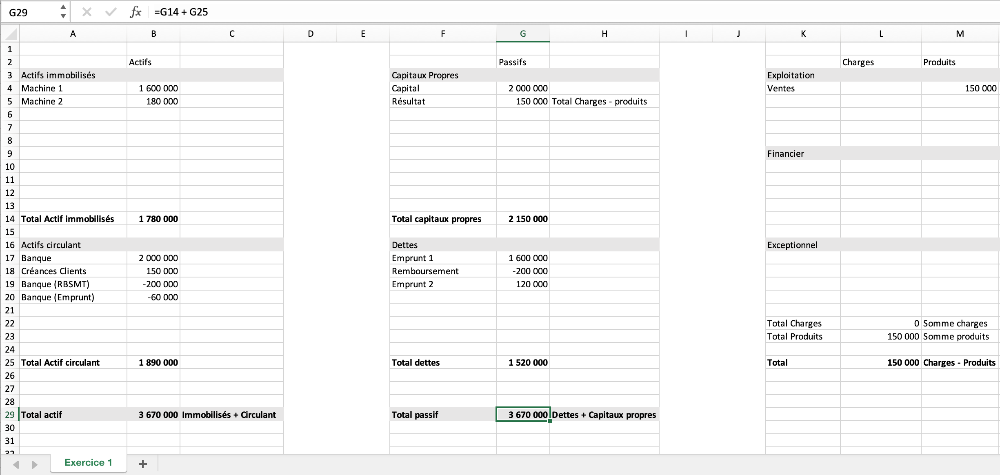

# Gestion financiere

Notes de cours par `Thomas Peugnet`. 

## Evaluation

- Contrôle continu - 60%
  - TDs : Etude de cas (bilan, comptabilité...)
- QCM - 40%

## Introduction

Bilan comptable : Permet d'évaluer le patrimoine de l'entreprise. Contient les actifs et les passifs.

Bilan : Biens/Dettes = Patrimoine

Le taux d'imposition d'une entreprise en France est de 25%.

**Actifs** : Contient les biens. Ce que l'entreprise possède.

- Immobilisés (tout ce que possède l'entreprise, long terme)
  - Corporelles : tout ce qui est physique.
  - Incorporelles : logiciels, brevets etc.
  - Financiers : 
- Circulant : Biens ne gardant pas la même valeur, bougeant tout le temps (exemple : stocks) (court et moyen terme)
  - Créances : Argent qui est dû par les clients
  - Disponibilités : Argent disponible dans l'entreprise

**Passifs** : Contient les dettes. Ce que l'entreprise doit.

- Capitaux propres
  - Ressources fournies par les actionnaires

- Dettes

**Compte de résultat :** consommation/production = activité

- **Consommation/Charges**

  - Exploitation
    - Consommables..
  - Financier
    - Intérêts sur un prêt, Pertes en actions...

  - Exceptionnelles
    - Toute dépense non-régulière, impromptue et non-prévue

- **Production/Produits**

  - Exploitation
    - Ventes (Principalement)
  - Financier

### Déroulement

1. 31/12 - Bilan et compte de résultat
2. 30/06 - Assemblée Générale Ordinaire
   1. Répartition du bénéfice

**Réparatition du bénéfice :** Séparation entre l'entreprise (**réserves**) et les associés (**dividendes**).

**Coût historique : ** Blocage de la valeur d'achat. Un matériel ne perdra pas en valeur chaque année, le coup d'origine est conservé.

**Principe de prudence** : Constatation des pertes, même infimes. Le bilan se doit d'être le plus pessimiste possible.

| Actif | Brut             | Amortissement | Net (Brut - Amrtst) |
| ----- | ---------------- | ------------- | ------------------- |
|       | Valeur d'origine | Dépréciation  | Valeur résiduelle   |

L'ammortissement est estimé selon une méthode de calcul. La méthode la plus fréquemment utilisée est la **méthode linéaire**.

### Méthode linéaire

**Amortissement** : Valeur d'origine $\times$ taux $\times$ prorata temporis

**Valeur d'origine :** Coût de mise en service (HT déductible)

**Coût de mise en service :** Tous les coûts jusqu'à la mise en service. Comprend donc le prix d'achat, frais d'achat (douane, stockage temporaire...), frais d'installation, frais de réglage.

**Taux :** $\frac{100%}{\text{Duree d'utilisation}}$, avec la durée d'utilisation définie par les ingénieurs (entre autres).

**Prorata temporis :** Nombre de mois d'utilisation par rapport à une année. $\frac{\text{Nombre de jours d'utilisation}}{\text{360 jours}}$. Dans cette technique, on considère que chaque mois possède 30 jours.

<u>Exemple :</u> Matériel utilisé 6 mois sur 12, donc un prorata temporis de $\frac{1}{2}$.

# TDs

## TD1

### Exercice 1

### Exercice 2

### Exercice 3

