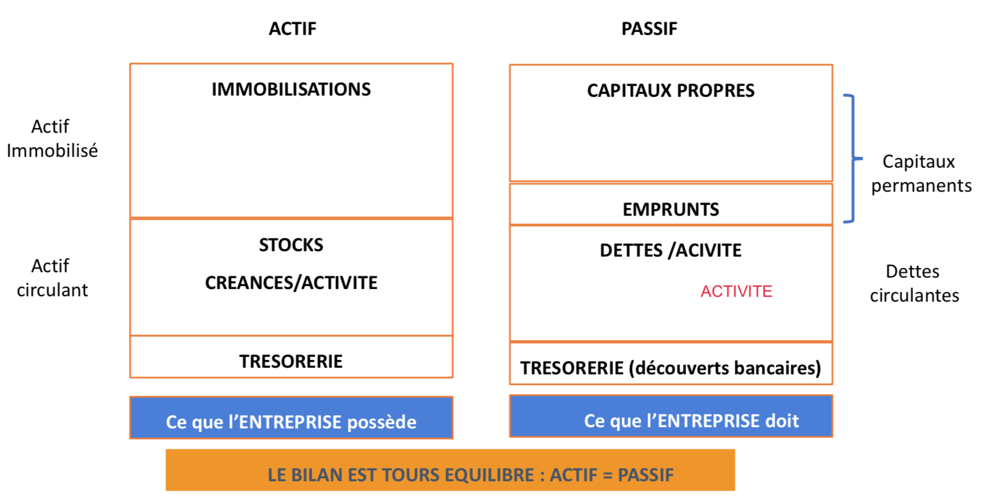
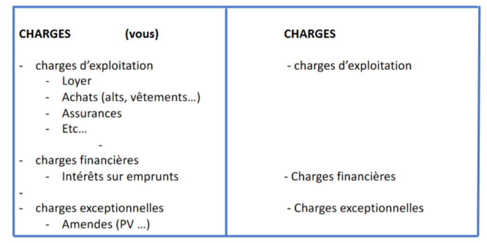
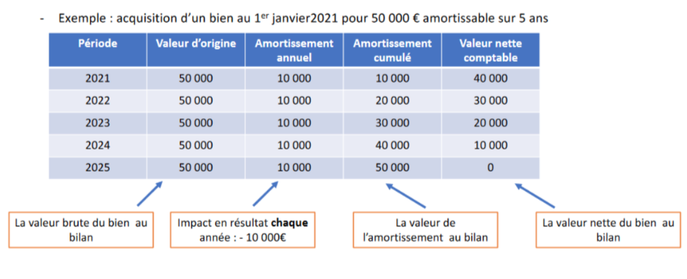
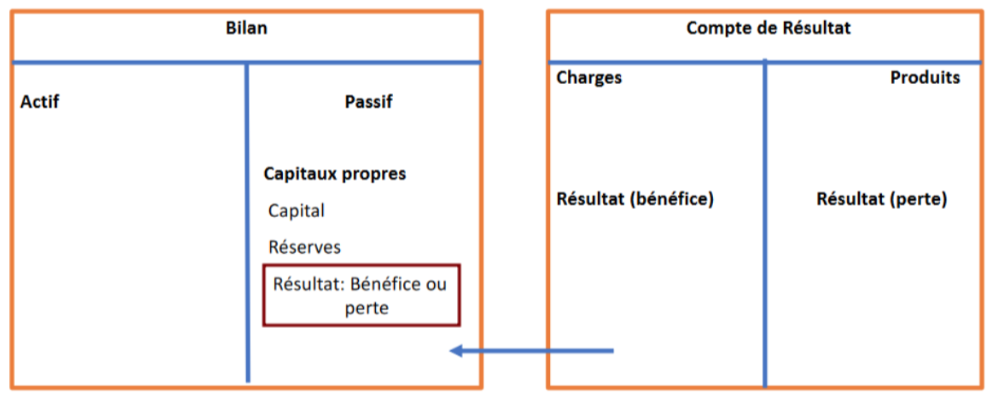
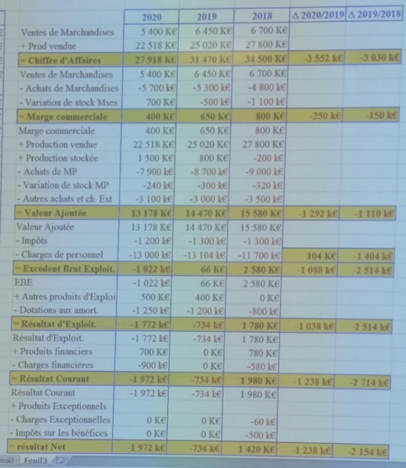
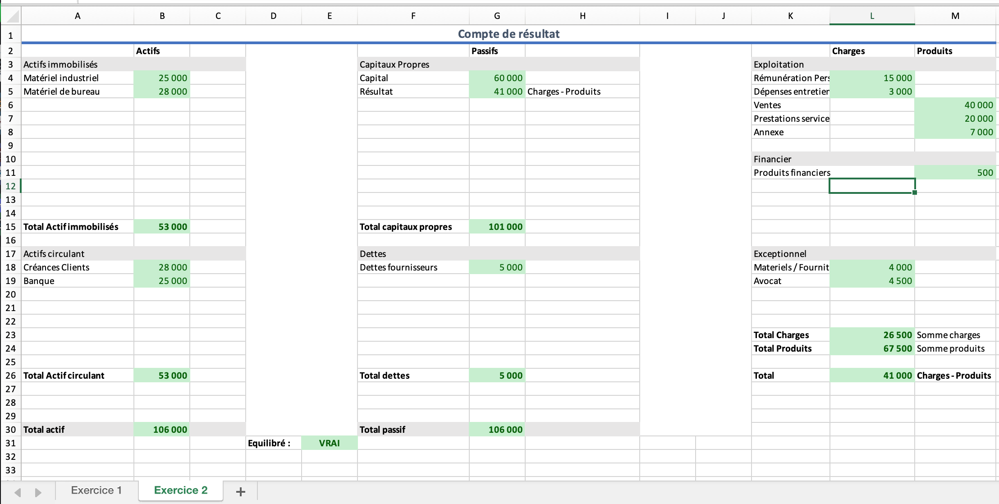
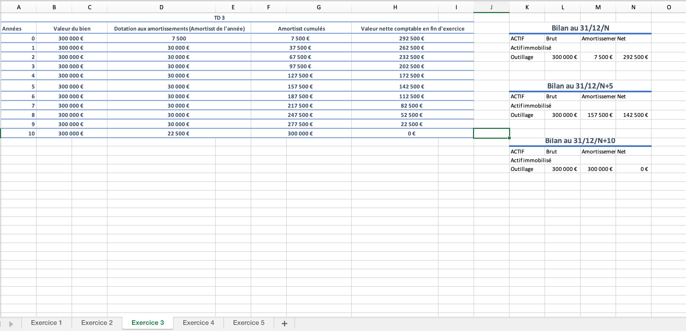

# Gestion financiere

Notes de cours par `Thomas Peugnet`. 

## Evaluation

- Contrôle continu - 60%
  - TDs : Etude de cas (bilan, comptabilité...)
- QCM - 40%

## Introduction

Bilan comptable : Permet d'évaluer le patrimoine de l'entreprise. Contient les actifs et les passifs.

Bilan : Biens/Dettes = Patrimoine

Le taux d'imposition d'une entreprise en France est de 25%.

**Actifs** : Contient les biens. Ce que l'entreprise possède.

- Immobilisés (tout ce que possède l'entreprise, long terme)
  - Corporelles : tout ce qui est physique.
  - Incorporelles : logiciels, brevets etc.
  - Financiers : 
- Circulant : Biens ne gardant pas la même valeur, bougeant tout le temps (exemple : stocks) (court et moyen terme)
  - Créances : Argent qui est dû par les clients
  - Disponibilités : Argent disponible dans l'entreprise

**Passifs** : Contient les dettes. Ce que l'entreprise doit.

- Capitaux propres
  - Ressources fournies par les actionnaires

- Dettes

**Compte de résultat :** consommation/production = activité

- **Consommation/Charges**

  - Exploitation
    - Consommables..
  - Financier
    - Intérêts sur un prêt, Pertes en actions...

  - Exceptionnelles
    - Toute dépense non-régulière, impromptue et non-prévue

- **Production/Produits**

  - Exploitation
    - Ventes (Principalement)
  - Financier

**Remarque :** Dans les charges, nous ne mettns que ce qui est consommé.

>Ex: Pour une période donnée on a achats de MP=100 SI=0. et SF=20 à L’entreprise a acheté 100 et consommé 80 Donc coût d’achat des MP consommées = 100-20 = 80

> Ex: Pour une période donnée on a achats de MP=100 SI=50. et SF=20 à L’entreprise a acheté 100, a tout consommé plus du stock pour 30. Donc coût d’achat des MP consommées = 100 + 30 = 130

### Déroulement

1. 31/12 - Bilan et compte de résultat
2. 30/06 - Assemblée Générale Ordinaire
   1. Répartition du bénéfice

**Répartition du bénéfice :** Séparation entre l'entreprise (**réserves**) et les associés (**dividendes**).

**Coût historique : ** Blocage de la valeur d'achat. Un matériel ne perdra pas en valeur chaque année, le coup d'origine est conservé.

**Principe de prudence** : Constatation des pertes, même infimes. Le bilan se doit d'être le plus pessimiste possible.

| Actif | Brut             | Amortissement | Net (Brut - Amrtst) |
| ----- | ---------------- | ------------- | ------------------- |
|       | Valeur d'origine | Dépréciation  | Valeur résiduelle   |

L'ammortissement est estimé selon une méthode de calcul. La méthode la plus fréquemment utilisée est la **méthode linéaire**.

### Méthode linéaire

**Amortissement** : Valeur d'origine $\times$ taux $\times$ prorata temporis

**Valeur d'origine :** Coût de mise en service (HT déductible)

**Coût de mise en service :** Tous les coûts jusqu'à la mise en service. Comprend donc le prix d'achat, frais d'achat (douane, stockage temporaire...), frais d'installation, frais de réglage.

**Taux :** $\frac{100%}{\text{Duree d'utilisation}}$, avec la durée d'utilisation définie par les ingénieurs (entre autres).

**Prorata temporis :** Nombre de mois d'utilisation par rapport à une année. $\frac{\text{Nombre de jours d'utilisation}}{\text{360 jours}}$. Dans cette technique, on considère que chaque mois possède 30 jours.

<u>Exemple :</u> Matériel utilisé 6 mois sur 12, donc un prorata temporis de $\frac{1}{2}$.

### Résultats

- Résultat **d'exploitation** : Produits d'exploitation - charges d'exploitation
- Résultat **courant** : Résultat d'exploitation - Résultat financier
- Résultat **net avant impôts** : Résultat courant - résultat exceptionnel
- Résultat **net après impôts** : Résultat net avant impôt - impôt sur les sociétés.

### Impact du compte de résultat sur le bilan

## Informations importantes

- Patrimoine $\Leftrightarrow$ Capitaux propres  : Apports + réserves / résultat
- Bilan : Valeur patrimoniale de l'entreprise à la date T
- Patrimoine $\neq$ Trésorerie disponible : On peut être riche mais à découvert :laughing:
- Le compte de résultat permet de décrire l'activité de l'entreprise et de calculer le résultat (Produits - Charges)
- Il existe des décalages entre l'encaissement de produits et le paiement des charges
- Le chiffre d'affaire est toujours calculé hors taxes
- Deux types d'activités :
  - Negoce : Vendre un produit qui n'a pas été transformé (marchandise)
  - Industrie : Vendre ce qui a été fabriqué par l'entreprise (production vendue)
- La prestation de service correspond au temps passé
- **Marge commerciale** : Vente marchandises - Coût d'achat des marchandises vendues 
  - Achats de marchandises $\pm$ variation de stockes de marchandises
- Résultat de l'exercice : Résultat courant avant impôts $\pm$ Résultat exceptionnel - Impôts sur les bénéfices - Participation des salariés

*Exemple :*

*Commentaires :*

- Le chiffre d'affaires baisse régulièrement $-3M \Rightarrow$ le marché se réduit
- Le CA diminue et la marge est également plus faible sur ce dernier
  - Cela affaiblit également la marge commerciale
- Le CA diminue donc la Valeur Ajoutée diminue également
- Pendant les 3 années, le taux de VA (Ce qui reste en pourcentage une fois qu'on enlève les charges) reste le même, donc la chute de la VA provident donc de la réduction de l'activité

- L'année 2020 dégage une Insuffisance Brute d'Exploitation (IBE) (i.e. une EBE négatif)
- L'EBE de 2019 a fortement baissé à cause d'embauches qui ont augmenté les charges de personnel de 1404k€
- Le Résultat d'Exploitation a diminué en 2019 de façon importante à cause d'investissements qui ont augmenté les Dotations aux Amortissements et aux Provision

# Analyse Financière

## Soldes intermédiaires de gestion

**Objectif : ** 

- Comprendre ce qui fait perdre/gagner de l'argent
- Rentabilité de l'entreprise
- Distinction charges internes/externes

## Types d'entreprises

- Entreprise négoce : Chiffre d'affaires : Vente de marchandises
- Entreprise de production : CA : Production vendue
- Entreprise de production & négoce : CA : $\sum$ Production vendue et marchandises
- Entreprise de service : CA : Prestation vendue

## Derniers principes

- Tout emploi doit être financé par une ressource d'une durée au moins équivalente à la durée de l'emploi

- La sécurité est opposée à la rentabilité. Si on ne prend pas de risque, on gagne peu.
- Il doit y avoir un équilibre entre emplois Long Terme et ressources LT / emplois Moyen Terme et ressources MT.
- Fonds De Roulement : Réserves pour antivipes les besoins de financement MT
  - FDR = Ressources LT - Emplois LT
- Besoin en FDR : Besoin de financement venant de la zone MT, c'est à dire que les emplois MT ne sont pas financés par les ressources MT.
  - BFR = Emplois MT - Ressources MT
- Trésorerie Net : Ensemble des sommes d'argent mobilisables à court terme
  - TN = Trésorerie Active - Trésorerie Passive

**Ce qui nous donne donc :**

- FDR = BFR + TN
- Si FDR > 0 et FDR < BFR alors TN > 0 $\Rightarrow$ Déséquilibre financier
- Si FDR > 0 et BFR < 0 alors TN > 0 $\Rightarrow$ Grande stabilité financière
- Si FDR > 0 et BFR > 0 alors TN < 0 $\Rightarrow$ Grande difficulté financière

## Construction du bilan fonctionnel

### Retraitements comptables

1. Transfert des amortissements et des provisions pour dépréciation vers le haut du passif, afin de les ajouter aux capitaux propres et former ainsi une partie nommée "Fonds Propres".

| Actif            | Brut | Amortissement | Net        | Passif -> Fonds propres     |      |
| ---------------- | ---- | ------------- | ---------- | --------------------------- | ---- |
| Actif immobilisé |      | :no_entry:    | :no_entry: | Capitaux propres :no_entry: |      |
| Actif circulant  |      | :no_entry:    | :no_entry: | Dettes                      |      |
| Total            |      | :no_entry:    | :no_entry: | Total                       |      |

2. Séparation du poste Emprunts

| Actif            | Brut | Passif            |      |
| ---------------- | ---- | ----------------- | ---- |
| Actif immobilisé |      | Fonds Propres     |      |
| Actif circulant  |      | Dettes : Emprunts |      |
| Total            |      | Total             |      |

### Retraitements extra-comptables

1. Ajout d'effets escomptés non échus (E.E.N.E)

## Présentation du bilan fonctionnel

| Actif                                             | Passif                                               |
| ------------------------------------------------- | ---------------------------------------------------- |
| Actif immobilisé                                  | Capitaux Permanents (Fonds propres + LT)             |
| Actif circulant (Exploitation, H-exp. Trésorerie) | Dettes circulantes (Exploitation, H-exp. Trésorerie) |

## Besoin de fonds de roulement

| Actif                             | Passif                               |
| --------------------------------- | ------------------------------------ |
| A.I.                              | C.P.e                                |
| Actif circulant exploitation      | Dettes circulantes exploitation      |
| Actif circulant hors-exploitation | Dettes circulantes hors-exploitation |
| Trésorerie Active                 | Trésorerie Passive                   |

## Valeurs remarquables

**Fonds de roulement net global : FRNG**

**BFR d'exploitation : BFRE** = Actif circulant exploitation (ACE) - dettes exploitation (DCE)

**BFR Hors exploitatino : BFRHE** = Acrif crculant HE (ACHE) - dettes HE (DCHE)

**Trésorerie nette : TN** = Trésorerie active - trésorerie passive

# TDs

## TD1

### Exercice 1

### Exercice 2

### Exercice 3

