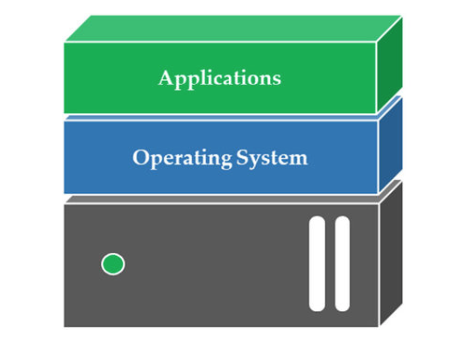

# Virtualisation de stockage

Notes de cours par `Thomas PEUGNET`.

# Introduction

## Références

https://pdfbib.com/pdf/0704-cours-virtualisation-et-cloud.pdf

https://www.asprom.com/technologie/Virtualisation.pdf

https://perso.univ-lyon1.fr/fabien.rico/site/_media/cloud:2018:virtualisation-intro.pdf

## Définitions

***Virtualiser** : proposer, par l'intermédiaire d'une couche d'abstraction proche du matériel, une vue multiple d'un matériel unique, en sérialisant les appels vus concurrents de l'extérieur.* - [Cours en ligne](https://perso.univ-lyon1.fr/fabien.rico/site/_media/cloud:2018:virtualisation-intro.pdf)

Principes fondamentaux de la virtualisation :

- **Le cloisonnement** : chaque système d’exploitation a un fonctionnement indépendant, et ne peut interférer avec les autres en aucune manière.
- **La transparence** : le fait de fonctionner en mode virtualisé ne change rien au fonctionnement du système d’exploitation et a fortiori des applications. La transparence implique la **compatibilité** : toutes les applications peuvent tourner sur un système virtualisé, et leur fonctionnement n'est en rien modifié. 

***Émulation :** Simulation par des moyens matériels et logiciels d'un ordinateur d'un certain type vers un ordinateur d'un autre type.* - Larousse

# Architecture

## Classique

Une architecture classique peut se schématiser de la façon suivante.

# Hyperviseurs

*Un hyperviseur est une plate-forme de virtualisation qui permet à plusieurs systèmes d’exploitation de travailler sur une même machine physique en même temps.*

## Type 1

Un hyperviseur de type 1 est un système d'exploitation permettant de virtualiser des ordinateurs invités, des conteneurs, etc.

Nous pouvons notamment noter ESXi, un OS d'hyperviseur développé par VMware, ou Proxmox.

Ils peuvent être représentés de la façon suivante, par rapport à une architecture classique.

## Type 2

Un hyperviseur de type 2, beaucoup plus connu par les particuliers, est une application pouvant émuler des machines virtuelles ou des conteneurs. VirtualBox d'Oracle, VMware Fusion/Workstation en sont de bons exemples.

Il se différencient de la manière suivante, par rapport à un hyperviseur de type 1.

Nous pouvons noter que `Host OS` est ici le système d'exploitation (linux, macOS ou Windows) sur lequel le logiciel de virtualisation va être lancé.

## Avantages

### Particulier

De façon générale, les hyperviseurs les plus avantageux sont ceux de type 1, enlevant une couche logicielle, libérant donc davantage de ressources destinées aux machines virtuelles qu'il héberge.

Pour une utilisation simple, par un particulier, les avantages sont nombreux, mais peuvent se résumer en trois principaux :

- **La performance :** n’ayant pas à gérer les limitations inhérentes posées par un système d’exploitation, ils ont de meilleures performances.
- **La** **sécurité :** ces hyperviseurs sont protégés des failles et des vulnérabilités liées au système d’exploitation.
- **La** **vitesse :** l’accès direct au matériel entraîne une latence moindre.

Source : [Napsis](https://www.napsis.fr/cloud-lexique/hyperviseur/)

### Disponibilité

Pour une utilisation professionnelle, les avantages sont encore différents. En effet, la possibilité de pouvoir créer des machines virtuelles identiques, de restaurer ces dernières au dernier point de sauvegarde, apporte un aspect HA, pour haute accessibilité. 

Par ailleurs, à l'aide d'un load balancer, il est possible de répartir la charge sur chacune de ces machines virtuelles hébergées par l'hyperviseur. Nous pouvons notamment citer `F5 LTM` dans cette catégorie. Avec un système de pool, de `Virtual IP`, ce load balancer permet de choisir sur quelle machine rediriger le flux de connexion qu'il reçoit, en fonction de la charge déjà active sur les différentes machines en questions.

On parle donc de ne pas avoir de `SPOF`, pour **single point of failure**, car nous n'avons pas qu'une seule machine qui fait fonctionner notre application.

### Consolidation

# Stockage

**Stockage en mode objet** : Exemple Ceph, au lieu d'avoir 3 fois une suite d'octets identiques, on indique la suite d'octet + le nombre de fois qu'elle se répète.

**Stockage mode traditionnel** : Fonctionnement classique sous forme de répertoires.

Données chaudes/froides - Tiering : Niveau d'accessibilité des données.

**HBA** : Contrôleur du disque sur VMware - SATA, SCSI, IDE, PATA, SAS

### RAIDs

- 0 : Stripping : les disques sont synchronisés. 1 de perdu, tout le reste part vavec

- 1 : Mirroring

- 5 : Fonctionne avec un disque de parité. `a + b = c`, `c` stocké sur le disque de parité. Si on perd une donnée, on peut faire `c - a = b`, par exemple.

  

## Serveur de stockage

**Note :** Entre un problème de RAM et un problème de CPU, le CPU ralentira, mais la RAM arrêtera le programme.

### Systèmes de fichiers

- Windows : NTFS, FAT32, exFAT, ReFS
- Linux : Ext4, 3, 2 , ZFS, BTRFS
- macOS : APFS, HFS & HFS+

On considère 3 entités pour 3PAR (HP)

- Un hyperviseur, gérant les ressources
- Un réseau
- Un stockage, NAS / SAN

**Hyperconvergence** : Gestion centralisée des systèmes. Opposé du 3PAR, mais conserve l'interdisponibilité des différents stockages.

**Volumétrie utile :** 

### Consultance

**RPO : ** Recovery point  objective
**RTO :** Recovery

### Examen

- 16 Questions de QCM
  - vCenter (vMotion)
  - HA, Ports group, VM Kernel
  - Raid (1,5,10)
- 5 Questions directes
  - Définitions
