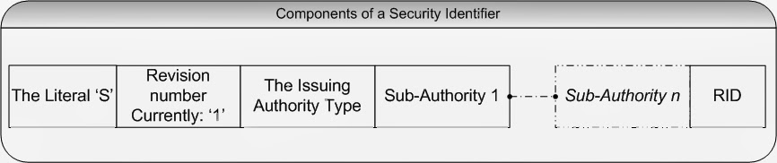
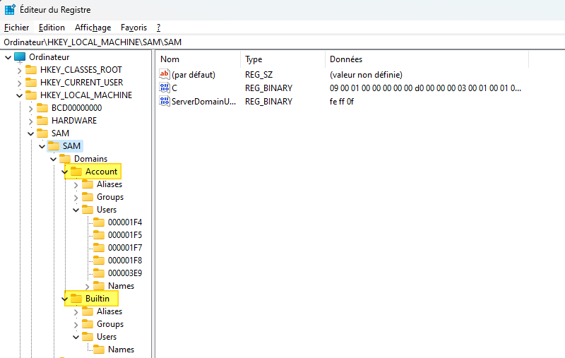

# Administration et sécurité Windows

# SIDs

*Un SID (Security Identifier) en informatique, notamment dans les environnements Windows, est un identifiant unique utilisé pour gérer les permissions de sécurité. Chaque compte d'utilisateur, groupe d'utilisateurs, et même certains processus ou composants dans le système d'exploitation Windows, se voient attribuer un SID qui les identifie de manière unique. - ChatGPT*

| Well-known SID | Description                       |
| -------------- | --------------------------------- |
| S-1-5-18       | Local System Account              |
| S-1-5-19       | Local Service Account             |
| S-1-5-20       | Network Service Account           |
| S-1-5-32-544   | Administrators Group              |
| S-1-5-32-545   | Users Group                       |
| S-1-5-32-546   | Guests Group                      |
| S-1-5-32-547   | Power Users Group                 |
| S-1-5-32-548   | Account Operators Group           |
| S-1-5-32-549   | Server Operators Group            |
| S-1-5-32-550   | Print Operators Group             |
| S-1-5-32-551   | Backup Operators Group            |
| S-1-5-32-552   | Replicators Group                 |
| S-1-5-11       | Authenticated Users Special Group |
| S-1-5-15       | This Organization Special Group   |

## Access Token

Représente l'identité d'un utilisateur.

Contient : 

- User SID
- Group SIDs
- Privilèges
- Impersonation Level

`whoami /all` : Donne toutes les informations contenues dans le Access Token, dont les privilèges, pour un utilisateur donné (celui logged in).

# SAM

*SAM Access Control est un aspect fondamental de la sécurité et de la gestion des comptes d'utilisateurs dans Windows. Il assure que les informations d'utilisateur sont stockées, gérées et accédées de manière sécurisée, tout en fournissant les mécanismes nécessaires pour l'authentification et la gestion des comptes. - ChatGPT*

La base SAM est représentée par le fichier `"**%SystemRoot%\system32\config\SAM**"` (généralement dans `"C:\Windows\"`) qui est en fait un fichier associé à la base de [Registre Windows](https://www.it-connect.fr/quest-ce-que-la-base-de-registre-windows/) : `HKEY_LOCAL_MACHINE\SAM\`.

# LSA

On peut accéder à ces services via RPC (Remote Procedure Call).

### **RPC (Remote Procedure Call)**

- **Communication inter-processus** : Permet à un programme d'exécuter des fonctions dans un autre programme, souvent sur un autre ordinateur.
- **Abstraction réseau** : Masque la complexité de la communication réseau.
- **Protocoles divers** : Implémentations comme DCOM, Java RMI, XML-RPC.
- **Sécurité** : Authentification, chiffrement, gestion des autorisations.
- **Systèmes distribués** : Utilisé dans architectures distribuées, cloud, services web.
- **Défis** : Gestion des erreurs réseau, latence, sérialisation/désérialisation.

### **LSA (Local Security Authority)**

- **Authentification** : Vérifie les identifiants des utilisateurs.
- **Jetons d'accès** : Crée des jetons après authentification réussie.
- **Politiques de sécurité** : Gère les stratégies de mot de passe, droits utilisateurs.
- **SAM et Active Directory** : Interagit pour informations d'identification.

#### **LSASS (Local Security Authority Subsystem Service)**

- **Processus** : Exécute les fonctions de LSA.
- **Sécurité système** : Gère les politiques de sécurité, les comptes, les mots de passe.
- **Protection** : Fonctionne avec des privilèges élevés pour la sécurité.
- **Cible des attaques** : Souvent visé par des malwares pour accéder aux données de sécurité.

## Exemples de RPC

## Exemple de Winlogon

Authentification de l'utilisateur, vérification des credentials, démarrage de userinit.exe…

# Authentification

Session:

- Session, Kernel (partitionnement système entre utilisateurs)
- Logon Session (LSASS)
  - Utilisateur authentifié sur la machine (LUID, Localy-…)

