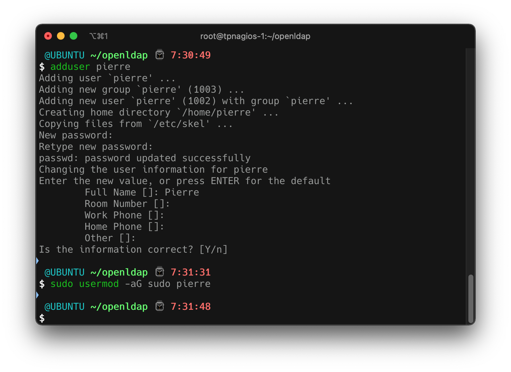
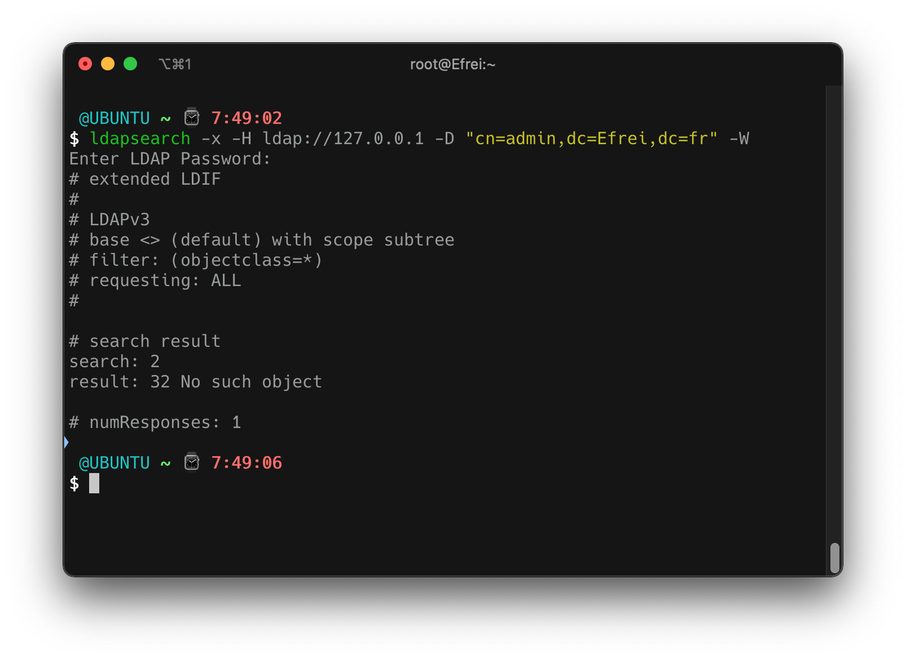
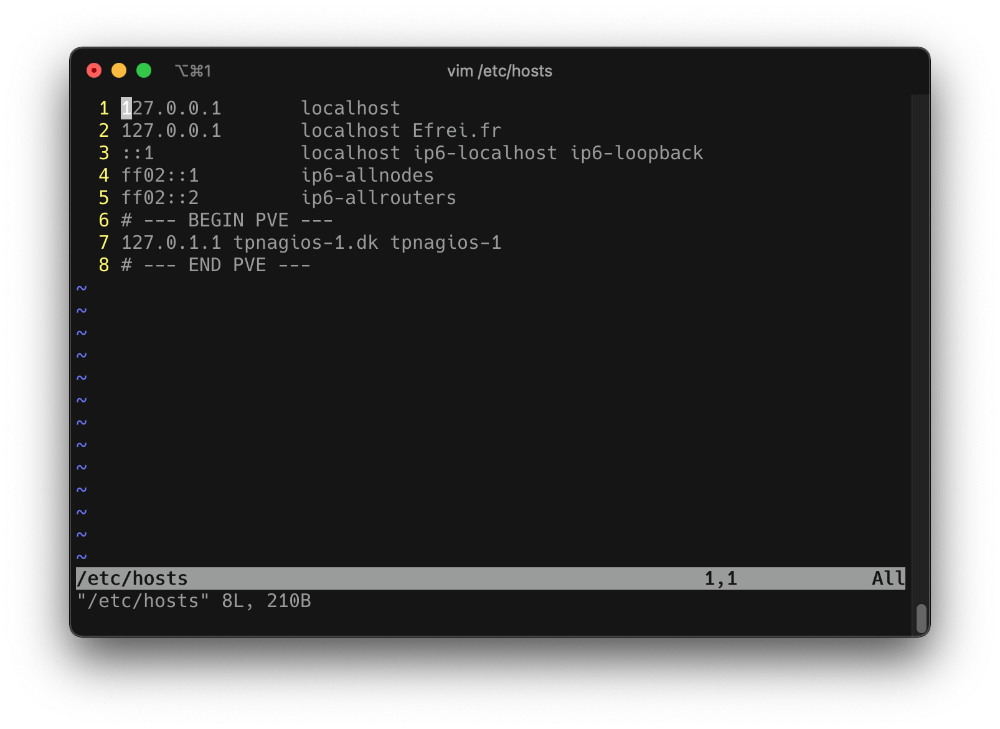
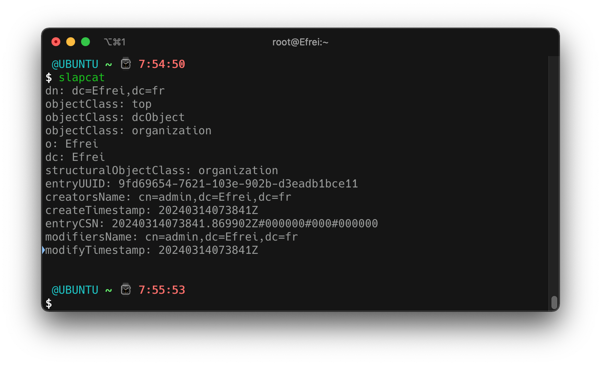

# Architectures sécurisées d'entreprise

Notes de cours de `Thomas PEUGNET`.

Ce cours présente comment faire un speedrun des TPs 1 et 2.

# TP01

## Création de l'utilisateur Pierre



```shell
$ adduser pierre
$ usermod -aG sudo pierre

# Changement du hostname
$ hostnamectl hostname Efrei.fr 
```

## Installation

```shell
$ apt install slapd ldap-utils

# Création de la configuration de base
$ dpkg-reconfigure slapd
```

Durant cette étape, choisir les options suivantes : 

- Omit OpenLDAP server configuration ? `No`
- DNS Domain Name : `Efrei.fr`
- Org. Name: `Efrei`
- Do you want the database to be removed when `slapd` is purged ? : `Yes`

Vérifier que le service fonctionne correctement : `systemctl status slapd` doit posséder le statut `active`.

Vérifier le port d'écoute du service : `netstat -laptun | grep slapd`

## Première connexion

```shell
$ ldapsearch -x -H ldap://127.0.0.1 -D "cn=admin,dc=Efrei,dc=fr" -W
```



Modification du fichier `/etc/hosts` :



Dans le fichier `/etc/ldap/ldap.conf`, modifier les lignes `BASE` et `URI` suivantes :
```shell
BASE	  dc=Efrei,dc=fr
URI	    ldap://Efrei.fr
```

Ce qui donne le fichier suivant :

```conf
#
# LDAP Defaults
#

# See ldap.conf(5) for details
# This file should be world readable but not world writable.

BASE	dc=Efrei,dc=fr
URI	ldap://Efrei.fr

#SIZELIMIT	12
#TIMELIMIT	15
#DEREF		never

# TLS certificates (needed for GnuTLS)
TLS_CACERT	/etc/ssl/certs/ca-certificates.crt
```

Vérification du fonctionnement avec la commande suivante :

```shell
$ ldapsearch -x
```


Pour vérifier le bon fonctionnement du serveur LDAP, à tout moment utiliser :

```shell
$ slapcat
```



## Remplissage de l'annuaire

