# Architectures sécurisées d'entreprise

Notes de cours de `Thomas PEUGNET`.

Ce cours présente comment faire un speedrun des TPs 1 et 2.

Le speedrun des TPs 3, 4 et 5 est en cours.

# TP01

## Création de l'utilisateur Pierre


```shell
$ adduser pierre
$ usermod -aG sudo pierre

# Changement du hostname
$ hostnamectl hostname Efrei.fr 
```

## Installation

```shell
$ apt install slapd ldap-utils

# Création de la configuration de base
$ dpkg-reconfigure slapd
```

Durant cette étape, choisir les options suivantes : 

- Omit OpenLDAP server configuration ? `No`
- DNS Domain Name : `Efrei.fr`
- Org. Name: `Efrei`
- Do you want the database to be removed when `slapd` is purged ? : `Yes`

Vérifier que le service fonctionne correctement : `systemctl status slapd` doit posséder le statut `active`.

Vérifier le port d'écoute du service : `netstat -laptun | grep slapd`

## Première connexion

```shell
$ ldapsearch -x -H ldap://127.0.0.1 -D "cn=admin,dc=Efrei,dc=fr" -W
```


Modification du fichier `/etc/hosts` :


Dans le fichier `/etc/ldap/ldap.conf`, modifier les lignes `BASE` et `URI` suivantes :
```shell
BASE	  dc=Efrei,dc=fr
URI	    ldap://Efrei.fr
```

Ce qui donne le fichier suivant :

```conf
#
# LDAP Defaults
#

# See ldap.conf(5) for details
# This file should be world readable but not world writable.

BASE	dc=Efrei,dc=fr
URI	ldap://Efrei.fr

#SIZELIMIT	12
#TIMELIMIT	15
#DEREF		never

# TLS certificates (needed for GnuTLS)
TLS_CACERT	/etc/ssl/certs/ca-certificates.crt
```

Vérification du fonctionnement avec la commande suivante :

```shell
$ ldapsearch -x
```


Pour vérifier le bon fonctionnement du serveur LDAP, à tout moment utiliser :

```shell
$ slapcat
```


## Remplissage de l'annuaire

### Organization Units

Créer un fichier `org_unit.ldif` et le remplir avec le contenu suivant:

```ldif
dn: ou=users,dc=Efrei,dc=fr
objectClass: organizationalUnit

dn: ou=groups,dc=Efrei,dc=fr
objectClass: organizationalUnit
```

Appliquer le contenu présent dans ce fichier à notre serveur LDAP par la commande suivante :

```shell
$ ldapadd -W -D "cn=admin,dc=Efrei,dc=fr" -x -f org_unit.ldif
```

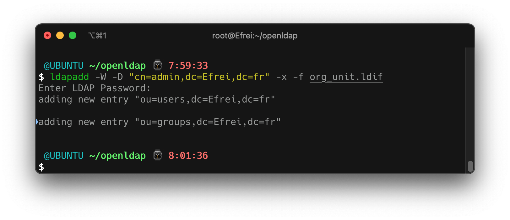

### Groups

Créer un fichier `groups.ldif` et le remplir avec le contenu suivant:

```ldif
dn: cn=teachers,ou=groups,dc=Efrei,dc=fr
objectClass: posixGroup
objectClass: top
gidNumber: 6001
cn: teachers

dn: cn=students,ou=groups,dc=Efrei,dc=fr
objectClass: posixGroup
objectClass: top
gidNumber: 6002
cn: students
```

Appliquer le contenu présent dans ce fichier à notre serveur LDAP par la commande suivante :

```shell
$ ldapadd -W -D "cn=admin,dc=Efrei,dc=fr" -x -f groups.ldif
```

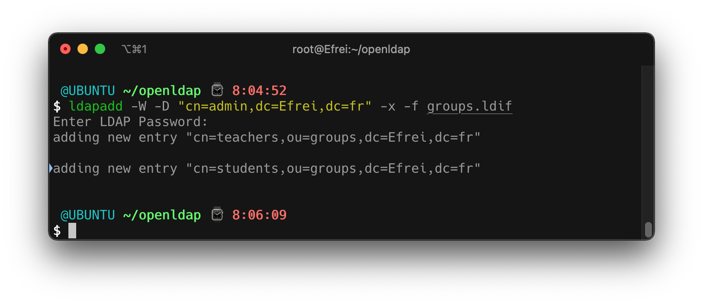

### Création de l'utilisateur Pierre et Souheib

Créer un fichier `pierre.ldif` et le remplir avec le contenu suivant:

```ldif
dn: cn=teachers,ou=groups,dc=Efrei,dc=fr
objectClass: posixGroup
objectClass: top
gidNumber: 6001
cn: teachers

dn: uid=pierre.dupont,ou=users,dc=Efrei,dc=fr
objectClass: posixGroup
objectClass: top
objectClass: organizationalPerson
objectClass: inetOrgPerson
objectClass: posixAccount
uidNumber: 6002
gidNumber: 6002
homeDirectory: /home/pierre
loginShell: /bin/bash
uid: pierre.dupont
sn: dupont
cn: pierre dupont
mail: pierre.dupont@efrei.fr
userPassword: pierre
```

Appliquer le contenu présent dans ce fichier à notre serveur LDAP par la commande suivante :

```shell
$ ldapadd -W -D "cn=admin,dc=Efrei,dc=fr" -x -f pierre.ldif
```

Créer un fichier `souheib.ldif` et le remplir avec le contenu suivant:

```ldif
dn: uid=souheib.yousfi,ou=users,dc=Efrei,dc=fr
objectClass: person
objectClass: top
objectClass: organizationalPerson
objectClass: inetOrgPerson
objectClass: posixAccount
uidNumber: 6001
gidNumber: 6001
homeDirectory: /home/souheib
loginShell: /bin/bash
uid: souheib.yousfi
sn: yousfi
cn: souheib yousfi
mail: souheib.yousfi@efrei.fr
userPassword: souheib
```

Appliquer le contenu présent dans ce fichier à notre serveur LDAP par la commande suivante :

```shell
$ ldapadd -W -D "cn=admin,dc=Efrei,dc=fr" -x -f souheib.ldif
```

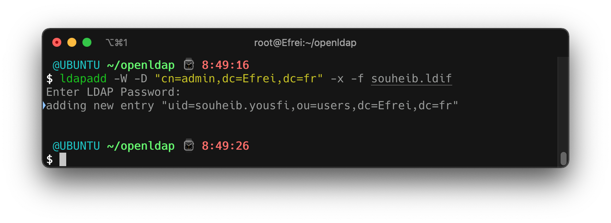

On met à jour le mot de passe à l'aide la commande suivante :

```shell
$ ldappasswd -H ldap://127.0.0.1 -x -D "cn=admin,dc=Efrei,dc=fr" -W -S "uid=souheib.yousfi,ou=users,dc=Efrei,dc=fr"
```

## Vérification et ajout d'un email

On effectue une requête pour vérifier l'utilisateur à l'aide de la commande suivante :

```shell
$ ldapsearch -x -b "dc=Efrei,dc=fr" -LLL uid=souheib.yousfi cn mail
```

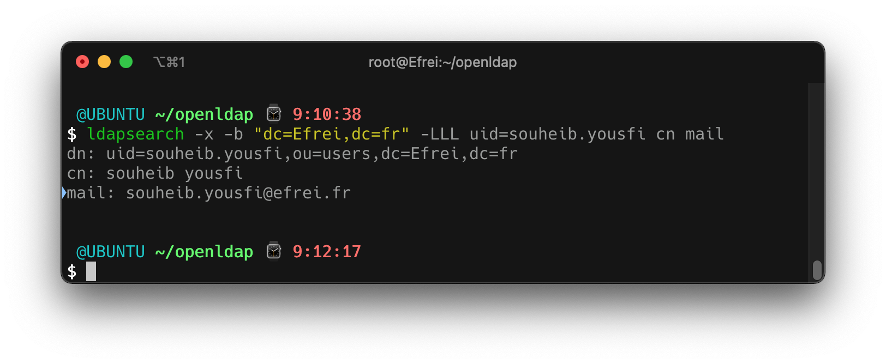

On crée un nouvel email pour l'utilisateur au sein du fichier `add_email.ldif` :

```
dn: uid=souheib.yousfi,ou=users,dc=Efrei,dc=fr
changetype: modify
add: mail
mail:souheib.yousfi@efrei.net
```

On ajoute  un email à l'utilisateur à l'aide de la commande suivante :

```shell
$ ldapmodify -D cn=admin,dc=Efrei,dc=fr -W -f add_email.ldif
```

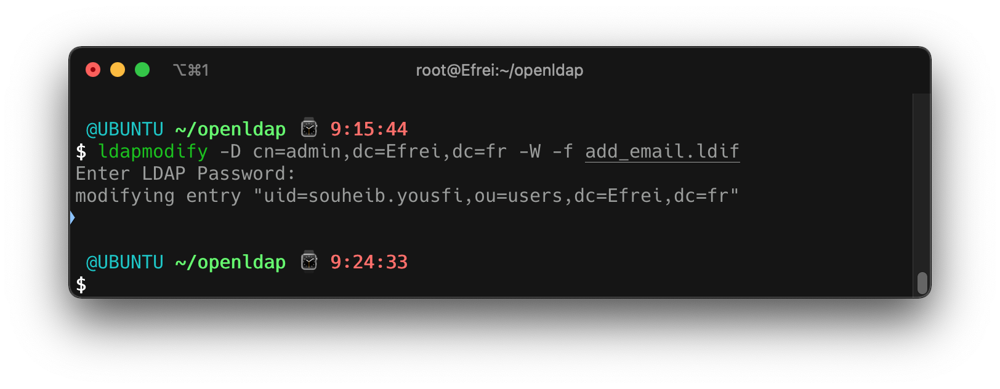

# TP02

## Création des certificats

Création d'un certificat à l'aide de la commande suivante :

```shell
$ mkdir /etc/ldap/ssl && cd /etc/ldap/ssl
$ openssl req -x509 -newkey rsa:4096 -keyout key.pem -out cert.pem -days 3650 -nodes
```

(Photo non-contractuelle)

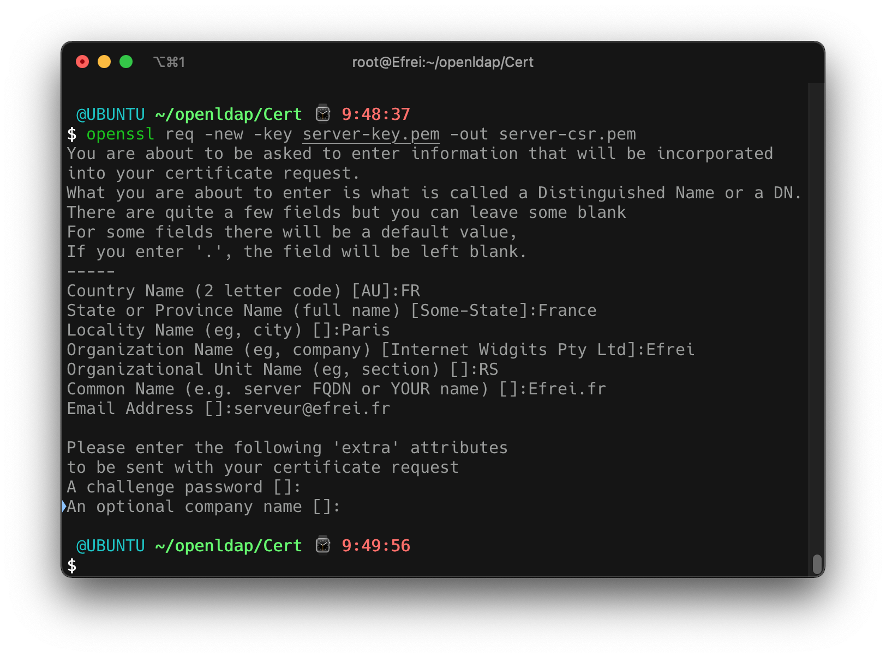

Changer l'appartenance et les permissions avec les commandes suivantes : 

```shell
$ chown openldap:openldap /etc/ldap/ssl/cert.pem
$ chown openldap:openldap /etc/ldap/ssl/key.pem
```

## Configuration du certificat avec `slapd`

Créer un fichier `cert.ldif` avec le contenu suivant :

```ldif
dn: cn=config
changetype: modify
add: olcTLSCACertificateFile
olcTLSCACertificateFile: /etc/ldap/ssl/cert.pem
-
add: olcTLSCertificateFile
olcTLSCertificateFile: /etc/ldap/ssl/cert.pem
-
add: olcTLSCertificateKeyFile
olcTLSCertificateKeyFile: /etc/ldap/ssl/key.pem
-
add: olcTLSVerifyClient
olcTLSVerifyClient: never
```

On applique ce fichier à l'aide de la commande suivante : 

```shell
$ ldapmodify -QY EXTERNAL -H ldapi:/// -f cert.ldif
```

On modifie le fichier de configuration `/etc/default/slapd` pour ajouter le service `ldaps` en ajoutant à `ldaps:///` à la suite de la ligne `SLAPD_SERVICES`.

Redémarrer le service et vérifier que le port `636` est bien sur écoute.

```shell
$ systemctl restart slapd.service
$ sudo netstat -tulpen | grep slapd
```


# Création des utilisateurs (DIT Personnel)

Créer 3 fichiers correspondant aux informations des 3 utilisateurs, ayant respectivement chacun le contenu suivant :

`thomas.ldif`:

```
dn: uid=thomas.peugnet,ou=users,dc=Efrei,dc=fr
objectClass: person
objectClass: top
objectClass: organizationalPerson
objectClass: inetOrgPerson
objectClass: posixAccount
uidNumber: 10002
gidNumber: 6002
homeDirectory: /home/thomas
loginShell: /bin/bash
uid: thomas.peugnet
sn: peugnet
cn: thomas peugnet
mail: thomas.peugnet@efrei.fr
userPassword: thomas
```

`tom.ldif`:

```
dn: uid=tom.thioulouse,ou=users,dc=Efrei,dc=fr
objectClass: person
objectClass: top
objectClass: organizationalPerson
objectClass: inetOrgPerson
objectClass: posixAccount
uidNumber: 10003
gidNumber: 6002
homeDirectory: /home/tom
loginShell: /bin/bash
uid: tom.thioulouse
sn: thioulouse
cn: tom thioulouse
mail: tom.thioulouse@efrei.fr
userPassword: tom
```

`alexis.ldif`:

```
dn: uid=alexis.plessias,ou=users,dc=Efrei,dc=fr
objectClass: person
objectClass: top
objectClass: organizationalPerson
objectClass: inetOrgPerson
objectClass: posixAccount
uidNumber: 10001
gidNumber: 6002
homeDirectory: /home/alexis
loginShell: /bin/bash
uid: alexis.plessias
sn: plessias
cn: alexis plessias
mail: alexis.plessias@efrei.fr
userPassword: alexis
```

Nous les appliquons au serveur LDAP à l'aides des 3 commandes suivantes :

```shell
$ ldapadd -W -D "cn=admin,dc=Efrei,dc=fr" -x -f thomas.ldif
$ ldapadd -W -D "cn=admin,dc=Efrei,dc=fr" -x -f tom.ldif
$ ldapadd -W -D "cn=admin,dc=Efrei,dc=fr" -x -f alexis.ldif
```

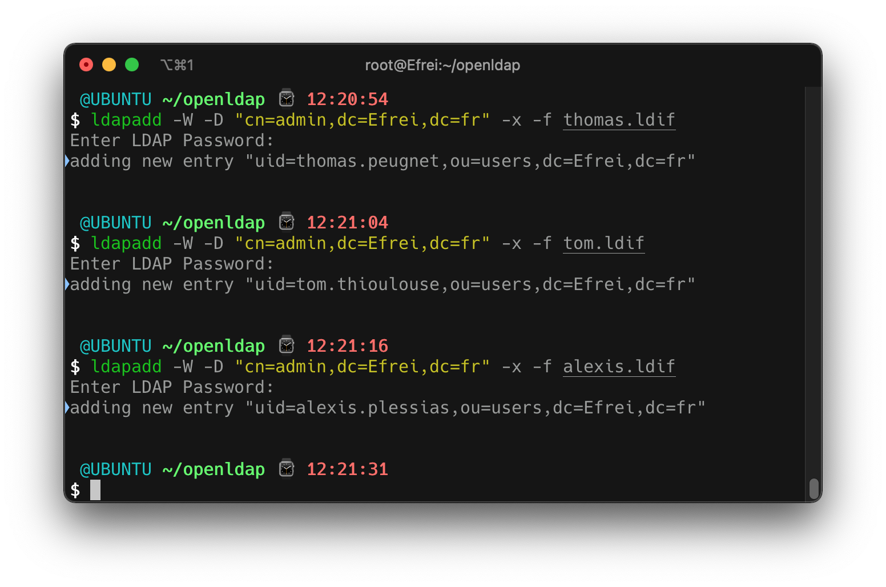

## Interface Graphique `LDAP Accound Manager`

### Installation

Utiliser la commande suivante pour installer toutes les dépendances et `ldap-account-manager` : 

```shell
$ sudo apt install apache2 php php-cgi libapache2-mod-php php-mbstring php-common php-pear ldap-account-manager -y

# Activer php-cgi
$ sudo a2enconf php8.1-cgi

# Resart apache2
$ systemctl restart apache2
```

Ensuite, se connecter sur `http://192.168.1.28/lam/templates/login.php`.

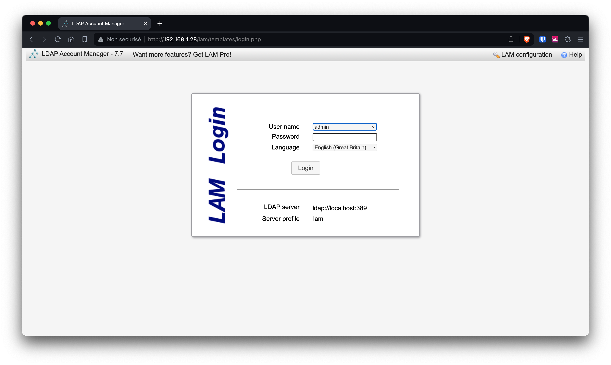

Puis, se rendre dans `LAM configuration`, utiliser le mot de passe `lam` et modifier les paramètres de domaine dans la page `General Settings` :

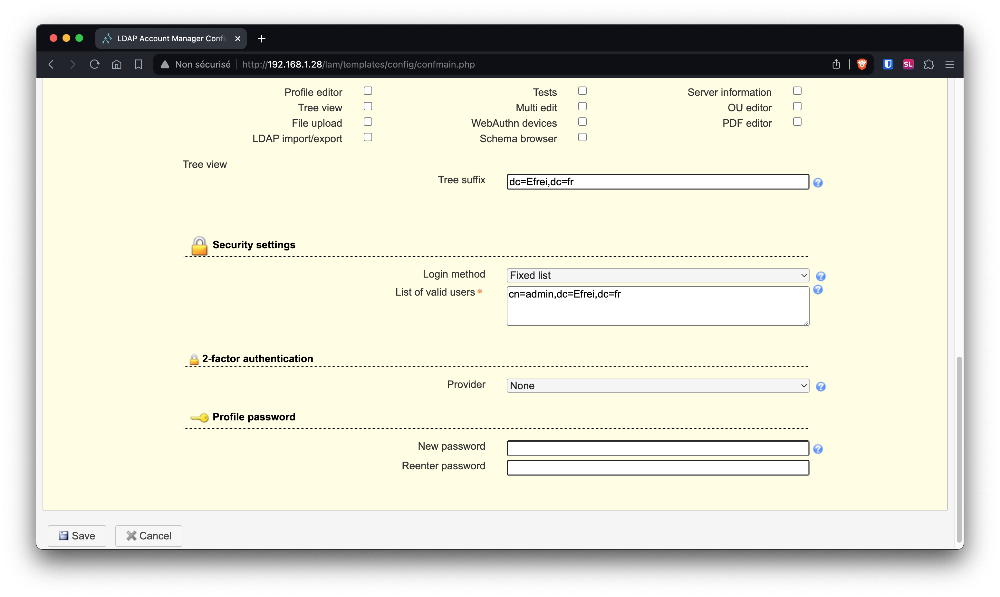

Enfin, modifier également les informations de domaine dans la partie `Account Types` :

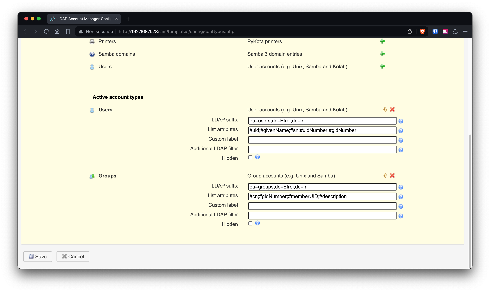

Après avoir sauvegardé cette configuration, se reconnecter avec l'utilisateur `admin`

Nous pouvons constater le résultat suivant :

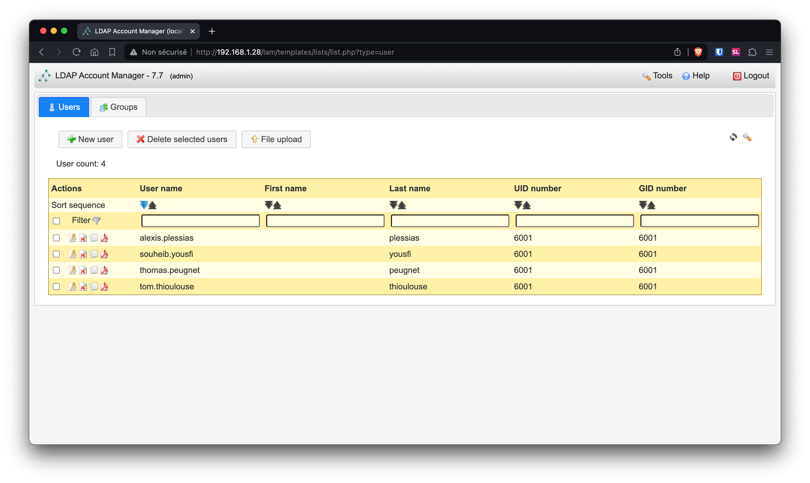

## Connexion au serveur

Utiliser la commande suivante pour vérifier qu'il est bien possible de se connecter au serveur :

```shell
$ LDAPTLS_REQCERT=never ldapsearch -H ldaps://192.168.1.28:636 -W -D "cn=admin,dc=Efrei,dc=fr" -b "dc=Efrei,dc=fr" "(objectClass=*)"
```

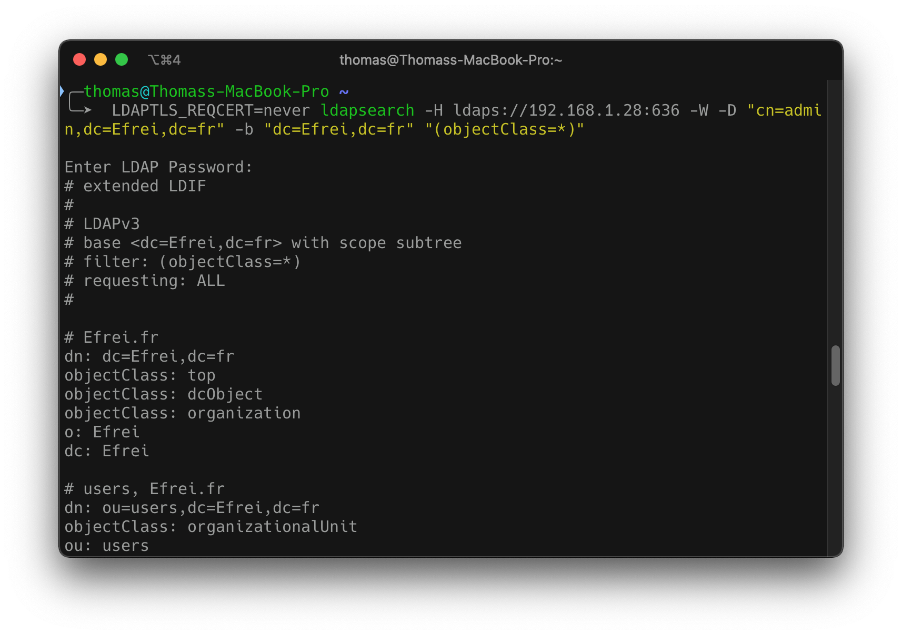

Il est nécessaire d'ignorer temporairement la vérification du certificat, d'où la variable `LDAPTLS_REQCERT=never`.

### Wireshark

Après avoir lancé la capture Wireshark, et effectué une requête au serveur LDAP, on obtient le résultat suivant :

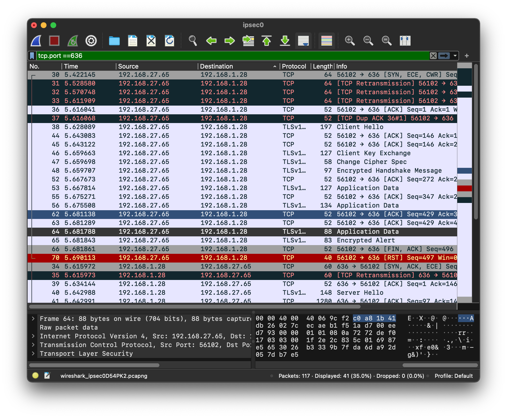

Etant donné que nous utilisons un protocole de chiffrement, il n'est pas étonnant de voir que nous ne pouvons pas déchiffrer directement dans Wireshark les informations du LDAP. Le traffic ne circule pas en clair sur le réseau.

# TP03

## Configuration de PAM

```shell
$ sudo apt install libnss-ldap
```

Par la suite, un écran de configuration va être affiché, il s'agit de remplir les informations suivantes : 

- URI du serveur LDAP : `Efrei.fr:636`
- Base de recherche : `dc=Efrei,dc=fr`
- Make local root Database admin : `Yes`
- Does database require login : `No`
- LDAP account for root : `cn=admin,dc=Efrei,dc=fr`
- Configuration des services à configurer : Aucun


Utiliser la commande suivante pour vérifier le bon fonctionnement : 

```shell
$ LDAPTLS_REQCERT=never ldapsearch -H ldaps://Efrei.fr:636 -b 'dc=Efrei,dc=fr' -x uid=thomas.peugnet -LLL
```

On obtient le résultat suivant :

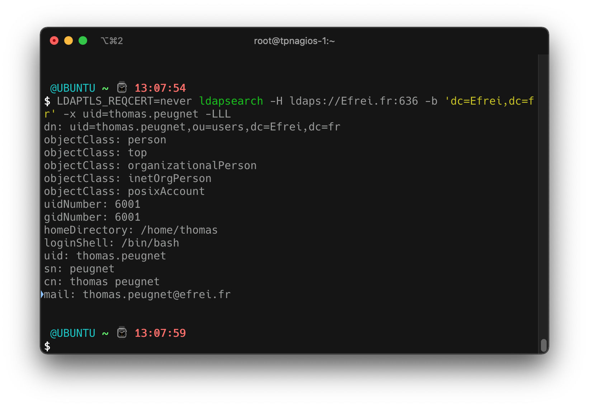

On modifie les fichiers `nsswitch.conf` et `nslcd.conf` pour avoir le résultat suivant:

`nsswitch.conf` (attention aux lignes `passwd, group, shadow et gshadow`):

```
# /etc/nsswitch.conf
#
# Example configuration of GNU Name Service Switch functionality.
# If you have the `glibc-doc-reference' and `info' packages installed, try:
# `info libc "Name Service Switch"' for information about this file.

passwd:         ldap files systemd
group:          ldap files systemd
shadow:         ldap files
gshadow:        files

hosts:          files dns
networks:       files

protocols:      db files
services:       db files
ethers:         db files
rpc:            db files

netgroup:       nis
```

`nslcd.conf`:

```
# /etc/nslcd.conf
# nslcd configuration file. See nslcd.conf(5)
# for details.

# The user and group nslcd should run as.
uid nslcd
gid nslcd

# The location at which the LDAP server(s) should be reachable.
uri ldaps://Efrei.fr:636

# The search base that will be used for all queries.
base dc=Efrei,dc=fr

# The LDAP protocol version to use.
#ldap_version 3

# The DN to bind with for normal lookups.
#binddn cn=annonymous,dc=example,dc=net
#bindpw secret

# The DN used for password modifications by root.
#rootpwmoddn cn=admin,dc=example,dc=com

# SSL options
#ssl off
tls_reqcert never
tls_cacertfile /etc/ldap/ssl/cert.pem

# The search scope.
#scope sub
```

On redémarre le service :

```shell
$ sudo service nslcd restart
```

On vérifie que le service a bien redémarré avec la commande suivante :

```shell
$ getent passwd | grep thomas.peugnet
```

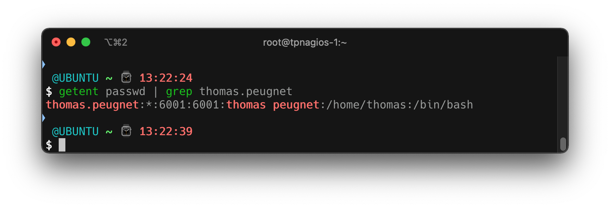

**Note:** Une erreur avait été faite lors de la création de l'utilisateur ci-dessus, avec les mauvais UIDs.

Si plusieurs utilisateurs ont les mêmes UIDs, il est possible de les changer via l'url de LAM:

http://192.168.1.28/lam/templates/login.php

**Note:** Si, en se connectant avec un utilisateur, on se retrouve connecté sur le compte d'un autre utilisateur, il est possible qu'il existe un conflit sur les UIDs.

On crée les dossiers personnels des utilisateurs avec les bonnes permissions à l'aide des commandes suivantes:

```shell
$ mkdir /home/tom && chown tom.thioulouse:teachers -R /home/tom
$ mkdir /home/thomas && chown thomas.peugnet:students -R /home/thomas
$ mkdir /home/alexis && chown alexis.plessias:students -R /home/alexis
```

Enfin, on essaye de se connecter via une autre instance :

```shell
$ ssh alexis.plessias@192.168.1.28
```

Le mot de passe étant défini dans le fichier `.ldif` du TP01.

On obtient le résultat suivant :

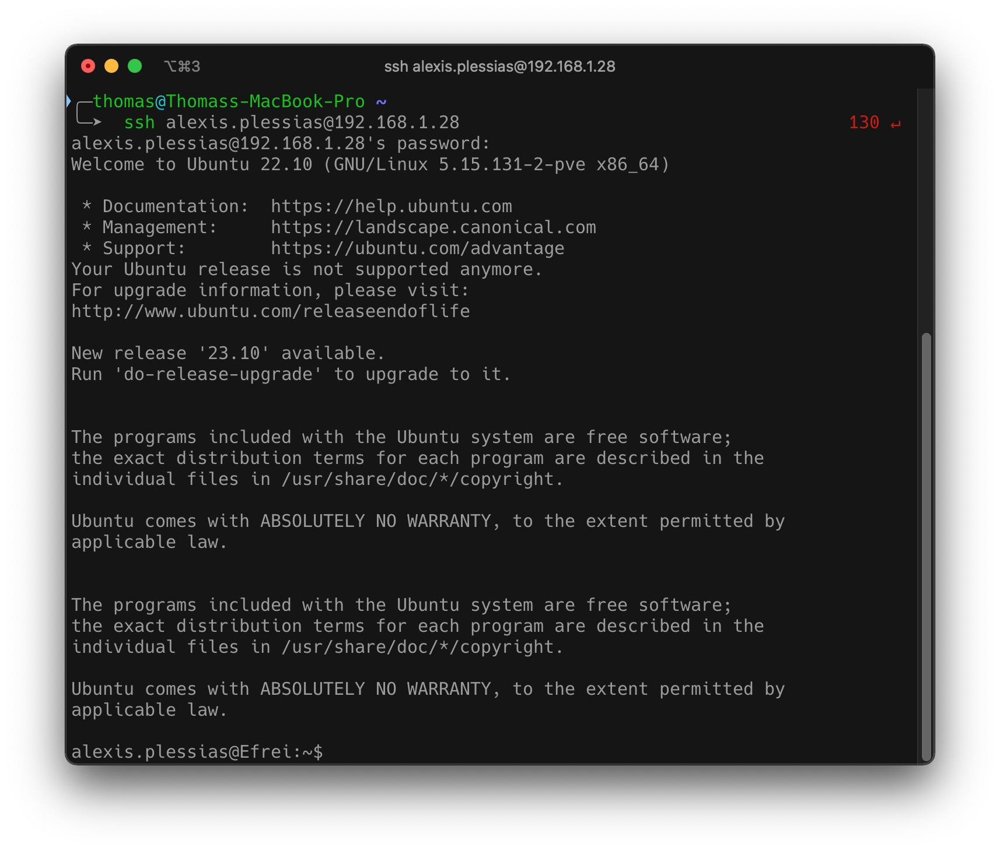

## Gestion des accès SSH

On modifie le fichier de configuration SSH, pour n'autoriser que les membres du groupe `teachers` à se connecter via SSH, em ajoutant à la fin du fichier :

```
AllowGroups teachers
```

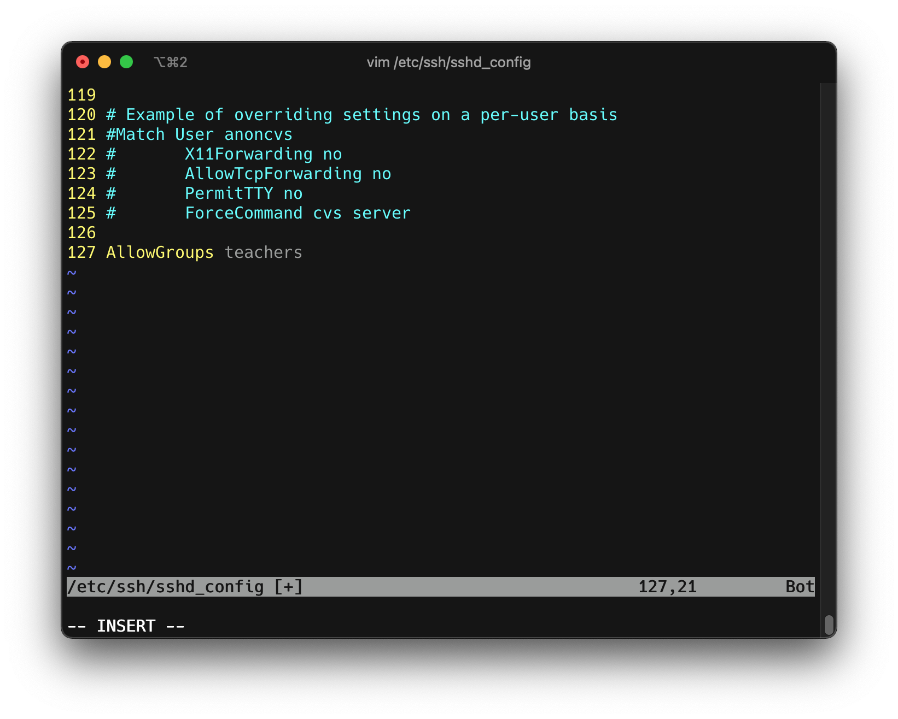

On modifie égalemement le fichier de configuration `/etc/pam.d/sshd` en ajoutant la ligne suivante :

```
auth required pam_group.so
```

Ce qui donne le résultat suivant :

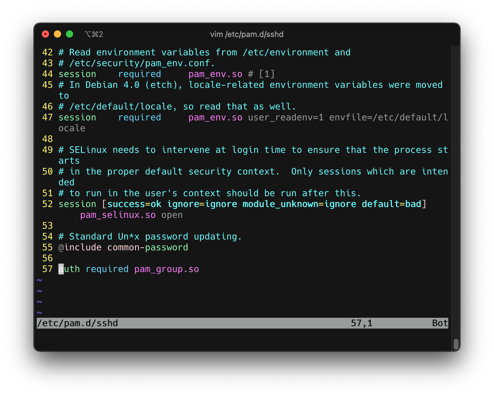

On redémarre le service ssh avec la commande suivante : 

```shell
$ systemctl restart ssh.service
```

Puis, on re-tente de se connecter en ssh avec un utilisateur du groupe `students` :

```shell
$ ssh alexis.plessias@192.168.1.28
```

On obtient le résultat suivant :

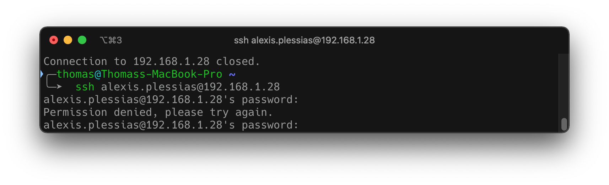

Si on tente de se connecter avec un utilisateur du groupe `teachers`  :

```shell
$ ssh tom.thioulouse@192.168.1.28
```

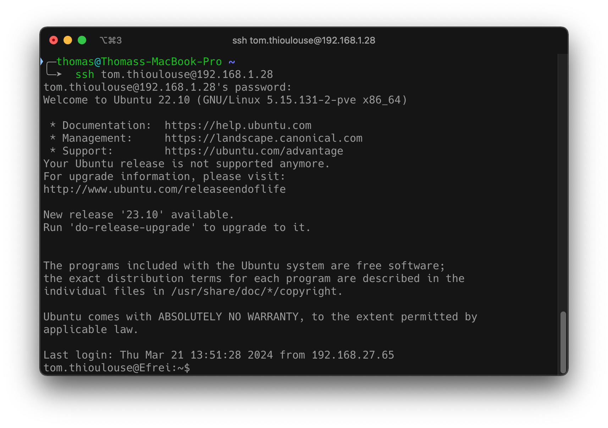

**Note:** Si l'erreur `Could not chdir to home directory /home/X: No such file or directory`, c'est que le dossier de l'utilisateur n'existe pas. Si une erreur de `Permission Denied` survient, c'est le `chown` qui n'a pas été correctement effectué.

# TP04

## Configuration de Apache2

Installation du service Apache2 et activation du module d'authentification :

```shell
# Installation
$ apt install apache2

# Activation du module
$ sudo a2enmod authnz_ldap

# Restart du service
$ systemctl restart apache2
```

Modification du VirtualHost par défaut d'Apache pour lui ajouter une Basic Auth:

Le fichier `/etc/apache2/sites-availables/000-default.conf` doit donc avoir le contenu suivant:

```conf
<AuthnProviderAlias ldap myldap>
    AuthLDAPURL "ldap://Efrei.fr/ou=users,dc=Efrei,dc=fr"
</AuthnProviderAlias>

<VirtualHost *:80>
	# The ServerName directive sets the request scheme, hostname and port that
	# the server uses to identify itself. This is used when creating
	# redirection URLs. In the context of virtual hosts, the ServerName
	# specifies what hostname must appear in the request's Host: header to
	# match this virtual host. For the default virtual host (this file) this
	# value is not decisive as it is used as a last resort host regardless.
	# However, you must set it for any further virtual host explicitly.
	#ServerName www.example.com

	ServerAdmin webmaster@localhost
	DocumentRoot /var/www/html

	# Available loglevels: trace8, ..., trace1, debug, info, notice, warn,
	# error, crit, alert, emerg.
	# It is also possible to configure the loglevel for particular
	# modules, e.g.
	#LogLevel info ssl:warn

	ErrorLog ${APACHE_LOG_DIR}/error.log
	CustomLog ${APACHE_LOG_DIR}/access.log combined

	# For most configuration files from conf-available/, which are
	# enabled or disabled at a global level, it is possible to
	# include a line for only one particular virtual host. For example the
	# following line enables the CGI configuration for this host only
	# after it has been globally disabled with "a2disconf".
	#Include conf-available/serve-cgi-bin.conf

        <Directory "/var/www/html">
            AuthType Basic
            AuthName "Top Secret"
            AuthBasicProvider myldap
            Require valid-user
            LogLevel trace1
        </Directory>
</VirtualHost>

# vim: syntax=apache ts=4 sw=4 sts=4 sr noet
```

On redémarre le service:

```shell
$ systemctl restart apache2
```

On modifie le contenu de la page sur laquelle le VHost redirige avec le contenu suivant:

```html
<h1>It's working !</h1>
<p>Si ce message est visible, c'est que la configuration est correcte !</p>
<p style="font-size:5px">Meilleur site de speedruns sur les TPs, visitez <a href="https://iefrei.fr">iefrei.fr</a> !</p>
```

On accède à la page sur l'URL http://192.168.1.28, et on constate le résultat suivant :

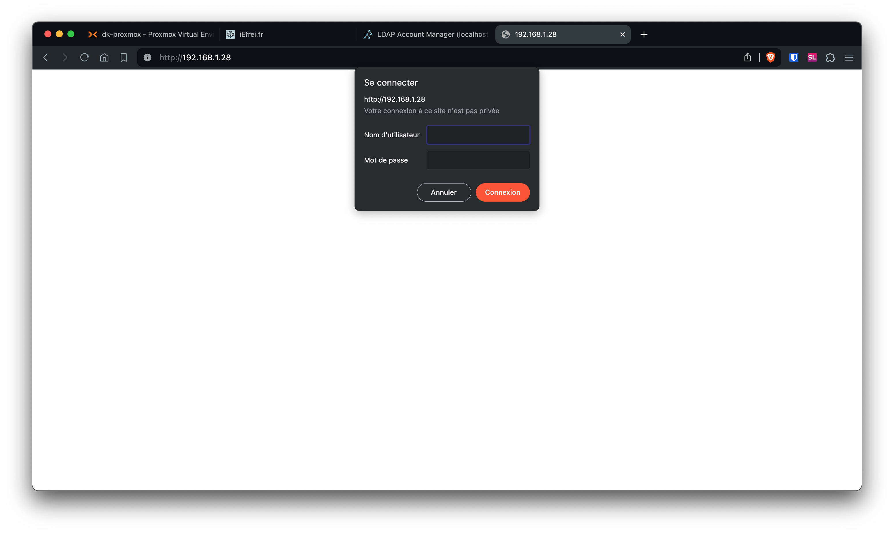

Cela nous indique que la configuration de la Basic Auth fonctionne correctement.

Si on entre les informations de l'utilisateur `alexis.plessias` :


## Restriction des accès au groupe `teachers`

Modification de la ligne `2` de la configuration du VHost avec le contenu suivant :

```
<AuthnProviderAlias ldap myldap>
    AuthLDAPURL "ldap://Efrei.fr/ou=users,dc=Efrei,dc=fr?uid?sub?(gidNumber=6001)"
</AuthnProviderAlias>
```

Avec `6001` le GID du groupe `teachers`.

Avec la connexion en tant qu'utilisateur `alexis.plessias` du groupe `students` :

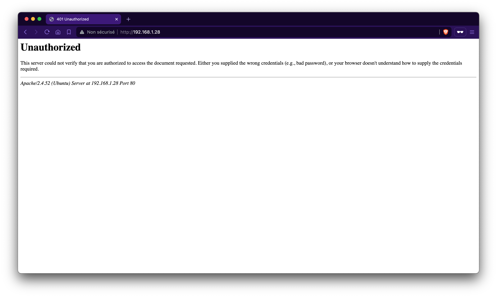

**Note:** L'écran ci-dessus arrive lorsque l'on clique sur le bouton `Annuler`,  après plusieurs tentatives infructueuses de connexion.

Avec l'utilisateur `tom` qui est membre du groupe `teachers` :

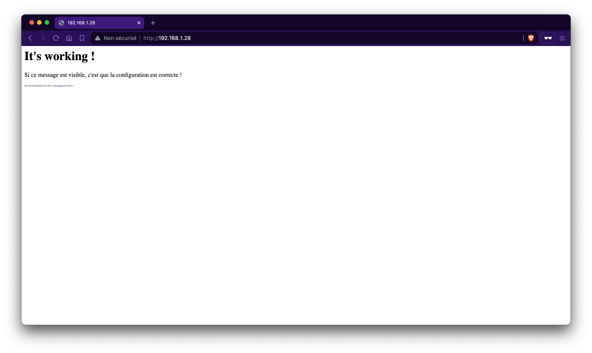

## Amélioration - HTTPS

Création d'un certificat pour l'HTTPS:

```shell
$ openssl genpkey -algorithm RSA -out /etc/ssl/private/https_key.key -pkeyopt rsa_keygen_bits:2048
$ openssl req -new -key /etc/ssl/private/https_key.key -out https_request.csr
$ openssl x509 -signkey /etc/ssl/private/https_key.key -in https_request.csr -req -days 365 -out /etc/ssl/certs/https_cert.crt
```

Pour activer l'HTTPS sur notre serveur web, nous allons commencer par activer le module `ssl` à l'aide de la commande suivante:

```shell
$ a2enmod ssl
```

On effectue une backup du fichier de configuration original.

```shell
$ cd /etc/apache2/sites-available
$ cp default-ssl.conf default-ssl.conf.old
$ echo "" > default-ssl.conf
```

On modifie notre configuration Apache dans notre fichier `default-ssl.conf` par la configuration suivante:

```
<VirtualHost *:443>
    ServerAdmin webmaster@localhost
    DocumentRoot /var/www/html

    ErrorLog ${APACHE_LOG_DIR}/error.log
    CustomLog ${APACHE_LOG_DIR}/access.log combined

    SSLEngine on
    SSLCertificateFile /etc/ssl/certs/https_cert.crt
    SSLCertificateKeyFile /etc/ssl/private/https_key.key

    <Directory "/var/www/html">
        AuthType Basic
        AuthName "Top Secret"
        AuthBasicProvider myldap
        Require valid-user
        LogLevel trace1
    </Directory>
</VirtualHost>
```

En nous rendant sur le site en `https` on obtient le résultat suivant:


Nous pouvons constater que cela fonctionne correctement.

# TP05

## Installation de OpenVPN

```shell
$ apt install openvpn
```

Vérifier la bonne installation en se rendant dans le dossier suivant :

```shell
$ cd /usr/share/doc/openvpn/examples
```

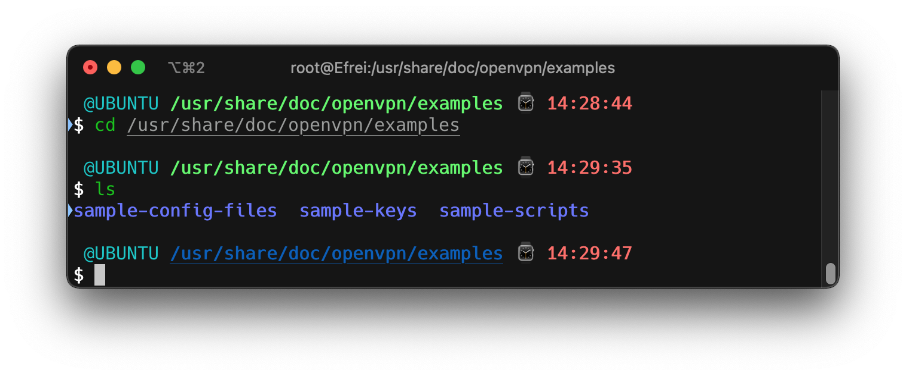

On récupère l'adresse IP de notre instance par la commande `hostname -I`.

On modifie le contenu de la configuration du fichier `sample-config-files/client.conf` avec la ligne suivante (varaible selon votre IP):

```
remote 192.168.1.28 1194
```

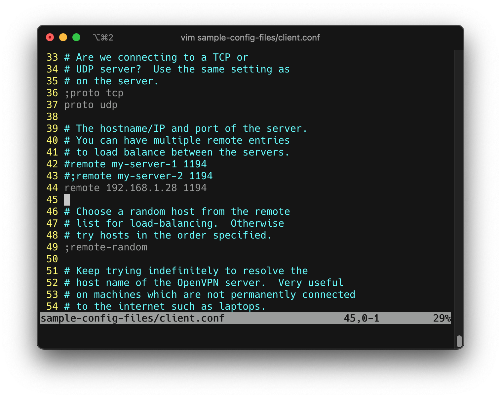

On teste le bon fonctionnement de ce VPN à l'aide de la commande suivante :

```shell
# Se placer dans le dossier contenant les certificats
$ cd /usr/share/doc/openvpn/examples/sample-keys

# Lancer la configuration par défaut
$ openvpn ../sample-config-files/server.conf
```

Dû à des problèmes liés au kernel proxmox (`/dev/net/tun` inexistant dans cette version), nous passerons par l'utilisation d'un Docker en lieu et place de l'installer en bare metal.

On commence donc par créer notre environnement de travail. Notes issues du site [Docker officiel](https://hub.docker.com/r/kylemanna/openvpn/#!).

```shell
$ cd
$ mkdir openvpn && mkdir openvpn/ovpn-data-example && cd openvpn
$ OVPN_DATA="ovpn-data-example"
# Initialize the $OVPN_DATA container that will hold the configuration files and certificates. The container will
# prompt for a passphrase to protect the private key used by the newly generated certificate authority.
$ docker volume create --name $OVPN_DATA
$ docker run -v $OVPN_DATA:/etc/openvpn --rm kylemanna/openvpn ovpn_genconfig -u udp://VPN.SERVERNAME.COM
$ docker run -v $OVPN_DATA:/etc/openvpn --rm -it kylemanna/openvpn ovpn_initpki
```

On start le conteneur :

```shell
$ docker run -v $OVPN_DATA:/etc/openvpn -p 1194:1194/udp --cap-add=NET_ADMIN kylemanna/openvpn
```

Mais finalement, on obtient le même problème de `/dev/net/tun` inexistant.

Nous essayons ensuite de passer par un conteneur template `lxc`, qui est une fonctionnalité Proxmox permettant de créer des conteneurs LXC directement à partir d'un template, dans notre cas OpenVPN.

Après avoir lancé le conteneur, nous obtenons à nouveau une erreur sur le `/dev/net/tun`, mais l'installation semble se poursuivre. A l'issue de cette dernière, nous obtenons le résultat suivant:

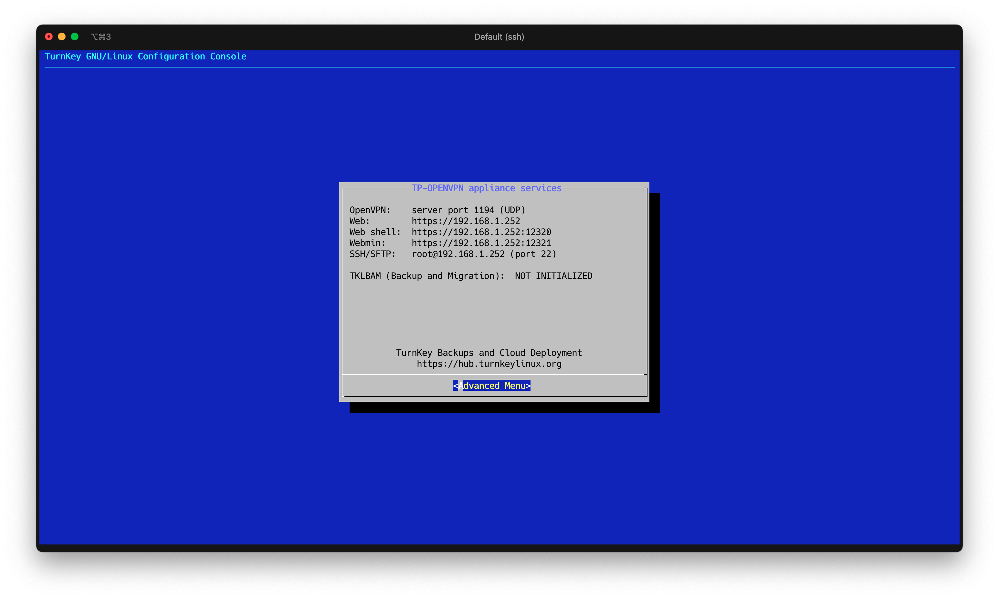

Nous ajoutons ensuite un nouveau client:

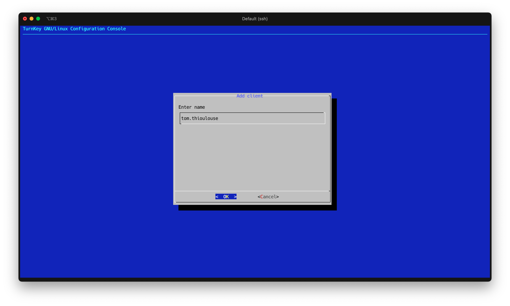

Une fois ceci fait, nous obtenons une URL nous permettant de télécharger ou voir la configuration du client `tom.thioulouse` à partir d'un lien de la forme `http://192.168.1.252/profiles/1145ab468e54137e1f56079040561ab3296c3767/tom.thioulouse.ovpn`.

Nous obtenons le fichier de configuration du client. Après avoir essayé de se connecter, nous pouvons constater que cela fonctionne parfaitement. Il reste maintenant à intégrer l'utilisation du module LDAP pour l'authentification.

## Configuration du plugin `ldap`

Nous commençons par créer notre configuration LDAP qui sera utilisée par le plugin pour l'authentification. Nous créons donc le fichier `/etc/openvpn/auth-ldap.conf` avec le contenu suivant:

```
<LDAP>
    # Connexion au serveur LDAP
    URL             ldaps://192.168.1.28:636

    # Paramètres de l'annuaire LDAP
    BindDN          cn=admin,dc=Efrei,dc=fr
    Password        bind_password
    Timeout         15
    TLSEnable       no
    FollowReferrals no

    # Base de recherche pour les utilisateurs
    BaseDN          "ou=users,dc=Efrei,dc=fr"
    SearchFilter    "(uid=%u)"

    #RequireGroup    yes
    #BaseDN          "ou=groups,dc=Efrei,dc=fr"
    #GroupSearchFilter "(memberUid=%u)"
    #GroupName       cn=vpn_users,ou=groups,dc=Efrei,dc=fr
</LDAP>
```

Nous ajoutons maintenant cette ligne dans `/etc/openvpn/server.conf` pour intégrer l'utilisation du plugin `openvpn-auth-ldap`.

```
plugin /usr/lib/openvpn/plugins/openvpn-plugin-auth-ldap.so "/etc/openvpn/auth-ldap.conf"
```

Nous avons donc une configuration qui a le contenu suivant:

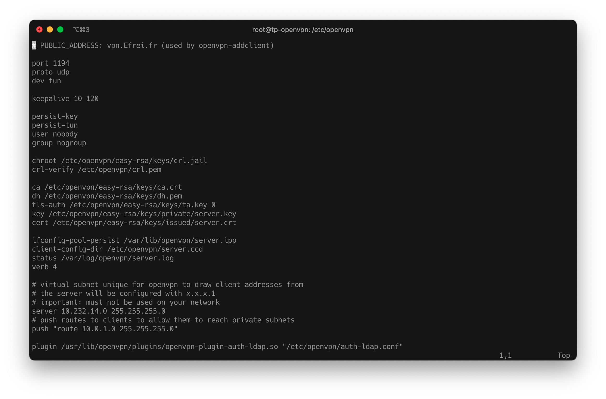

Enfin, nous redémarrons notre service à l'aide de la commande suivante:

```shell
$ systemctl restart openvpn@server
```

Hélas, encore une fois, le plugin `openvpn-plugin-auth-ldap.so` semble ne pas avoir été installé correctement, ou se trouve à un autre endroit comme en témoigne le `journalctl`.

Nous essayons donc, en dernière tentative, de cloner directement le code source du plugin et de l'installer manuellement.

```shell
$ git clone https://github.com/snowrider311/openvpn-auth-ldap
$ cd openvpn-auth-ldap/
$ ./ubuntu_16.04_lts_build.sh
```

Avec cette commande, nous obtenons ENFIN notre plugin d'authentification:

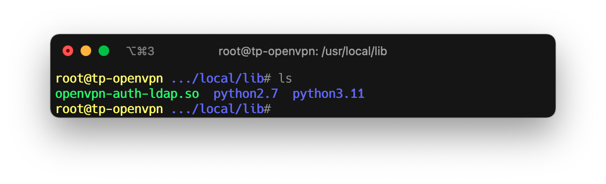

Nous procédons à une modification du nom dans notre configuration de `server.conf`:

```
plugin /usr/local/lib/openvpn-auth-ldap.so "/etc/openvpn/auth-ldap.conf"
```

Nous n'obtenons cette fois-ci plus d'erreur lors du restart de notre service OpenVPN !


## Configuration

Nous copions le contenu de `easy-rsa` dans notre dossier `server`:

```shell
$ cp -r /usr/share/easy-rsa /etc/openvpn/server
```

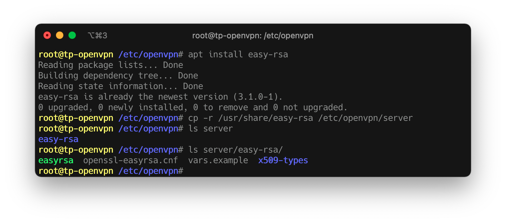

Nous créons notre infrastructure de clés publiques à l'aide de la commande suivante:

```shell
$ ./easy-rsa/easyrsa init-pki
$ ./easy-rsa/easyrsa build-ca
```

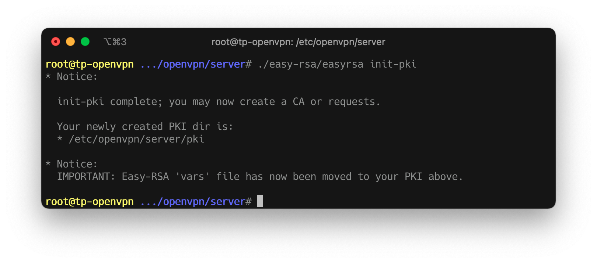

**Note:** Lors de l'exécution de la deuxième commande, indiquer `autorite` pour `Common Name`.

Nous effectuons ensuite la création de la clé et la demande de certificat pour Efrei et pour le client:

```shell
$ ./easy-rsa/easyrsa gen-req Efrei nopass
$ ./easy-rsa/easyrsa sign-req server Efrei
```

Nous obtenons le résultat suivant:

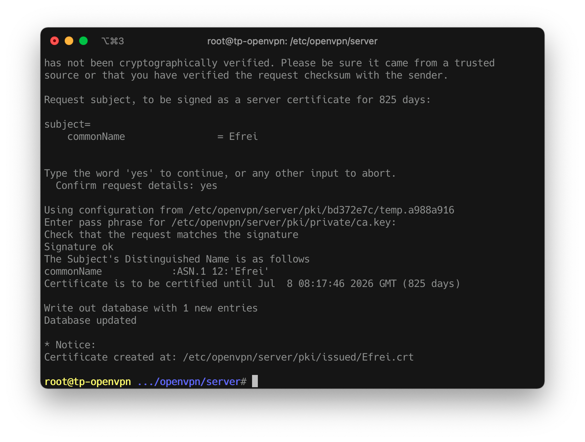

```shell
$ ./easy-rsa/easyrsa gen-req Client_VPN nopass
$ ./easy-rsa/easyrsa sign-req client ClientVPN
```

Nous obtenons le résultat suivant:

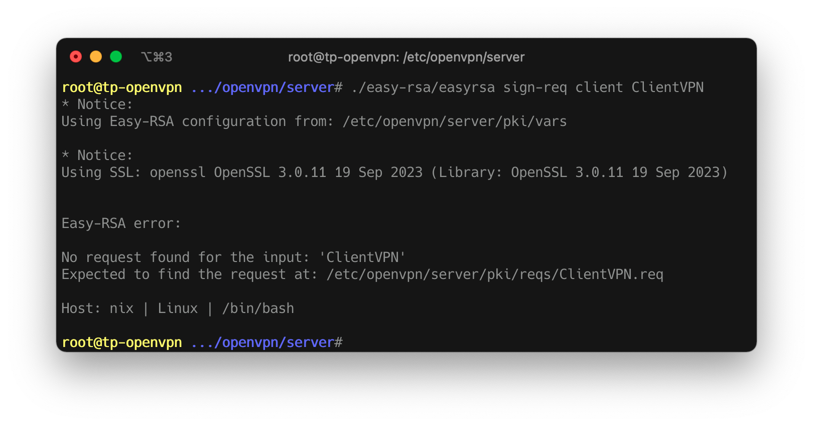

Puis, nous créons la clé Diffie Hellman et la clé d’authentification TLS `TA.key`: 

```shell
$ ./easy-rsa/easyrsa gen-dh
$ openvpn --genkey secret ta.key
```

