# Architectures sécurisées d'entreprise

Notes de cours de `Thomas PEUGNET`.

Ce cours présente comment faire un speedrun des TPs 1, 2, 3, 4, et 6.

Le TP05 aura éte effectué à 90%, mais n'aboutit pas à une solution fonctionnelle.

# TP01

## Création de l'utilisateur Pierre


```shell
$ adduser pierre
$ usermod -aG sudo pierre

# Changement du hostname
$ hostnamectl hostname Efrei.fr 
```

## Installation

```shell
$ apt install slapd ldap-utils

# Création de la configuration de base
$ dpkg-reconfigure slapd
```

Durant cette étape, choisir les options suivantes : 

- Omit OpenLDAP server configuration ? `No`
- DNS Domain Name : `Efrei.fr`
- Org. Name: `Efrei`
- Do you want the database to be removed when `slapd` is purged ? : `Yes`

Vérifier que le service fonctionne correctement : `systemctl status slapd` doit posséder le statut `active`.

Vérifier le port d'écoute du service : `netstat -laptun | grep slapd`

## Première connexion

```shell
$ ldapsearch -x -H ldap://127.0.0.1 -D "cn=admin,dc=Efrei,dc=fr" -W
```


Modification du fichier `/etc/hosts` :


Dans le fichier `/etc/ldap/ldap.conf`, modifier les lignes `BASE` et `URI` suivantes :
```shell
BASE	  dc=Efrei,dc=fr
URI	    ldap://Efrei.fr
```

Ce qui donne le fichier suivant :

```conf
#
# LDAP Defaults
#

# See ldap.conf(5) for details
# This file should be world readable but not world writable.

BASE	dc=Efrei,dc=fr
URI	ldap://Efrei.fr

#SIZELIMIT	12
#TIMELIMIT	15
#DEREF		never

# TLS certificates (needed for GnuTLS)
TLS_CACERT	/etc/ssl/certs/ca-certificates.crt
```

Vérification du fonctionnement avec la commande suivante :

```shell
$ ldapsearch -x
```


Pour vérifier le bon fonctionnement du serveur LDAP, à tout moment utiliser :

```shell
$ slapcat
```


## Remplissage de l'annuaire

### Organization Units

Créer un fichier `org_unit.ldif` et le remplir avec le contenu suivant:

```ldif
dn: ou=users,dc=Efrei,dc=fr
objectClass: organizationalUnit

dn: ou=groups,dc=Efrei,dc=fr
objectClass: organizationalUnit
```

Appliquer le contenu présent dans ce fichier à notre serveur LDAP par la commande suivante :

```shell
$ ldapadd -W -D "cn=admin,dc=Efrei,dc=fr" -x -f org_unit.ldif
```


### Groups

Créer un fichier `groups.ldif` et le remplir avec le contenu suivant:

```ldif
dn: cn=teachers,ou=groups,dc=Efrei,dc=fr
objectClass: posixGroup
objectClass: top
gidNumber: 6001
cn: teachers

dn: cn=students,ou=groups,dc=Efrei,dc=fr
objectClass: posixGroup
objectClass: top
gidNumber: 6002
cn: students
```

Appliquer le contenu présent dans ce fichier à notre serveur LDAP par la commande suivante :

```shell
$ ldapadd -W -D "cn=admin,dc=Efrei,dc=fr" -x -f groups.ldif
```


### Création de l'utilisateur Pierre et Souheib

Créer un fichier `pierre.ldif` et le remplir avec le contenu suivant:

```ldif
dn: cn=teachers,ou=groups,dc=Efrei,dc=fr
objectClass: posixGroup
objectClass: top
gidNumber: 6001
cn: teachers

dn: uid=pierre.dupont,ou=users,dc=Efrei,dc=fr
objectClass: posixGroup
objectClass: top
objectClass: organizationalPerson
objectClass: inetOrgPerson
objectClass: posixAccount
uidNumber: 6002
gidNumber: 6002
homeDirectory: /home/pierre
loginShell: /bin/bash
uid: pierre.dupont
sn: dupont
cn: pierre dupont
mail: pierre.dupont@efrei.fr
userPassword: pierre
```

Appliquer le contenu présent dans ce fichier à notre serveur LDAP par la commande suivante :

```shell
$ ldapadd -W -D "cn=admin,dc=Efrei,dc=fr" -x -f pierre.ldif
```

Créer un fichier `souheib.ldif` et le remplir avec le contenu suivant:

```ldif
dn: uid=souheib.yousfi,ou=users,dc=Efrei,dc=fr
objectClass: person
objectClass: top
objectClass: organizationalPerson
objectClass: inetOrgPerson
objectClass: posixAccount
uidNumber: 6001
gidNumber: 6001
homeDirectory: /home/souheib
loginShell: /bin/bash
uid: souheib.yousfi
sn: yousfi
cn: souheib yousfi
mail: souheib.yousfi@efrei.fr
userPassword: souheib
```

Appliquer le contenu présent dans ce fichier à notre serveur LDAP par la commande suivante :

```shell
$ ldapadd -W -D "cn=admin,dc=Efrei,dc=fr" -x -f souheib.ldif
```


On met à jour le mot de passe à l'aide la commande suivante :

```shell
$ ldappasswd -H ldap://127.0.0.1 -x -D "cn=admin,dc=Efrei,dc=fr" -W -S "uid=souheib.yousfi,ou=users,dc=Efrei,dc=fr"
```

## Vérification et ajout d'un email

On effectue une requête pour vérifier l'utilisateur à l'aide de la commande suivante :

```shell
$ ldapsearch -x -b "dc=Efrei,dc=fr" -LLL uid=souheib.yousfi cn mail
```


On crée un nouvel email pour l'utilisateur au sein du fichier `add_email.ldif` :

```
dn: uid=souheib.yousfi,ou=users,dc=Efrei,dc=fr
changetype: modify
add: mail
mail:souheib.yousfi@efrei.net
```

On ajoute  un email à l'utilisateur à l'aide de la commande suivante :

```shell
$ ldapmodify -D cn=admin,dc=Efrei,dc=fr -W -f add_email.ldif
```


# TP02

## Création des certificats

Création d'un certificat à l'aide de la commande suivante :

```shell
$ mkdir /etc/ldap/ssl && cd /etc/ldap/ssl
$ openssl req -x509 -newkey rsa:4096 -keyout key.pem -out cert.pem -days 3650 -nodes
```

(Photo non-contractuelle)


Changer l'appartenance et les permissions avec les commandes suivantes : 

```shell
$ chown openldap:openldap /etc/ldap/ssl/cert.pem
$ chown openldap:openldap /etc/ldap/ssl/key.pem
```

## Configuration du certificat avec `slapd`

Créer un fichier `cert.ldif` avec le contenu suivant :

```ldif
dn: cn=config
changetype: modify
add: olcTLSCACertificateFile
olcTLSCACertificateFile: /etc/ldap/ssl/cert.pem
-
add: olcTLSCertificateFile
olcTLSCertificateFile: /etc/ldap/ssl/cert.pem
-
add: olcTLSCertificateKeyFile
olcTLSCertificateKeyFile: /etc/ldap/ssl/key.pem
-
add: olcTLSVerifyClient
olcTLSVerifyClient: never
```

On applique ce fichier à l'aide de la commande suivante : 

```shell
$ ldapmodify -QY EXTERNAL -H ldapi:/// -f cert.ldif
```

On modifie le fichier de configuration `/etc/default/slapd` pour ajouter le service `ldaps` en ajoutant à `ldaps:///` à la suite de la ligne `SLAPD_SERVICES`.

Redémarrer le service et vérifier que le port `636` est bien sur écoute.

```shell
$ systemctl restart slapd.service
$ sudo netstat -tulpen | grep slapd
```


# Création des utilisateurs (DIT Personnel)

Créer 3 fichiers correspondant aux informations des 3 utilisateurs, ayant respectivement chacun le contenu suivant :

`thomas.ldif`:

```
dn: uid=thomas.peugnet,ou=users,dc=Efrei,dc=fr
objectClass: person
objectClass: top
objectClass: organizationalPerson
objectClass: inetOrgPerson
objectClass: posixAccount
uidNumber: 10002
gidNumber: 6002
homeDirectory: /home/thomas
loginShell: /bin/bash
uid: thomas.peugnet
sn: peugnet
cn: thomas peugnet
mail: thomas.peugnet@efrei.fr
userPassword: thomas
```

`tom.ldif`:

```
dn: uid=tom.thioulouse,ou=users,dc=Efrei,dc=fr
objectClass: person
objectClass: top
objectClass: organizationalPerson
objectClass: inetOrgPerson
objectClass: posixAccount
uidNumber: 10003
gidNumber: 6002
homeDirectory: /home/tom
loginShell: /bin/bash
uid: tom.thioulouse
sn: thioulouse
cn: tom thioulouse
mail: tom.thioulouse@efrei.fr
userPassword: tom
```

`alexis.ldif`:

```
dn: uid=alexis.plessias,ou=users,dc=Efrei,dc=fr
objectClass: person
objectClass: top
objectClass: organizationalPerson
objectClass: inetOrgPerson
objectClass: posixAccount
uidNumber: 10001
gidNumber: 6002
homeDirectory: /home/alexis
loginShell: /bin/bash
uid: alexis.plessias
sn: plessias
cn: alexis plessias
mail: alexis.plessias@efrei.fr
userPassword: alexis
```

Nous les appliquons au serveur LDAP à l'aides des 3 commandes suivantes :

```shell
$ ldapadd -W -D "cn=admin,dc=Efrei,dc=fr" -x -f thomas.ldif
$ ldapadd -W -D "cn=admin,dc=Efrei,dc=fr" -x -f tom.ldif
$ ldapadd -W -D "cn=admin,dc=Efrei,dc=fr" -x -f alexis.ldif
```


## Interface Graphique `LDAP Accound Manager`

### Installation

Utiliser la commande suivante pour installer toutes les dépendances et `ldap-account-manager` : 

```shell
$ sudo apt install apache2 php php-cgi libapache2-mod-php php-mbstring php-common php-pear ldap-account-manager -y

# Activer php-cgi
$ sudo a2enconf php8.1-cgi

# Resart apache2
$ systemctl restart apache2
```

Ensuite, se connecter sur `http://192.168.1.28/lam/templates/login.php`.


Puis, se rendre dans `LAM configuration`, utiliser le mot de passe `lam` et modifier les paramètres de domaine dans la page `General Settings` :


Enfin, modifier également les informations de domaine dans la partie `Account Types` :


Après avoir sauvegardé cette configuration, se reconnecter avec l'utilisateur `admin`

Nous pouvons constater le résultat suivant :


## Connexion au serveur

Utiliser la commande suivante pour vérifier qu'il est bien possible de se connecter au serveur :

```shell
$ LDAPTLS_REQCERT=never ldapsearch -H ldaps://192.168.1.28:636 -W -D "cn=admin,dc=Efrei,dc=fr" -b "dc=Efrei,dc=fr" "(objectClass=*)"
```


Il est nécessaire d'ignorer temporairement la vérification du certificat, d'où la variable `LDAPTLS_REQCERT=never`.

### Wireshark

Après avoir lancé la capture Wireshark, et effectué une requête au serveur LDAP, on obtient le résultat suivant :


Etant donné que nous utilisons un protocole de chiffrement, il n'est pas étonnant de voir que nous ne pouvons pas déchiffrer directement dans Wireshark les informations du LDAP. Le traffic ne circule pas en clair sur le réseau.

# TP03

## Configuration de PAM

```shell
$ sudo apt install libnss-ldap
```

Par la suite, un écran de configuration va être affiché, il s'agit de remplir les informations suivantes : 

- URI du serveur LDAP : `Efrei.fr:636`
- Base de recherche : `dc=Efrei,dc=fr`
- Make local root Database admin : `Yes`
- Does database require login : `No`
- LDAP account for root : `cn=admin,dc=Efrei,dc=fr`
- Configuration des services à configurer : Aucun


Utiliser la commande suivante pour vérifier le bon fonctionnement : 

```shell
$ LDAPTLS_REQCERT=never ldapsearch -H ldaps://Efrei.fr:636 -b 'dc=Efrei,dc=fr' -x uid=thomas.peugnet -LLL
```

On obtient le résultat suivant :


On modifie les fichiers `nsswitch.conf` et `nslcd.conf` pour avoir le résultat suivant:

`nsswitch.conf` (attention aux lignes `passwd, group, shadow et gshadow`):

```
# /etc/nsswitch.conf
#
# Example configuration of GNU Name Service Switch functionality.
# If you have the `glibc-doc-reference' and `info' packages installed, try:
# `info libc "Name Service Switch"' for information about this file.

passwd:         ldap files systemd
group:          ldap files systemd
shadow:         ldap files
gshadow:        files

hosts:          files dns
networks:       files

protocols:      db files
services:       db files
ethers:         db files
rpc:            db files

netgroup:       nis
```

`nslcd.conf`:

```
# /etc/nslcd.conf
# nslcd configuration file. See nslcd.conf(5)
# for details.

# The user and group nslcd should run as.
uid nslcd
gid nslcd

# The location at which the LDAP server(s) should be reachable.
uri ldaps://Efrei.fr:636

# The search base that will be used for all queries.
base dc=Efrei,dc=fr

# The LDAP protocol version to use.
#ldap_version 3

# The DN to bind with for normal lookups.
#binddn cn=annonymous,dc=example,dc=net
#bindpw secret

# The DN used for password modifications by root.
#rootpwmoddn cn=admin,dc=example,dc=com

# SSL options
#ssl off
tls_reqcert never
tls_cacertfile /etc/ldap/ssl/cert.pem

# The search scope.
#scope sub
```

On redémarre le service :

```shell
$ sudo service nslcd restart
```

On vérifie que le service a bien redémarré avec la commande suivante :

```shell
$ getent passwd | grep thomas.peugnet
```


**Note:** Une erreur avait été faite lors de la création de l'utilisateur ci-dessus, avec les mauvais UIDs.

Si plusieurs utilisateurs ont les mêmes UIDs, il est possible de les changer via l'url de LAM:

http://192.168.1.28/lam/templates/login.php

**Note:** Si, en se connectant avec un utilisateur, on se retrouve connecté sur le compte d'un autre utilisateur, il est possible qu'il existe un conflit sur les UIDs.

On crée les dossiers personnels des utilisateurs avec les bonnes permissions à l'aide des commandes suivantes:

```shell
$ mkdir /home/tom && chown tom.thioulouse:teachers -R /home/tom
$ mkdir /home/thomas && chown thomas.peugnet:students -R /home/thomas
$ mkdir /home/alexis && chown alexis.plessias:students -R /home/alexis
```

Enfin, on essaye de se connecter via une autre instance :

```shell
$ ssh alexis.plessias@192.168.1.28
```

Le mot de passe étant défini dans le fichier `.ldif` du TP01.

On obtient le résultat suivant :


## Gestion des accès SSH

On modifie le fichier de configuration SSH, pour n'autoriser que les membres du groupe `teachers` à se connecter via SSH, em ajoutant à la fin du fichier :

```
AllowGroups teachers
```


On modifie égalemement le fichier de configuration `/etc/pam.d/sshd` en ajoutant la ligne suivante :

```
auth required pam_group.so
```

Ce qui donne le résultat suivant :


On redémarre le service ssh avec la commande suivante : 

```shell
$ systemctl restart ssh.service
```

Puis, on re-tente de se connecter en ssh avec un utilisateur du groupe `students` :

```shell
$ ssh alexis.plessias@192.168.1.28
```

On obtient le résultat suivant :


Si on tente de se connecter avec un utilisateur du groupe `teachers`  :

```shell
$ ssh tom.thioulouse@192.168.1.28
```


**Note:** Si l'erreur `Could not chdir to home directory /home/X: No such file or directory`, c'est que le dossier de l'utilisateur n'existe pas. Si une erreur de `Permission Denied` survient, c'est le `chown` qui n'a pas été correctement effectué.

# TP04

## Configuration de Apache2

Installation du service Apache2 et activation du module d'authentification :

```shell
# Installation
$ apt install apache2

# Activation du module
$ sudo a2enmod authnz_ldap

# Restart du service
$ systemctl restart apache2
```

Modification du VirtualHost par défaut d'Apache pour lui ajouter une Basic Auth:

Le fichier `/etc/apache2/sites-availables/000-default.conf` doit donc avoir le contenu suivant:

```conf
<AuthnProviderAlias ldap myldap>
    AuthLDAPURL "ldap://Efrei.fr/ou=users,dc=Efrei,dc=fr"
</AuthnProviderAlias>

<VirtualHost *:80>
	# The ServerName directive sets the request scheme, hostname and port that
	# the server uses to identify itself. This is used when creating
	# redirection URLs. In the context of virtual hosts, the ServerName
	# specifies what hostname must appear in the request's Host: header to
	# match this virtual host. For the default virtual host (this file) this
	# value is not decisive as it is used as a last resort host regardless.
	# However, you must set it for any further virtual host explicitly.
	#ServerName www.example.com

	ServerAdmin webmaster@localhost
	DocumentRoot /var/www/html

	# Available loglevels: trace8, ..., trace1, debug, info, notice, warn,
	# error, crit, alert, emerg.
	# It is also possible to configure the loglevel for particular
	# modules, e.g.
	#LogLevel info ssl:warn

	ErrorLog ${APACHE_LOG_DIR}/error.log
	CustomLog ${APACHE_LOG_DIR}/access.log combined

	# For most configuration files from conf-available/, which are
	# enabled or disabled at a global level, it is possible to
	# include a line for only one particular virtual host. For example the
	# following line enables the CGI configuration for this host only
	# after it has been globally disabled with "a2disconf".
	#Include conf-available/serve-cgi-bin.conf

        <Directory "/var/www/html">
            AuthType Basic
            AuthName "Top Secret"
            AuthBasicProvider myldap
            Require valid-user
            LogLevel trace1
        </Directory>
</VirtualHost>

# vim: syntax=apache ts=4 sw=4 sts=4 sr noet
```

On redémarre le service:

```shell
$ systemctl restart apache2
```

On modifie le contenu de la page sur laquelle le VHost redirige avec le contenu suivant:

```html
<h1>It's working !</h1>
<p>Si ce message est visible, c'est que la configuration est correcte !</p>
<p style="font-size:5px">Meilleur site de speedruns sur les TPs, visitez <a href="https://iefrei.fr">iefrei.fr</a> !</p>
```

On accède à la page sur l'URL http://192.168.1.28, et on constate le résultat suivant :


Cela nous indique que la configuration de la Basic Auth fonctionne correctement.

Si on entre les informations de l'utilisateur `alexis.plessias` :


## Restriction des accès au groupe `teachers`

Modification de la ligne `2` de la configuration du VHost avec le contenu suivant :

```
<AuthnProviderAlias ldap myldap>
    AuthLDAPURL "ldap://Efrei.fr/ou=users,dc=Efrei,dc=fr?uid?sub?(gidNumber=6001)"
</AuthnProviderAlias>
```

Avec `6001` le GID du groupe `teachers`.

Avec la connexion en tant qu'utilisateur `alexis.plessias` du groupe `students` :


**Note:** L'écran ci-dessus arrive lorsque l'on clique sur le bouton `Annuler`,  après plusieurs tentatives infructueuses de connexion.

Avec l'utilisateur `tom` qui est membre du groupe `teachers` :


## Amélioration - HTTPS

Création d'un certificat pour l'HTTPS:

```shell
$ openssl genpkey -algorithm RSA -out /etc/ssl/private/https_key.key -pkeyopt rsa_keygen_bits:2048
$ openssl req -new -key /etc/ssl/private/https_key.key -out https_request.csr
$ openssl x509 -signkey /etc/ssl/private/https_key.key -in https_request.csr -req -days 365 -out /etc/ssl/certs/https_cert.crt
```

Pour activer l'HTTPS sur notre serveur web, nous allons commencer par activer le module `ssl` à l'aide de la commande suivante:

```shell
$ a2enmod ssl
```

On effectue une backup du fichier de configuration original.

```shell
$ cd /etc/apache2/sites-available
$ cp default-ssl.conf default-ssl.conf.old
$ echo "" > default-ssl.conf
```

On modifie notre configuration Apache dans notre fichier `default-ssl.conf` par la configuration suivante:

```
<VirtualHost *:443>
    ServerAdmin webmaster@localhost
    DocumentRoot /var/www/html

    ErrorLog ${APACHE_LOG_DIR}/error.log
    CustomLog ${APACHE_LOG_DIR}/access.log combined

    SSLEngine on
    SSLCertificateFile /etc/ssl/certs/https_cert.crt
    SSLCertificateKeyFile /etc/ssl/private/https_key.key

    <Directory "/var/www/html">
        AuthType Basic
        AuthName "Top Secret"
        AuthBasicProvider myldap
        Require valid-user
        LogLevel trace1
    </Directory>
</VirtualHost>
```

En nous rendant sur le site en `https` on obtient le résultat suivant:


Nous pouvons constater que cela fonctionne correctement.

# TP05

> ***Note:** Cette partie n'aboutit pas à une configuration OpenVPN fonctionnelle. Elle détaille l'installation de 4 façons différentes, dont l'une avec succès, la configuration qui, normalement devrait fonctionner, mais la finalité demeure être une impossibilité de lancer le serveur OpenVPN, et donc d'initier une connexion depuis un client distant.*

## Installation de OpenVPN

```shell
$ apt install openvpn
```

Vérifier la bonne installation en se rendant dans le dossier suivant :

```shell
$ cd /usr/share/doc/openvpn/examples
```


On récupère l'adresse IP de notre instance par la commande `hostname -I`.

On modifie le contenu de la configuration du fichier `sample-config-files/client.conf` avec la ligne suivante (varaible selon votre IP):

```
remote 192.168.1.28 1194
```


On teste le bon fonctionnement de ce VPN à l'aide de la commande suivante :

```shell
# Se placer dans le dossier contenant les certificats
$ cd /usr/share/doc/openvpn/examples/sample-keys

# Lancer la configuration par défaut
$ openvpn ../sample-config-files/server.conf
```

Dû à des problèmes liés au kernel proxmox (`/dev/net/tun` inexistant dans cette version), nous passerons par l'utilisation d'un Docker en lieu et place de l'installer en bare metal.

On commence donc par créer notre environnement de travail. Notes issues du site [Docker officiel](https://hub.docker.com/r/kylemanna/openvpn/#!).

```shell
$ cd
$ mkdir openvpn && mkdir openvpn/ovpn-data-example && cd openvpn
$ OVPN_DATA="ovpn-data-example"
# Initialize the $OVPN_DATA container that will hold the configuration files and certificates. The container will
# prompt for a passphrase to protect the private key used by the newly generated certificate authority.
$ docker volume create --name $OVPN_DATA
$ docker run -v $OVPN_DATA:/etc/openvpn --rm kylemanna/openvpn ovpn_genconfig -u udp://VPN.SERVERNAME.COM
$ docker run -v $OVPN_DATA:/etc/openvpn --rm -it kylemanna/openvpn ovpn_initpki
```

On start le conteneur :

```shell
$ docker run -v $OVPN_DATA:/etc/openvpn -p 1194:1194/udp --cap-add=NET_ADMIN kylemanna/openvpn
```

Mais finalement, on obtient le même problème de `/dev/net/tun` inexistant.

Nous essayons ensuite de passer par un conteneur template `lxc`, qui est une fonctionnalité Proxmox permettant de créer des conteneurs LXC directement à partir d'un template, dans notre cas OpenVPN.

Après avoir lancé le conteneur, nous obtenons à nouveau une erreur sur le `/dev/net/tun`, mais l'installation semble se poursuivre. A l'issue de cette dernière, nous obtenons le résultat suivant:


Nous ajoutons ensuite un nouveau client:


Une fois ceci fait, nous obtenons une URL nous permettant de télécharger ou voir la configuration du client `tom.thioulouse` à partir d'un lien de la forme `http://192.168.1.252/profiles/1145ab468e54137e1f56079040561ab3296c3767/tom.thioulouse.ovpn`.

Nous obtenons le fichier de configuration du client. Après avoir essayé de se connecter, nous pouvons constater que cela fonctionne parfaitement. Il reste maintenant à intégrer l'utilisation du module LDAP pour l'authentification.

## Configuration du plugin `ldap`

Nous commençons par créer notre configuration LDAP qui sera utilisée par le plugin pour l'authentification. Nous créons donc le fichier `/etc/openvpn/auth-ldap.conf` avec le contenu suivant:

```
<LDAP>
    # Connexion au serveur LDAP
    URL             ldaps://192.168.1.28:636

    # Paramètres de l'annuaire LDAP
    BindDN          cn=admin,dc=Efrei,dc=fr
    Password        bind_password
    Timeout         15
    TLSEnable       no
    FollowReferrals no

    # Base de recherche pour les utilisateurs
    BaseDN          "ou=users,dc=Efrei,dc=fr"
    SearchFilter    "(uid=%u)"

    #RequireGroup    yes
    #BaseDN          "ou=groups,dc=Efrei,dc=fr"
    #GroupSearchFilter "(memberUid=%u)"
    #GroupName       cn=vpn_users,ou=groups,dc=Efrei,dc=fr
</LDAP>
```

Nous ajoutons maintenant cette ligne dans `/etc/openvpn/server.conf` pour intégrer l'utilisation du plugin `openvpn-auth-ldap`.

```
plugin /usr/lib/openvpn/plugins/openvpn-plugin-auth-ldap.so "/etc/openvpn/auth-ldap.conf"
```

Nous avons donc une configuration qui a le contenu suivant:


Enfin, nous redémarrons notre service à l'aide de la commande suivante:

```shell
$ systemctl restart openvpn@server
```

Hélas, encore une fois, le plugin `openvpn-plugin-auth-ldap.so` semble ne pas avoir été installé correctement, ou se trouve à un autre endroit comme en témoigne le `journalctl`.

Nous essayons donc, en dernière tentative, de cloner directement le code source du plugin et de l'installer manuellement.

```shell
$ git clone https://github.com/snowrider311/openvpn-auth-ldap
$ cd openvpn-auth-ldap/
$ ./ubuntu_16.04_lts_build.sh
```

Avec cette commande, nous obtenons ENFIN notre plugin d'authentification:


Nous procédons à une modification du nom dans notre configuration de `server.conf`:

```
plugin /usr/local/lib/openvpn-auth-ldap.so "/etc/openvpn/auth-ldap.conf"
```

Nous n'obtenons cette fois-ci plus d'erreur lors du restart de notre service OpenVPN !


## Configuration

Nous copions le contenu de `easy-rsa` dans notre dossier `server`:

```shell
$ cp -r /usr/share/easy-rsa /etc/openvpn/server
```


Nous créons notre infrastructure de clés publiques à l'aide de la commande suivante:

```shell
$ ./easy-rsa/easyrsa init-pki
$ ./easy-rsa/easyrsa build-ca
```


**Note:** Lors de l'exécution de la deuxième commande, indiquer `autorite` pour `Common Name`.

Nous effectuons ensuite la création de la clé et la demande de certificat pour Efrei et pour le client:

```shell
$ ./easy-rsa/easyrsa gen-req Efrei nopass
$ ./easy-rsa/easyrsa sign-req server Efrei
```

Nous obtenons le résultat suivant:


```shell
$ ./easy-rsa/easyrsa gen-req Client_VPN nopass
$ ./easy-rsa/easyrsa sign-req client ClientVPN
```

Nous obtenons le résultat suivant:


Puis, nous créons la clé Diffie Hellman et la clé d’authentification TLS `TA.key`: 

```shell
$ ./easy-rsa/easyrsa gen-dh
$ openvpn --genkey secret ta.key
```

Nous récupérons les différents fichiers :

```shell
$ scp root@192.168.1.252:/etc/openvpn/server/pki/ca.crt ./Desktop
$ scp root@192.168.1.252:/etc/openvpn/server/pki/issued/Client_VPN.crt ./Desktop
$ scp root@192.168.1.252:/etc/openvpn/server/pki/private/Client_VPN.key ./Desktop
$ scp root@192.168.1.252:/etc/openvpn/server/ta.key ./Desktop
```

Nous modifions maintenant le fichier de configuration `server.conf`, qui a maintenant le contenu suivant:

```shell
# PUBLIC_ADDRESS: vpn.Efrei.fr (used by openvpn-addclient)

port 1194
proto udp
dev tun

#keepalive 10 120

#persist-key
#persist-tun
#user nobody
#group nogroup

#chroot /etc/openvpn/easy-rsa/keys/crl.jail
#crl-verify /etc/openvpn/crl.pem

ca /etc/openvpn/pki/ca.crt
dh /etc/openvpn/pki/dh.pem
cert /etc/openvpn/pki/issued/Efrei.crt

#tls-auth /etc/openvpn/easy-rsa/keys/ta.key 0
#key /etc/openvpn/easy-rsa/keys/private/server.key
#cert /etc/openvpn/easy-rsa/keys/issued/server.crt

#ifconfig-pool-persist /var/lib/openvpn/server.ipp
#client-config-dir /etc/openvpn/server.ccd
#status /var/log/openvpn/server.log
#verb 4

# virtual subnet unique for openvpn to draw client addresses from
# the server will be configured with x.x.x.1
# important: must not be used on your network
#server 10.232.14.0 255.255.255.0
# push routes to clients to allow them to reach private subnets
#push "route 10.0.1.0 255.255.255.0"

plugin /usr/local/lib/openvpn-auth-ldap.so "/etc/openvpn/auth-ldap.conf"
```

Sur la machine cliente, nous copions tous les fichiers nécessaires à la connexion dans `/etc/openvpn`, et obtenons le résultat suivant:

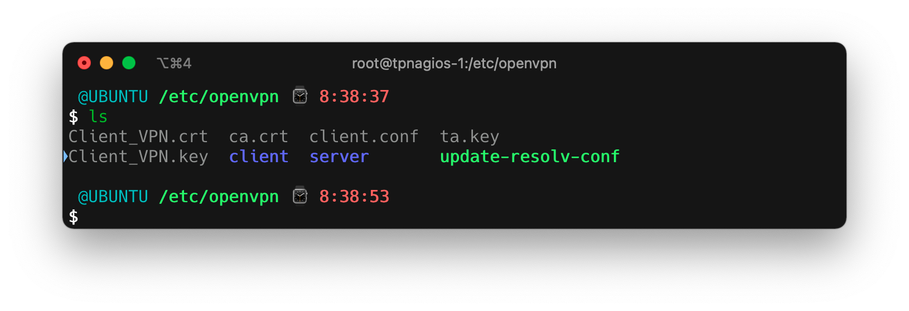

Nous modifions notre fichier de configuration `client.conf` pour correspondre à notre configuration serveur:

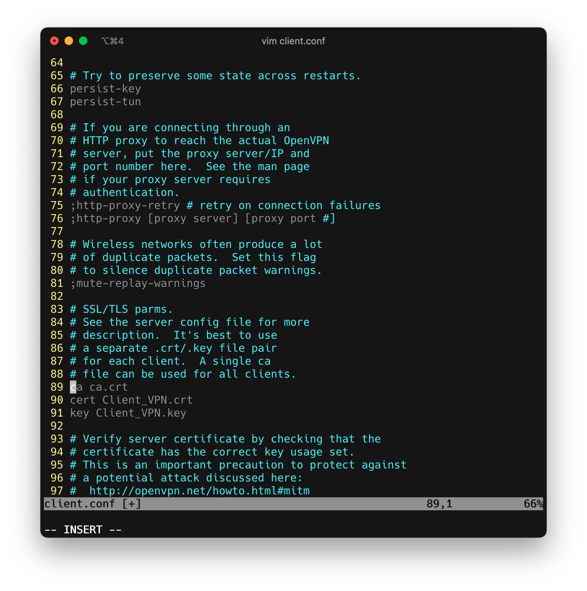

Nous essayons ensuite de lancer le serveur à l'aide de la commande suivante depuis le dossier `/etc/openvpn` sur le serveur:

```shell
$ openvpn server.conf
```

Notre configuration est donc la suivante:

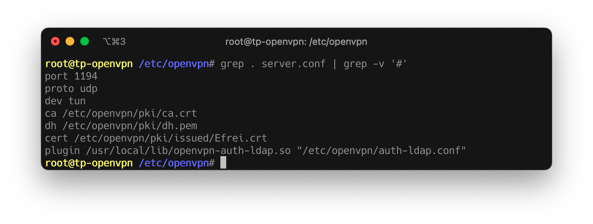

Malgré nos efforts, nous obtenons toujours une erreur dû à notre configuration TLS, pourtant à priori assez proche de celle du TP.


La deuxième commande nous indique que l'utilisation d'un `ca.cert` nécessite l'utilisation du paramètre `–tls-server` d'après la commande `openvpn –help`. Le problème étant que, visiblement, ce paramètre n'est pas reconnu :

```
Options error: Unrecognized option or missing or extra parameter(s) in [CMD-LINE]:1: tls-client

# Alors que dans la doc, nous avons bien: 
--tls-server    : Enable TLS and assume server role during TLS handshake.
# Qui ne semble pas nécessiter d'argument.
```

Étant à court d'idées et de temps, nous choisissons d'interrompre nos recherches ici.

# TP06

## Configuration du serveur DNS

Nous modifions le fichier `/etc/hosts` pour obtenir le résultat suivant:

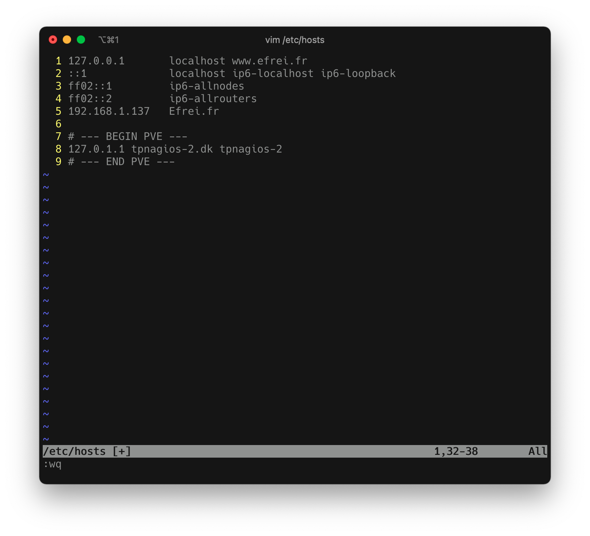

Puis, nous installons les packages suivants.

```shell
$ sudo apt install -y bind9 bind9utils bind9-doc dnsutils
```

Nous modifions ensuite notre fichier `/etc/bind/named.conf.options` et y insérons le contenu suivant:

```java
forwarders {
		8.8.8.8;
		8.8.4.4;
};

allow-query { any; };
```

Puis, nous modifions notre fichier `/etc/bind/named.conf.local` pour avoir le contenu suivant:

```java
zone "efrei.fr" IN  {
        type master;
        file "/etc/bind/forward.efrei.fr.db";
        allow-update { none; };
};

zone "29.16.172.in-addr.arpa" IN {
        type master;
        file "/etc/bind/reverse.efrei.fr.db";
        allow-update { none; };
};
```

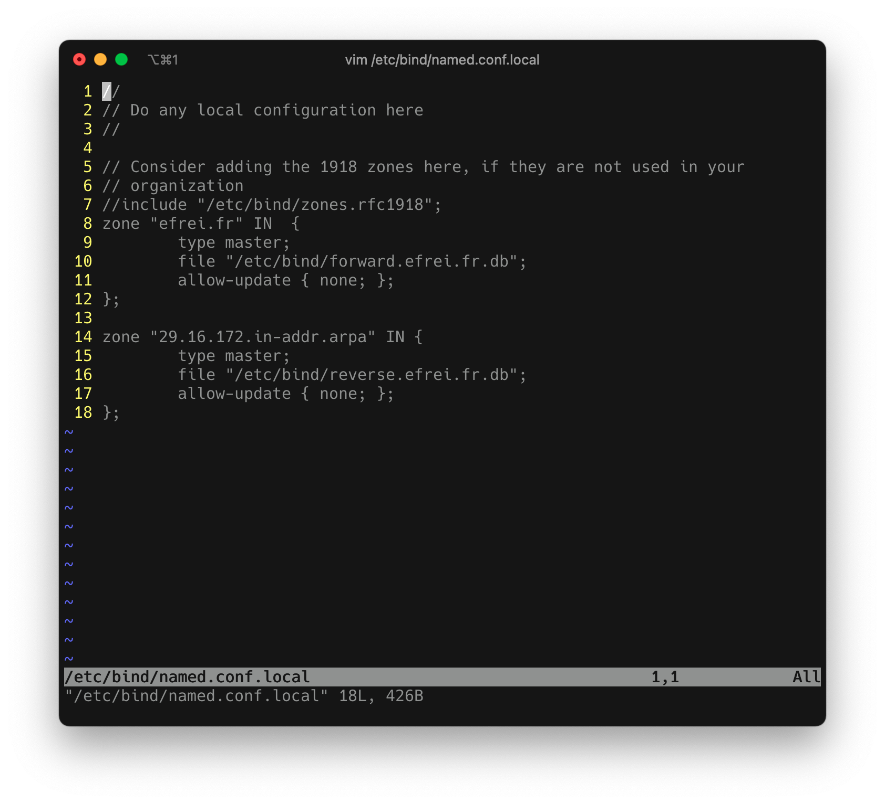

Puis, nous copions le contenu de `db.local` vers `/etc/bind/forward.efrei.fr.db`

```bash
$ cp /etc/bind/db.local /etc/bind/forward.efrei.fr.db
```

Nous modifions ensuite le contenu de notre fichier `forward.efrei.fr.db` avec le contenu suivant:

````java
;
; BIND data file for local loopback interface
;
$TTL	604800
@	IN	SOA	efrei.fr. root.efrei.fr. (
			      2		; Serial
			 604800		; Refresh
			  86400		; Retry
			2419200		; Expire
			 604800 )	; Negative Cache TTL
;
@	IN	NS	efrei.fr.
@	IN	A	192.168.1.137
@	IN	AAAA	::1
;
ubuntu.efrei.fr.              IN           A      192.168.1.28
````

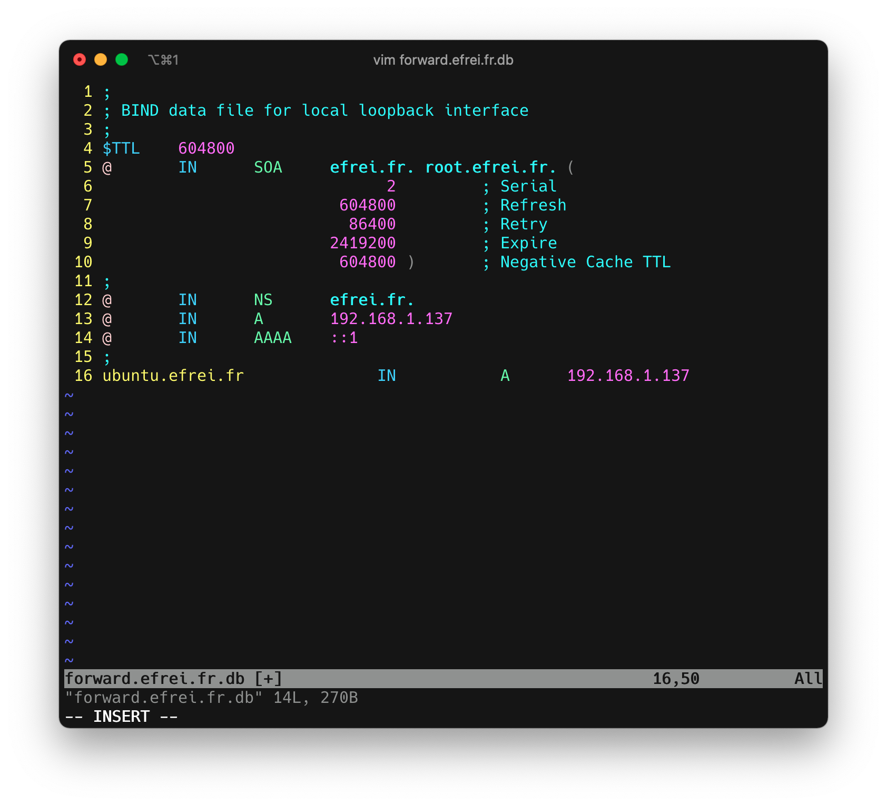

Puis, nous opérons à l'identique pour le fichier `reverse`.

```bash
$ cp /etc/bind/db.local /etc/bind/reverse.efrei.fr.db
```

Nous modifions son contenu pour avoir le suivant:

```java
;
; BIND data file for local loopback interface
;
$TTL	604800
@	IN	SOA	efrei.fr. root.efrei.fr. (
			      1		; Serial
			 604800		; Refresh
			  86400		; Retry
			2419200		; Expire
			 604800 )	; Negative Cache TTL
;
@	    IN	NS	efrei.fr.
efrei.fr    IN	A	192.168.1.137
137	    IN	PTR	efrei.fr.
28         IN  PTR     ubuntu.efrei.fr.
```


Puis, nous testons à l'aide des 2 commandes suivantes :

```bash
$ named-checkzone efrei.fr forward.efrei.fr.db

$ named-checkzone 29.16.172.in-addr.arpa reverse.efrei.fr.db
```

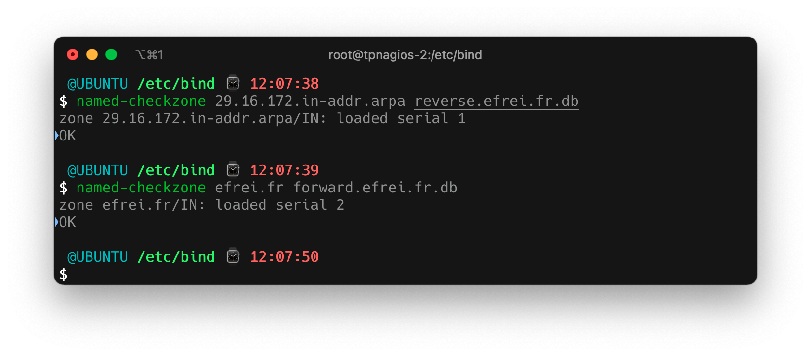

Nous redémarrons le service.

```shell
$ systemctl restart named
```

Nous pouvons constater les adresses de nos DNS en regardant le contenu du fichier  `/etc/resolv.conf`.

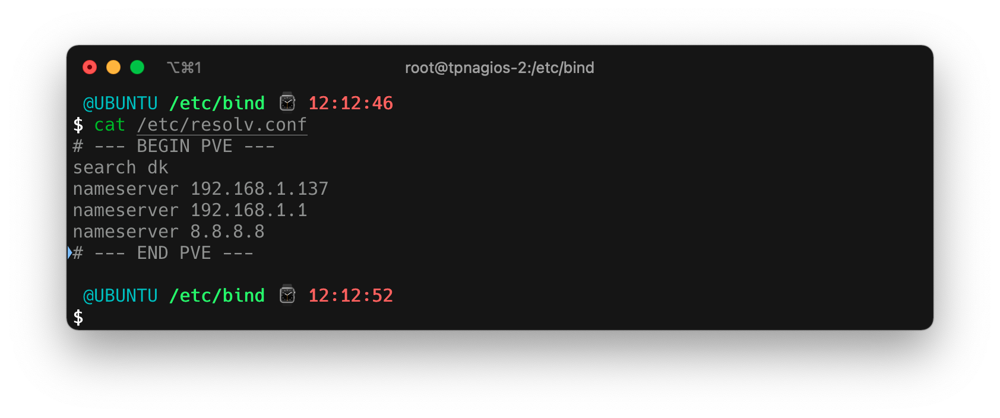

Nous pouvons donc maintenant vérifier la bonne résolution de `ubuntu.efrei.fr` par la commande `dig ubuntu.efrei.fr`.

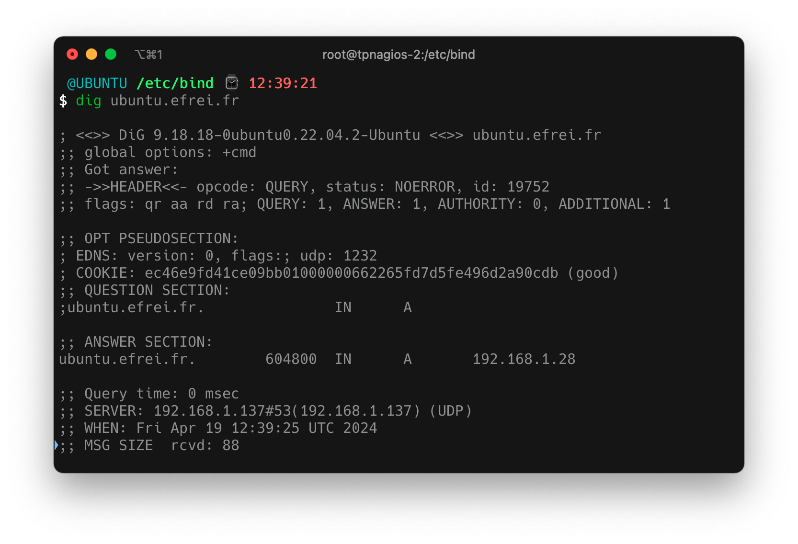

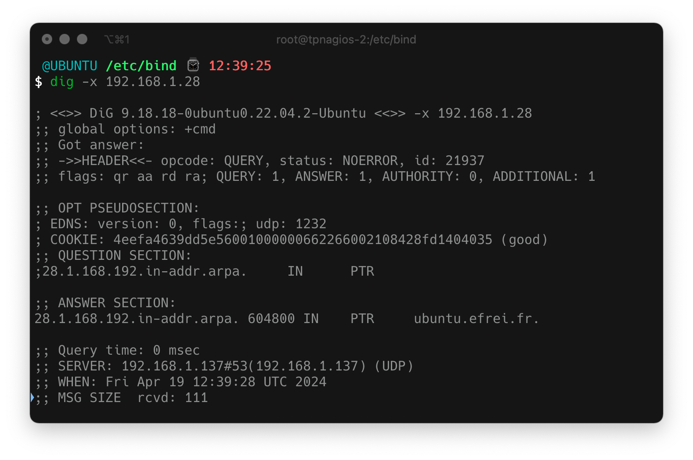

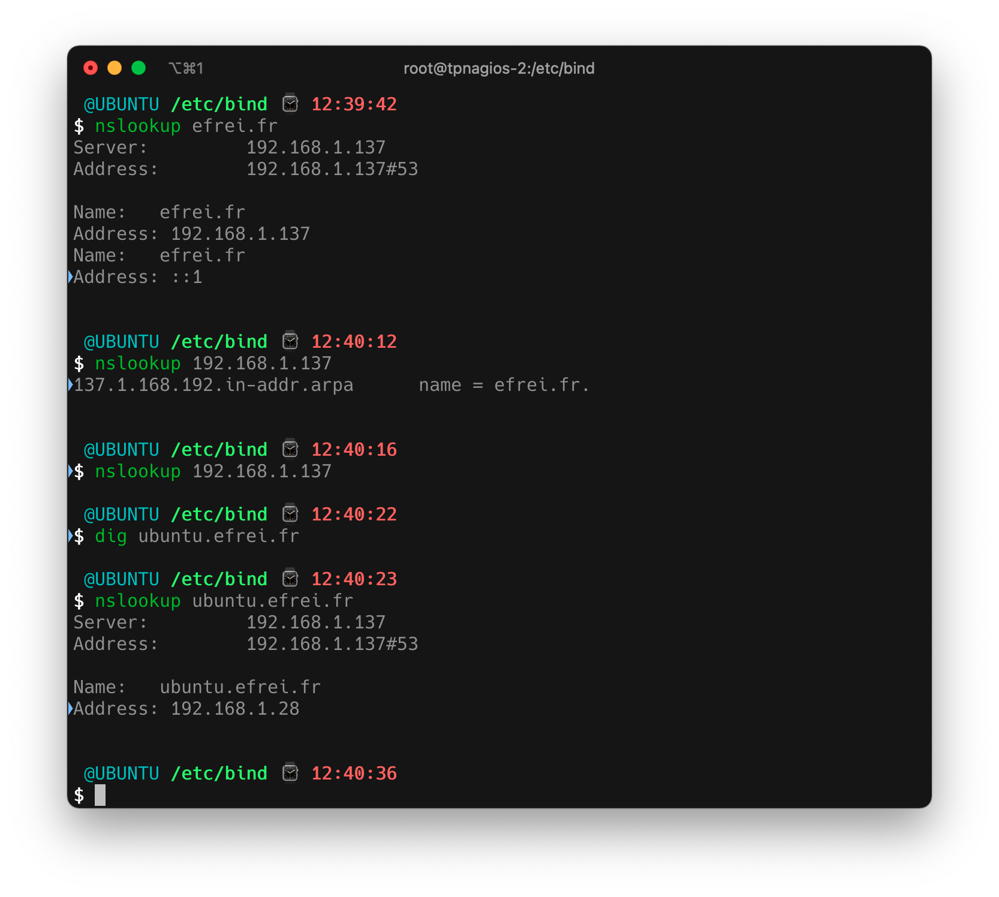

Nous pouvons constater que tout résourd correctement.

## Kerberos

Nous configurons maintenant une authentification SSH avec Kerberos.

Pour un souci de simplicité au niveau des dépendances, nous allons passer par une image Docker custom.

Nous commençons donc par créer un `Dockerfile` ayant le contenu suivant:

```
FROM ubuntu:20.04

RUN apt-get update && \
    apt-get install -y krb5-kdc krb5-admin-server && \
    apt-get clean && \
    rm -rf /var/lib/apt/lists/*

COPY krb5.conf /etc/
COPY kdc.conf /etc/krb5kdc/
COPY kadm5.acl /etc/krb5kdc/

RUN krb5_newrealm <<EOF
secret123
secret123
EOF

EXPOSE 8888

CMD ["krb5kdc", "-n"]
```

Puis, nous créons 3 fichiers de configurations pour Kerberos.

`krb5.conf`:

```
[libdefaults]
    default_realm = EFREI.FR
    dns_lookup_realm = false
    dns_lookup_kdc = false

[realms]
    EFREI.FR = {
        kdc = 192.168.1.137:8888
        admin_server = 192.168.1.137
    }

[domain_realm]
    .efrei.fr = EFREI.FR
    efrei.fr = EFREI.FR
[logging]
    kdc = FILE:/var/log/krb5kdc.log
    admin_server = FILE:/var/log/kadmind.log
    default = FILE:/var/log/krb5libs.log
```

`kdc.conf`:

```
[kdcdefaults]
    kdc_ports = 8888

[realms]
    EFREI.FR = {
        database_module = DB2
        acl_file = /etc/krb5kdc/kadm5.acl
        dict_file = /usr/share/dict/words
        admin_keytab = /etc/krb5kdc/kadm5.keytab
        supported_enctypes = aes256-cts:normal aes128-cts:normal
    }

[logging]
    kdc = FILE:/var/log/krb5kdc.log
    admin_server = FILE:/var/log/kadmind.log

```

`kadm5.acl`:

```
*/admin@EFREI.FR   *
```

Nous construisons notre image Docker avec la commande suivante:

```shell
$ docker build -t kerberos-server .
```

Puis nous lançons notre conteneur de serveur.

```shell
docker run --name kerberos-server -p 8888:8888 --network="host" -d kerberos-server
```

Pour nous connecter en tant que client, nous allons également faire appel à un conteneur Docker (problèmes de dépendances sur les instances d'Ubuntu ne rendant pas possible l'installation des paquets).

Nous créons donc un `Dockerfile` pour créer une image custom de notre client kerberos.

```
FROM ubuntu:20.04

RUN apt-get update && \
    apt-get install -y krb5-user ssh && \
    apt-get clean && \
    rm -rf /var/lib/apt/lists/*

COPY krb5.conf /etc/

CMD ["bash"]
```

Le fichier `krb5.conf` est rigoureusement identique à celui mentionné précédemment.

Puis, une fois l'image construite, nous lançons notre conteneur client et nous connectons en shell dessus à l'aide de la commande suivante:
```bash
$ docker run -it --network="host" kerberos-client
```

Sur le serveur, nous nous connectons au shell de notre conteneur :

```bash
$ docker exec -it kerberos-server /bin/bash
```

Puis, nous ajoutons un utilisateur à la base de données :

```bash
# Connexion à la console
$ kadmin.local

# Ajout de l'utilisateur thomas
$ kadmin.local: addprinc thomas@EFREI.FR
```

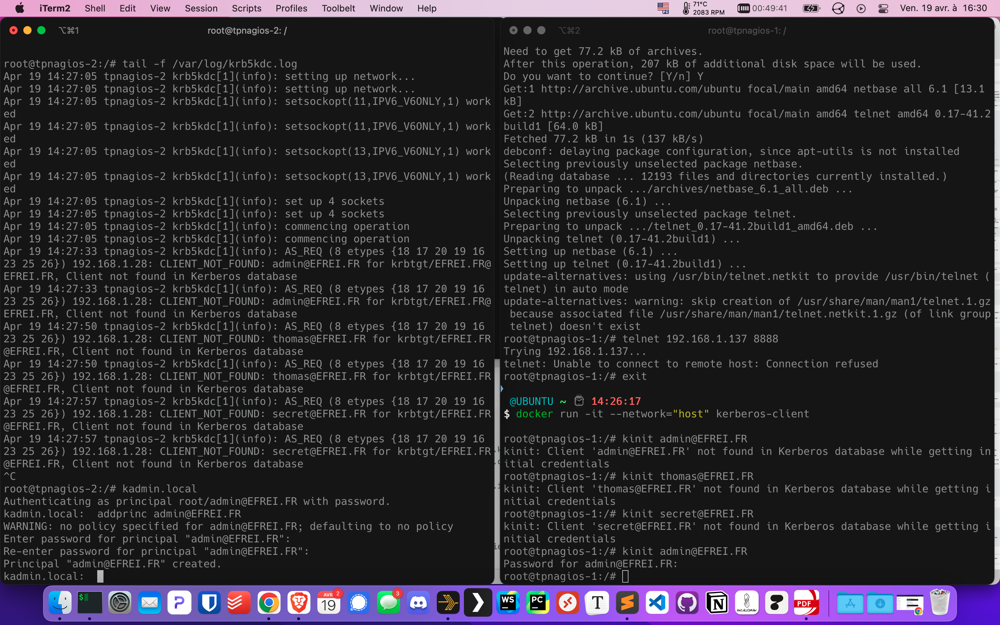

Nous à avons ici, à gauche les logs du serveur, et à droite le `kinit admin@EFREI.FR` du client.

Nous utilisons la commande `klist` pour vérifier que nous avons bien notre ticket.

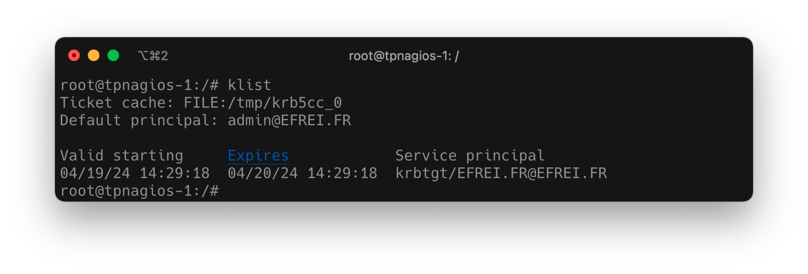

Nous nous connectons ensuite à notre serveur depuis notre client en utilisant la commande suivante :

```shell
$ ssh -K thomas@192.168.1.137
```

Et nous obtenons le résultat suivant:

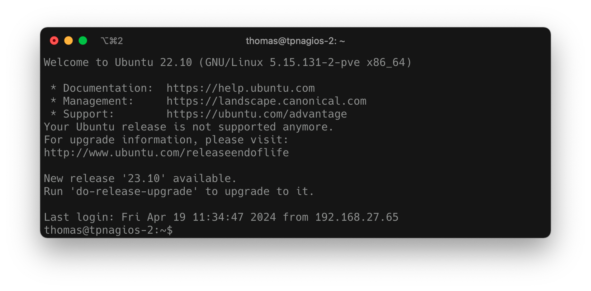

Notre authentification kerberos via SSH fonctionne donc correctement.

# Fiche DE

### **LDAP (Lightweight Directory Access Protocol)** 

  **Définition** : Protocole standard pour accéder aux services d'annuaire. 

####   Concepts importants : 

- **Annuaire** : Base de données hiérarchique pour stocker des informations sur des objets. 

- **DIT (Directory Information Tree)** : Structure arborescente où sont stockées les données.
- **DN (Distinguished Name)** : Identifie de manière unique chaque entrée dans l'arbre LDAP.
- **RDN (Relative Distinguished Name)** : Nom relatif à un DN qui est unique parmi les entrées du même niveau.

-  **Objet** : Élément individuel dans l'annuaire. 

- **Attribut** : Information sur un objet. 

####   Commandes clés : 

- ` ldapsearch` : Recherche d'entrées dans un serveur LDAP. 

​      Ex. : `ldapsearch -x -b "dc=example,dc=com" "(objectClass=*)"`. 

- `   ldapadd` : Ajout de nouvelles entrées. 

-  ` ldapdelete` : Suppression d'une entrée. 

### **LDAPS (LDAP over SSL/TLS)** 

  **Définition** : Variante de LDAP utilisant SSL/TLS pour la sécurité. 

  Concepts importants : 

- SSL/TLS : Protocoles de chiffrement pour sécuriser la communication. 

- Port 636

  Commandes clés : 

​    ldapsearch avec l'option -ZZ pour ignorer TLS ou -H ldaps:// pour SSL. 

​      Ex. : `ldapsearch -H ldaps://example.com -x -b "dc=example,dc=com" "(objectClass=*)"`. 

### **VPN (Virtual Private Network)** 

  Définition : Réseau privé virtuel pour un accès sécurisé à distance. 

####   Commandes clés : 

- ` openvpn` : Lance un client ou serveur OpenVPN. 

​      Ex. : `openvpn --config client.ovpn`. 

- ` ipsec` : Gère les connexions IPSec. 

- `pptp` : Gère les connexions PPTP. 

#### Protocoles

- **PPTP** : Plus ancien, moins sécurisé.
- **L2TP/IPsec** : Combinaison de L2TP et IPsec, largement utilisé pour sa sécurité.
- **OpenVPN** : Basé sur SSL/TLS, offre un bon équilibre entre sécurité et performance.
- **WireGuard** : Plus récent, conçu pour être simple et performant.

### **DNS (Domain Name System)** 

####   Concepts importants : 

​    **Zones** : Fichiers contenant les enregistrements DNS. 

​    **Enregistrements** : 

-  A : Associe un nom à une adresse IPv4. 

-  AAAA : Associe un nom à une adresse IPv6. 

- CNAME : Alias d'un autre nom de domaine. 

- MX : Serveur de messagerie. 

####   Commandes clés : 

-  `dig` : Interroge les serveurs DNS. 

​      Ex. : `dig example.com. `

-  `nslookup` : Recherche les informations DNS. 

-  `named` : Service pour lancer un serveur DNS. 

### Kerberos

**Définition** : Kerberos est un protocole d'authentification réseau qui utilise des tickets pour permettre aux nœuds communiquant sur un réseau non sécurisé de prouver leur identité de manière sécurisée.

**Fonctionnement** :

1. **Authentication Server (AS)** : L'utilisateur s'authentifie auprès de ce serveur et reçoit un Ticket Granting Ticket (TGT).
2. **Ticket Granting Server (TGS)** : Utilise le TGT pour valider l'utilisateur et émettre des tickets de service pour d'autres services sur le réseau.
3. **Service Server (SS)** : L'utilisateur présente son ticket de service pour accéder au service.

**Commandes importantes** :

- `kinit` : Obtient un TGT en utilisant un mot de passe.
- `klist` : Liste les tickets Kerberos en cache.
- `kdestroy` : Détruit tous les tickets en cache.

**Sécurité** :

- Chiffrement : Tous les tickets sont chiffrés pour éviter leur falsification.
- Dépendance à l'heure : Les tickets ont une durée de vie limitée, nécessitant une synchronisation précise des horloges.

# QCM

*Attention, les réponses ont été donnée par une analyse de ChatGPT. Aucune certitude à 100% ne peut y être associée.*

**Page 1**
**Dans quel scénario utiliseriez-vous la commande ldapmodify plutôt que ldapadd?**

- Pour ajouter une nouvelle entrée - **FAUX**
- Pour modifier une entrée existante - **VRAI**
- Pour rechercher dans l'annuaire - **FAUX**
- Pour supprimer une entrée - **FAUX**

**Page 2**
**Quel est le rôle de l'attribut objectClass dans une entrée LDAP?**

- Définir les permissions de l'entrée - **FAUX**
- Spécifier la localisation de l'entrée dans l'arbre LDAP - **FAUX**
- Déterminer les attributs que l'entrée peut contenir - **VRAI**
- Crypter les informations de l'entrée - **FAUX**

**Page 3**
**Quelle opération LDAP est utilisée pour supprimer une entrée?**

- DELETE - **VRAI**
- REMOVE - **FAUX**
- DROP - **FAUX**
- DEL - **FAUX**

**Page 4**
**Comment s'appelle le fichier de configuration utilisé par OpenLDAP pour stocker sa configuration de manière dynamique?**

- slapd.d - **VRAI**
- slapd.conf - **FAUX**
- ldap.conf - **FAUX**
- cn=config - **VRAI**

**Page 5**
**Quel outil est utilisé pour changer le mot de passe d'un utilisateur dans OpenLDAP?**

- Idapmodpass - **FAUX**
- Idappassmod - **FAUX**
- ldappasswd - **VRAI**
- ldapchpasswd - **FAUX**

**Page 6**
**Quelle option de ldapsearch spécifie le DN à utiliser pour la connexion?**

- -D - **VRAI**
- -W - **FAUX**
- -b - **FAUX**
- -S - **FAUX**

**Page 7**
**Quel est le format de stockage recommandé pour les mots de passe dans OpenLDAP?**

- En clair - **FAUX**
- MD5 - **FAUX**
- SSHA - **VRAI**
- SHA - **FAUX**

**Page 8**
**Quel attribut est utilisé pour définir une unité organisationnelle dans LDAP?**

- ou - **VRAI**
- cn - **FAUX**
- dc - **FAUX**
- uid - **FAUX**

**Page 9**
**Quel outil de ligne de commande peut être utilisé pour exporter l'ensemble de l'annuaire LDAP dans un fichier LDIF?**

- Idapexport - **FAUX**
- slapcat - **VRAI**
- Idifde - **FAUX**
- ldapdump - **FAUX**

**Page 10**
**Quelle est la principale différence entre ldapadd et ldapmodify lors de l'ajout d'une entrée?**

- ldapadd crée de nouvelles entrées, tandis que ldapmodify peut également modifier ou supprimer des entrées existantes. - **VRAI**
- Aucune différence; ldapadd est un alias pour ldapmodify. - **FAUX**
- ldapmodify est utilisé pour les entrées sécurisées, tandis que ldapadd n'est pas. - **FAUX**
- ldapadd utilise LDIF, tandis que ldapmodify utilise un format propriétaire. - **FAUX**

**Page 11**
**Quelle commande est utilisée pour tester les règles d'accès dans OpenLDAP?**

- slaptest - **VRAI**
- ldaptest - **FAUX**
- accesscheck - **FAUX**
- slapd-check - **FAUX**

**Page 12**
**Quelle option avec la commande ldapsearch permet de spécifier un fichier de sortie pour les résultats de la recherche?**

- -f - **VRAI**
- -L - **FAUX**

**Page 13**
**Comment spécifier un mot de passe dans un fichier LDIF pour l'attribut userPassword?**

- En utilisant le mot de passe en clair - **FAUX**
- En encodant le mot de passe en Base64 - **FAUX**
- En utilisant un hash SSHA - **VRAI**

**Page 14**
**Comment activer le chiffrement SSL sur OpenLDAP?**

- En configurant les directives SSLCertificateFile et SSLCertificateKeyFile dans slapd.conf - **VRAI**
- En utilisant l'option -Z avec les commandes LDAP - **VRAI**
- En configurant un reverse proxy avec SSL devant OpenLDAP - **FAUX**
- A et B sont correctes - **VRAI**

**Page 15**
**Quelle est la commande pour rechercher tous les enregistrements sous un DN spécifique?**

- ldapsearch -x -b "dn spécifique" - **VRAI**
- ldaplist -b "dn spécifique" - **FAUX**
- ldapquery -d "dn spécifique" - **FAUX**
- ldapseek-base "dn spécifique" - **FAUX**

**Page 16**
**Comment exporter spécifiquement la configuration d'OpenLDAP (cn=config) dans un fichier LDIF?**

- ldapsearch -Y EXTERNAL -H ldapi:/// -b "cn=config" > config.ldif - **FAUX**
- slapcat -n 0 > config.ldif - **VRAI**
- slapcat -b "cn=config" > config.ldif - **VRAI**
- A et C sont correctes - **VRAI**

**Page 17**
**Pour augmenter la sécurité, comment forcer OpenLDAP à n'accepter que des connexions sécurisées?**

- En configurant security ssf=128 dans slapd.conf - **VRAI**
- En désactivant le port 389 et en activant uniquement le port 636 (LDAPS) - **VRAI**
- En utilisant un pare-feu pour bloquer toutes les connexions non SSL/TLS - **FAUX**
- A et B sont correctes - **VRAI**


Continuons avec les réponses aux questions de votre document :

**Page 18**
**Quel outil de ligne de commande peut être utilisé pour modifier les entrées LDAP en utilisant un éditeur de texte?**

- ldapvi - **VRAI**

**Page 19**
**Quel attribut est utilisé par défaut comme identifiant unique pour une entrée dans OpenLDAP?**

- cn - **FAUX**
- uid - **VRAI**
- dn - **FAUX**
- sn - **FAUX**

**Page 20**
**Quelle option de la commande ldapsearch permet d'inclure les entrées ayant un attribut spécifique défini à une valeur particulière?**

- Aucune des réponses ci-dessus - **VRAI**

**Page 21**
**Quel est le rôle du suffixe dans une configuration OpenLDAP?**

- Déterminer l'identifiant unique de l'administrateur LDAP - **FAUX**
- Spécifier la racine de l'arbre des données LDAP - **VRAI**
- Définir les options de cryptage pour la connexion - **FAUX**
- Configurer les paramètres de réplication - **FAUX**

**Page 22**
**Comment spécifier un utilisateur et un mot de passe pour se connecter à OpenLDAP avec ldapsearch?**

- Utiliser les options -D pour l'utilisateur et -w pour le mot de passe - **VRAI**
- Configurer les variables d'environnement LDAP_USER et LDAP_PASSWORD - **FAUX**
- Passer l'utilisateur et le mot de passe directement dans l'URL - **FAUX**
- Utiliser les options -u pour l'utilisateur et -p pour le mot de passe - **FAUX**

**Page 23**
**Quel protocole utilise OpenLDAP pour sécuriser les communications entre le client et le serveur?**

- HTTPS - **FAUX**
- SSL - **VRAI**
- LDAPs - **VRAI**
- SSH - **FAUX**

**Page 24**
**Quel mécanisme OpenLDAP n'utilise pas pour l'authentification?**

- SASL - **FAUX**
- Kerberos - **FAUX**
- Digest-MD5 - **FAUX**
- OAuth - **VRAI**

**Page 25**
**Quelle est la première étape pour sécuriser une installation OpenLDAP?**

- Configurer des ACLs - **FAUX**
- Activer SSL/TLS - **VRAI**
- Changer le mot de passe administrateur - **FAUX**
- Mettre à jour OpenLDAP vers la dernière version - **FAUX**

**Page 26**
**Quelle commande est utilisée pour appliquer un certificat SSL/TLS à OpenLDAP?**

- ldapmodify - **FAUX**
- ldapcert - **FAUX**
- ldapssl - **FAUX**
- ldaptls - **FAUX**

**Page 27**
**Pour renforcer la sécurité, quel type de cryptage des mots de passe est recommandé dans OpenLDAP?**

- SHA-1 - **FAUX**
- MD5 - **FAUX**
- SSHA - **VRAI**
- Plaintext - **FAUX**

**Page 28**
**Quelle option de sécurité LDAP limite le nombre de tentatives de connexion?**

- Ppolicy - **VRAI**

**Page 29**
**Quel outil n'est pas utilisé pour surveiller OpenLDAP?**

- Nagios - **FAUX**
- Zabbix - **FAUX**
- OpenVPN - **VRAI**
- ELK Stack - **FAUX**

**Page 30**
**Quelle est la meilleure pratique pour gérer les mots de passe dans OpenLDAP?**

- Stocker les mots de passe en clair pour faciliter la récupération - **FAUX**
- Utiliser un algorithme de hachage fort et ne jamais stocker les mots de passe en clair - **VRAI**
- Laisser le choix aux utilisateurs - **FAUX**
- Encoder les mots de passe - **FAUX**

**Page 31**
**Quelle commande peut être utilisée pour vérifier la configuration SSL/TLS d'OpenLDAP?**

- openssl s_client -connect host:port - **VRAI**
- slapd -T test - **FAUX**
- ldapsearch -ZZ - **FAUX**
- tlscheck -ldap - **FAUX**

**Page 32**
**Quelle stratégie n'est pas recommandée pour sécuriser les sauvegardes d'OpenLDAP?**

- Chiffrer les sauvegardes - **FAUX**
- Stocker les sauvegardes sur un serveur connecté au réseau - **VRAI**
- Tester régulièrement les procédures de restauration - **FAUX**
- Limiter l'accès physique et réseau aux sauvegardes - **FAUX**

**Page 33**
**Quel est le principal avantage de l'authentification SASL dans OpenLDAP?**

- Elle permet l'utilisation de mécanismes d'authentification externes - **VRAI**
- Elle réduit la latence de l'authentification - **FAUX**
- Elle élimine le besoin de SSL/TLS - **FAUX**
- Elle supporte uniquement l'authentification par mot de passe - **FAUX**

**Page 34**
**Quelle meilleure pratique n'est pas associée à la gestion des ACL dans OpenLDAP?**

- Utiliser le principe du moindre privilège - **FAUX**
- Appliquer des ACLs identiques à tous les utilisateurs - **VRAI**
- Tester les ACLs dans un environnement de développement avant la production - **FAUX**
- Documenter toutes les ACLs et leurs changements - **FAUX**

**Page 35**
**Quel est l'impact de la désactivation de l'anonyme bind dans OpenLDAP?**

- Augmente la sécurité en empêchant les accès non authentifiés - **VRAI**
- Diminue la sécurité en limitant les méthodes d'authentification - **FAUX**
- Aucun impact sur la sécurité - **FAUX**
- Réduit la performance du serveur - **FAUX**

**Page 36**
**Quelle est l'importance de chiffrer les sauvegardes d'OpenLDAP?**

- Pour accélérer le processus de restauration - **FAUX**
- Pour prévenir la perte de données - **FAUX**
- Pour protéger contre l'accès non autorisé aux données sauvegardées - **VRAI**
- Aucune, le chiffrement des sauvegardes n'est pas nécessaire - **FAUX**

**Page 37**
**Quelle est la meilleure approche pour sécuriser les communications entre les répliques OpenLDAP?**

- Utiliser une connexion VPN - **FAUX**
- Transférer les données en clair pour une meilleure performance - **FAUX**
- Utiliser SSL/TLS pour toutes les réplications - **VRAI**
- Se fier à la sécurité du réseau interne - **FAUX**

**Page 38**
**Quelle option avec ldapsearch spécifie le filtre de recherche?**

- -f - **VRAI**
- -b - **FAUX**
- -S - **FAUX**

**Page 39**
**Pour spécifier un fichier LDIF avec ldapmodify, quelle option utilisez-vous?**

- -f - **VRAI**

**Page 40**
**Quelle option de ldapsearch spécifie la base DN pour la recherche?**

- -b - **VRAI**
- -D - **FAUX**
- -S - **FAUX**
- -f - **FAUX**

**Page 41**
**Quelle option avec ldapdelete spécifie la suppression récursive?**

- Cette fonctionnalité n'existe pas - **VRAI**

**Page 42**
**Quelle option avec ldapsearch permet de réaliser une recherche en spécifiant le niveau de la recherche (base, one, sub)?**

- -S - **FAUX**
- -b - **VRAI**
- -L - **FAUX**
- -f - **FAUX**

**Page 43**
**Quelle commande est utilisée pour renommer ou déplacer une entrée dans un annuaire LDAP?**

- ldapmoddn - **VRAI**

**Page 44**
**Quelle option avec ldapmoddn ou ldaprename permet de spécifier le nouveau parent de l'entrée?**

- -newsuperior - **VRAI**

**Page 45**
**Quelle option avec ldapadd indique l'utilisation de l'authentification simple?**

- -X - **VRAI**
- -f - **FAUX**

**Page 46**
**Quelle commande est utilisée pour vérifier la configuration du serveur OpenLDAP?**

- ldapcheck - **FAUX**
- ldapinfo - **FAUX**
- ldapconfig - **FAUX**
- ldapwhoami - **FAUX**

**Page 8**
**Quel attribut est utilisé pour définir une unité organisationnelle dans LDAP?**

- ou - **VRAI**
- cn - **FAUX**
- dc - **FAUX**
- uid - **FAUX**

**Page 14**
**Comment activer le chiffrement SSL sur OpenLDAP?**

- En configurant les directives SSLCertificateFile et SSLCertificateKeyFile dans slapd.conf - **VRAI**
- En utilisant l'option -Z avec les commandes LDAP - **VRAI**
- En configurant un reverse proxy avec SSL devant OpenLDAP - **FAUX**
- A et B sont correctes - **VRAI**

**Page 16**
**Comment exporter spécifiquement la configuration d'OpenLDAP (cn=config) dans un fichier LDIF?**

- ldapsearch -Y EXTERNAL -H ldapi:/// -b "cn=config" > config.ldif - **FAUX**
- slapcat -n 0 > config.ldif - **VRAI**
- slapcat -b "cn=config" > config.ldif - **VRAI**
- A et C sont correctes - **VRAI**

**Page 17**
**Pour augmenter la sécurité, comment forcer OpenLDAP à n'accepter que des connexions sécurisées?**

- En configurant security ssf=128 dans slapd.conf - **VRAI**
- En désactivant le port 389 et en activant uniquement le port 636 (LDAPS) - **VRAI**
- En utilisant un pare-feu pour bloquer toutes les connexions non SSL/TLS - **FAUX**
- A et B sont correctes - **VRAI**

**Page 33**
**Quel est le principal avantage de l'authentification SASL dans OpenLDAP?**

- Elle permet l'utilisation de mécanismes d'authentification externes - **VRAI**
- Elle réduit la latence de l'authentification - **FAUX**
- Elle élimine le besoin de SSL/TLS - **FAUX**
- Elle supporte uniquement l'authentification par mot de passe - **FAUX**

**Page 34**
**Quelle meilleure pratique n'est pas associée à la gestion des ACL dans OpenLDAP?**

- Utiliser le principe du moindre privilège - **FAUX**
- Appliquer des ACLs identiques à tous les utilisateurs - **VRAI**
- Tester les ACLs dans un environnement de développement avant la production - **FAUX**
- Documenter toutes les ACLs et leurs changements - **FAUX**

**Page 37**
**Quelle est la meilleure approche pour sécuriser les communications entre les réplicas OpenLDAP?**

- Utiliser une connexion VPN - **FAUX**
- Transférer les données en clair pour une meilleure performance - **FAUX**
- Utiliser SSL/TLS pour toutes les réplications - **VRAI**
- Se fier à la sécurité du réseau interne - **FAUX**

**Page 42**
**Quelle option avec ldapsearch permet de réaliser une recherche en spécifiant le niveau de la recherche (base, one, sub)?**

- -S - **FAUX**
- -b - **VRAI**
- -L - **FAUX**
- -f - **FAUX**

**Page 43**
**Quelle commande est utilisée pour renommer ou déplacer une entrée dans un annuaire LDAP?**

- ldapmoddn - **VRAI**

**Page 45**
**Quelle option est utilisée avec la commande ldapsearch pour spécifier le filtre de recherche ?**

- -f - **VRAI**

