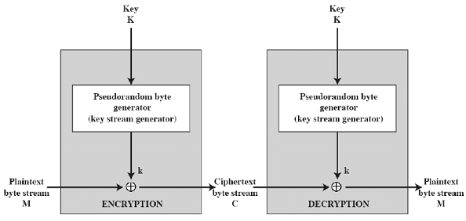
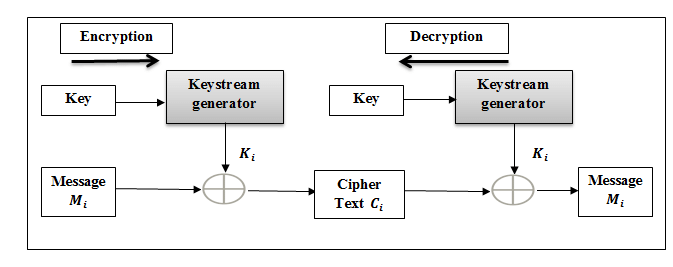
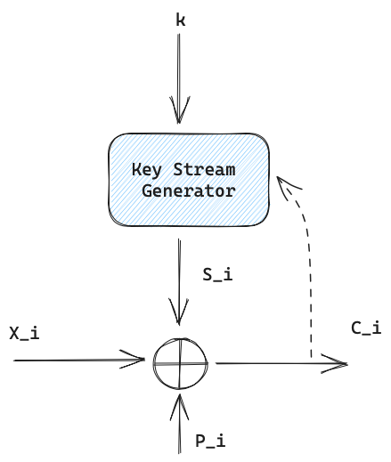
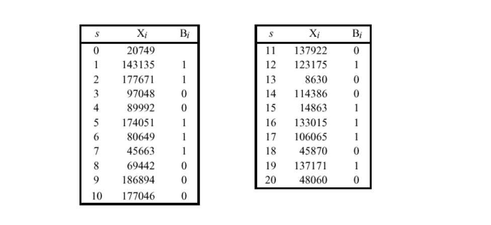
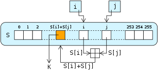

# Cryptographie

Notes de cours par `Thomas Peugnet`.

# 2. Chiffrement [...]

## Introduction

> *En [Informatique](https://fr.wikipedia.org/wiki/Informatique), un **algorithme déterministe** est un [algorithme](https://fr.wikipedia.org/wiki/Algorithme) qui, étant donné une entrée particulière, produira toujours la même sortie, avec la machine sous-jacente passant toujours par la même séquence d'états. Les algorithmes déterministes forment, de loin, la famille d'algorithme la plus étudiée.*
>
> *Formellement, un algorithme déterministe calcule une [fonction mathématique](https://fr.wikipedia.org/wiki/Application_(mathématiques)) ; une fonction ayant une valeur unique pour n'importe quelle entrée dans son [ensemble de définition](https://fr.wikipedia.org/wiki/Ensemble_de_définition), l'algorithme produit cette valeur en sortie.* - **Wikipédia**

## Chiffrement par flot continu

Ce type de chiffrement sera efficace dans des environnements restreints : IoT, RFID, ect.

**Schéma général :**

Chiffrement synchrone et asynchrone.

Si la flèche en pointillés est utilisée, alors le chiffrement est synchrone.

#### Les nombres aléatoires

La génération des nombres aléatoires est une fonction principale des algorithmes de chiffrement.

> Quelques usages :
>
> - Génération de clés RSA
> - Génération des clés de Session
> - Distributino des clés et authentification mutuelle (nonce - antirejeu)

Il existe deux exigences distinctes pour une séquence de nombres aléatoires :

- Aléatoire
- Imprévisibilité

Par ailleurs, deux critères sont utilisés pour valider qu'une séquence de nombres est aléatoire : 

- Distribution **uniforme** : La fréquence d'apparition des 1 et des 0 doit être approximativement égale
- **Indépendance** : Aucune **sous-séquence** de la séquence [...] `notes manquantes`.

#### Génération de nombres aléatoires

**TRNG** : True Random Number Generator

**PRNG** : Pseudorandom number generator

**PRF** : Pseudorandom function 

#### Exigences des PNRG

**Caractère aléatoire** : En termes de caractères aléatoires, l'exigence est que le flux binaire généré apparaisse aléatoire même s'il est déterministe, et doit également passer un ensemble de tests.

#### Blum Blum Shub Generator

.jpg)

**Exemple :**

#### Propriétés d'une bonne conception

La séquence binaire chiffrée doit avoir une période longue (100 Md premiers bits générés) car l'algorithme est déterministe.

La keystream doit avoir les propriétés du **vrai aléatoire**.

#### RC4

### Chiffrement par bloc

On ne peut pas chiffrer bit par bit, on doit avoir une taille de bloc prédéfinie (128bits par exemple).

# Corrections

## TP 01

### Exercice 1

### Exercice 2

**1. ** Polyalphabêtique

**2.** 

- $5 \times 4 \times 3 = 60$  
- Position initiale : $26 \times 26 \times 26$.
- $C_{12}^{26} = (_{12}^{26}) = \frac{26!}{12! (26 - 12)!}$
- 

