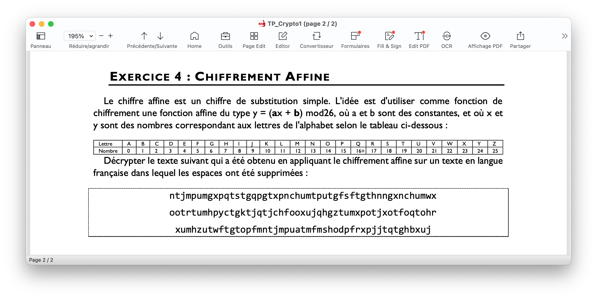
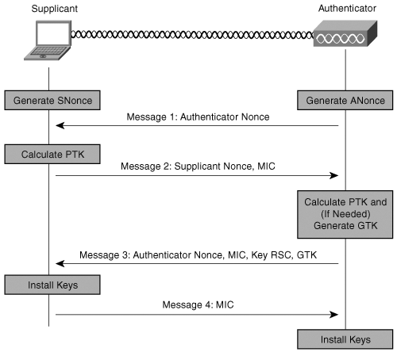
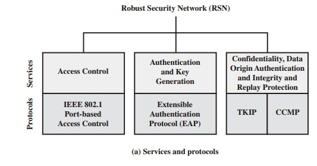
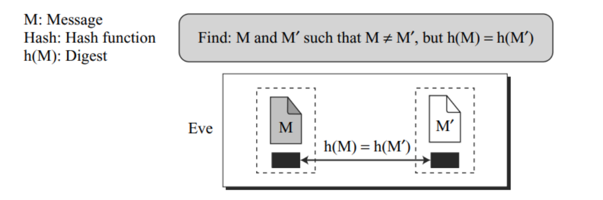
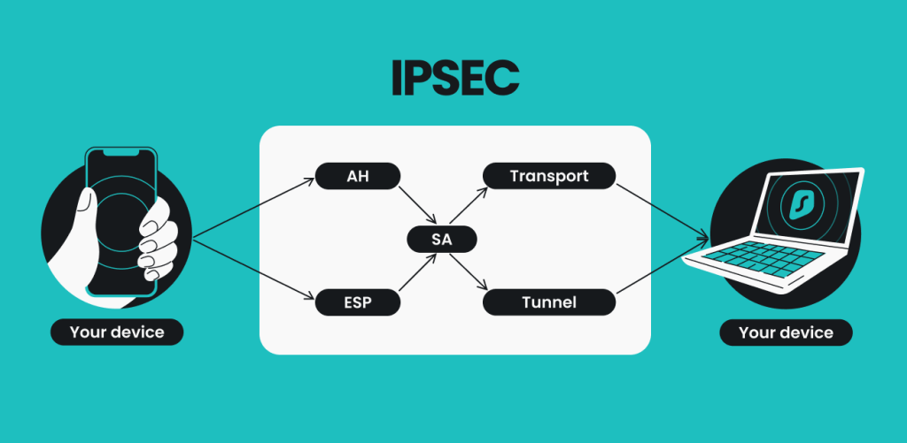

# Cryptographie

Notes de cours par `Thomas Peugnet`.

# 2. Chiffrement [...]

## Introduction

> *En [Informatique](https://fr.wikipedia.org/wiki/Informatique), un **algorithme déterministe** est un [algorithme](https://fr.wikipedia.org/wiki/Algorithme) qui, étant donné une entrée particulière, produira toujours la même sortie, avec la machine sous-jacente passant toujours par la même séquence d'états. Les algorithmes déterministes forment, de loin, la famille d'algorithme la plus étudiée.*
>
> *Formellement, un algorithme déterministe calcule une [fonction mathématique](https://fr.wikipedia.org/wiki/Application_(mathématiques)) ; une fonction ayant une valeur unique pour n'importe quelle entrée dans son [ensemble de définition](https://fr.wikipedia.org/wiki/Ensemble_de_définition), l'algorithme produit cette valeur en sortie.* - **Wikipédia**

## Chiffrement par flot continu

Ce type de chiffrement sera efficace dans des environnements restreints : IoT, RFID, ect.

**Schéma général :**

Chiffrement synchrone et asynchrone.

Si la flèche en pointillés est utilisée, alors le chiffrement est synchrone.

#### Les nombres aléatoires

La génération des nombres aléatoires est une fonction principale des algorithmes de chiffrement.

> Quelques usages :
>
> - Génération de clés RSA
> - Génération des clés de Session
> - Distributino des clés et authentification mutuelle (nonce - antirejeu)

Il existe deux exigences distinctes pour une séquence de nombres aléatoires :

- Aléatoire
- Imprévisibilité

Par ailleurs, deux critères sont utilisés pour valider qu'une séquence de nombres est aléatoire : 

- Distribution **uniforme** : La fréquence d'apparition des 1 et des 0 doit être approximativement égale
- **Indépendance** : Aucune **sous-séquence** de la séquence [...] `notes manquantes`.

#### Génération de nombres aléatoires

**TRNG** : True Random Number Generator

**PRNG** : Pseudorandom number generator

**PRF** : Pseudorandom function 

#### Exigences des PNRG

**Caractère aléatoire** : En termes de caractères aléatoires, l'exigence est que le flux binaire généré apparaisse aléatoire même s'il est déterministe, et doit également passer un ensemble de tests.

#### Blum Blum Shub Generator

.jpg)

**Exemple :**

#### Propriétés d'une bonne conception

La séquence binaire chiffrée doit avoir une période longue (100 Md premiers bits générés) car l'algorithme est déterministe.

La keystream doit avoir les propriétés du **vrai aléatoire**.

#### RC4

### Chiffrement par bloc

On ne peut pas chiffrer bit par bit, on doit avoir une taille de bloc prédéfinie (128bits par exemple).

# Corrections

## TP 01

### Exercice 1

### Exercice 2

**1. ** Polyalphabêtique

**2.** 

- $5 \times 4 \times 3 = 60$  
- Position initiale : $26 \times 26 \times 26$.
- $C_{12}^{26} = (_{12}^{26}) = \frac{26!}{12! (26 - 12)!}$

### Exercice 4

$y = ax + b$ implique une linéarité : $f(n+m)=f(n)+f(m)$

Ce texte est monoalphabétique.

Le `t` est la première lettre la plus fréquente. Le `m`est la seconde. Donc on a une équation à deux inconnues : $\{^{19 = 4a + b}_{12 = 0 \times a + b}$, ce qui nous donne donc $19 = (4a + 12) \mod 26$, et donc $7 = 4a \mod 26$.

Seulement, il n'y a pas de solution à cette équation : aucun multiple de 4 modulo 26 égal à 7.

On prend donc la troisième lettre ayant la plus grande occurence. Mais problème identique, pas de solution.

Finalement, on change de méthode : on suppose que `m -> t`, ce qui nous donne $\{^{19 = 4a + b}_{12 = 19 a + b}$ et donc $\{^{7 = -15a \mod 12}_{? = 0 a \mod 26}$.

Bref, `a` = 3.

# Authentification dans le Wifi

> **802.11x** :
>
> *802.1X est un standard lié à la sécurité des réseaux informatiques, mis au point en 2001 par l'IEEE. Il permet de contrôler l'accès aux équipements d'infrastructures réseau.* - Wikipédia
>
> Cela permet, par exemple, de ne pas pouvoir se retrouver sur le réseau d'une entreprise en se connectant sur un câble Ethenet.

> **EAP** : Sécuriser la partie réseaux sur la couche la plus basse (L3).

## Définitions

**802.1X** : Réseau à accès contrôlé.

**AAA** : Authentification, Authorization, Accounting.

**Serveur AAA** : Serveur offrant les services d'authentification, d'autorisation et de traçabilité des évènements.

**Client** : Élément de confiance d'un réseau 802.1X servant de point d'accès au réseau. Cet élément est appelé authenticator dans la norme 802.1X.

**Supplicant** : Logiciel sur l'équipement d'extrémité cherchant à se connecter sur un réseau à accès contrôlé.

**EAP : ** Extended Authenfication Protocol, permettant d'abstraire le mécanisme d'authentification spécifique utilisable.

**EAPoL** : Idem ci-dessus over LAN, protocole d'encapsulation de trames EAP sur des réseaux locaux.

**Réseau de confiance** : Réseau maîtrisé dans lequel le serveur et les clients communiquent.

> *Les **serveurs RADIUS** reçoivent des demandes de connexion des utilisateurs, authentifient l'utilisateur, puis renvoient les informations de configuration nécessaires pour que le client remette le service à l'utilisateur.* - Cisco.com

## GPT Generated - Summary

- **Supplicant** :
  - Un supplicant est un élément du système qui cherche à s'authentifier auprès d'un serveur pour accéder à un réseau ou à des ressources.
  - Il peut s'agir d'un utilisateur, d'un périphérique ou d'une application cherchant à obtenir l'accès.
- **Client** :
  - Le client est le composant logiciel ou matériel situé du côté de l'utilisateur ou du périphérique.
  - Il agit comme un intermédiaire entre le supplicant et le serveur d'authentification.
  - Son rôle est de collecter les informations d'authentification du supplicant et de les transmettre au serveur pour vérification.
- **Serveur** :
  - Le serveur est le composant central responsable de l'authentification des supplicants.
  - Il valide les informations d'identification fournies par le client ou le supplicant et décide d'accorder ou de refuser l'accès au réseau ou aux ressources.
- **Radius** :
  - RADIUS (Remote Authentication Dial-In User Service) est un protocole de réseau utilisé pour l'authentification, l'autorisation et la comptabilisation des utilisateurs.
  - Il est couramment utilisé dans les réseaux sans fil, les réseaux VPN et d'autres environnements pour gérer l'authentification des supplicants.
- **Tunnel SSL EAP** :
  - Un tunnel SSL (Secure Sockets Layer) EAP (Extensible Authentication Protocol) est une méthode sécurisée pour l'authentification.
  - Il permet d'encapsuler les données d'authentification dans une connexion SSL chiffrée, assurant ainsi la confidentialité des informations d'identification pendant leur transmission.
- **Confiance** :
  - La confiance dans le contexte de l'authentification signifie que le serveur d'authentification a une raison de croire que le supplicant ou le client est légitime.
  - Cela implique généralement une vérification réussie des informations d'identification et peut également inclure des mécanismes de vérification de la sécurité, tels que des certificats numériques.
- **OneTime Pad** :
  - Méthode de chiffrement incassable mais impossible à mettre en place en pratique (taille clé doit correspondre à la taille de l'ensemble des messages echangés avec l'interlocuteur.). Chiffrement symétrique.

- **Indice de coincidence:**
  - Permet de déterminer si un chiffrement est monoalphabétique ou poly.

- **Chiffrement symétrique / asymétrique** :
  - Symétrique plus rapide dû à des calculs plus simples.

- **La cryptanalyse** est la technique qui consiste à déduire un texte en clair d’un texte [chiffré](https://fr.wiktionary.org/wiki/chiffré) sans posséder la [clé de chiffrement](https://fr.wikipedia.org/wiki/Clé_de_chiffrement). Le processus par lequel on tente de comprendre un message en particulier est appelé une *attaque*.

Une attaque est généralement caractérisée selon les données qu'elle nécessite :

- [attaque sur texte chiffré seul](https://fr.wikipedia.org/wiki/Attaque_sur_texte_chiffré_seul) (*ciphertext-only* en anglais) : le cryptanalyste possède des exemplaires chiffrés des messages, il peut faire des hypothèses sur les messages originaux qu'il ne possède pas. La cryptanalyse est plus ardue de par le manque d'informations à disposition ;

- [attaque à texte clair connu](https://fr.wikipedia.org/wiki/Attaque_à_texte_clair_connu) (*known-plaintext attack* en anglais) : le cryptanalyste possède des messages ou des parties de messages en clair ainsi que les versions chiffrées. La [cryptanalyse linéaire](https://fr.wikipedia.org/wiki/Cryptanalyse_linéaire) fait partie de cette catégorie ;

- [attaque à texte clair choisi](https://fr.wikipedia.org/wiki/Attaque_à_texte_clair_choisi) (*chosen-plaintext attack* en anglais) : le cryptanalyste possède des messages en clair, il peut créer les versions chiffrées de ces messages avec l'algorithme que l'on peut dès lors considérer comme une boîte noire. La [cryptanalyse différentielle](https://fr.wikipedia.org/wiki/Cryptanalyse_différentielle) est un exemple d'attaque à texte clair choisi ;

- [attaque à texte chiffré choisi](https://fr.wikipedia.org/wiki/Attaque_à_texte_chiffré_choisi) (*chosen-ciphertext attack* en anglais) : le cryptanalyste possède des messages chiffrés et demande la version en clair de certains de ces messages pour mener l'attaque.

- **WPA2 4 way Handsake** :

  

  **Nonce** : 

  Nombre arbitraire destiné à être utilisé une seule fois (généré aléatoire).

  **PEAP (Protected Extensible Authentication Protocol) :**

  1. Plus sécurisé, car il permet l'authentification du serveur via un certificat.
  2. Nécessite généralement des certificats serveur et client.
  3. Largement pris en charge par une variété de clients et de serveurs.
  4. Utilise généralement EAP-MSCHAPv2 (ou EAP-GTC) pour l'authentification basée sur les noms d'utilisateur et les mots de passe.
  5. Souvent utilisé dans les réseaux d'entreprise.

  **TTLS (Tunneled Transport Layer Security) :**

  1. Moins sécurisé en termes d'authentification du serveur, car il repose principalement sur des certificats clients.
  2. Nécessite généralement uniquement des certificats clients.
  3. Également pris en charge par de nombreux clients et serveurs, mais moins répandu que PEAP.
  4. Offre une plus grande flexibilité en termes de méthodes d'authentification sous-jacentes.
  5. Utilisé dans les réseaux d'entreprise, adapté aux situations où l'authentification du serveur est moins critique.

  Le choix entre PEAP et TTLS dépendra des besoins spécifiques de sécurité et de déploiement de votre réseau, ainsi que des exigences de compatibilité avec les dispositifs clients et serveurs.

  

> *En résumé, dans le processus d'authentification, un supplicant (utilisateur ou périphérique) tente de se connecter à un réseau ou à des ressources en passant par un client qui transmet les informations d'identification au serveur. Le serveur utilise le protocole RADIUS pour vérifier l'authenticité du supplicant. Les données d'authentification sont souvent sécurisées via un tunnel SSL EAP, et la confiance est établie lorsque le serveur est convaincu de l'identité légitime du supplicant.*

## `wpa_supplicant` - Linux

> *`wpa_supplicant` est un logiciel libre implémentant IEEE 802.11i sous Linux, Windows. Il prend en charge WPA2 et les versions antérieures. Ses spécifications incluent : WPA et IEEE 802.11i/RSN/WPA2 complet WPA-PSK et WPA2-PSK WPA avec EAP Gestion de clés pour CCMP, TKIP et le peu sécurisé WEP.* - Wikipédia

## Synoptique de connexion

# Hashage

## Fonction de hachage cryptographique

-  Une fonction de hachage réalise idéalement une projection aléatoire
- - D une entrée de taille quelconque
  - sur `n` bits en sortie

Chaque valeur de sortie est équiprobable ($p=2^{-n}$) et ne dépend pas des entrees de façon prévisible.

Elle opère une compression : sortie de longueur fixe (et courte) : `n` bits

**MAC : Message Authentication Code**

**CBC : Cypher Block Chain**

### Preimage resistance

Etnant donné une fonction de hachage $h$ et $y = h(M)$ il doit être extrêmement difficile pour Eve de truver un message $M'$ tel que $y = h(M')$

### Second preimage resistance

### Collision

## Problèmes des anniversaires

L'analyse des fonctions de hachage nécessite la compréhension des problèmes des anniversaires. Quatre prob`lemes sont souvent utilisés : 

- a et b sont relatives, la freimage attack
- c et d sont relatives à la collision

[Image compliquée et tableau avec de nombreux chiffres.]

[Explications](https://en.wikipedia.org/wiki/Birthday_problem) sur wikipedia.

## VPN IpSec

