# Projet DevOps - Github Actions

# Github Runner

## Introduction

Nous avons choisi d'essayer d'instancier un runner Github, bien que la possibilité de les self-hoster ne soit encore très jeune. 

D'après nos recherches, la documentation semble très bien faite, et nous décidons donc de tenter l'expérience.

Nous ajoutons donc un nouveau runner depuis le repository `TerrActions`.

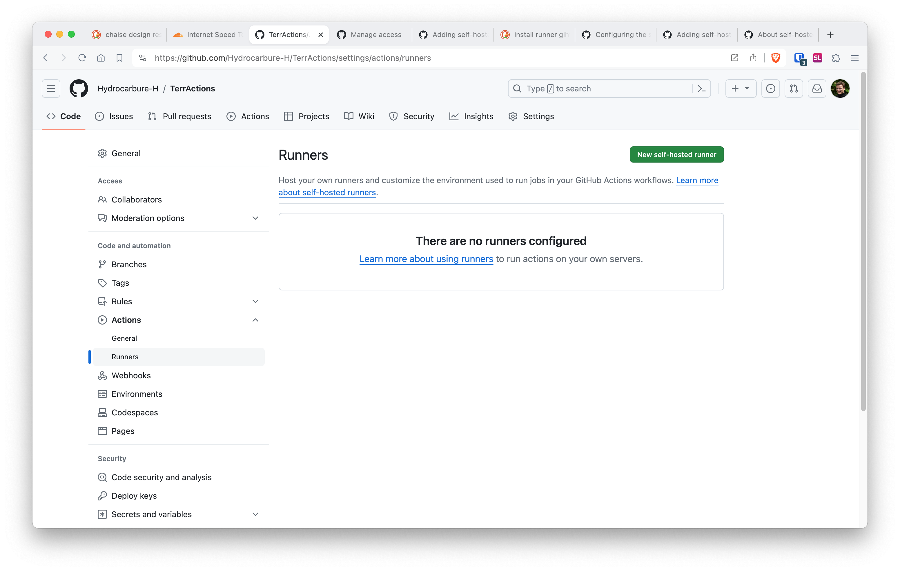

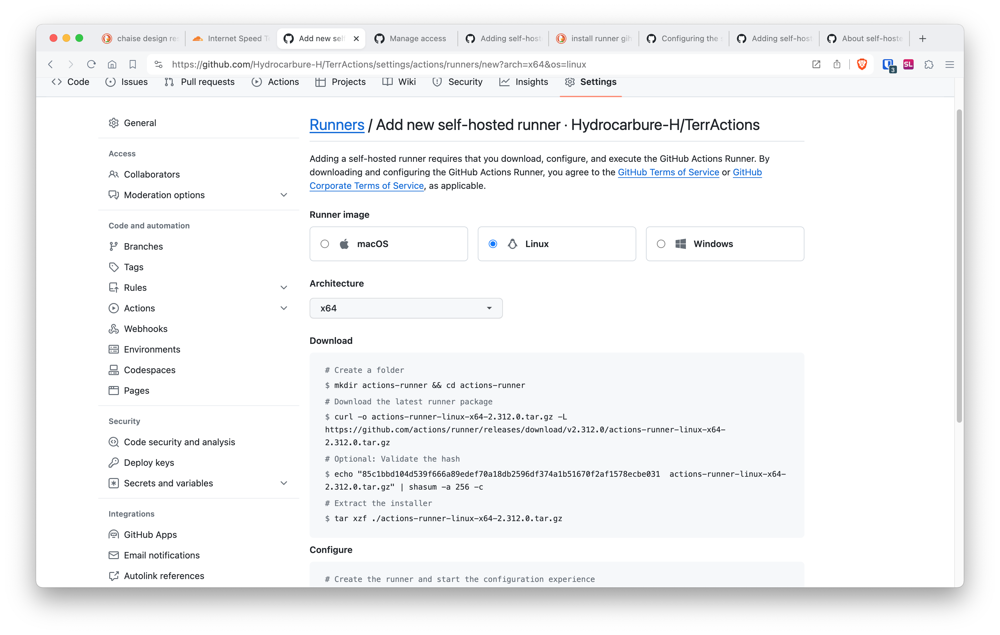

## Création du runner

Démarrage de l'instance EC2 qui servira pour notre `runner` Github.


## Configuration de notre runner

D'après la documentation de Github, nous créons le runner de la façon suivante:

```bash
$ mkdir actions-runner && cd actions-runner 

# Download the latest runner package
$ curl -o actions-runner-linux-x64-2.312.0.tar.gz -L https://github.com/actions/runner/releases/download/v2.312.0/actions-runner-linux-x64-2.312.0.tar.gz 

# Optional: Validate the hash
$ echo "85c1bbd104d539f666a89edef70a18db2596df374a1b51670f2af1578ecbe031  actions-runner-linux-x64-2.312.0.tar.gz" | shasum -a 256 -c

# Extract the installer
$ tar xzf ./actions-runner-linux-x64-2.312.0.tar.gz

# Create the runner and start the configuration experience
$ ./config.sh --url https://github.com/Hydrocarbure-H/TerrActions --token AXJ2G7EPNSCQTD2HGXKKWSDFXTZZI

# Last step, run it!
$ ./run.sh
```

Puis, on met à jour notre workflow, ici nommé `startaction.yaml` pour vérifier le fonctionnement de notre runner.

```yaml
# Use this YAML in your workflow file for each job
runs-on: self-hosted
```

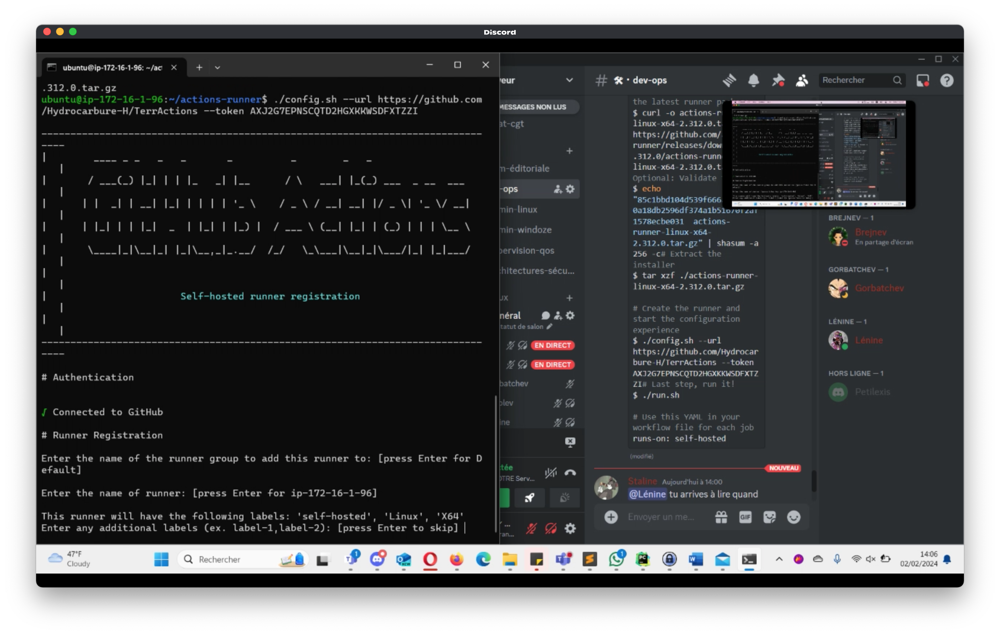

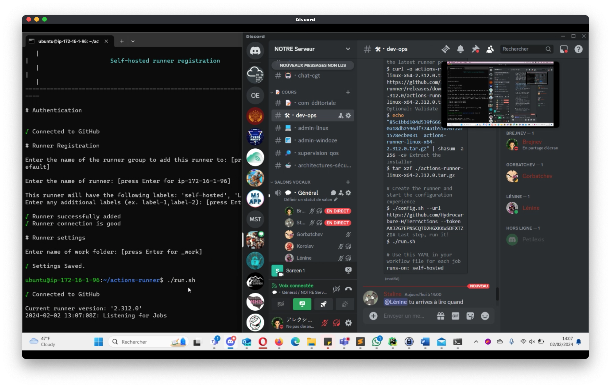

Voici le code de notre `startaction.yaml` maintenant mis à jour pour être exécuté sur le runner de notre instance EC2 :

```yaml
# This is a basic workflow to help you get started with Actions

name: CI

# Controls when the workflow will run
on:
  # Triggers the workflow on push or pull request events but only for the "main" branch
  push:
    branches: [ "main" ]
  pull_request:
    branches: [ "main" ]

  # Allows you to run this workflow manually from the Actions tab
  workflow_dispatch:

# A workflow run is made up of one or more jobs that can run sequentially or in parallel
jobs:
  # This workflow contains a single job called "build"
  build:
    # The UPDATED LINE for self-hosted runner
    runs-on: self-hosted

    # Steps represent a sequence of tasks that will be executed as part of the job
    steps:
      # Checks-out your repository under $GITHUB_WORKSPACE, so your job can access it
      - uses: actions/checkout@v3

      # Runs a single command using the runners shell
      - name: Run a one-line script
        run: echo Hello, world!

      # Runs a set of commands using the runners shell
      - name: Run a multi-line script
        run: |
          echo Add other actions to build,
          echo test, and deploy your project.
```

Nous avons commit notre modification sur la ligne `runs-on: self-hosted`, et avons vu que notre instance a bien exécuté notre Action.

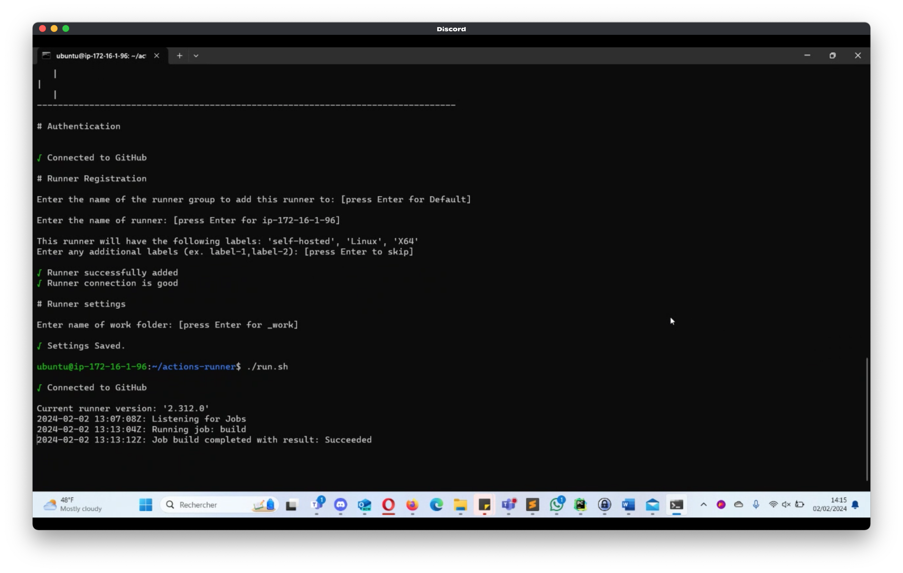

Par ailleurs, nous avons pu constater que c'est également le cas sur l'interface graphique de Github.

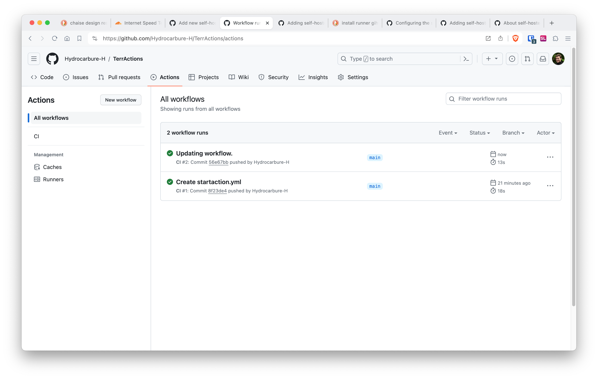

# Pipeline de Build Applicatif

Nous avons maintenant l'Action suivante, pour créer notre AMI à l'aide du code Packer précédemment écrit dans un TP.

A noter que notre script fait appel à des `secrets`, champs spéciaux dans les Github Actions permettant de cacher des identifiants et autres données sensibles.

Par ailleurs, les deux paramètres pour le port d'écoute de notre projet est stocké dans la variable `HTTPD_PORT` et le nom du projet pour la construction de l'AMI est stocké dans `PROJECT_NAME`.

Nous avons notre repository qui possède l'architecture suivante:

```
├── .github
│   └── workflows
│       ├── app-build.yml
│       └── startaction.yml
├── .gitignore
├── LICENSE
├── README.md
├── apache-packer.pkr.hcl
└── play.yml
```

## Github Actions

```yaml
name: Build Apache AMI

on:
  push:
    branches:
      - main

jobs:
  build:
    runs-on: self-hosted

    steps:
    - uses: actions/checkout@v2

    - name: Clone Packer template repository
      run: git clone https://github.com/Hydrocarbure-H/TerrActions ./repo

    - name: Setup Packer
      uses: hashicorp/setup-packer@latest
      with:
        packer-version: '1.7.0'

    - name: Validate Packer Template
      run: packer validate ./repo/apache-packer.pkr.hcl

    - name: Build AMI with Packer
      env:
        APP_NAME: 'TerrAction'
        HTTPD_PORT: '8080'
      run: packer build -var 'app_name=${{ env.APP_NAME }}' -var 'httpd_port=${{ env.HTTPD_PORT }}' ./repo/apache-packer.pkr.hcl
```

## Packer

Le code du fichier Packer est le suivant:

```hcl
packer {
  required_plugins {
    amazon = {
      version = "~> 1.3"
      source  = "github.com/hashicorp/amazon"
    }
    ansible = {
      version = "~> 1.1"
      source  = "github.com/hashicorp/ansible"
    }
  }
}

variable "associate_public_ip_address" {
  type    = string
  default = "true"
}
variable "base_ami" {
  type    = string
  default = "ami-007855ac798b5175e"
}
variable "instance_type" {
  type    = string
  default = "t2.micro"
}
variable "region" {
  type    = string
  default = "us-east-1"
}
variable "app_name" {
  type    = string
  default = "WebApp"
}
variable "ssh_username" {
  type    = string
  default = "ubuntu"
}

locals {
  timestamp = formatdate("DD_MM_YYYY-hh_mm", timestamp())
}

source "amazon-ebs" "static-web-ami" {
  ami_name                    = "${var.app_name}-${local.timestamp}"
  associate_public_ip_address = "${var.associate_public_ip_address}"
  instance_type               = "${var.instance_type}"
  region                      = "${var.region}"
  source_ami                  = "${var.base_ami}"
  ssh_username                = "${var.ssh_username}"

  iam_instance_profile        = "LabInstanceProfile"

  tags = {
    Name = "${var.app_name}"
  }
}

variable "httpd_port" {
  type    = string
  default = "80" # Port par défaut pour HTTPD, remplacez-le par le port souhaité
}

build {
  sources = ["source.amazon-ebs.static-web-ami"]
  provisioner "ansible" {
    playbook_file = "./repo/play.yml" # Assurez-vous que le chemin est correct
    extra_arguments = ["-e", "httpd_port=${var.httpd_port}"]
    use_proxy = false
  }
}
```

## Playbook Ansible

Le playbook ansible `play.yml` est le suivant.

```yml
- name: Configure HTTPD to listen on specified port
  hosts: all
  become: yes
  tasks:
    - name: Update httpd.conf to listen on specified port
      lineinfile:
        path: /etc/httpd/conf/httpd.conf
        regexp: '^Listen'
        line: "Listen {{ httpd_port }}"
```

# Pipeline de déploiement

## Terraform

Nous avons, grâce au TP02, le code Terraform suivant, permettant de déployer notre infrastructure AWS et notre application web.

```
# Set the AWS provider with the desired region
provider "aws" {
  region = var.aws_region
}

# Define variables for the CIDRs of the VPC and subnets
variable "aws_region" {
  default = "us-east-1"
  type    = string
}

variable "vpc_cidr" {
  default = "172.16.0.0/16"
  type    = string
}

variable "public_subnet_cidr" {
  default = "172.16.1.0/24"
  type    = string
}

variable "private_subnet_cidr" {
  default = "172.16.2.0/24"
  type    = string
}

variable "instance_type" {
  default = "t2.micro"
  type    = string
}

########################
# Find your current IP
########################
variable "personal_ip_address" {
  type = string
}

data "http" "current_ip" {
  url = "https://checkip.amazonaws.com"
}

locals {
  your_ip_addresses = distinct([var.personal_ip_address, chomp(data.http.current_ip.response_body)])
}

########################
# Network
########################

# Create the VPC
resource "aws_vpc" "tp_devops_vpc" {
  cidr_block = var.vpc_cidr
  tags = {
    Name = "TP_DevOps"
  }
}

# Create the public subnet
resource "aws_subnet" "tp_devops_public_subnet" {
  vpc_id                  = aws_vpc.tp_devops_vpc.id
  cidr_block              = var.public_subnet_cidr
  availability_zone       = "${var.aws_region}a"
  map_public_ip_on_launch = true
  tags = {
    Name = "TP_DevOps_Public"
  }
}

# Create the private subnet
resource "aws_subnet" "tp_devops_private_subnet" {
  vpc_id            = aws_vpc.tp_devops_vpc.id
  cidr_block        = var.private_subnet_cidr
  availability_zone = "${var.aws_region}a"
  tags = {
    Name = "TP_DevOps_Private"
  }
}

# Create an internet gateway
resource "aws_internet_gateway" "tp_devops_igw" {
  vpc_id = aws_vpc.tp_devops_vpc.id
  tags = {
    Name = "TP_DevOps"
  }
}

# Create a route table for the public subnets
resource "aws_route_table" "public_route_table" {
  vpc_id = aws_vpc.tp_devops_vpc.id

  route {
    cidr_block = "0.0.0.0/0"
    gateway_id = aws_internet_gateway.tp_devops_igw.id
  }

  tags = {
    Name = "TP_DevOps_Public"
  }
}


resource "aws_route_table_association" "public" {
  subnet_id      = aws_subnet.tp_devops_public_subnet.id
  route_table_id = aws_route_table.public_route_table.id
}

resource "aws_security_group" "public" {
  name_prefix = "public-"
  vpc_id      = aws_vpc.tp_devops_vpc.id

  # allow all access from local network
  ingress {
    from_port       = 0
    to_port         = 0
    protocol        = "-1"
    security_groups = [aws_security_group.private.id]
  }

  # allow SSH access from your IP
  ingress {
    from_port   = 22
    to_port     = 22
    protocol    = "tcp"
    cidr_blocks = [for ip in local.your_ip_addresses : "${ip}/32"]
  }

  # Allow HTTP access from 8080
    ingress {
        from_port   = 8080
        to_port     = 8080
        protocol    = "tcp"
        cidr_blocks = [for ip in local.your_ip_addresses : "${ip}/32"]
    }

  # allow external access
  egress {
    from_port   = 0
    to_port     = 0
    protocol    = "-1"
    cidr_blocks = ["0.0.0.0/0"]
  }

  tags = {
    Name = "public"
  }
}

resource "aws_security_group" "private" {
  name_prefix = "private-"
  vpc_id      = aws_vpc.tp_devops_vpc.id

  # allow SSH access from public subnet
  ingress {
    from_port   = 22
    to_port     = 22
    protocol    = "tcp"
    cidr_blocks = [var.public_subnet_cidr]
  }

  # allow external access
  egress {
    from_port   = 0
    to_port     = 0
    protocol    = "-1"
    cidr_blocks = ["0.0.0.0/0"]
  }

  tags = {
    Name = "Private"
  }
}

########################
# Instances
########################
data "aws_ami" "webapp" {
most_recent = true
owners = ["833574749817"]
filter {
    name   = "image-id"
    values = ["ami-009bc99353224f1ec"]
  }
}
# Create a WebApp instance
resource "aws_instance" "tp_devops_webapp_instance" {
    ami = data.aws_ami.webapp.id
    instance_type = var.instance_type
    key_name = "monkey"
    iam_instance_profile = "LabInstanceProfile"
    subnet_id            = aws_subnet.tp_devops_public_subnet.id

    tags = {
    Name = "WebServer"
    }

    vpc_security_group_ids = [aws_security_group.public.id]
}
```

Pour vérifier son fonctionnement, nous avons à nouveau exécuté a commande `terraform init` et `terraform apply`.

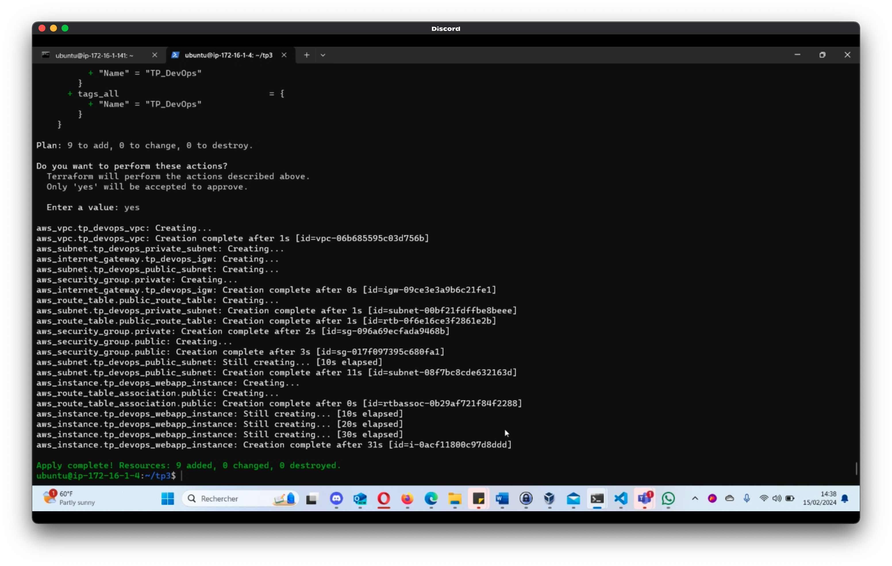

Nous avons vu que le déploiement de l'instance EC2 et que le site web se sont bien effectués.

Nous ajoutons donc un fichier `main.tf` à notre repository GitHub pour que ce fichier puisse être exécuté sur notre runner.

## Runner GitHub

Nous en profitons maintenant pour vérifier que notre runner fonctionne toujours.

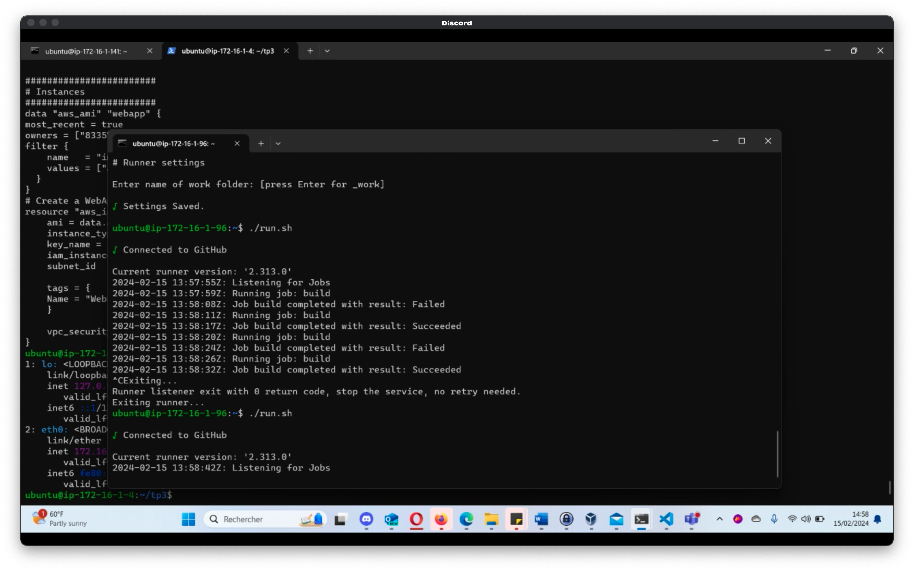

C'est visiblement le cas.

Nous ajoutons donc dans l'instance de notre runner un fichier dans `~/.aws/credentials` contenant les informations de session avec les clés et identifiants nécessaires à la manipulation des services AWS.

## GitHub Actions

Une fois ceci fait, nous avons écrit le code de notre GitHub Actions qui est le suivant.

```yaml
name: Deploy Pipeline

on:
  push:
    branches:
      - main

jobs:
  deploy:
    runs-on: self-hosted

    steps:
    - name: Checkout code
      uses: actions/checkout@v2

    - name: Setup Terraform
      uses: hashicorp/setup-terraform@v1
      with:
        terraform_version: 1.0.0

    - name: Terraform Init
      run: terraform init

    - name: Terraform Plan
      run: terraform plan

    - name: Terraform Apply
      run: terraform apply -auto-approve
```

En fin de compte, cette pipeline va déployer notre infrastructure, mais également notre application à l'aide du code Terraform.

Après quelques heures de debug, nous obtenons finalement le résultat suivant.

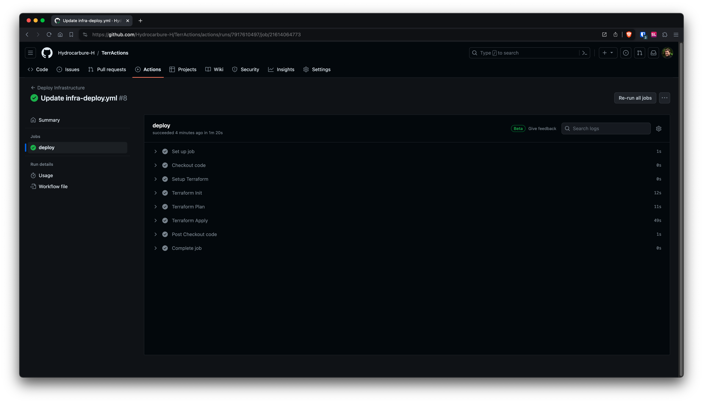

Nous avons donc maintenant la structure de fichiers suivante:

```
├── .github
│   └── workflows
│       ├── app-build.yml
│       ├── infra-deploy.yml
│       └── startaction.yml
├── .gitignore
├── LICENSE
├── README.md
├── apache-packer.pkr.hcl
└── play.yml
```

# Pipeline de destruction des ressources

Nous avonc créé une GitHub Action qui permet de `destroy` les ressources AWS.

Voici le code de notre GitHub Action.

```yaml
name: Cleanup Infrastructure
on:
  push:
    branches:
      - main
jobs:
  destroy:
    runs-on: self-hosted
    steps:
    - name: Checkout code
      uses: actions/checkout@v2

    - name: Setup Terraform
      uses: hashicorp/setup-terraform@v1
      with:
        terraform_version: 1.0.0

    - name: Terraform Init
      run: terraform init

    - name: Terraform Destroy
      run: terraform destroy -auto-approve
```

Après avoir exécuté les autres pipelines, nous exécutons celle-ci et obtenons le résultat suivant.

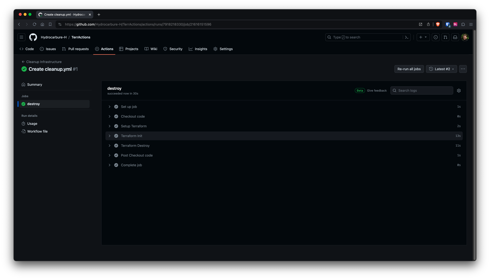

Après vérification sur AWS, nous pouvons constater que les ressources créées ont bien éte supprimées.

Avec tout le processus qui a été effectué, nous avons le résultat suivant.

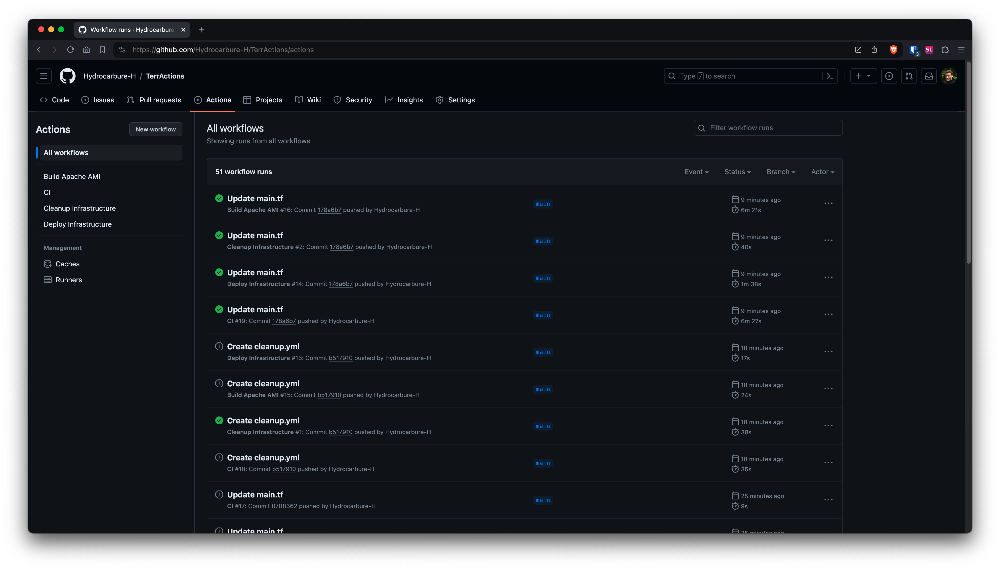

# Finalisation

## GitHub Actions unique

Nous avons pu constater qu'il était beaucoup plus habituel de créer un seul workflow contenant les différentes pipelines nécessaires au projet. Pour cela, nous avons donc supprimé nos précédentes pipelines pour les concaténer dans un seul workflow, qui est le suivant.

```yaml
name: Build and deploy our website.

on:
  push:
    branches:
      - main

jobs:
  build:
    runs-on: self-hosted

    steps:
      - uses: actions/checkout@v2

      - name: Clone Packer template repository
        run: git clone https://github.com/Hydrocarbure-H/TerrActions ./repo

      - name: Setup Packer
        uses: hashicorp/setup-packer@main
        with:
          packer-version: "1.7.0"

      - name: Validate Packer Template
        run: packer validate ./repo/apache-packer.pkr.hcl

      - name: Build AMI with Packer
        env:
          APP_NAME: "TerrAction"
          HTTPD_PORT: "8080"
        run: packer build -var 'app_name=${{ env.APP_NAME }}' -var 'httpd_port=${{ env.HTTPD_PORT }}' ./repo/apache-packer.pkr.hcl

  deploy:
  	needs: build
    runs-on: self-hosted

    steps:
    - name: Checkout code
      uses: actions/checkout@v2

    - name: Setup Terraform
      uses: hashicorp/setup-terraform@v1
      with:
        terraform_version: 1.0.0

    - name: Terraform Init
      run: terraform init

    - name: Terraform Plan
      run: terraform plan

    - name: Terraform Apply
      run: terraform apply -auto-approve

  destroy:
  	needs: deploy
    runs-on: self-hosted
    steps:
    - name: Checkout code
      uses: actions/checkout@v2

    - name: Setup Terraform
      uses: hashicorp/setup-terraform@v1
      with:
        terraform_version: 1.0.0

    - name: Terraform Init
      run: terraform init

    - name: Terraform Destroy
      run: terraform destroy -auto-approve
```

Et, une fois exécutée, nous avons le retour suivant.

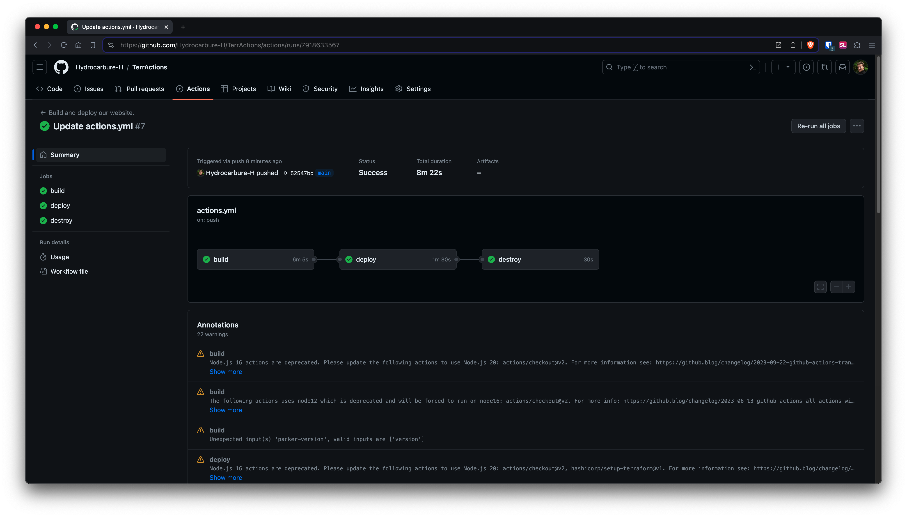

Les logs de notre runner GitHub confirment le bon déroulement de cette pipeline.

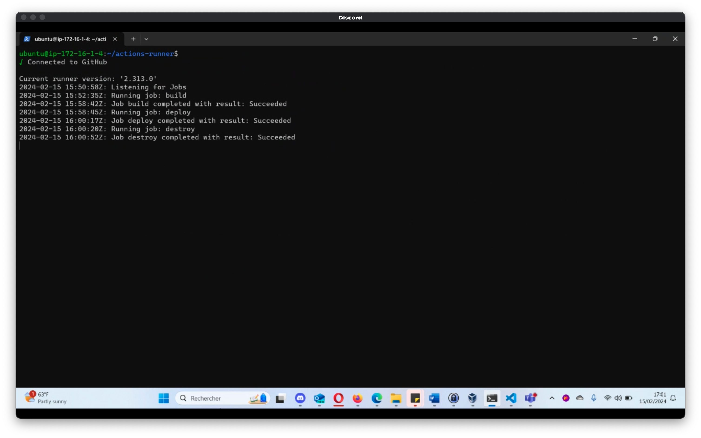
