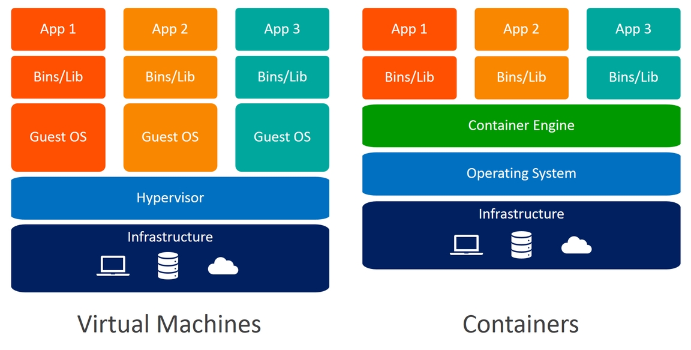
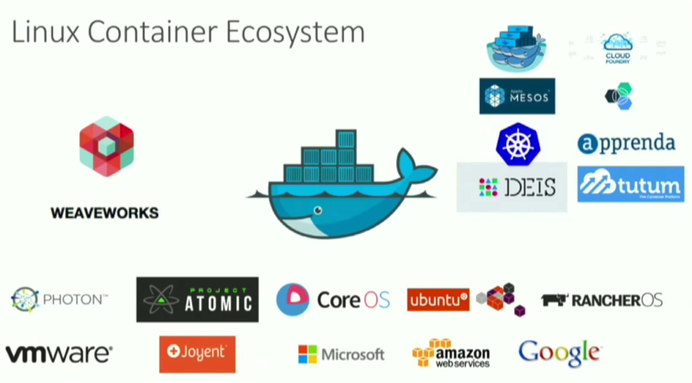
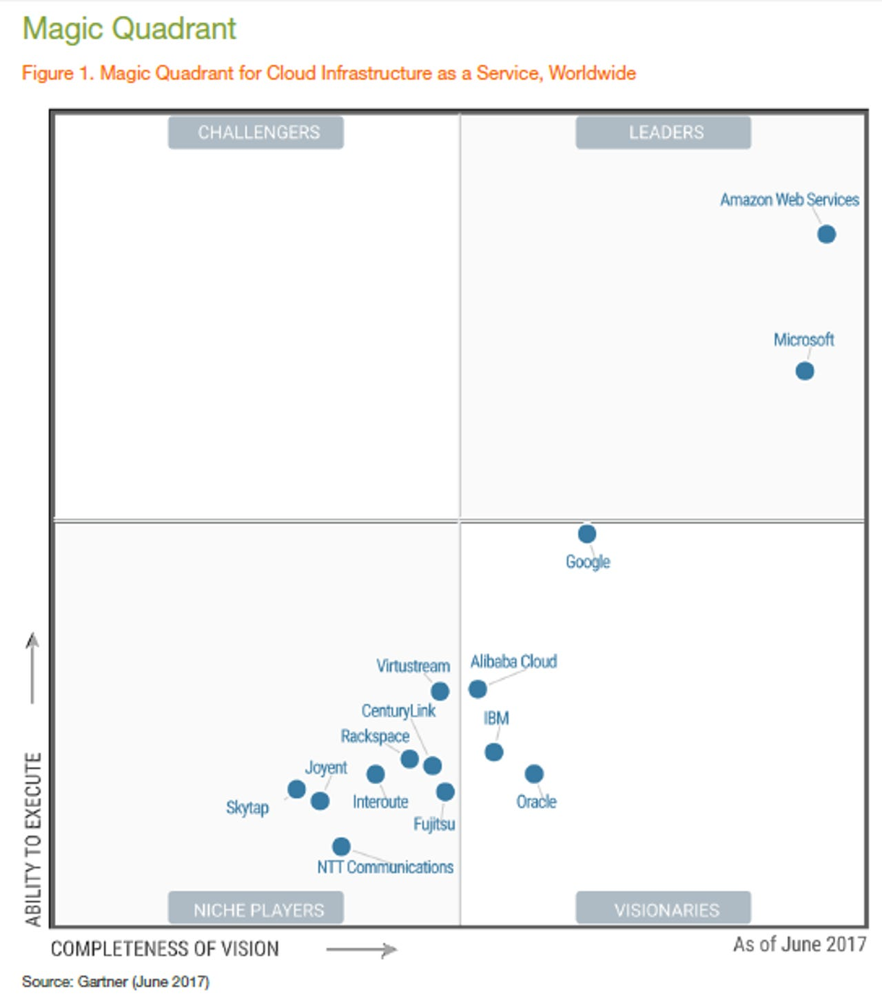
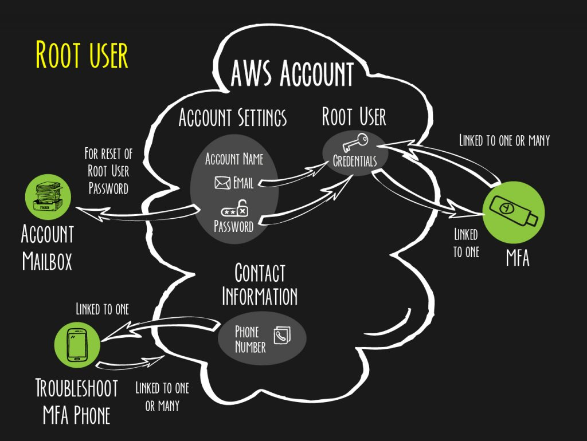
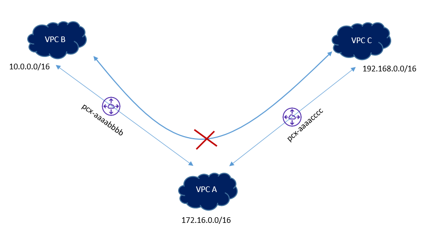
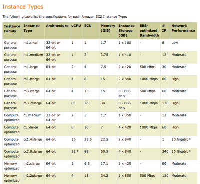

# AWS et Architecture Cloud

# Cloud Computing

**On Demand Cloud Service**

L'utilisateur peut, quand il en a besoin, provisionner ou modiffier de la puissance informatique.

**Broad Network Access**

Toutes ces possibilités sont disponibles à travers un réseau par des mácanismes standards depuis des postes hétérogènes.

**Resource pooling**

Les ressources informatiques sont regroupées pour plusieurs utilisateurs de différentes sociétés assignées dynamiquement et réassignées selon la demande.

**Rapid Elasticity**

Les capacités informqtiques peuvent être provisionnées ou dé-prévisionnées automatiquement le plus souvent.

**Measured Service**

-- Notes manquantes -- 

1. **Cloud Privé :**

   - Propriété et gestion : Un cloud privé est géré et détenu par une seule organisation, ce qui signifie que l'entreprise contrôle l'ensemble de l'infrastructure cloud.
   - Isolation : Les ressources cloud d'un cloud privé sont dédiées exclusivement à l'organisation cliente, ce qui garantit une isolation complète par rapport aux autres utilisateurs.
   - Sécurité et conformité : Les entreprises ont un contrôle total sur la sécurité et la conformité de leurs données et applications dans un cloud privé, ce qui peut être essentiel pour les industries soumises à des réglementations strictes.
   - Coût : Les coûts de mise en place et de gestion d'un cloud privé sont généralement plus élevés que ceux d'autres modèles en raison de la nécessité d'acquérir et de maintenir l'infrastructure.

2. **Cloud Public :**

   - Propriété et gestion : Dans un cloud public, les ressources informatiques sont détenues et gérées par un fournisseur de services cloud tiers, comme Amazon Web Services (AWS), Microsoft Azure ou Google Cloud Platform (GCP).
   - Partage : Les ressources sont partagées entre de multiples clients, ce qui permet une utilisation plus économique des infrastructures, mais peut entraîner une moins grande isolation.
   - Évolutivité : Les services cloud publics sont hautement évolutifs, ce qui signifie que les clients peuvent augmenter ou réduire rapidement leurs ressources en fonction de leurs besoins.
   - Coût : Les coûts de fonctionnement d'un cloud public sont généralement basés sur l'utilisation réelle, ce qui peut être plus rentable pour de nombreuses organisations.

3. **Cloud Communautaire :**

   - Propriété et gestion : Le cloud communautaire est partagé par plusieurs organisations appartenant à un même secteur ou à une même communauté spécifique, comme une industrie ou une organisation gouvernementale.
   - Partage limité : Bien que les ressources soient partagées, le cloud communautaire offre une plus grande isolation et une meilleure sécurité que le cloud public, car les organisations participantes ont souvent des besoins similaires en matière de sécurité et de conformité.
   - Coopération : Les organisations au sein d'un cloud communautaire collaborent souvent pour élaborer des politiques de sécurité et de conformité communes.
   - Coût : Les coûts sont généralement partagés entre les organisations membres, ce qui peut rendre le cloud communautaire plus économique que le cloud privé.

4. **Cloud Hybride** :

   Bien sûr, le cloud hybride est un autre modèle de cloud computing qui mérite d'être mentionné, car il combine des éléments du cloud privé et du cloud public pour offrir une solution plus flexible et adaptée aux besoins changeants des organisations. Voici ce qu'il faut savoir sur le cloud hybride :

   Cloud Hybride :

   - Combinaison : Le cloud hybride intègre à la fois des ressources informatiques locales (sur site, généralement dans les locaux de l'entreprise) et des ressources cloud (privées ou publiques). Cela permet aux entreprises de conserver certaines données et applications sensibles sur site tout en utilisant le cloud pour des charges de travail moins critiques ou pour éviter de surcharger leur infrastructure locale.
   - Flexibilité : Le cloud hybride offre une grande flexibilité, permettant aux organisations de déplacer des charges de travail entre le cloud privé et le cloud public en fonction des besoins. Cela peut être particulièrement utile pour faire face à des pics de demande temporaires ou pour répondre à des exigences de conformité spécifiques.
   - Isolation et contrôle : Les entreprises ont un contrôle total sur les ressources locales dans un cloud hybride, ce qui peut être essentiel pour les données sensibles ou les réglementations strictes. En même temps, elles peuvent profiter de l'évolutivité et de la rentabilité du cloud public pour d'autres charges de travail.
   - Gestion centralisée : Un avantage clé du cloud hybride est la possibilité de gérer l'ensemble de l'infrastructure, y compris les ressources locales et cloud, à partir d'une console de gestion centralisée.
   - Complexité : La gestion d'un environnement de cloud hybride peut être plus complexe que celle d'un seul modèle cloud. Il nécessite une planification, une intégration et une gestion soignées pour s'assurer que toutes les composantes fonctionnent de manière transparente.

Le choix entre un cloud privé, un cloud public ou un cloud communautaire dépend des besoins spécifiques de chaque organisation en matière de sécurité, de conformité, d'évolutivité et de coûts. Certaines entreprises optent même pour une approche de cloud hybride, qui combine plusieurs de ces modèles pour répondre à différents besoins.

## 3 modèles de services

### SaaS - Software as a Service

### PaaS - Platform as a Service

C'est une plateforme complète de développement et de déploiement pour les applications en mode SaaS et services Web.

- Conception, intégration de web services, développement, test, versionning...
- Gestion des instances, scalable sur demande, gestion, monitoring..

# Docker

### Ecosysteme Kubernetes

## Nouveaux modèles de services

## FaaS - Serverless

Stands for Function as a Service.

Le principe du serverless conciste à déclencher la fonction requise à la demande via un céclencheur logiciel.

Le principal bénéfice du FaaS cnciste à permettre la scalabilité à zéro !

Ce mode de fonctionnement est particulièrement intéressant en termes de coût vis à vis des cloud providers et en terme d'optimisation des ressources en cloud privé.

# Principaux acteurs du marché

## Gartner Magic Quadrant

En 2017 : 

C'est durant cette année que les premiers acteurs chinois ont fait leur apparition.

## Amazon Web Services

En 2006, démarrage de la propositions de différents services web pour différentes entreprises.

En 2017, premier datacenter d'AWS en France.

Propose plus de 200 services. Problème principal : Prix.

### Interface de gestion

Utilise le concept du moindre privilège.

**Prochain cours :** Présentation des différents services

### Comparaison des architectures on-premises et AWS (IaaS)

## Accounting

Comte root - Compte de gestion pour une activité spécifique.

- Permet de créer plusieurs comptes
- Contient une @mail et un pwd.

**SLA** - Service Level Agreement : Niveau de sécurité qui va être établi pour protéger le contenu des données.

### Composants fondamentaux

#### Les services réseaux

**VPC :** - Virtual Private Cloud 

- Provisionne un réseua (privé, virtuel, isolé)
- Permet d'avoir le contrôle complet sur lénvironnement virtual du réseau de votre cloud privé.

Le subnet d'un VPC permet le lancement de resources AWS au sein d'un sous-réseau.

Il est possible de faire du VPC peering.

Non transitif, et il sera nécessaire d'avoir des adresses disjoinctes.

## EC2

Les instances EC2 sont des serveurs virtualisés dans les datacenters AWS, ayant un contrôle complet des ressources (redimensionnables).

### Serverless

Site web : créer une nouvelle instance à chaque nouvel utilisateur. Si peu de visites dans le mois, facture basse, sinon haute.

Mais mieux que pratiquement max chaque mois dû à une infra en static bare metal.

Ce qui permet donc aussi d'utiliser la technologie d'autoscaling si jamais le besoin est + ou - important.

## Stockage

1. **Stockage par bloc :**
   - Le stockage par bloc divise un support de stockage en blocs de taille fixe (généralement de quelques kilooctets à plusieurs mégaoctets).
   - Chaque bloc est identifié par une adresse physique unique.
   - Les données sont stockées sans aucune structure de fichier ou de système de fichiers. Les blocs sont simplement des unités de données brutes.
   - Ce type de stockage est couramment utilisé dans les disques durs, les SSD (Solid State Drives) et les systèmes de stockage en réseau (SAN).
   - Il est souvent utilisé dans des environnements qui nécessitent une performance élevée et une gestion fine du stockage, tels que les bases de données.
2. **Stockage par fichiers :**
   - Le stockage par fichiers organise les données en utilisant une structure de système de fichiers. Les fichiers sont des ensembles de données logiquement organisées.
   - Chaque fichier a un nom, un type et une hiérarchie de dossiers qui le place dans une structure arborescente.
   - Les données sont stockées de manière plus conviviale pour les utilisateurs, ce qui permet de les organiser et de les récupérer plus facilement.
   - Ce type de stockage est couramment utilisé dans les systèmes d'exploitation, les serveurs de fichiers, et les services de stockage en réseau tels que le NAS (Network-Attached Storage).
   - Il est adapté aux besoins des utilisateurs et des applications qui gèrent des données de manière plus traditionnelle, comme les documents, les images, les vidéos, etc.

En résumé, la principale différence réside dans la manière dont les données sont organisées. Le stockage par blocs est plus adapté aux applications nécessitant une performance élevée et une gestion fine du stockage, tandis que le stockage par fichiers est plus adapté aux besoins des utilisateurs et des applications qui nécessitent une organisation logique des données en fichiers et dossiers. En pratique, de nombreuses solutions de stockage combinent ces deux approches pour répondre aux différents besoins des utilisateurs et des applications.

## Amazon Simple Stoage Service

1. **S3 Reduced Redundancy Storage (RRS)** :
   - RRS est une classe de stockage qui offre une réduction des coûts par rapport à la classe de stockage Standard en échange d'une réduction légère de la redondance des données.
   - Conçue pour stocker des données non critiques ou répliquées ailleurs, RRS présente un niveau de redondance moindre par rapport à la classe de stockage Standard, ce qui signifie qu'il existe un risque légèrement plus élevé de perte de données.
   - Elle convient aux données qui peuvent être reconstituées facilement en cas de perte.
2. **S3 Standard** :
   - La classe de stockage S3 Standard offre une durabilité élevée des données grâce à la réplication multi-site des données.
   - Les données stockées dans la classe S3 Standard sont conçues pour être accessibles avec une latence faible.
   - Cette classe de stockage convient aux données fréquemment utilisées et aux applications nécessitant un accès rapide aux données.
3. **S3 Standard-IA (Infrequent Access)** :
   - S3 Standard-IA est une classe de stockage conçue pour stocker des données qui ne sont pas fréquemment utilisées, mais qui doivent être accessibles avec une latence relativement faible.
   - Elle offre une réduction des coûts par rapport à la classe de stockage Standard tout en maintenant une durabilité élevée.
   - Convient aux données auxquelles on accède moins fréquemment, mais qui doivent être rapidement disponibles lorsque nécessaire.
4. **S3 Intelligent-Tiering** :
   - S3 Intelligent-Tiering est une classe de stockage qui automatise le déplacement des objets entre les classes de stockage en fonction de leur fréquence d'accès.
   - Il peut basculer automatiquement entre les classes S3 Standard et S3 Standard-IA, offrant ainsi un équilibre entre performance et coût en fonction du comportement d'accès réel des objets.
   - Convient aux cas d'utilisation où les besoins en matière de stockage peuvent varier avec le temps.

# Stockage objet

**Amazon Simple Storage Service - S3** 

> *Amazon Simple Storage Service (Amazon S3) est un service de stockage d'objets qui offre une capacité de mise à l'échelle, une disponibilité des données, une sécurité et des performances de pointe. Les clients de toutes les tailles et de tous les secteurs peuvent stocker et protéger n'importe quelle quantité de données pour la quasi-totalité des cas d'utilisation, par exemple les lacs de données ainsi que les applications natives cloud et mobiles. Grâce à des classes de stockage économiques et à des fonctions de gestion faciles à utiliser, vous pouvez optimiser les coûts, organiser les données et configurer des contrôles d'accès précis pour répondre à des exigences opérationnelles, organisationnelles et de conformité spécifiques.* - **aws.amazon.com**

**Règle des 3-2-1** : Avoir au moins une sauvegarde hors site.

## Classes de stocages d'objets

- **S3 Standard**
  - Accès performants et fréquents aux données
- **S3 Reduced Redundancy Storage**
  - Non recommandé, classe suivante remplaçante, plus sécurisée et plus performante.
- **S3 Standard infrequent Access**
  - Données longues vies, backups. Moins cher que classe Standard
- **S3 Glacier Instant Retrieval**
  - Archivage de données
  - Aucun accès temps réel
  - Coût très faible

## Stockage Amazon EC2

- Stockage Local : Ephémère sur l'hôte
- Stockage extérieur à l'hôte

# Identity / Access Management

Il existe deux types de policies :

- Resources-based policies
- Users-based policies

# Fiche

*GPT-Generated*

#### Introduction au Cloud Computing

1. **Définition du Cloud Computing** :
   - **Concept** : Le Cloud Computing est un modèle qui permet un accès réseau omniprésent, pratique et à la demande à un ensemble partagé de ressources informatiques configurables.
   - **Caractéristiques Clés** : Accès en réseau, allocation rapide des ressources, gestion optimisée.

2. **Types de Cloud Computing** :
   - **Software as a Service (SaaS)** : Accès à des applications via Internet.
   - **Platform as a Service (PaaS)** : Plateforme permettant le développement, le test, la livraison et la gestion d'applications.
   - **Infrastructure as a Service (IaaS)** : Accès à des ressources informatiques virtualisées sur Internet.

3. **Modèles de Déploiement du Cloud** :
   - **Cloud Privé** : Réservé à une seule organisation.
   - **Cloud Public** : Accessible par le grand public ou une grande industrie.
   - **Cloud Communautaire** : Partagé par plusieurs organisations ayant des besoins communs.
   - **Cloud Hybride** : Combinaison des trois précédents, offrant plus de flexibilité.

#### Avantages et Défis du Cloud Computing

1. **Avantages du Cloud Computing** :
   - **Flexibilité et Évolutivité** : Adaptabilité rapide aux changements de charge de travail.
   - **Réduction des Coûts** : Économies sur les coûts d'infrastructure et d'opération.
   - **Accès à distance** : Accessibilité depuis n'importe quel endroit avec une connexion Internet.
   - **Mises à jour Automatiques** : Les services cloud sont régulièrement mis à jour.

2. **Défis du Cloud Computing** :
   - **Sécurité et Confidentialité** : Nécessité de protéger les données stockées et traitées dans le cloud.
   - **Gestion des Coûts** : Contrôle des dépenses liées à l'utilisation des services cloud.
   - **Conformité Légale** : Respect des normes et réglementations locales et internationales.
   - **Dépendance aux Fournisseurs** : Risque lié à la dépendance à un fournisseur de cloud spécifique.

#### Impact sur les Structures d'Entreprise et les Professions IT

1. **Transformation des Entreprises** :
   - **Agilité d'Entreprise** : Le cloud offre une flexibilité pour s'adapter rapidement aux besoins du marché.
   - **Innovation** : Facilite l'expérimentation et le déploiement rapide de nouvelles idées.
   - **Collaboration Améliorée** : Permet un travail collaboratif plus efficace, même à distance.

2. **Impact sur les Professions IT** :
   - **Évolution des Compétences** : Nécessité pour les professionnels IT de se familiariser avec les technologies et stratégies cloud.
   - **Nouveaux Rôles IT** : Émergence de rôles tels que l'architecte cloud, l'ingénieur DevOps, et le spécialiste de la sécurité cloud.
   - **Décentralisation IT** : Passage d'une gestion IT centralisée à une approche plus distribuée et intégrée.

#### Introduction Détaillée à Amazon Web Services (AWS)

1. **Présentation Approfondie d'AWS** :
   - **Histoire et Évolution** : Comment AWS est devenu un leader du cloud computing.
   - **Infrastructure Globale** : Présentation des régions et zones de disponibilité AWS.

2. **Services Clés d'AWS (Détails)** :
   - **EC2** : Options de configuration, types d'instances, tarification.
   - **S3** : Utilisations, sécurité, intégration avec d'autres services AWS.
   - **RDS** : Bases de données supportées, gestion de la performance, sauvegarde et récupération.
   - **Autres Services Importants** : Lambda (traitement sans serveur), DynamoDB (base de données NoSQL), IAM (gestion des identités et des accès).

3. **Cas d'Usage et Scénarios** :
   - **Hébergement Web** : Utilisation d'AWS pour l'hébergement de sites web et applications.
   - **Big Data et Analytique** : Solutions AWS pour le traitement et l'analyse de grandes quantités de données.
   - **Sécurité et Conformité** : Outils et pratiques pour assurer la sécurité des données.

4. **Écosystème AWS et Communauté** :
   - **Partenariats et Intégrations** : Comment AWS collabore avec d'autres entreprises.
   - **Support et Ressources de Formation** : AWS Training and Certification, forums, documentation.

#### Construire un Cloud Privé

1. **Comprendre un Cloud Privé** :
   - **Définition** : Un cloud privé est une infrastructure cloud dédiée à une seule organisation.
   - **Avantages** : Meilleur contrôle, sécurité renforcée, personnalisation.

2. **Étapes de Construction** :
   - **Planification et Analyse des Besoins** : Déterminer les exigences en termes de performance, sécurité, et conformité.
   - **Choix de la Technologie** : Sélectionner les technologies et les plateformes adaptées (par exemple, VMware, OpenStack).
   - **Mise en Place de l'Infrastructure** : Installer et configurer l'infrastructure nécessaire (serveurs, stockage, réseau).

3. **Gestion et Sécurité** :
   - **Maintenance et Mises à Jour** : Gérer les mises à jour logicielles et matérielles.
   - **Sécurité** : Mettre en œuvre des stratégies de sécurité robustes pour protéger les données et les applications.

4. **Intégration et Optimisation** :
   - **Intégration avec des Services Externes** : Connecter le cloud privé à des services cloud publics pour une approche hybride.
   - **Optimisation des Ressources** : Utiliser des outils de gestion des ressources pour maximiser l'efficacité.
