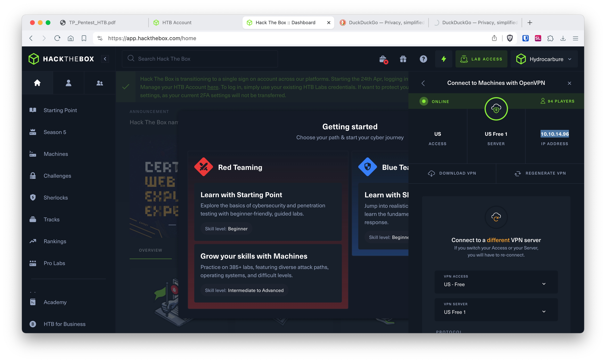
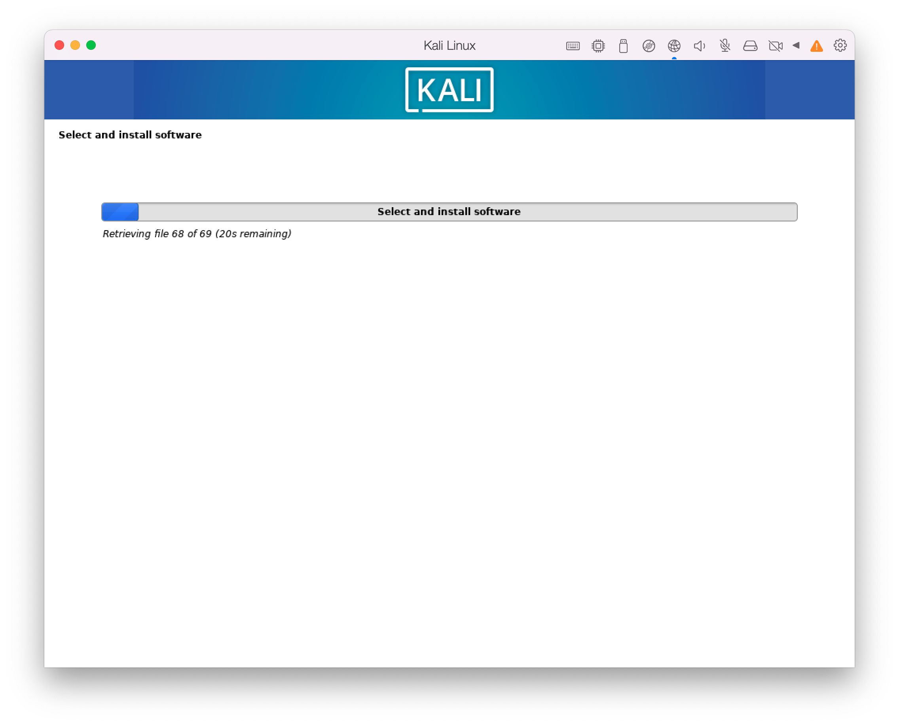
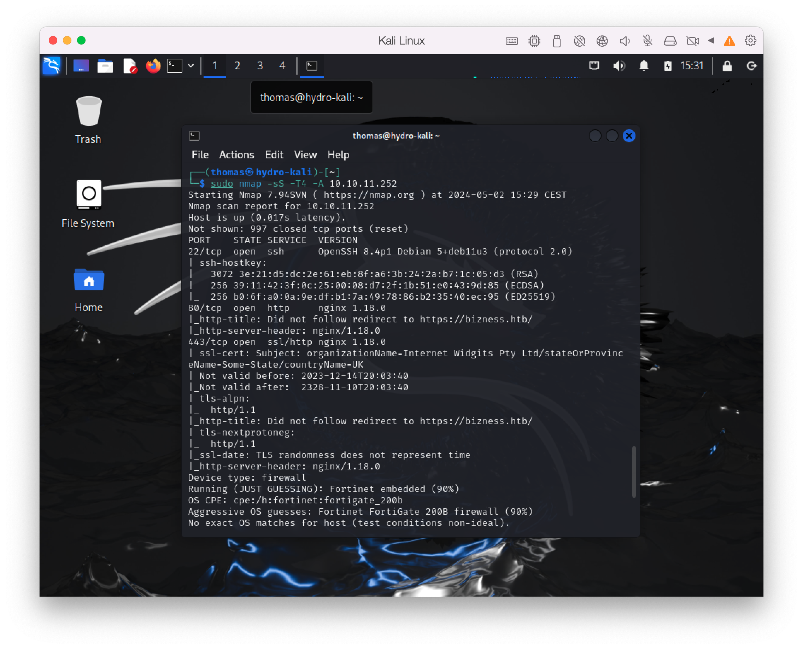
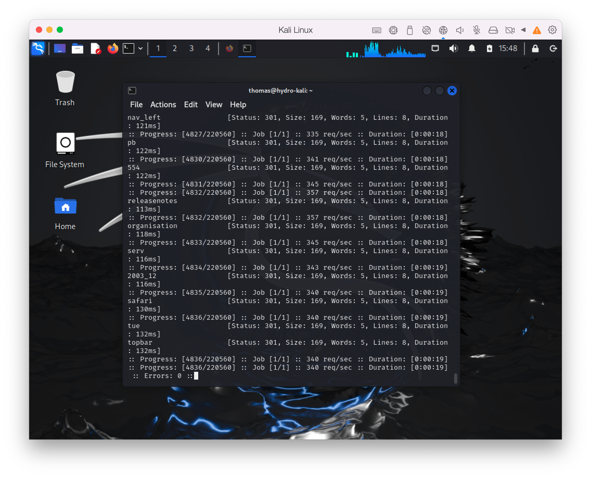

# Pentest

Notes de cours par `Thomas PEUGNET`.

Ce cours présente la marche à suivre pour effectuer les TPs de Pentest.

# Installation

Nous avons téléchargé et installé OpenVPN, puis importé notre fichier de configuration obtenu sur le site.

Nous avons donc une connexion OpenVPN maintenant fonctionnelle.



Nous lançons donc l'installation de notre VM Kali linux.



# Questions

Nous lançons ensuite notre commande `nmap` avec les paramètres suivants:

```shell
$ sudo nmap -sS -T4 -A -v 10.10.11.252
```



## Question 1

De notre point de vue, on peut aller regarder rapidement le port 22 pour le `ssh`, voir si des mots de passe usuels peuvent être utilisés. On pourrait ensuite s'intéresser au port 80 et chercher des serveurs apache mal configurés, permettant d'avoir un `Index of` accessible.

## Question 2

Les options utilisées pour `nmap` sont les suivantes:

- `-sS` : Scan SYN.
- `-T4` : Accélère le scan.
- `-A` : Active la détection du système d'exploitation et des versions des services.

## Question 3

Si notre pentest était en conditions réelles, nous éviterions d'accélérer le scan et d'utiliser le scan SYN car ces techniques risquent de déclencher des alertes auprès des systèmes de détection d'intrusion, ce qui pourrait bloquer notre tentative ou notre appareil. En outre, un scan trop rapide peut omettre des informations essentielles si des paquets sont perdus ou si des services ne répondent pas, réduisant ainsi la fiabilité de notre analyse.

# Lister les répertoires

Nous effectuons un scan avec `ffuf` avec les options suivantes:

```shell
$ ffuf -w /usr/share/wordlists/dirbuster/directory-list-2.3-medium.txt -u http://10.10.11.252/FUZZ
```



Ne voyant pas de résultat probant sur cette commande, nous tentons notre chance avec `gobuster`.

Nous utilisons donc la commande suivante:

```shell
$ gobuster dir -u https://bizness.htb -w /usr/share/wordlists/dirb/big.txt -k -b 302 -t 20 2>/dev/null
```

- `dir` : spécifie le mode de Gobuster à utiliser, ici pour chercher des répertoires.
- `-w /usr/share/wordlists/dirb/big.txt` : définit le chemin de la wordlist à utiliser pour le fuzzing.
- `-k` : ignore les avertissements SSL, utile si le certificat SSL du site ne peut pas être vérifié.
- `-b 302` : permet de ne pas suivre les redirections
- `-t 20` : définit le nombre de threads à utiliser, accélérant ainsi le processus de fuzzing en permettant à 20 requêtes de s'exécuter en parallèle.

## Question 1

D'après nos recherches, les trois outils les plus courants pour le crawling sont `ffuf`, `dirb`, et `gobuster`.

## Question 2

`ffuf` utilise `-w` pour la wordlist, `-u` pour l'URL avec le placeholder FUZZ, et `-fs` pour filtrer par taille de réponse, ce qui nous aide à éviter les faux positifs en excluant les réponses de tailles spécifiques.

## Question 3

Selon nousm il s'agit de l'identification des points d'entrée potentiels ou des informations sensibles qui ne sont pas destinées à être publiques, et qui pourraient être exploitées.