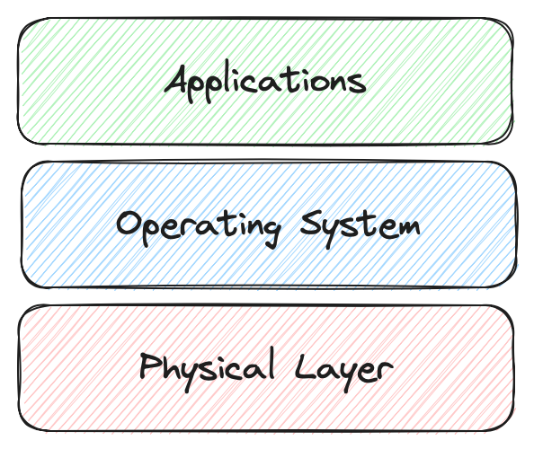
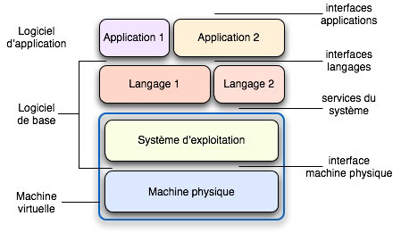
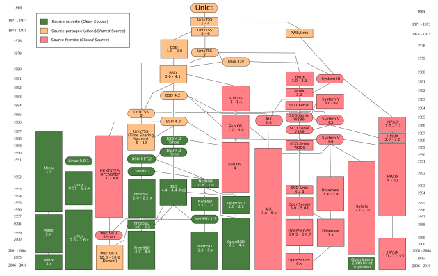
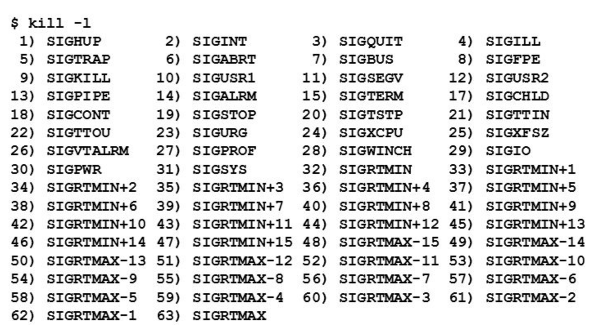
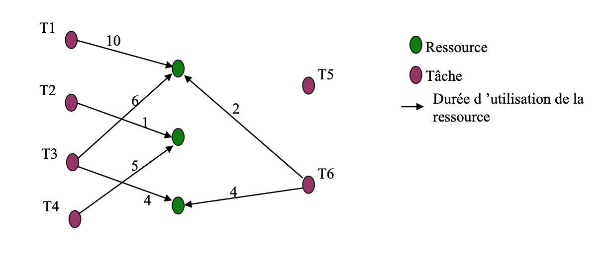

# Programmation Multitâches

Notes de cours par `Thomas Peugnet`.

---

**Références** :

- Threads en C - https://www.geeksforgeeks.org/multithreading-in-c/

- Cours Système d'exploitation - https://iefrei.fr/?course_id=24

# Système d'exploitation

## Introduction

> *Un système d'exploitation est un ensemble de programmes responsables de la liaison entre les ressources matérielles d'un ordinateur et les applictions informatiques de l'utilisateur.*



L'OS (ou SE) est un ensemble de programmes "systèmes" qui interfacent le matériel d'une plateforme et les utilisateurs.

Il permet de construire, au-dessus du matériel une machine virtuelle conviviale qui cache les spécificités matérielles de la plateforme.



L'OS permet d'accéder de façon homogène via une interface de programmation (API) à la couche physique.

## Historique





## POSIX

Les principaux standards POSIX : 

- IEEE 1003.2 - 
- IEEE 1003.1b - 
- IEE 1003.1c - API pour multithreading

## Architecture de base


# Processus

## Rappels

- Un processus est un programme en cours d'exécution.

- Unix est un système d'exploitation multitâches, il peut exécuter plusieurs programmes en parallèles.
- L'exécution d'un processus doit progresser séquentiellement.

**Processus systeme (daemons)** : 

- Assure des services généreux accessibles à tous les utilisateurs du système. 
- Le propriétaire est `root`.

**Processus utilisateur** : 

- Dédié à l'exécution d'une tâche particulière.
- Le propriétaire est l'utilisateur qui l'exécute, 

- Sous le contrôle du terminal à l'origine du lancement.

## Ordonnancement


Il existe différents raccourcis pour changer l'état d'un processus.

## Organisation

Toute exécution d'un programme retourne son PID. Il s'agit de son numéro d'identification. 

Chaque processus appartient à un utilisateur et à un groupe. Tout processus est créé par un autre processus (son père). Le premier processus est `initd`.

- Un processus possède un identificateur qui est un numéro :le `pid`
  -   Il s’agit d’un entier du type `pid_t`
- Un processus possède une priorité et deux modes d'exécution:
  - Mode `utilisateur` (ou esclave) de basse priorité. Le processus ne peut accéder qu'à ses données privées.
  - Mode` noyau` (ou maître) de plus forte priorité. Le processus peut accéder à tout l'espace adressable.
- Quand vous exécutez la commande `ls` vous exécutez le programme` /bin/ls` qui appartient à `root`

> **Note : ** Tout processus est créé par un autre processus. 
> Le nouveau processus créé est alors fils / enfant du processus père.
>
> Le premier processus à être créé dans le système est `init`, est possède le `pid` 1.

## Manipulation

- `ps` permet de lister les processus en cours d'exécution.

- `kill <process_pid>` permet de tuer le processus en cours.

## Constitution

Chaque processus est représenté par un bloc de contrôle, suivant le schéma ci-dessous :


`/proc/self` est un lien symbolique vers le répertoire de `/proc` du processus courant. Sa destination dépend donc du processus lancé.

Le fichier `cmdline` contient la liste d’arguments du processus.

## Utilisateur réel et utilisateur effectif

Il est possible de se faire passer `root` pour effectuer certaines commandes, alors qu'initialement l'utilisateur n'est pas connecté en tant que tel, mais en tant que `user`. L'utilisateur `user` est donc l'utilisateur réel, et `root` l'utilisateur effectif (qui effectue la commande).

- `uid_t getuid()` retourne l'UID **réel** du processus appelant.
- `uid_t geteuid()` retourne l'UID **effectif** du processus appelant.
- `char *getLogin(void)` retourne le nom de l'utilisateur connecté au système depuis un terminal de contrôle.
- `struct passwd *getpwuid(uid_t uid)` permet d’obtenir les caractéristiques de l’utilisateur effectif, retourné sous la forme d'une structure.

## Gestion des processus

### `fork()`

La fonction `pid_t fork()` est l’unique appel système permettant de créer un processus.

Elle possède 3 valeurs de retour à interpréter différement.

- `0` : Le processus fils a été créé, et nous nous trouvons dedans.
- `-1`: Une erreur s'est produite, le processus n'a pas été créé.
- `<int>` : Tout le reste (souvent représenté par un `else {}`). Il s'agit du `pid` du processus parent (celui qui a été à l'origine du processus créé). Si nous entrons dans cette condition, cela implique que nous sommes dans le processus parent.

```c
pid_t son_1 = fork();
ressources_check(son_1); // Check if the son_1's pid is -1
if (son_1 == 0) 
{
    // Inside the child process
    display_pid(); // Son's pid
    display_ppid(); // Parent's pid
}
else 
{
  	// Inside the parent process
}
```

### `wait()`

La fonction `int wait(int *status)` permet d'attendre la fin d'exécution d'un processus.

Elle possède deux valeurs de retour différentes.

- `<int>` :  Identificateur du processus mort.
- `-1` : Si une erreur s'est produite.

**Note : ** Sans effectuer de `wait()`, on augmente le risque de créer des processus **zombie**.

**Processus zombie : ** Tout processus **fils** qui **meurt** et dont le **père**, toujours en vie, **n'est pas au courant**, est appelé processus zombie.

Pour ne pas se retrouver dans cette situation, il est nécessaire d'ajouter un appel à la fonction `wait()` au sein du `else {}` de notre exemple.

```c
pid_t son_1 = fork();
ressources_check(son_1); // Check if the son_1's pid is -1
if (son_1 == 0) 
{
    // Inside the child process
    display_pid(); // Son's pid
    display_ppid(); // Parent's pid
}
else 
{
    // Inside the parent process
    wait(NULL);
}
```

## Exécution programme externe

Il est possible d'exécuter une commande en interne (ex. `ls -l`) à l'aide des fonctions `int exec*();` .

<u>Exemple</u> : `execlp("ls", "l")`.

# Syscalls

Un `Syscall` est un mécanisme permettant de manipuler et de communiquer avec des processus sous Unix. Ils sont représentés par des nombres entiers.

**Note : ** Un signal n'a aucun effet sur un `zombie process`.

Il existe 3 façons de les gérer :

- Il peut être ignoré
- Il peut être pris en compte
- Il possède également un comportement par défaut

**Remarque : ** La liste des signaux existants est disponible avec la commande `kill -l`.



## Traitement des signaux

### `signal()`

```c
void (*signal (int sig, void (*fcn)(int)))(int) // Réception d'un signal
```

**Valeur de retour :**

- Adresse de la fonction spécifiant le comportement du processus vis-à-vis du signal considéré.
- -1 sinon.

### Exemple

```c
#include <stdio.h>
#include <stdlib.h>
#include <unistd.h>

void display_merci();
void display_thanks();
void display_quit();
int main(int argc, char *argv[])
{
    for (;;)
    {
        // wait for SIGUSR1 signal
        signal(SIGUSR1, display_merci);
        // wait for SIGUSR2 signal
        signal(SIGUSR2, display_thanks);
        // wait for ctrl c signal
        signal(SIGINT, display_quit);
    };
}

void display_merci()
{
    printf("MERCI\n");
}

void display_thanks()
{
    printf("THANKS\n");
}

void display_quit()
{
    printf("\nFin du programme\n");
    exit(1);
}
```

Le programme ci-dessus va effectuer une boucle en continu, et attendre qu'un signal lui soit envoyé, `SIGUSR1`, `SIGUSR2` ou `SIGINT`.

**Note** : `SIGINT` est le signal envoyé lorsque l'on fait un `CTRL+C`

## `sigaction()`

La fonction `sigaction` peut être utilisée pour paramétrer l'action à effectuer en réponse à un signal.

```c
sigaction(SIGHUP, &newact, &oldact);
```

- `SIGHUP` correspond au numéro du signal.
- `newact` et `oldact` sont des pointeurs vers des structures de `sigaction` .

## `pause()`

```c
void pause(void);
```

Cette primitive correspond à l'attente d'un signal quelconque.

## `kill()`

```c
int kill(pid_t pid, int sig);
```

Cette primitive permet d'envoyer un signal.

**Valeurs de retour :**

- 0 si le signal est envoyé.
- -1 sinon.

**Note** : En laissant `sig` à 0, aucun signal n'est envoyé, mais cela permet de vérifier si le processus auquel on souhaitait envoyer quelque chose existe bel et bien.

### `pid = 0`

Par ailleurs, en mettant le `pid` à 0, le signal est envoyé à tous les processus du même groupe que l'émetteur. Souvent utilisée pour tuer tous les processus en arrière plan sans avoir besoin d'indiquer leur `pid` un à un.

### `pid = -1`

En indiquant un `pid` à `- 1`, si le processus appartient au `root`, le signal est envoyé à tous les processus, excepté à celui qui envoie le signal et aux processus système.

### `pid < -1`

Si le `pid` est inférieur à -1, sa valeur absolue est récupérée. Ainsi, `pid = -2339` est équivalent à `pid = 2339`.

# Arduino


 # Ordonnancement

### Exemple


$$
B_1 = MAX(2,6) + 0 = 6\\
B_2 = MsX(5) + MAX(2,6) = 11\\
B_3 = MAX(2) + MAX(4) + MAX(5) = 11
$$
Avec $B_i = $ blocage direct + blocage par héritage
