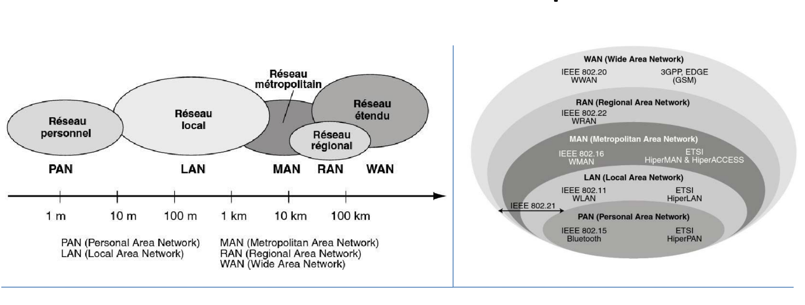
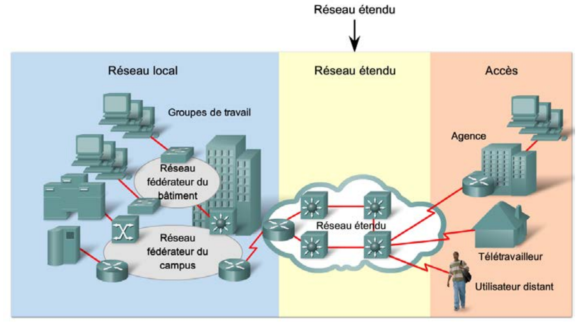
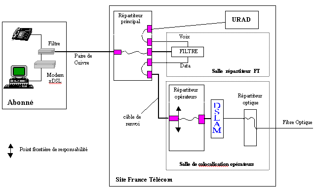
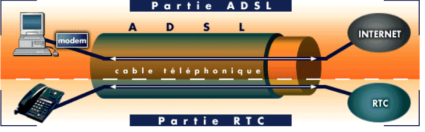
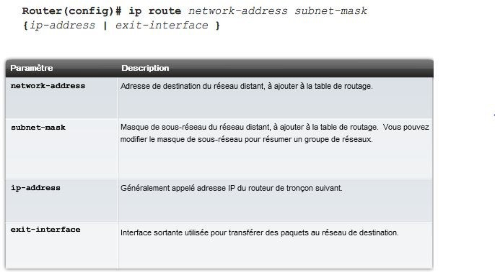
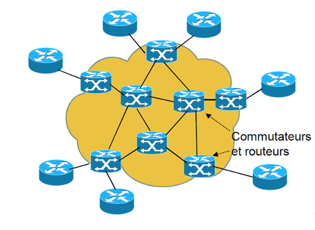
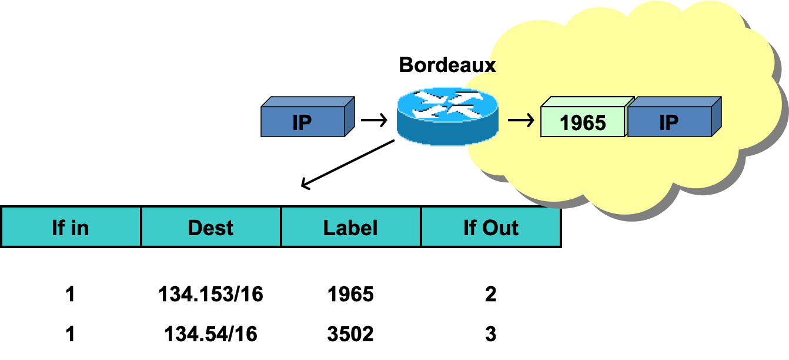
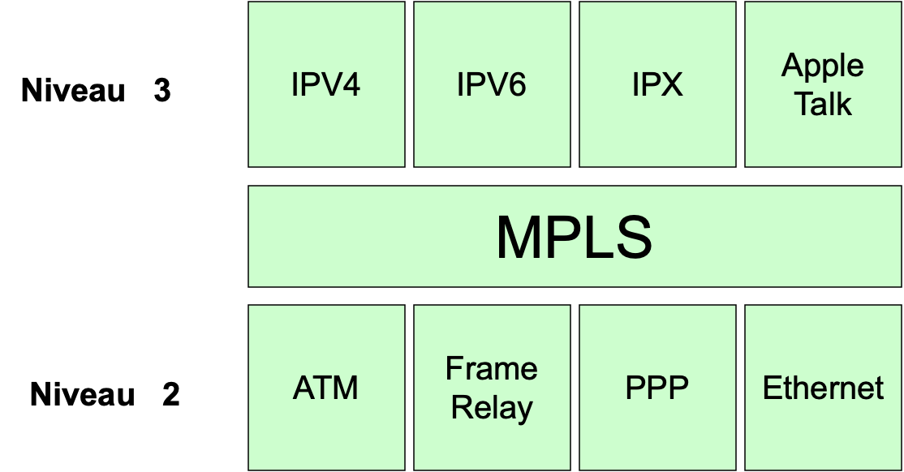

# Réseaux Convergents

# Introduction

## Définition

Un réseau covergent permet de faire coexister différents types de trafic sur un même réseau IP […].

- **Intégration des services** : Transition de différents types de trafic (voix, vidé, data..)
- **Utilisation efficace des ressources** : Réduction des coût par optimisation.
- **Qualité de service** : Avec l'utilisation d'un ensemble de capteur, permettant de capturer des traces d'erreurs etc.

### Réseaux informatiques

### Réseaux étendus

**Définition : ** Un réseau étendu est un réseau de communication de données qui fonctionne au-delà de la portée géographique d’un réseau local.	

###    WAN

 

## Avantages et inconvénients

### xDSL

#### Client ADSL

- La machine que l'abonné connecte à l'internet. Peu importent la plate forme matérielle et le système

d'exploitation, pourvu que ce dernier supporte le réseau TCP/IP.

#### Modem

- Modulateur/Démodulateur. Une boîte dont la fonction est assez similaire à celle du modem RTC, à part

qu'ici, elle est conçue pour la technologie DSL.

#### DSLAM

- Digital Subscriber Line Access Multiplexer. C'est une sorte d'entonnoir ou de gouttière, qui ramasse les flux

numériques de chaque abonné et les fait converger par multiplexage sur un seul lien à fort débit.

#### BAS

- Broadband Access Server

- Lorsque l'on a réussi une connexion avec son FAI, on a établi un lien PPP (Point to Point Protocol) entre son ordinateur et le BAS. Ce lien PPP va transporter les protocoles supérieurs IP, TCP, UDP, ICMP...

C'est au niveau du BAS que l'authentification du client va se faire et que les paramètres IP vont être transmis (serveur RADIUS, généralement).

#### Routeur

- C'est l'équipement qui va assurer la liaison entre le BAS et le réseau du fournisseur d'accès.

- Le lien n°4 relie le BAS à ce routeur et les données circulent dans un tunnel de type L2TP (Layer 2 Tunnel Protocol). Il s'agit de construire un VPN (Virtual Private Network : réseau privé virtuel) entre le BAS et le réseau du fournisseur d'accès.

# Cheat Sheet Cisco

## Configuration statique

On possède l'infrastructure suivante :

Les subnets à créer sont les suivants :

Le subnet 0 n'est pas utilisé, le subnet 1 est pour les HeadQuarters, le subnet 2 est pour le WAN HeadQuarter - Agence et le subnet 3 est pour l'agance. L'utilisation d'un /26 nous donnant donc la possibilité d'utiliser 62 hôtes hors Broadcast et Network Address.

# Routage

Utilisation d'un routeur contre un switch permet de router les paquets d'un réseau à un autre en fonction d'une adresse IP. A chaque interface réseau d'un routeur est assignée une adresse IP.

Le protocole de routage utilisé va faire varier comment sera choisi le prochain routeur.

Le prochain routeur est choisi en fonction d'une table de routage, qui contient les prochains HOP à faire pour atteindre un autre réseau.

La table de routage contient les adresse réseaux de destination, les adresses des passerelles et l'interface de sortie.

Lorsqu'un chemin n'est pas dans la table de routage de façon explicite, on utilise la passerelle par défaut.

- **Routage statique**

Les tables de routage sont mises à jour manuellement à chaque modification de la structure du réseau.

- **Routage dynamique**

Les tables de routage sont mises à jour automatiquement selon le protocole chois (RIP, OSPF, etc.). A cet instant, le meilleur chemin est déterminé par un algorithme :

- RIP - Bellman
- OSPF - Dijkstra

Le `Distance Vector` transmet les tables de routage reçues de ses voisins à ses voisins immédiats et fusionne la sienne avec celles reçues.

Le `Link State` transmet les tables de routage à ses voisins immédias et retransmet les informations reçues des ses voisins à ses autres voisins. Puis, calcule sa table de routage.

---

Distance administrative définit la préférence d'une source de routage. Pour chaque route une valeur de 0 à 255 est attribuée. Plus la valeur est faible, plus la rotue est privilégiée.

## OSPF - Open Shortest Path First

RFC 1247 - 1583

L'algotihme est dynamique, s'adapte aux changements de topoligie du réseau. Le routage est accepté par type de service (traitemment du champ service du datagramme IP).

Un état de liens dans OSPF est une description de l’interface d’un routeur avec les éléments suivants :

- Son adresse IP

- Son masque

- Le type de réseau

- Son voisin (un routeur)

- L’ensemble des liens OSPF est enregistré dans une base de données appelée link-state database, qui est identique sur tous les routeurs d’une même aire.

Le routage fonctionne avec la création d'areas étant un ensemble de réseaux contigues. Chaque ensemble de réseaux ne connaît que sa propre zone.

Cet aspect permet de ne pas avoir besoin de reconstruire toutes les tables à chaque changement dans une zone. Intéressant également sur le point de vue des performances CPU/RAM.

## MPLS - Multi Protocol Label Switching

Les intérêts de cette technologie est que le routage se fait à l'entrée du réseau, et que le coeur de réseau est plus rapide.

Le réseau "interne" est composé de commutateurs et de routeurs, et l'intelligence du routage se fait à l'extérieur. L'extérieur, ce sont les labels (?).

Fait intervenir la QoS dans le routage, simplifie le fonctionnement par l'absence de superposition et de cumul des technologies.

### Fonctionnement

LSP (Label Switch Path), les chemis prédéfinis relient les extrémités du réseau. Un LSP est unidirectionnel. Les équipements MPLS sont nommés LSR pour Label Switch Router.

1. À l'entrée du réseau, le premier LSR insère un label devant le paquet IP. 
   
2. Le paquet est ensuite redirigé en fonction du label.
   

3. Le LSR de sortie retire le label.
   
4. Le paquet est ensuite routé selon le fonctionnement IP traditionnel.

- **MPLS** Multiple Protocol Label Switching;

- **iLER** ingress Label Edge Router (routeur d’entrée)

- **eLER** egress Label Edge Router 

Il est également possible d'empiler les lables pour permettre un traffic tunneled au travers de plusieurs réseaux.

Le **LSP** est l'ensemble des équipements touchés entre les deux E-LSR.

Le MPLS permet la simplification du coeur de réseau, l'utilisation de plusieurs services et protocoles différents et est indépendant du protocole utilisé dans la couche 2.

Un label peut signifier plusieurs choses, un chemin, une source, une destination, une application ou un QoS.

# Fiches

## IPv6

### Introduction à l'IPv6
- **Besoin de transition** : L'épuisement des adresses IPv4 a mené à l'élaboration de l'IPv6. Par exemple, avec l'expansion d'objets connectés, l'IPv4 ne pouvait plus répondre aux besoins croissants d'adressage.
- **Objectif** : Offrir un espace d'adressage plus large et répondre à la croissance des connexions Internet.
- **Caractéristiques clés** : Extension de la taille des adresses à **128 bit**s, adoption d'une architecture plus efficace pour la gestion des réseaux. 

### Adressage IPv6
- **Format d'adresse** : Composé de **8 groupe**s hexadécimaux séparés par des deux-points.Une adresse IPv6 typique : 2001:0db8:85a3:0000:0000:8a2e:0370:7334.
- **Types d'adresses** : Unicast, multicast, anycast. Par exemple, une adresse unicast est attribuée à un seul destinataire, tandis qu'une adresse multicast est destinée à un groupe de récepteurs.
- **Notation simplifiée** : Utilisation de "::" pour compresser les **zéros consécutifs**. Par exemple, 2001:0db8::1 représente la même adresse que 2001:0db8:0000:0000:0000:0000:0000:0001.

### Format d’une trame IPv6
- **En-tête de 40 octets** : Contient des champs tels que le type de protocole, la durée de vie du paquet et les adresses source/destination. Par exemple, l'en-tête IPv6 comprend des informations vitales pour le routage des paquets.
- **Flexibilité accrue** : Support de la fragmentation côté destinataire, QoS intégrée. Par exemple, l'en-tête de l'IPv6 permet une meilleure qualité de service en spécifiant des priorités pour les paquets.

####  Fragmentation dans IPv6

La fragmentation dans IPv6 survient lorsque :

- **Taille du paquet dépasse la MTU** : Si la taille d'un paquet IPv6 est supérieure à la MTU d'un lien réseau, il est fragmenté.
- **Réduction en fragments** : Le paquet est divisé en fragments plus petits pour s'adapter à la taille de la MTU du lien.
- **En-têtes spécifiques** : Chaque fragment conserve l'en-tête IPv6 d'origine et inclut un nouvel en-tête appelé "**Fragment Header**".
- **Assemblage à la destination** : Les fragments sont reçus par la destination qui les réassemble pour reconstruire le paquet initial.

La fragmentation IPv6 est moins préférable car :

- **Charge supplémentaire** : Elle peut augmenter la charge de traitement des routeurs et des équipements finaux.
- **Risques de sécurité** : La fragmentation peut être exploitée pour des attaques, telles que les attaques de fragmentation malicieuse.

L'objectif dans IPv6 est d'éviter la fragmentation autant que possible pour optimiser les performances et la sécurité du réseau.

### Services offerts par IPv6
- **Auto-configuration des adresses** : Simplification de l'attribution automatique des adresses aux périphériques. Par exemple, l'IPv6 propose **SLAAC** (Stateless Address Autoconfiguration) pour permettre aux appareils de configurer automatiquement leurs adresses.
- **Support natif d'IPsec** : Amélioration de la sécurité des communications. Par exemple, l'IPsec est intégré dans IPv6 pour crypter et authentifier les données échangées.

### Mobilité dans IPv6
- **Maintien de la connectivité** : Permet aux appareils de rester connectés tout en se déplaçant entre différents réseaux. Par exemple, Mobile IPv6 (MIPv6) assure la continuité de la communication d'un appareil lorsqu'il se déplace entre différents réseaux.

### Sécurité dans IPv6
- **IPsec intégré** : Authentification et cryptage des paquets pour une sécurité renforcée. Par exemple, l'utilisation d'IPsec dans IPv6 assure la confidentialité et l'intégrité des données transitant sur le réseau.

#### Support natif d'IPsec dans IPv6

- **Qu'est-ce qu'IPsec ?**
  - IPsec (Internet Protocol Security) est un ensemble de protocoles et d'algorithmes de sécurité utilisés pour sécuriser les communications sur un réseau IP.
  - Il offre des services de **confidentialité, d'intégrité, d'authentification** et de **protection contre les attaques**.
- **Fonctionnement d'IPsec :**
  - **Cryptage des données** : IPsec chiffre les données pour assurer leur confidentialité pendant la transmission.
  - **Authentification des paquets** : Il permet de vérifier l'authenticité des paquets pour garantir qu'ils proviennent de sources légitimes.
  - **Intégrité des données** : IPsec s'assure que les données n'ont pas été altérées pendant leur transfert.
- **Utilisation dans IPv6 :**
  - Dans IPv6, IPsec est intégré nativement, ce qui signifie que le support d'IPsec est une fonctionnalité de base du protocole IPv6.
  - L'intégration native d'IPsec dans IPv6 facilite la sécurisation des communications réseau sans nécessiter d'extensions supplémentaires.
- **Avantages d'IPsec dans IPv6 :**
  - **Sécurité renforcée** : L'intégration native simplifie l'application de mesures de sécurité pour protéger les données en transit.
  - **Protection des communications** : IPsec dans IPv6 assure la confidentialité et l'intégrité des données, renforçant ainsi la sécurité des communications sur Internet.

- **Contrôle d'accès** : Mécanismes de filtrage et de contrôle des paquets intégrés. Par exemple, les règles de pare-feu IPv6 permettent de contrôler le flux de données et de limiter les accès non autorisés.

### Intégration d'IPv6
- **Interopérabilité** : Coexistence d'IPv6 et IPv4 grâce à des mécanismes de transition tels que Dual Stack, Tunneling, NAT64. Par exemple, Dual Stack permet à un périphérique de supporter à la fois IPv4 et IPv6.
