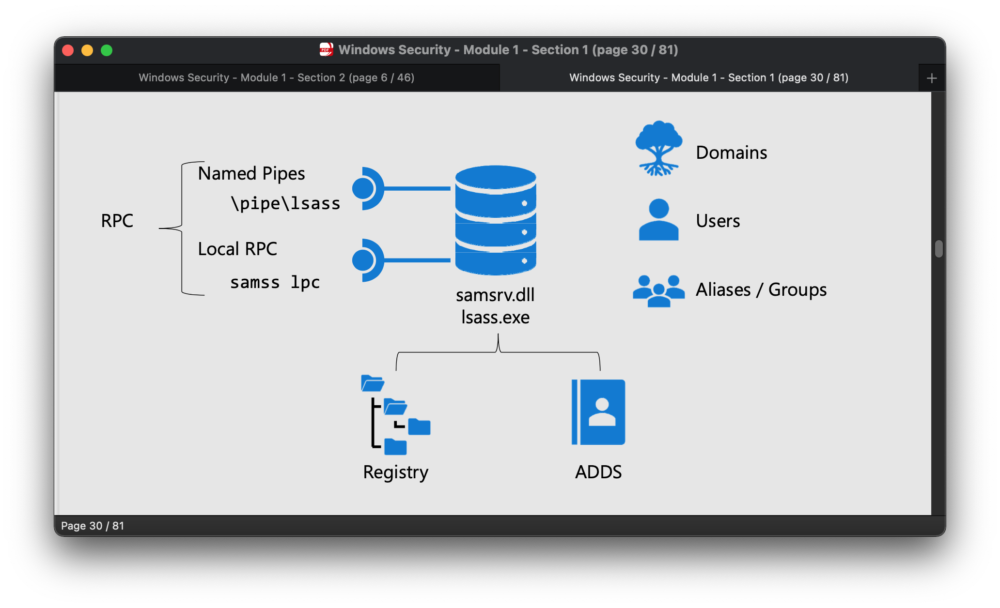
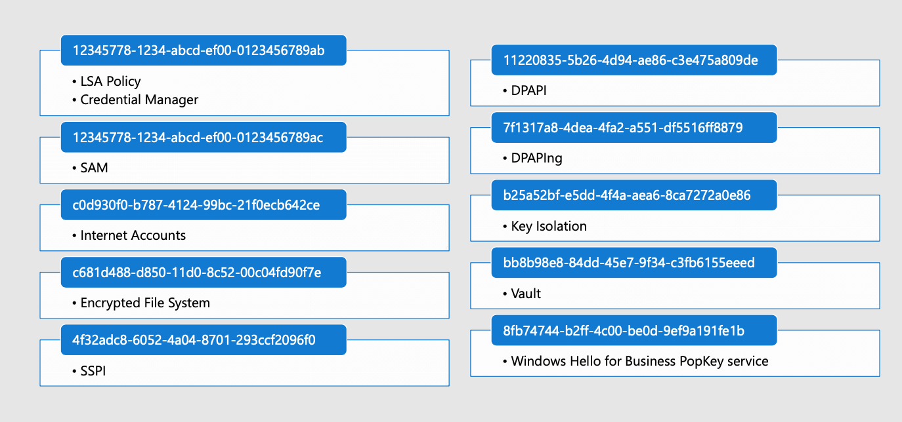
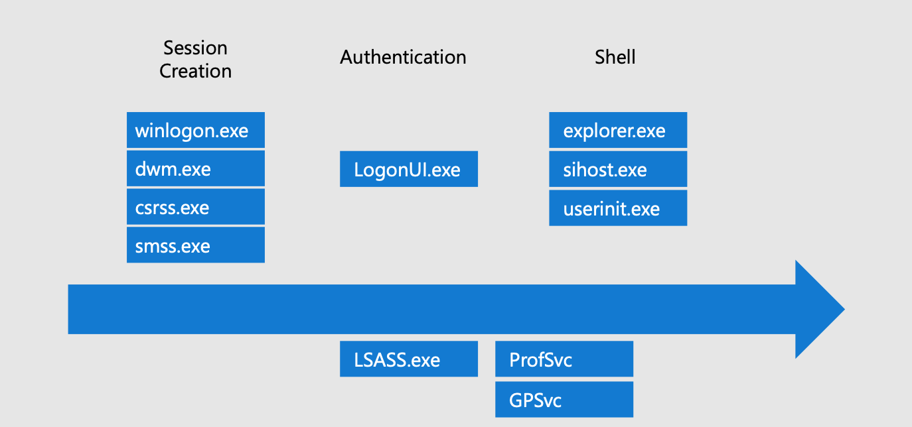
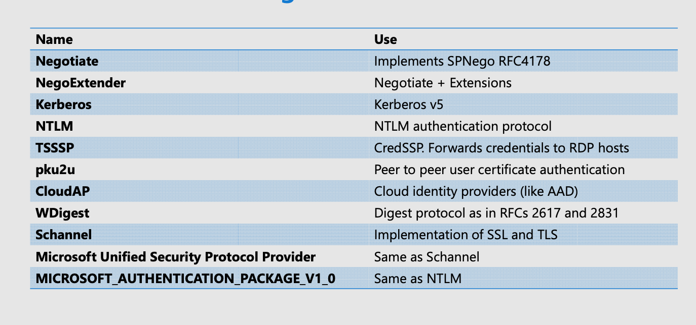
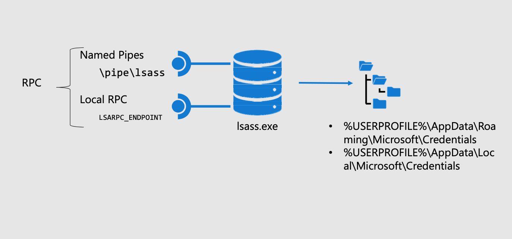
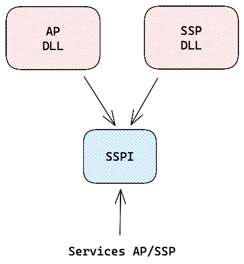
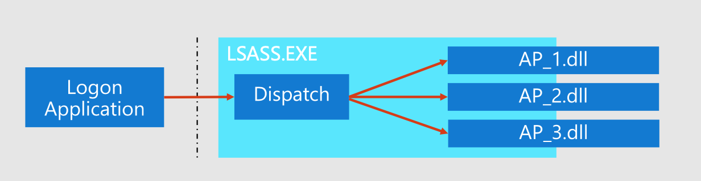
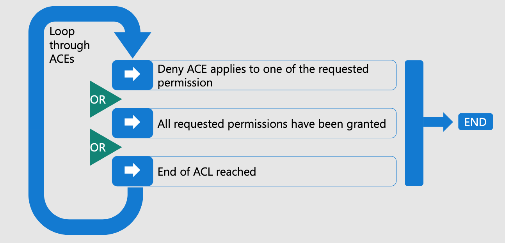
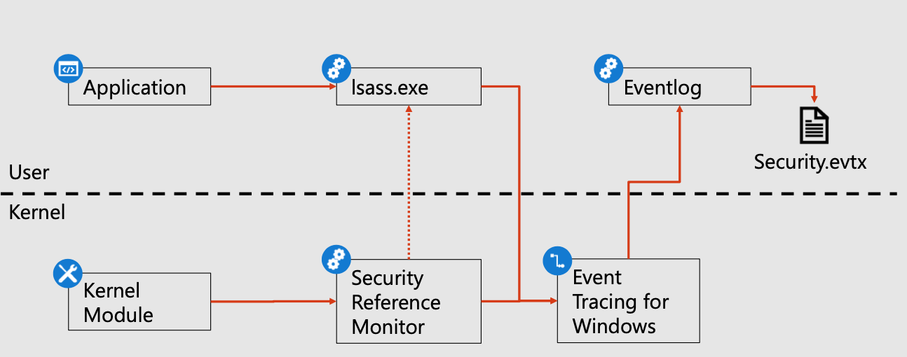

# Administration et sécurité Windows

# SIDs

> *Un SID (Security Identifier) en informatique, notamment dans les environnements Windows, est un identifiant unique utilisé pour gérer les permissions de sécurité. Chaque compte d'utilisateur, groupe d'utilisateurs, et même certains processus ou composants dans le système d'exploitation Windows, se voient attribuer un SID qui les identifie de manière unique. - ChatGPT*

| Well-known SID | Description                       |
| -------------- | --------------------------------- |
| `S-1-5-18`     | Local System Account              |
| `S-1-5-19`     | Local Service Account             |
| `S-1-5-20`     | Network Service Account           |
| `S-1-5-32-544` | Administrators Group              |
| `S-1-5-32-545` | Users Group                       |
| `S-1-5-32-546` | Guests Group                      |
| `S-1-5-32-547` | Power Users Group                 |
| `S-1-5-32-548` | Account Operators Group           |
| `S-1-5-32-549` | Server Operators Group            |
| `S-1-5-32-550` | Print Operators Group             |
| `S-1-5-32-551` | Backup Operators Group            |
| `S-1-5-32-552` | Replicators Group                 |
| `S-1-5-11`     | Authenticated Users Special Group |
| `S-1-5-15`     | This Organization Special Group   |

## Access Token

Représente l'identité d'un utilisateur.

Contient : 

- User SID
- Group SIDs
- Privilèges
- Impersonation Level

`whoami /all` : Donne toutes les informations contenues dans le Access Token, dont les privilèges, pour un utilisateur donné (celui logged in).

# SAM

> *SAM Access Control est un aspect fondamental de la sécurité et de la gestion des comptes d'utilisateurs dans Windows. Il assure que les informations d'utilisateur sont stockées, gérées et accédées de manière sécurisée, tout en fournissant les mécanismes nécessaires pour l'authentification et la gestion des comptes. - ChatGPT*

La base SAM est représentée par le fichier `"**%SystemRoot%\system32\config\SAM**"` (généralement dans `"C:\Windows\"`) qui est en fait un fichier associé à la base de [Registre Windows](https://www.it-connect.fr/quest-ce-que-la-base-de-registre-windows/) : `HKEY_LOCAL_MACHINE\SAM\`.

# LSA

On peut accéder à ces services via RPC (Remote Procedure Call).

### **RPC (Remote Procedure Call)**

- **Communication inter-processus** : Permet à un programme d'exécuter des fonctions dans un autre programme, souvent sur un autre ordinateur.
- **Abstraction réseau** : Masque la complexité de la communication réseau.
- **Protocoles divers** : Implémentations comme DCOM, Java RMI, XML-RPC.
- **Sécurité** : Authentification, chiffrement, gestion des autorisations.
- **Systèmes distribués** : Utilisé dans architectures distribuées, cloud, services web.
- **Défis** : Gestion des erreurs réseau, latence, sérialisation/désérialisation.

### **LSA (Local Security Authority)**

- **Authentification** : Vérifie les identifiants des utilisateurs.
- **Jetons d'accès** : Crée des jetons après authentification réussie.
- **Politiques de sécurité** : Gère les stratégies de mot de passe, droits utilisateurs.
- **SAM et Active Directory** : Interagit pour informations d'identification.

#### **LSASS (Local Security Authority Subsystem Service)**

- **Processus** : Exécute les fonctions de LSA.
- **Sécurité système** : Gère les politiques de sécurité, les comptes, les mots de passe.
- **Protection** : Fonctionne avec des privilèges élevés pour la sécurité.
- **Cible des attaques** : Souvent visé par des malwares pour accéder aux données de sécurité.

## Exemples de RPC

## Exemple de Winlogon

Authentification de l'utilisateur, vérification des credentials, démarrage de userinit.exe…

# Authentification

Session:

- Session, Kernel (partitionnement système entre utilisateurs)
- Logon Session (LSASS)
  - Utilisateur authentifié sur la machine (LUID, Localy-…)

## Authentifications Packages (DLLs)

## Credentials Manager

Permet l'enregistrement de mots de passe.

**Note**: Possible de faire 2 types de call pour accéder à ces données, Local RPC ou Named Pipes.

# SSPI (Security Support Provider Interface)

> ***SSPI (Security Support Provider Interface)** est une interface de programmation dans les systèmes Windows qui offre des services de sécurité tels que l'authentification, l'autorisation, et la gestion des échanges de clés cryptographiques. - ChatGPT*

- **Interface** : Fournit une interface pour la sécurité au niveau du système.
- **Authentification** : Gère l'authentification, l'autorisation, et l'échange de clés cryptographiques.
- **Abstraction** : Cache les détails spécifiques des protocoles de sécurité.
- **Protocoles supportés** : Inclut Kerberos, NTLM, Schannel (SSL/TLS), Digest.
- **Extensible** : Peut intégrer de nouveaux protocoles de sécurité.
- **Utilisation** : Employé par divers services Windows et applications pour sécuriser les communications.
- **Interactions avec LSASS** : SSPI communique avec LSASS pour l'accès aux fonctions de sécurité.

## Structure des call dispatch

## Fonctionnement de SSPI

# UAC (User Account Control)

> ***UAC (User Account Control)** est une fonctionnalité de sécurité dans les systèmes d'exploitation Windows qui aide à prévenir les modifications non autorisées sur le système. Elle vise à améliorer la sécurité en demandant une autorisation ou des informations d'identification d'administrateur avant de lancer des tâches pouvant affecter le fonctionnement du système ou modifier des paramètres sensibles. - ChatGPT*

- **Contrôle des Modifications Système** : Prévient les changements non autorisés sur le système.
- **Demande d'Élévation de Privileges** : Demande une autorisation pour les tâches nécessitant des droits d'administrateur.
- **Sécurité Renforcée** : Réduit le risque d'infections par des logiciels malveillants et d'actions non autorisées.
- **Modes de Notification** : Plusieurs niveaux de notifications selon les paramètres de l'utilisateur.
- **Utilisateur Standard vs Administrateur** : Fait la distinction entre les droits des utilisateurs standards et ceux des administrateurs.
- **Compatibilité avec les Applications** : Peut nécessiter des ajustements pour les anciennes applications non conçues pour UAC.
- **Gestion Centralisée** : Peut être configuré via des politiques de groupe dans un environnement d'entreprise.

## Liste des Filtered Groups

| Groupe d'Utilisateurs                                        | Description                                                  |
| ------------------------------------------------------------ | ------------------------------------------------------------ |
| **Domain Admins**                                            | Administrateurs du domaine avec privilèges complets, restreints sous UAC. |
| **Read-only Domain Controllers**                             | Contrôleurs de domaine en lecture seule, avec des droits limités. |
| **Enterprise Read-only Domain Controllers**                  | Contrôleurs de domaine d'entreprise en lecture seule, avec des droits spécifiques. |
| **Administrators**                                           | Groupe d'administrateurs avec privilèges élevés, limités sous UAC. |
| **Power Users**                                              | Utilisateurs avec certains privilèges administratifs, réduits sous UAC. |
| **Account Operators**                                        | Gère les comptes utilisateurs, avec des privilèges limités sous UAC. |
| **Server Operators**                                         | Opérateurs de serveur avec des droits limités en présence d'UAC. |
| **Print Operators**                                          | Opérateurs d'impression avec des droits restreints sous UAC. |
| **Backup Operators**                                         | Opérateurs de sauvegarde avec des privilèges spéciaux, filtrés par UAC. |
| **Pre-Windows 2000 Compatible Access**                       | Accès compatible avec les versions antérieures à Windows 2000, limité par UAC. |
| **Cert Publishers**                                          | Éditeurs de certificats, avec des droits spécifiques sous UAC. |
| **Schema Admins**                                            | Administrateurs de schéma avec des privilèges élevés, restreints par UAC. |
| **Enterprise Admins**                                        | Administrateurs d'entreprise avec droits complets, filtrés sous UAC. |
| **Group Policy Creator Owners**                              | Propriétaires créateurs de stratégies de groupe, avec des privilèges spéciaux sous UAC. |
| **RAS and IAS Servers Access**                               | Accès limité sous UAC pour les serveurs RAS et IAS.          |
| **Network Configuration Operators**                          | Opérateurs de configuration réseau, avec droits limités sous UAC. |
| **Cryptographic Operators**                                  | Opérateurs cryptographiques avec des privilèges restreints sous UAC. |
| **NT AUTHORITY\Local account and member of Administrators group** | Comptes locaux membres du groupe Administrateurs, avec droits d'administrateur filtrés sous UAC. |

# Summary

- **Windows Identity** : SID et Access Token
- **SAM**: Account database
- **LSASS** : Hôte pour les services d'authentifications
- **SSPI** : API d'authentification de Windows
- **UAC**: Protection des comptes privilégiés

# Service Account

## GSMA (Group Managed Service Account)

> ***GMSA (Group Managed Service Account)** est une fonctionnalité dans les environnements **Windows Server**, conçue pour offrir une gestion automatisée et sécurisée des comptes de service. - ChatGPT*

- **Gestion Automatisée des Mots de Passe** : GMSA permet la gestion automatique des mots de passe, éliminant le besoin de les changer manuellement.
- **Sécurité Renforcée** : Améliore la sécurité des applications et des services en évitant la gestion manuelle des mots de passe.
- **Utilisation sur Plusieurs Serveurs** : Contrairement aux MSA (Managed Service Accounts), les GMSA peuvent être utilisés sur plusieurs serveurs.
- **Support d'Applications et Services** : Idéal pour les services Windows, IIS, SQL Server et d'autres applications qui nécessitent des comptes de service.
- **Active Directory** : Nécessite Active Directory pour stocker et gérer les comptes GMSA.
- **Automatisation avec PowerShell** : Géré principalement via PowerShell pour l'automatisation et la configuration.
- **Restrictions et Délégation** : Permet de définir des restrictions et des délégations spécifiques pour les comptes de service.

### gSMA Operations

> *Les opérations avec `Group Managed Service Accounts` (`gMSA`) dans Windows Server sont conçues pour simplifier la gestion des comptes de service, en particulier pour les mots de passe automatiquement gérés et synchronisés. - ChatGPT*

**Fonctionnement:**

1. **Création de `gMSA`** : Les administrateurs créent un `gMSA` dans Active Directory. Ils spécifient les systèmes où le `gMSA` peut être utilisé.

2. **Automatisation des Mots de Passe** : `gMSA` gère automatiquement les changements de mot de passe, éliminant le besoin pour les administrateurs de les mettre à jour manuellement.

3. **Utilisation sur Plusieurs Serveurs** : Contrairement à un `Managed Service Account` (`MSA`), un `gMSA` peut être utilisé sur plusieurs serveurs, ce qui est idéal pour des services équilibrés sur plusieurs machines.

4. **Sécurité Renforcée** : Les mots de passe `gMSA` sont complexes et régulièrement renouvelés, améliorant ainsi la sécurité.

5. **Configuration des Services** : Les services ou applications sur les serveurs sont configurés pour utiliser le `gMSA` pour l'authentification. Cela inclut des services comme IIS, SQL Server ou des tâches planifiées.

6. **Accès aux Ressources** : Les services utilisant `gMSA` peuvent accéder aux ressources du réseau de manière sécurisée sans nécessiter une intervention pour la gestion des mots de passe.

7. **Dépendance Active Directory** : `gMSA` nécessite une infrastructure Active Directory et est principalement géré via PowerShell.

8. **Restrictions et Politiques** : Les administrateurs peuvent définir des politiques de sécurité et des restrictions spécifiques pour les `gMSA` dans Active Directory.

# Windows Privileges

> *Les privilèges de type session dans Windows sont des autorisations spécifiques accordées à un utilisateur ou à un processus pour une session donnée. Ces privilèges déterminent les actions que l'utilisateur ou le processus peut effectuer pendant la durée de la session. - ChatGPT* 

- **Attribution Dynamique** : Les privilèges de type session sont attribués dynamiquement lorsqu'une session utilisateur est créée. Ils varient en fonction du niveau d'accès de l'utilisateur ou du rôle du processus.

- **Gestion de la Sécurité** : Ces privilèges sont essentiels pour la gestion de la sécurité au niveau des sessions, limitant ou étendant les capacités des utilisateurs ou des processus en fonction de leurs besoins et de leur niveau de confiance.

- **Exemples de Privilèges** : Parmi les privilèges de type session, on trouve le droit de déboguer des programmes (`SeDebugPrivilege`), de charger ou de décharger des pilotes de périphériques (`SeLoadDriverPrivilege`), et de gérer l'audit et les journaux de sécurité (`SeSecurityPrivilege`).

- **Contrôle d'Accès** : Les privilèges de session jouent un rôle crucial dans le contrôle d'accès, en s'assurant que seules les actions autorisées peuvent être effectuées par un utilisateur ou un processus donné pendant une session.

- **Importance pour la Sécurité** : La gestion correcte de ces privilèges est vitale pour maintenir la sécurité du système, en prévenant les abus de droits et en limitant les risques d'actions malveillantes.

*En résumé, les privilèges de type session sont une partie intégrante du modèle de sécurité de Windows, permettant une gestion flexible et sécurisée des autorisations au niveau des sessions individuelles.*, 

## Tableaux détaillés

| Type de Privilège de Session        | Description                                                  |
| ----------------------------------- | ------------------------------------------------------------ |
| **SeCreateTokenPrivilege**          | Permet à un processus de créer un jeton d'accès.             |
| **SeAssignPrimaryTokenPrivilege**   | Permet à un processus de modifier le jeton d'accès d'un processus. |
| **SeLockMemoryPrivilege**           | Autorise le verrouillage des pages en mémoire.               |
| **SeIncreaseQuotaPrivilege**        | Permet d'augmenter les quotas de mémoire pour un processus.  |
| **SeMachineAccountPrivilege**       | Autorise la création d'un compte machine dans le domaine.    |
| **SeTcbPrivilege**                  | Permet de se comporter comme une partie du système d'exploitation. |
| **SeSecurityPrivilege**             | Autorise la modification des paramètres de sécurité et des journaux d'audit. |
| **SeTakeOwnershipPrivilege**        | Permet de prendre possession d'un objet sans autorisation.   |
| **SeLoadDriverPrivilege**           | Autorise le chargement ou le déchargement des pilotes de périphériques. |
| **SeSystemProfilePrivilege**        | Permet de profiler les performances du système.              |
| **SeSystemtimePrivilege**           | Autorise la modification de l'heure du système.              |
| **SeProfileSingleProcessPrivilege** | Permet de profiler les performances d'un processus unique.   |
| **SeIncreaseBasePriorityPrivilege** | Permet d'augmenter la priorité d'exécution d'un processus.   |
| **SeCreatePagefilePrivilege**       | Autorise la création d'un fichier d'échange.                 |
| **SeCreatePermanentPrivilege**      | Permet de créer des objets permanents dans le noyau.         |
| **SeBackupPrivilege**               | Autorise la sauvegarde de fichiers et de dossiers.           |
| **SeRestorePrivilege**              | Permet de restaurer des fichiers et des dossiers.            |
| **SeShutdownPrivilege**             | Autorise l'arrêt et le redémarrage du système.               |
| **SeDebugPrivilege**                | Permet d'accéder à des informations sensibles dans d'autres processus. |
| **SeAuditPrivilege**                | Autorise l'activation des journaux d'audit.                  |
| **SeSystemEnvironmentPrivilege**    | Permet de modifier les variables d'environnement du système. |
| **SeChangeNotifyPrivilege**         | Autorise la réception de notifications de modification de fichiers ou de dossiers. |
| **SeRemoteShutdownPrivilege**       | Autorise l'arrêt à distance d'un ordinateur.                 |
| **SeUndockPrivilege**               | Permet de détacher un ordinateur portable de sa station d'accueil. |
| **SeSyncAgentPrivilege**            | Permet d'effectuer des synchronisations de fichiers en tant qu'agent. |
| **SeEnableDelegationPrivilege**     | Permet d'activer la délégation de sécurité.                  |

# Privileges Management

> *La gestion des privilèges, ou `Privileges Management`, dans les systèmes informatiques, est un aspect crucial de la sécurité et de l'administration système. Elle implique l'attribution, la gestion et le contrôle des privilèges (droits) accordés aux utilisateurs, aux comptes de service et aux processus. - ChatGPT*

1. **Contrôle d'Accès** : La gestion des privilèges est essentielle pour contrôler l'accès aux ressources et fonctions du système. Elle détermine qui peut effectuer quelles actions et sur quels objets.

2. **Prévention des Abus** : En limitant les privilèges au strict nécessaire, on réduit le risque d'abus ou d'exploitation malveillante des droits étendus.

3. **Principe du Moindre Privilège** : Il s'agit d'une pratique de sécurité consistant à accorder aux utilisateurs uniquement les privilèges nécessaires pour effectuer leurs tâches, réduisant ainsi la surface d'attaque potentielle.

4. **Gestion des Comptes Utilisateur** : Implique de définir des rôles et des responsabilités, et d'associer les privilèges appropriés à ces rôles.

5. **Audit et Suivi** : La surveillance et l'audit des privilèges permettent de détecter les anomalies de sécurité et de conformité, en enregistrant qui a fait quoi, quand et où.

6. **Outils de Gestion des Privilèges** : Des logiciels spécialisés aident à gérer les privilèges, offrant des fonctionnalités comme la gestion automatisée des privilèges, l'analyse des droits et la délégation de droits.

7. **Mises à Jour et Révisions** : Les privilèges doivent être régulièrement revus et ajustés en fonction des changements de rôle, des départs d'employés ou de l'évolution des politiques de sécurité.

8. **Intégration avec la Gestion des Identités** : La gestion des privilèges est souvent intégrée à des solutions plus larges de gestion des identités et des accès (IAM) pour une administration cohérente des droits d'utilisateur.

# Local Security Database

> *La `Local Security Database` dans les systèmes Windows est un composant essentiel qui stocke les informations de sécurité locales pour un ordinateur. - ChatGPT*

1. **Stockage d'Informations de Sécurité** : Contient des données telles que les comptes d'utilisateurs, les groupes, les politiques de sécurité et les mots de passe.

2. **Gérée par SAM (`Security Account Manager`)** : La base de données est gérée par le SAM, qui contrôle l'accès et la gestion des comptes utilisateurs et des groupes.

3. **Utilisée pour l'Authentification Locale** : Permet l'authentification des utilisateurs sur l'ordinateur local sans nécessiter de connexion à un serveur Active Directory.

4. **Politiques de Sécurité** : Inclut des politiques telles que les exigences de mot de passe, les droits de connexion et les paramètres d'audit.

5. **Gestion des Comptes** : Permet aux administrateurs de créer, modifier et supprimer des comptes locaux et des groupes.

6. **Indépendante de l'Active Directory** : Fonctionne indépendamment d'Active Directory, importante pour les systèmes qui ne sont pas membres d'un domaine.

7. **Outil de Gestion** : Accessible via des outils comme l'`Local Users and Groups` du `Computer Management` ou via des commandes PowerShell.

8. **Sécurité** : Essentielle pour la sécurité de l'ordinateur, notamment en termes de gestion des accès et des droits des utilisateurs.

​	Des modèles peuvent être créés dans des `fichiers.inf`.

# Security Compliance Tookkit

> *Le `Security Compliance Toolkit` (SCT) est un ensemble d'outils fourni par Microsoft pour aider les organisations à gérer, analyser et renforcer la conformité de la sécurité de leurs systèmes Windows. - ChatGPT*

1. **Modèles de Sécurité Baseline** : Inclut des modèles de configuration de sécurité (baselines) recommandés par Microsoft pour divers produits Windows, y compris Windows Server et Windows 10.

2. **Outils d'Analyse de la Conformité** : Permet d'évaluer et de comparer la configuration actuelle d'un système avec les baselines de sécurité recommandées.

3. **Personnalisation des Baselines** : Les administrateurs peuvent personnaliser les baselines selon les besoins spécifiques de leur organisation.

4. **Amélioration de la Sécurité** : Aide à identifier et à appliquer les meilleures pratiques de sécurité pour renforcer les systèmes contre les vulnérabilités.

5. **Outils d'Automatisation** : Comprend des scripts et des outils pour automatiser la gestion de la conformité et la configuration de la sécurité.

6. **Intégration avec d'Autres Outils** : Peut être utilisé en conjonction avec d'autres outils de gestion de la sécurité et des politiques, tels que `Group Policy` et `Microsoft Endpoint Configuration Manager`.

7. **Rapports et Diagnostics** : Fournit des capacités de reporting pour aider à comprendre l'état de conformité de sécurité des systèmes.

8. **Utilisation par les Professionnels de la Sécurité** : Principalement destiné aux professionnels de la sécurité informatique et aux administrateurs système pour gérer la conformité et la configuration de sécurité.

# DACL Model

> *Le modèle DACL (Discretionary Access Control List) est un mécanisme de sécurité dans les systèmes Windows qui permet aux propriétaires de ressources de contrôler l'accès à ces ressources. - ChatGPT*

**Note:** SACL: System Access Control List, ACE: Access Control Entry

- **Liste de Contrôle d'Accès** : Une DACL est une liste qui identifie les utilisateurs ou groupes ayant des permissions sur une ressource.
- **Permissions Spécifiques** : Inclut des permissions comme lire, écrire, exécuter, modifier, ou supprimer.
- **Contrôle Discretionnaire** : Le propriétaire de la ressource définit et modifie les DACL.
- **Sécurité des Ressources** : Utilisée pour sécuriser les fichiers, dossiers, objets de registre, et autres objets Windows.
- **Application** : Les DACL sont appliquées lors de l'accès à une ressource, déterminant si l'accès est autorisé.
- **Intégration avec Active Directory** : Dans les environnements de domaine, les DACL peuvent également être utilisées pour contrôler l'accès aux objets Active Directory.
- **Audit et Conformité** : Les DACL aident à répondre aux exigences d'audit et de conformité en documentant qui a accès à quoi.
- **Outils de Gestion** : Peuvent être gérées via des outils graphiques (comme l'Explorateur de fichiers) ou des commandes PowerShell.

## Security Descriptor

Un `Security Descriptor` dans Windows est une structure qui contient des informations de sécurité importantes pour les objets comme les fichiers, les dossiers, et les clés de registre. Voici un tableau décrivant ses composants principaux :

| Composant                                    | Description                                                  |
| -------------------------------------------- | ------------------------------------------------------------ |
| **Owner**                                    | Identifie l'utilisateur ou le groupe qui possède l'objet. A le droit de modifier les permissions. |
| **Group**                                    | Généralement utilisé pour des raisons d'administration. Spécifie le groupe principal de l'objet. |
| **DACL (Discretionary Access Control List)** | Contient une liste de règles d'accès (ACEs) définissant les permissions pour les utilisateurs et les groupes. |
| **SACL (System Access Control List)**        | Utilisée pour le journal d'audit, indique les tentatives d'accès qui doivent être enregistrées dans le journal de sécurité. |

## Fonctionnement

## Exemples

### Success

### Deny

Accès refusé à Dena, spécifiquement.

## SIDs (DACLs)

| Well-known SID | Description   |
| -------------- | ------------- |
| `S-1-3-0`      | Creator Owner |
| `S-1-3-1`      | Creator Group |
| `S-1-3-4`      | Owner Rights  |

# SDDL

> *Le formatage SDDL (Security Descriptor Definition Language) est utilisé dans les systèmes Windows pour décrire les descripteurs de sécurité (security descriptors) de manière textuelle. - ChatGPT*

**SDDL Format**
- **`O:owner’s SID`** : Spécifie l'identifiant de sécurité (SID) du propriétaire de l'objet.
- **`G:group owner SID`** : Indique le SID du groupe principal de l'objet.
- **`D:dacl_flags(string_ace1)(string_ace2)... (string_acen)`** : Représente la liste de contrôle d'accès discrétionnaire (DACL) avec ses drapeaux et les entrées de liste de contrôle d'accès (ACE).
- **`S:sacl_flags(string_ace1)(string_ace2)... (string_acen)`** : Décrit la liste de contrôle d'accès système (SACL), incluant les ACE pour l'audit et le suivi.

**ACE Format**

- **`ace_type;ace_flags;rights;object_guid;inherit_object_guid;account_sid;(resource_attribute)`** : Format des entrées ACE dans les DACL et SACL.
  - `ace_type` : Type de l'ACE (par exemple, accès accordé ou refusé).
  - `ace_flags` : Drapeaux définissant comment l'ACE est héritée.
  - `rights` : Droits ou permissions spécifiés par l'ACE.
  - `object_guid` et `inherit_object_guid` : Identifiants pour les objets spécifiques et leur héritage.
  - `account_sid` : SID du compte associé à l'ACE.
  - `resource_attribute` : Attributs de ressource supplémentaires.

**APIs**
- **`ConvertSecurityDescriptorToStringSecurityDescriptor()`** : Convertit un descripteur de sécurité en sa représentation SDDL.
- **`ConvertStringSecurityDescriptorToSecurityDescriptor()`** : Fait l'inverse, convertissant une chaîne SDDL en descripteur de sécurité.

# Mandatory levels Dynamic Access Control

> *Mandatory Access Control (MAC) Levels, dans le cadre de Dynamic Access Control (DAC) dans Windows, sont utilisés pour définir et imposer des politiques de sécurité basées sur des niveaux de confidentialité ou d'intégrité. - ChatGPT*

- **Principe de Fonctionnement** : MAC associe des étiquettes de sécurité aux ressources et aux utilisateurs/processus. L'accès est accordé ou refusé en fonction de ces étiquettes.

- **Niveaux de Sécurité** : Différents niveaux (bas, moyen, élevé, etc.) sont attribués aux objets et aux utilisateurs. Par exemple, un document peut être marqué comme "Confidentiel".

- **Étiquettes d'Intégrité** : En plus des niveaux de confidentialité, les étiquettes d'intégrité (comme faible, moyen, élevé) peuvent être utilisées pour empêcher des processus à faible intégrité d'affecter ceux à haute intégrité.

- **Application dans DAC** : Dans Dynamic Access Control, les niveaux MAC sont combinés avec d'autres attributs (comme l'identité de l'utilisateur, le rôle, etc.) pour définir des politiques d'accès plus flexibles et dynamiques.

- **Contrôle Centralisé** : Permet une gestion centralisée des politiques de sécurité, importantes pour les grandes organisations.

- **Sécurité Renforcée** : Aide à prévenir les fuites d'informations et à assurer que seuls les utilisateurs autorisés ont accès aux données sensibles.

- **Déploiement** : Nécessite une planification et une mise en œuvre minutieuses pour être efficace, souvent intégré dans les stratégies de sécurité d'entreprise.

## Levels

| Niveau d'Intégrité    | SID Correspondant | Description                                                  |
| --------------------- | ----------------- | ------------------------------------------------------------ |
| **Untrusted**         | `S-1-16-0`        | Niveau attribué aux processus non fiables, avec les privilèges les plus bas. Utilisé pour isoler des applications potentiellement dangereuses. |
| **Low**               | `S-1-16-4096`     | Attribué aux processus qui s'exécutent avec des droits très limités. Typique pour les applications Internet et autres processus considérés comme moins fiables. |
| **Medium**            | `S-1-16-8192`     | Niveau par défaut pour les utilisateurs standards. La plupart des applications s'exécutent à ce niveau. |
| **High**              | `S-1-16-12288`    | Attribué aux processus qui nécessitent des droits élevés pour fonctionner correctement. Typiquement utilisé par les administrateurs système et certaines applications critiques. |
| **System**            | `S-1-16-16384`    | Niveau réservé aux processus du système d'exploitation. Donne un accès étendu aux ressources système. |
| **Protected/Trusted** | `S-1-16-20480`    | Le niveau le plus élevé, utilisé pour les processus qui nécessitent la plus haute fiabilité et confiance. |

> *`icacls.exe` est un outil en ligne de commande dans Windows utilisé pour afficher et modifier les listes de contrôle d'accès discrétionnaires (DACLs) et les listes de contrôle d'accès système (SACLs) des fichiers et dossiers. - ChatGPT*

	## Integrity ACE

> *Les `Integrity ACEs` (Access Control Entries) dans Windows sont utilisées pour mettre en œuvre la sécurité basée sur l'intégrité. Elles permettent de définir des politiques pour contrôler comment les processus interagissent en fonction de leur niveau d'intégrité.  - ChatGPT*

1. **No Write Up** : Empêche les processus à un niveau d'intégrité inférieur d'écrire dans les objets à un niveau supérieur, assurant ainsi que les processus moins fiables ne puissent pas modifier les données des processus plus sécurisés.

2. **No Read Up** : Restreint les processus à un niveau d'intégrité inférieur de lire les informations des objets à un niveau supérieur, empêchant ainsi les fuites d'informations sensibles vers des processus moins sécurisés.

3. **No Execute Up** : Interdit aux processus à un niveau d'intégrité inférieur d'exécuter des fichiers ou des scripts dans un contexte de niveau supérieur, protégeant ainsi contre l'exécution de code malveillant.

## Set DACL on resources

> *"Set DACL on resources" fait référence à l'action de définir ou de modifier la liste de contrôle d'accès discrétionnaire (DACL) sur des ressources telles que des fichiers, des dossiers ou des objets système dans Windows. Cela permet de précisément contrôler qui peut accéder à ces ressources et quelles actions sont autorisées, renforçant ainsi la sécurité des données et des objets. - ChatGPT*

# Audit Architecture

## Security event log

Le "`Security Event Log`" est un composant essentiel de la sécurité des systèmes Windows. Il enregistre des événements liés à la sécurité, aidant à surveiller les activités, à détecter les menaces et à maintenir la conformité.

Il est localisé dans `C:\Windows\System32\Winevt\Logs\Security.evtx`, et possède les permissions suivantes:

- Read: SYSTEM, Administrators, Eventlog Operators
- Flush: SYSTEM, Administrator

## Fonctionnement

# Audit

## Interconnexion

### **Audit Policies**

- Les Audit Policies sont des paramètres globaux de configuration de la sécurité qui définissent quels types d'événements de sécurité doivent être surveillés et enregistrés dans le journal des événements de sécurité.
- Ils définissent les conditions générales d'audit pour des événements tels que les ouvertures de session, l'accès aux fichiers, les modifications des objets, etc.
- Ils sont configurés au niveau du système et s'appliquent globalement à l'ensemble du système.

### **Audit Access to Resource**

- L'Audit Access to Resource, ou audit de l'accès aux ressources, est une composante spécifique des Audit Policies.
- Il permet de surveiller et d'enregistrer les tentatives d'accès aux ressources telles que les fichiers, les dossiers ou les objets système.
- Lorsque cette politique est activée, le système enregistre les événements liés à l'accès aux ressources spécifiées.

### **Audit Sessions**

- L'Audit Sessions, ou audit des sessions, est un type d'événement spécifique surveillé par les Audit Policies.
- Il enregistre les événements liés à l'ouverture et à la fermeture de sessions, notamment les ouvertures de session réussies et infructueuses.
- Ces événements sont essentiels pour suivre les activités des utilisateurs et pour détecter les tentatives d'intrusion.

> *En résumé, les Audit Policies définissent la portée générale de la surveillance de sécurité, tandis que l'Audit Access to Resource et l'Audit Sessions sont des aspects spécifiques de cette surveillance. Ensemble, ils contribuent à la détection des activités suspectes, à la réponse aux incidents et à la conformité aux politiques de sécurité.*

## Audit logs

| ID de l'Événement              | Catégorie                              | Description                                                  |
| ------------------------------ | -------------------------------------- | ------------------------------------------------------------ |
| **Accès aux Ressources**       |                                        |                                                              |
| `4656` (S/F)                   | Accès à un objet                       | Une demande d'accès à un objet a été faite.                  |
| `4658` (S)                     | Fermeture d'accès à un objet           | Un accès à un objet a été fermé.                             |
| `4670` (S)                     | Modification des permissions           | Les permissions sur un objet ont été modifiées.              |
| `4663` (S)                     | Tentative d'accès à un objet           | Tentative d'accès à un objet.                                |
| `4659`, `4660` (S)             | Suppression d'objet                    | Un objet a été supprimé.                                     |
| `4657` (S)                     | Modification de valeur de registre     | Une valeur de registre a été modifiée.                       |
| **Cycle de Vie des Sessions**  |                                        |                                                              |
| `4776` (S/F)                   | Validation des identifiants            | Tentative de validation des identifiants pour un compte.     |
| `4624` (S)                     | Connexion réussie                      | Un compte a été connecté avec succès.                        |
| `4625` (F)                     | Échec de connexion                     | Échec de la connexion d'un compte.                           |
| `4648` (S)                     | Connexion avec identifiants explicites | Une connexion a été tentée avec des identifiants explicites. |
| `4647` (S)                     | Déconnexion initiée par l'utilisateur  | L'utilisateur a initié une déconnexion.                      |
| `4634` (S)                     | Déconnexion de compte                  | Un compte a été déconnecté.                                  |
| **Utilisation des Privilèges** |                                        |                                                              |
| `4672` (S)                     | Privilèges spéciaux attribués          | Privilèges spéciaux attribués à une nouvelle connexion.      |
| `4673` (S/F)                   | Appel de service privilégié            | Un service privilégié a été appelé.                          |
| `4674` (S/F)                   | Opération sur objet privilégié         | Une opération a été tentée sur un objet privilégié.          |
| **Audit des Processus**        |                                        |                                                              |
| `4688` (S)                     | Création de nouveau processus          | Un nouveau processus a été créé.                             |
| `4689` (S)                     | Fin de processus                       | Un processus s'est terminé.                                  |
| `4608` (S)                     | Démarrage de Windows (Lsass.exe)       | Windows démarre.                                             |
| `4609` (S)                     | Arrêt de Windows                       | Windows s'arrête.                                            |
| `4616` (S)                     | Changement de l'heure système          | L'heure système a été modifiée.                              |

Chaque ID d'événement est associé à une description spécifique de l'activité enregistrée.

**S** - Success

**F** - Failure

