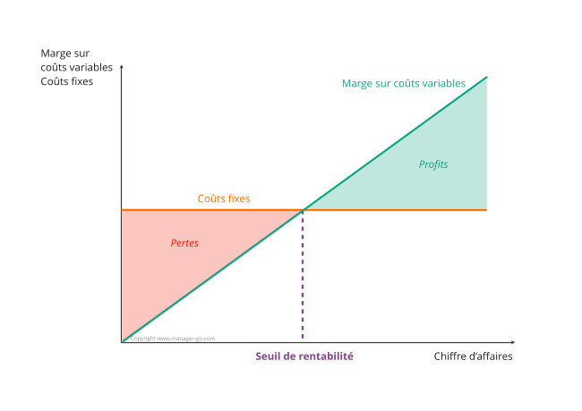
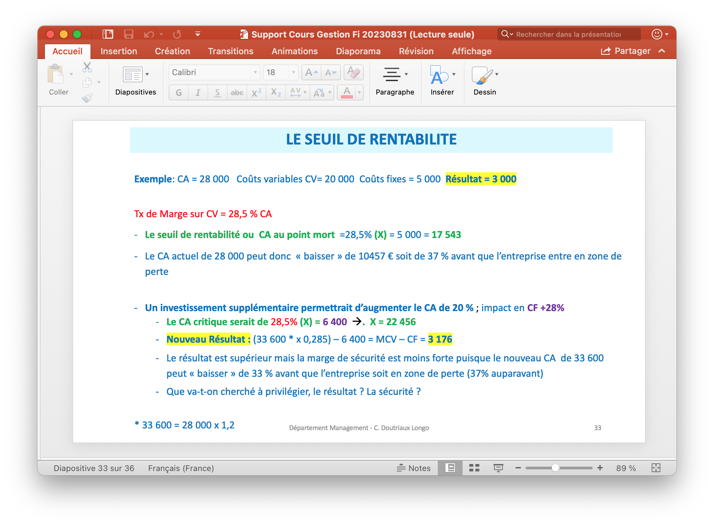

# Gestion financière

Cours – 31/08/2023 

# Rappels 

<u>Compte de résultats :</u> 

- 1 fois / an 

- Flux transactionnels 
- Sur une période temps 
- Résultat = Produit – Charges => est-ce que j’ai passé une bonne année ? 

- Il existe de nombreux résultats différents 
- Le plus important = Résultat net, définit les dividendes des actionnaires 

<u>Bilan :</u> 

- Ce que l’entreprise possède / Le patrimoine de l’entreprise 

- A un instant T 

- On y retrouve le résultat qui enrichie ou appauvri le patrimoine 

  - **Actif :** Ses ressources 

  - **Passif :** Emploie des ressources 

- Actif à LT 
- Besoins financiers à CT 
- Trésorerie (peut être négatif sans qu’on dépose bilan) 

- Résultat peut être négatif et tréso positive 

<u>Résultat et tréso :</u> 2 choses différentes 

- Pas de comptabilité 
- Il existe des charges qui pénalisent le résultat, mais pas de flux monétaire, ie trésorerie (amortissement) 
- Délais de payement (pas d’impact sur le resultat, mais impact sur trésorerie) 

- Permet de faire vivre les entreprises 

- TVA (20%) = source de revenu pour entreprises* 
- A maitriser 

<u>Comprendre le résultat net : SIG</u> 

- Important pour mesurer performance éco : EBE 

- Valeur ajoutée - charges (exploitation, personnels, impôts) 

- Très regardé par les investiseur 
- Prouve que l’entreprise est performante 
- Cash-flow 

- Importance CAF : 

- Capacité d’autofinancement 

- Flux net potentiel de trésorerie (cash dispo) 
- Très regardé par les investiseur 

<u>Le BFR</u> (à prévoir dans un projet – besoins exploitation du projet à financer) : 

- Les délais de paiement par les clients impliquent de taper dans la trésorerie 

<u>Fonds de roulement</u> (investissement dans un projet impact FR) : 

- Capitaux permanents – actifs immobilisés net 
- Doit être Positif pour financer BFR 
- FR - BFR = trésorerie 

## Concepts essentiels : couts, relation prix-cout-valeur 

### La notion de cout 

Choix techniques de l’ingénieur => Couts (techno/produits/..) => cout produit/service/process/… => Compte de résultat et bilan de l’entreprise 

<u>Cout</u> :

- Reflet de la performance 
- Valeur des consommation nécessaires à la prod et à l’exploitation d’un produit ou d’un service 

- **Charge indirect + charge direct** 

### Inducteur de cout :

<u>Types de coutes :</u> 

- Cout achat : achat (directe) + approvisionnement (indirecte) 
- Cout production : achat matiere premiere consommées + opérations de production (salaires, amortissement, outils prod, etc.) 

- Cout distribution 

<u>Charge directe :</u> 

-  [Notes manquantes]

<u>Charge indirecte :</u> 

-  [Notes manquantes]

DSI dépend de + en + du DAF, car DSI ont tendance à rencontrer des difficultés à gérer l’argent 

Direction marketing on parfois le contrôle sur la DSI 

DAF doit dépenser tout son budget.

# Seuil de rentabilité

> *Il s'agit du niveau des ventes à partir duquel on fait des bénéfices. Il permet de déterminer le CA minimum à réaliser pour être à l’équilibre. Il peut également permettre de fixer un objectif de vente.*

## Exemple

# Rentabilité

## Opex

## Capex

## Rentabilité des investissements

### Difficultés

Attention à l'estimation : Elle ne doit être ni pessimiste ni optimiste. Il est possible de faire plusieurs versions pour avoir un aperçu global.

### ROI

# Exercices

## Exercice 7

CV = 53% CA + 21% CA

Seuil rentabilité = Coût Fixe / Marge Coût Variable = 241 538,40e

Point mort = Seuil rentabilité $\times$ $\frac{330}{\text{CA}}$ = 318 jours (Avant d'être rentable)

| Chiffre d'affaire : 250 000e  | 100% CA  |
| ----------------------------- | -------- |
| Coût variable : 185 000e      | -74% CA  |
| Marge Coût Variable : 65 000e | - 26% CA |
| Coût fixe : 62 800e           |          |

## Exercice 1

|                 | 1       | 2        | 3      | 4      | 5      |
| --------------- | ------- | -------- | ------ | ------ | ------ |
| Investissement  | -65 000 | $\alpha$ |        |        |        |
| Cash Flow       | 20 000  | 20 000   | 20 000 | 20 000 | 20 000 |
| Total CashFlow  | -45 000 | 20 000   | 20 000 | 20 000 | 20 000 |
| Cashflow Cumulé | -45 000 | -25 000  | -5 000 | 15 000 | 35 000 |

**VAN = -45 000 + (20 000 $\times$ 4) = 35 000**

**Indice de profitabilité : VAN / Investissement = $\frac{35000}{65000}$ = 54%**

 ## Exercice 2

|                  | 0       | 1      | 2      | 3      | 4      | 5      |
| ---------------- | ------- | ------ | ------ | ------ | ------ | ------ |
| Cash Flow        | -35 000 | 92 000 | 94 000 | 86 000 | 82 000 | 76 000 |
| Cash Flow Cumulé | 1       | 84 988 | 80 218 | 67 798 | 59 717 | 51 129 |

**VAN : -350 000 + $\sum$ CF Actualisé = - 6 150 < 0** donc ce n'est pas rentable, rentrez chez vous.

## Exercice 4

|                             | 0         | 1                                  | 2                                  | 3         | 4         | 5          |
| --------------------------- | --------- | ---------------------------------- | ---------------------------------- | --------- | --------- | ---------- |
| Investissement              | $-48 000$ |                                    |                                    |           |           |            |
| CA                          |           | $\frac{26 \times 50 000}{1300000}$ | $\frac{26 \times 60 000}{1300000}$ |           |           |            |
| Charges                     |           | $\frac{23 \times 50000}{-1150000}$ |                                    |           |           |            |
| Amortissement               |           | $-96000$                           |                                    |           |           |            |
| **Résultat d'exploitation** |           | $54 000$                           |                                    |           |           |            |
| Excédent Brut Exploitation  |           | $150 000$                          |                                    |           |           |            |
| **Cash Flow**               | $-48 000$ | $150 000$                          | $180 000$                          | $210 000$ | $240 000$ | $270 000$  |
| Cash Flow Actualisé à 12%   |           | $133 929$                          | $143 495$                          | $149 474$ | $152 524$ | $153 2205$ |
| Cash Flow Cumué             | $-48 000$ | $-34607$                           | $-202 576$                         | $-53102$  | $99422$   | $252 627$  |
|                             |           |                                    |                                    |           | **OK!**   |            |

À partir de l'année numéro 4, on obtient un cashflow positif.