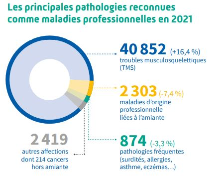
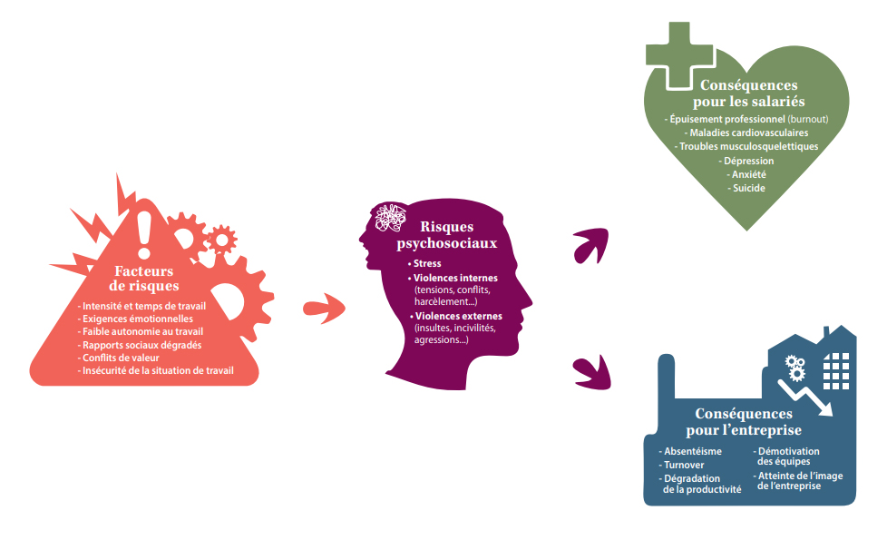

# Santé et Sécurité du Travail

# Définitions

### Accident du travail

Art. L411-1 - Du fait ou à l'occasion du travail…

### Accident de trajet

Art. L411-2 - Pendant le trajet d'aller et de retour entre…

### Maladie profesionnelle

Art. L461-1 - Toute maladie désignée dans un tableau; Si lien direct avec le travail; Si lien direct et essentiel.

## Statistiques

Durée moyenne d'un arrêt de travail suite à un accident de travail : 2.7 mois 

Durée moyenne d'un arrêt de travail suite à une maladie du travail : 9.9 mois

# Continuité

## 6 Facteurs de risque GOLLAC

Suites des facteurs : https://www.inrs.fr/risques/psychosociaux/facteurs-risques.html

# Enjeux 

## Humains et sociaux

*50% des alariés souffrant de lombalgies chroniques ne reprendont pas leur travail après un arrêt de plus de 6 mois.*

## Juridiques

Vidéo - Responsabilité de l'employeur : https://www.youtube.com/watch?v=DYBsok_TrW0

### Codes

Code du travail (L4121-1,2,3) - **1er responsable: L'employeur**

Code pénal (non assistance à personne en danger) **Tous responsables**

Différence entre pénal et civil : A déterminer

**Compromis historique de 1898** : Régime dérogatoire de responsabilité civile

Cas avérés de FIE si absence de :

- DUER
- Formation renforcée à la sécurité d'un sala'rie en CDD.
- Mesures de prévention suite à la manifestation d'un droit d'alerte par le CSE ou d'un droit de retrait par un salarié.

## Principes de 
