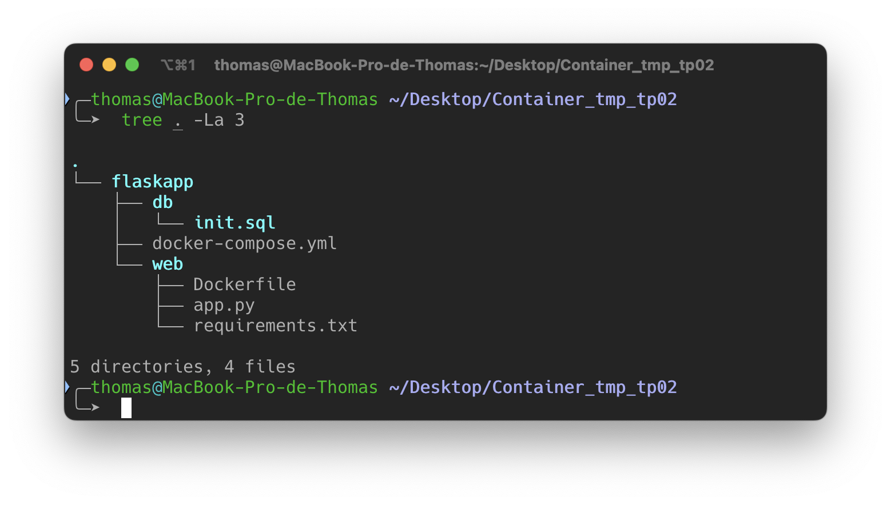
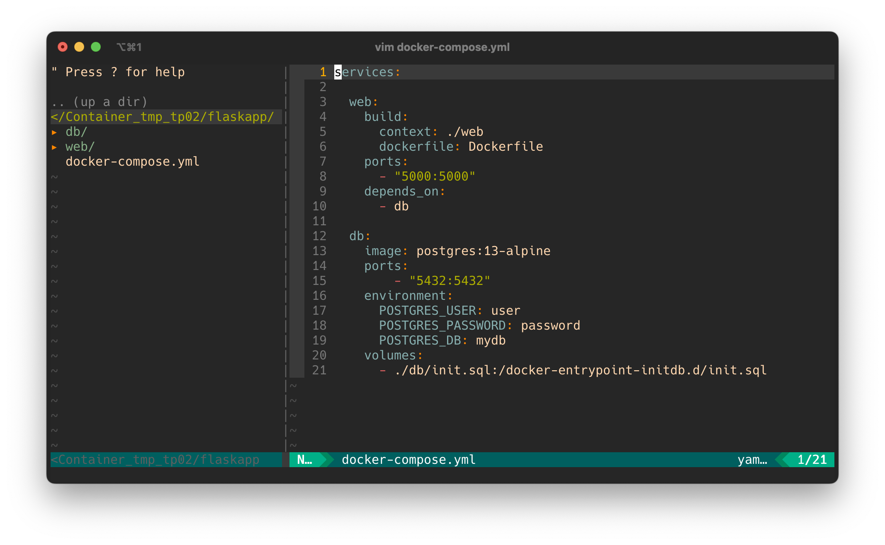
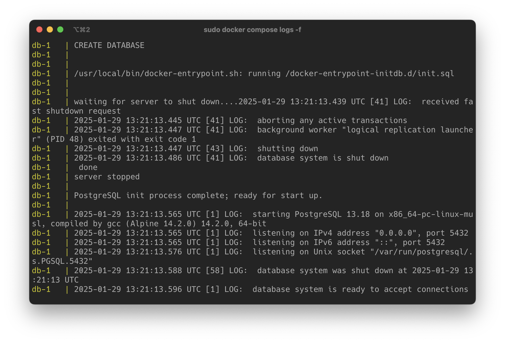
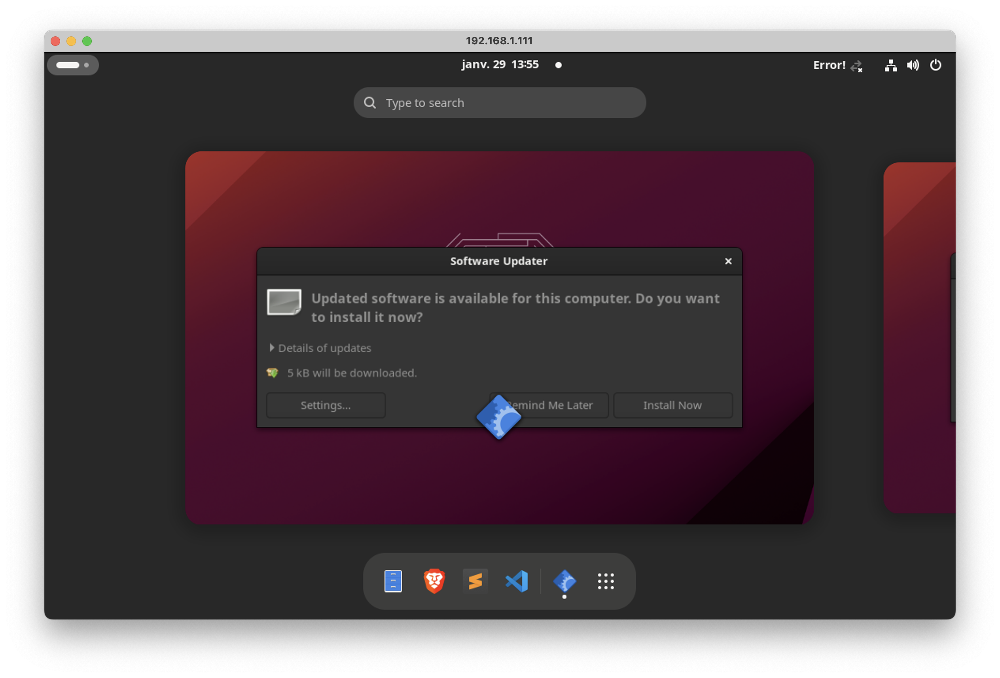
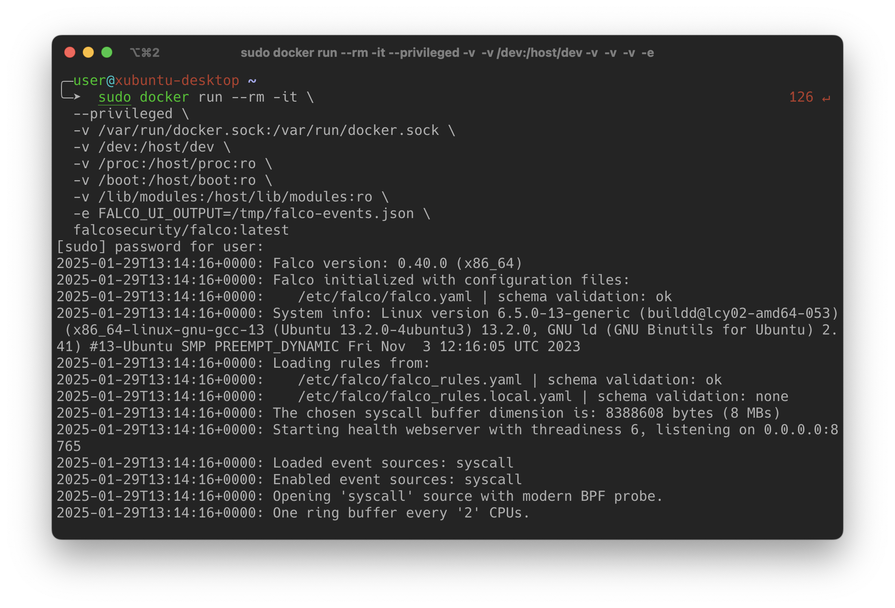
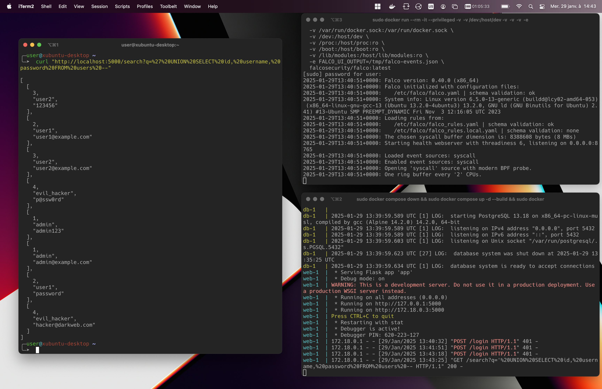
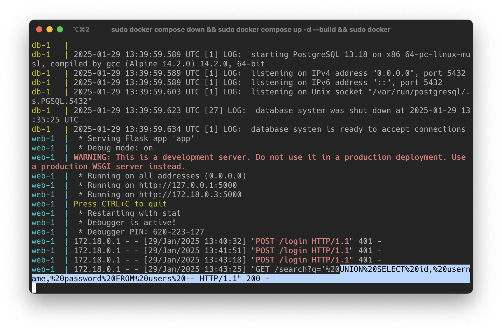

# Orchestration

Notes de cours par `Thomas PEUGNET`.


### Kubernetes Cheat Sheet

#### 1. Concepts de Base

- Cluster : Ensemble de nœuds contrôlés par Kubernetes.
- Node : Machine (physique ou virtuelle) dans un cluster.
- Pod : Plus petite unité déployable, contient un ou plusieurs conteneurs.
- Namespace : Isolation logique des ressources dans un cluster.
- Deployment : Contrôle le déploiement des Pods (scaling, rolling updates).
- Service : Expose les Pods à d’autres applications ou au réseau externe.

#### 2. Composants du Cluster

- Control Plane :
  - API Server : Interface RESTful pour interagir avec Kubernetes.
  - etcd : Base de données clé-valeur pour la configuration et l'état du cluster.
  - Scheduler : Planifie les Pods sur les nœuds disponibles.
  - Controller Manager : Contrôleurs pour gérer l’état désiré.
- Node Components :
  - kubelet : Agent sur chaque nœud pour gérer les Pods.
  - kube-proxy : Gère le réseau du cluster.
  - Container Runtime : Exécute les conteneurs (Docker, containerd, etc.).


#### 3. Commandes kubectl Essentielles

```bash
# Informations générales
kubectl cluster-info          # Infos sur le cluster
kubectl get nodes             # Liste des nœuds
kubectl get pods              # Liste des Pods
kubectl get svc               # Liste des Services
kubectl get deployments       # Liste des Deployments

# Débogage
kubectl describe pod <name>   # Infos détaillées sur un Pod
kubectl logs <pod>            # Logs d’un Pod
kubectl exec -it <pod> -- bash # Accès au shell dans un conteneur

# Gestion des ressources
kubectl apply -f <file>.yaml  # Applique une configuration
kubectl delete -f <file>.yaml # Supprime une ressource
kubectl scale deployment <name> --replicas=<num>  # Change le nombre de réplicas

# Namespaces
kubectl get namespaces        # Liste les namespaces
kubectl create namespace <name>  # Crée un namespace
kubectl delete namespace <name>  # Supprime un namespace
```

#### 4. Manifest YAML Exemple

```yaml
apiVersion: apps/v1
kind: Deployment
metadata:
  name: my-app
  labels:
    app: my-app
spec:
  replicas: 3
  selector:
    matchLabels:
      app: my-app
  template:
    metadata:
      labels:
        app: my-app
    spec:
      containers:
      - name: my-container
        image: nginx:1.21
        ports:
        - containerPort: 80
---
apiVersion: v1
kind: Service
metadata:
  name: my-service
spec:
  selector:
    app: my-app
  ports:
  - protocol: TCP
    port: 80
    targetPort: 80
  type: ClusterIP
```

#### 5. Objets Principaux

- ConfigMap : Stocke les configurations non sensibles.
- Secret : Stocke les informations sensibles (ex. mots de passe).
- Ingress : Gère l’accès HTTP/HTTPS au cluster.
- PersistentVolume (PV) : Définit un espace de stockage.
- PersistentVolumeClaim (PVC) : Requête pour un PV.

#### 6. Networking

- ClusterIP : Service interne au cluster.
- NodePort : Expose le Service sur un port de chaque Node.
- LoadBalancer : Expose le Service via un load balancer externe.
- Ingress : Point d’entrée unique basé sur des règles.

#### 7. Troubleshooting

- Vérifiez l'état des Pods :

  ```bash
  kubectl get pods --all-namespaces
  ```

- Inspectez les logs :

  ```bash
  kubectl logs <pod-name>
  ```

- Testez la connectivité :

  ```bash
  kubectl exec -it <pod-name> -- curl http://<service-name>
  ```

# Rendu TP01

Compte-rendu du TP01 effectué par `Thomas PEUGNET`.

## Préparation

Nous mettons en place notre environnement avec le script suivant.

```bash
#!/bin/bash

# Met à jour les dépôts et met à niveau les paquets
apt update && apt upgrade -y

# Installe les outils nécessaires
apt install -y open-vm-tools net-tools ca-certificates curl

truncate -s 0 /etc/machine-id
rm /var/lib/dbus/machine-id
ln -s /etc/machine-id /var/lib/dbus/machine-id

# Installe Docker
install -m 0755 -d /etc/apt/keyrings
curl -fsSL https://download.docker.com/linux/ubuntu/gpg -o /etc/apt/keyrings/docker.asc
chmod a+r /etc/apt/keyrings/docker.asc
echo "deb [arch=$(dpkg --print-architecture) signed-by=/etc/apt/keyrings/docker.asc] \
https://download.docker.com/linux/ubuntu \
$(. /etc/os-release && echo \"$VERSION_CODENAME\") stable" | tee /etc/apt/sources.list.d/docker.list > /dev/null
apt-get update -y
apt-get install -y docker-ce docker-ce-cli containerd.io docker-buildx-plugin docker-compose-plugin

# Vérifie l'installation de Docker
docker -v

# Installe Trivy
wget -qO - https://aquasecurity.github.io/trivy-repo/deb/public.key | gpg --dearmor | tee /usr/share/keyrings/trivy.gpg > /dev/null
echo "deb [signed-by=/usr/share/keyrings/trivy.gpg] https://aquasecurity.github.io/trivy-repo/deb $(lsb_release -sc) main" | tee /etc/apt/sources.list.d/trivy.list > /dev/null
apt-get update -y
apt-get install -y trivy
trivy -h

# Crée un fichier et un Dockerfile d'exemple
mkdir archive
echo "this is some text" > ./archive/file.txt
tar cvf myfile.tar archive
cat << 'EOF' > Dockerfile
FROM debian:10.0
RUN apt-get -y install bash
ADD ./myfile.tar /tmp
EXPOSE 22
EOF

# Construit une image Docker
sudo docker build -t mytestimage:0.1 ./ -f Dockerfile

# Lance le service Docker
sudo service docker start

# Vérifie les conteneurs en cours d'exécution
docker ps

# Exécute un scan Trivy sur l'image créée
trivy image -f json -o mytestimage_results_"$(date +"%H%M%S")".txt mytestimage:0.1

# Archive un historique des fichiers générés
mkdir -p /root/scan_results
mv mytestimage_results_*.txt /root/scan_results/
echo "Scan terminé. Résultats sauvegardés dans /root/scan_results."
```

Exécuter le script en `sudo`.

## Envoi des données

Nous envoyons le résultat de l'analyse sur `dbsystel.github.io`.


Nous changeons la version de Debian et faisons quelques changements sur le Dockerfile.


Notre Dockerfile, à cet instant, est le suivant.

```dockerfile
FROM debian:12

ENV DEBIAN_FRONTEND=noninteractive

RUN apt-get update && \
    apt-get upgrade -y && \
    apt-get install -y --no-install-recommends \
    bash \
    openssh-server \
    curl \
    ca-certificates && \
    apt-get clean && \
    rm -rf /var/lib/apt/lists/*

ADD ./myfile.tar /tmp

RUN useradd -ms /bin/bash appuser && \
    mkdir -p /home/appuser/.ssh && \
    chmod 700 /home/appuser/.ssh

USER appuser

EXPOSE 22

CMD ["bash"]
```

Les changements que nous avons fait:

- `apt-get update` et `apt-get upgrade` pour mettre à jour les paquets, suivi d'une installation des paquets nécessaires (`bash`, `openssh-server`, `curl`, `ca-certificates`), avec nettoyage du cache pour réduire la taille de l'image.

-  Plus une bonne pratique qu'une vulnérabilité: `myfile.tar`  déplacé à `/tmp`.

- SSH: Création de l'utilisateur `appuser`, configuration du répertoire `.ssh` et passage à cet utilisateur pour exécuter les commandes.

Puis, nous avons décidé de passer sur une image `alpine`, moins complète donc moins vulnérable.

Notre Dockerfile est à présent le suivant:

```Dockerfile
FROM alpine:3.21

RUN apk add --no-cache bash

ADD ./myfile.tar /tmp

EXPOSE 22
```

Et là nous obtenons un total de 0 vulnérabilité.


Nous avons, cette fois-ci, complètement changé notre fusil d'épaule en changeant le nom de l'image. Sans changer d'OS, nous sommes toujours sur un debian et n'avons pas impacté le fonctionnement de l'image.

Nous ne l'avons pas détaillé plus haut, mais nous effectuons systématiquement les commandes suivantes:

```bash
sudo  docker build -t mytestimage:0.6 ./ -f Dockerfile
```

```bash
sudo trivy image -f json -o mytestimage_result.json mytestimage:0.6
```

Nous envoyons ensuite le résultat json sur le site indiqué pour obtenir les informations sur les vulnérabilités.

## Analyse

Nous lançons la commande `trivy config Dockerfile` depuis notre répertoire `/hom/studenlab`.


Nous modifions notre Dockerfile pour avoir le contenu suivant.

```dockerfile
FROM alpine:3.21

RUN apk add --no-cache bash

ADD ./myfile.tar /tmp

RUN adduser -D appuser

USER appuser

CMD ["bash"]
```


Nous obtenons une seule vulnérabilité, qui est le fait d'avoir un Healthcheck sur notre Dockerfile. Étant donné que nous ne runnons aucun service et que ce conteneur est simplement une image linux qui tourne toute seule, un Healthcheck n'est pas forcément nécessaire. De plus, le résultat demeure satisfaisant même si nous n'avons pas obtenu 0 Failures..

# Rendu TP02

Rendu du TP02 par `Vincent LAGOGUE` et `Thomas PEUGNET`.

## Mise en place de l'environnement de travail

Nous créons notre environnement et obtenons l'architcture suivante.



Notre `docker-compose.yml` a le contenu suivant.



Nous lançons notre application avec le démarrage de nos conteneurs.

```
docker compose up -d --build
```

Nous constatons que l'application tourne correctement et que la base de données fonctionne correctement.



Nous modifions notre fichier `init.sql` pour avoir le contenu suivant. Ce contenu a été généré volontairement par Mistra AI.

```sql
-- Empty initialization file for now
-- Création de la base de données si elle n'existe pas
-- CREATE DATABASE mydb;
\c mydb;

-- Création de la table des utilisateurs avec une vulnérabilité classique (pas de préparation de requête)
DROP TABLE IF EXISTS users;
CREATE TABLE users (
    id SERIAL PRIMARY KEY,
    username VARCHAR(50) NOT NULL,
    password VARCHAR(255) NOT NULL,  -- Mauvaise pratique : stockage en clair
    email VARCHAR(100),
    role VARCHAR(20) DEFAULT 'user'
);

-- Insertion de quelques utilisateurs
INSERT INTO users (username, password, email, role) VALUES
('admin', 'admin123', 'admin@example.com', 'admin'),
('user1', 'password', 'user1@example.com', 'user'),
('user2', '123456', 'user2@example.com', 'user'),
('evil_hacker', 'p@ssw0rd', 'hacker@darkweb.com', 'user');

-- Table des logs (idéal pour tester l'injection dans les recherches)
DROP TABLE IF EXISTS logs;
CREATE TABLE logs (
    id SERIAL PRIMARY KEY,
    action TEXT,
    user_id INT REFERENCES users(id),
    timestamp TIMESTAMP DEFAULT NOW()
);

-- Exemples d'entrées de logs
INSERT INTO logs (action, user_id) VALUES
('User admin logged in', 1),
('User user1 changed password', 2),
('User user2 attempted login', 3),
('Evil hacker tried SQL injection', 4);
```

Nous modifions également notre fichier `app.py` pour avoir le contenu suivant.

```python
from flask import Flask, request, jsonify
import psycopg2
import logging

logging.basicConfig(filename='/app/logs/access.log', level=logging.INFO)

app = Flask(__name__)

# Connexion à PostgreSQL (⚠️ vulnérable car pas de paramètre sécurisé)
DB_CONFIG = {
    "dbname": "mydb",
    "user": "user",
    "password": "password",
    "host": "db",
    "port": 5432
}

def get_db_connection():
    return psycopg2.connect(**DB_CONFIG)

@app.route('/')
def home():
    return "🚀 API Flask vulnérable aux injections SQL"

# 🔥 1️⃣ Authentification vulnérable 🔥
@app.route('/login', methods=['POST'])
def login():
    data = request.json
    username = data.get('username', '')
    password = data.get('password', '')

    conn = get_db_connection()
    cursor = conn.cursor()

    # ⚠️ Vulnérable aux injections SQL
    query = f"SELECT id, username, role FROM users WHERE username = '{username}' AND password = '{password}'"
    logging.info(f"[DEBUG] Query exécutée: {query}")  # Pour voir ce qui est injecté
    cursor.execute(query)
    user = cursor.fetchone()

    cursor.close()
    conn.close()

    if user:
        return jsonify({"message": "Connexion réussie", "user": user}), 200
    return jsonify({"message": "Échec de l'authentification"}), 401

# 🔥 2️⃣ Recherche d'utilisateurs vulnérable 🔥
@app.route('/search', methods=['GET'])
def search_users():
    search = request.args.get('q', '')

    conn = get_db_connection()
    cursor = conn.cursor()

    # ⚠️ Vulnérable aux injections SQL
    query = f"SELECT id, username, email FROM users WHERE username LIKE '%{search}%'"
    logging.info(f"[DEBUG] Query exécutée: {query}")
    cursor.execute(query)
    results = cursor.fetchall()

    cursor.close()
    conn.close()

    return jsonify(results), 200

# 🔥 3️⃣ Affichage des logs vulnérable 🔥
@app.route('/logs', methods=['GET'])
def get_logs():
    filter_log = request.args.get('filter', '')

    conn = get_db_connection()
    cursor = conn.cursor()

    # ⚠️ Vulnérable aux injections SQL
    query = f"SELECT id, action, timestamp FROM logs WHERE action LIKE '%{filter_log}%'"
    logging.info(f"[DEBUG] Query exécutée: {query}")
    cursor.execute(query)
    logs = cursor.fetchall()

    cursor.close()
    conn.close()

    return jsonify(logs), 200

if __name__ == '__main__':
    app.run(host='0.0.0.0', port=5000, debug=True)
```

## Falco

Nous lançons Falco à l'aide de la commande suivante.

```
docker run --rm -it \
  --privileged \
  -v /var/run/docker.sock:/var/run/docker.sock \
  -v /dev:/host/dev \
  -v /proc:/host/proc:ro \
  -v /boot:/host/boot:ro \
  -v /lib/modules:/host/lib/modules:ro \
  -e FALCO_UI_OUTPUT=/tmp/falco-events.json \
  falcosecurity/falco:latest
```

Nous remarquons que, après plusieurs tentatives, `falco` ne peut pas fonctionner sur un système macOS. Nous nous connectons donc à une VM sur un hyperviseur Proxmox pour continuer la suite du TP.




Nous relançons la commande Docker.



## Attaques

### Injection SQL via HTTP

Nous lançons une première attaque, étant la requête `curl` suivante. Cette attaque fait une requête SQL au travers d'une requête POST faite à notre serveur web.



Nous constatons que l'attaque n'a pas été détectée par Falco (absence de changement dans les logs, fenêtre en haut à droite).

### Connexion en shell

Nous effetuons maintenant une connexion via un `docker exec` sur le conteneur de notre application web à l'aide de la commande suivante.

```
sudo docker exec -it flaskapp-web-1 /bin/bash
```


Nous constatons cette fois-ci que cette manipulation a bien été détectée par Falco, nous avons le résultat suivant.

```
2025-01-29T14:11:41.919363331+0000: Notice A shell was spawned in a container with an attached terminal (evt_type=execve user=root user_uid=0 user_loginuid=-1 process=bash proc_exepath=/usr/bin/bash parent=containerd-shim command=bash terminal=34816 exe_flags=EXE_WRITABLE|EXE_LOWER_LAYER container_id=21090e8b304a container_name=<NA>)
```

Un shell (`bash`) a été lancé à l'intérieur d'un conteneur.

- L’utilisateur `root` (`user=root user_uid=0`) a exécuté cette commande, ce qui indique un accès avec des privilèges root.

- Le processus parent est `containerd-shim`, ce qui signifie que le shell a été lancé directement via Docker ou un runtime de conteneur.

- Le terminal est attaché (`terminal=34816`), ce qui veut dire que la session est interactive.

- Le fichier exécutable (`proc_exepath=/usr/bin/bash`) est situé dans `/usr/bin/`.

### Injection SQL via un Shell

Nous tentons une nouvelle façon de faire une injection, avec une commande `docker exec`.

```shell
sudo docker exec -it flaskapp-db-1 psql -U user -d mydb -c "SELECT * FROM users WHERE username = 'admin' OR '1'='1';"
```


Nous constatons là encore que l'attaque n'est pas détectée, malgré une réussite évidente (liste de tous les users et leur mot de passe).

## Conclusion

Il semblerait donc que Falco, en fonctionnant avec ses règles par défaut ne soit pas capable de détecter des injections SQL passant par une requête HTTP.

Nous avons longuement investigué sur la façon de gérer les règles pour améliorer ses capacités de détection, mais avons constaté que c'était le programme du TP03.

Nous ajoutons simplement une note ici, permettant de monter notre fichier de règles depuis notre host vers notre conteneur Falco.

```shell
sudo docker run --rm -it \
  --privileged \
  -v /var/run/docker.sock:/var/run/docker.sock \
  -v /dev:/host/dev \
  -v /proc:/host/proc:ro \
  -v /boot:/host/boot:ro \
  -v /lib/modules:/host/lib/modules:ro \
  -v /home/user/flaskapp/falco_rules.local.yaml:/etc/falco/falco_rules.local.yaml:ro \
  -v /home/user/flaskapp/logs/access.log:/var/log/falco/flask_access.log:ro \
  -e FALCO_UI_OUTPUT=/tmp/falco-events.json \
  falcosecurity/falco:latest
```

À noter que la suite de nos tentatives étaient de rediriger l'output des logs de notre application Flask vers un fichier à lire par Falco lors de la création et du lancement du conteneur. Ensuite, nous aurions fait une règle analysant le contenu de notre fichier de log et vérifiant si une regex est validée par une des lignes du fichier de logs.

D'après la capture d'écran suivante, il ne serait pas forcément très difficile de détecter ce genre d'intrusion.



