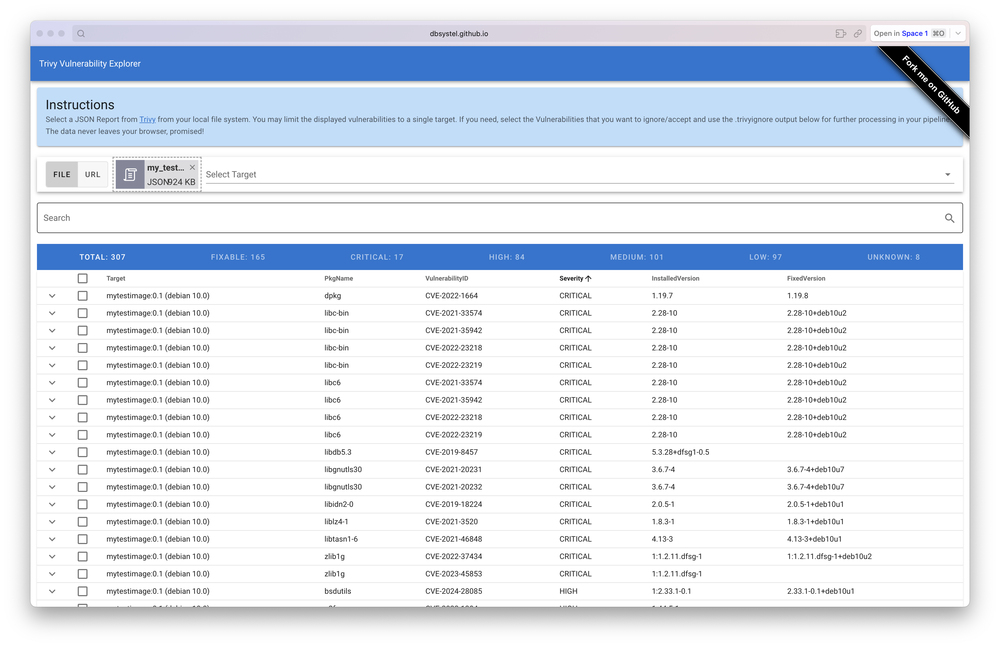
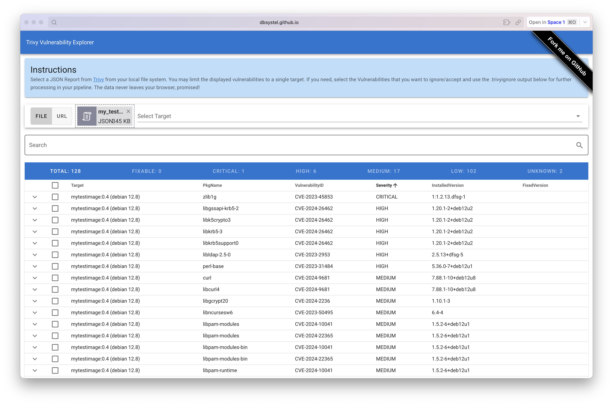
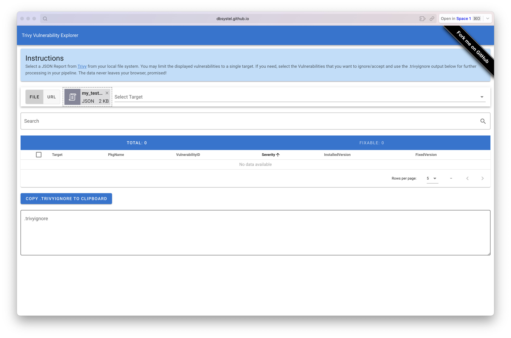
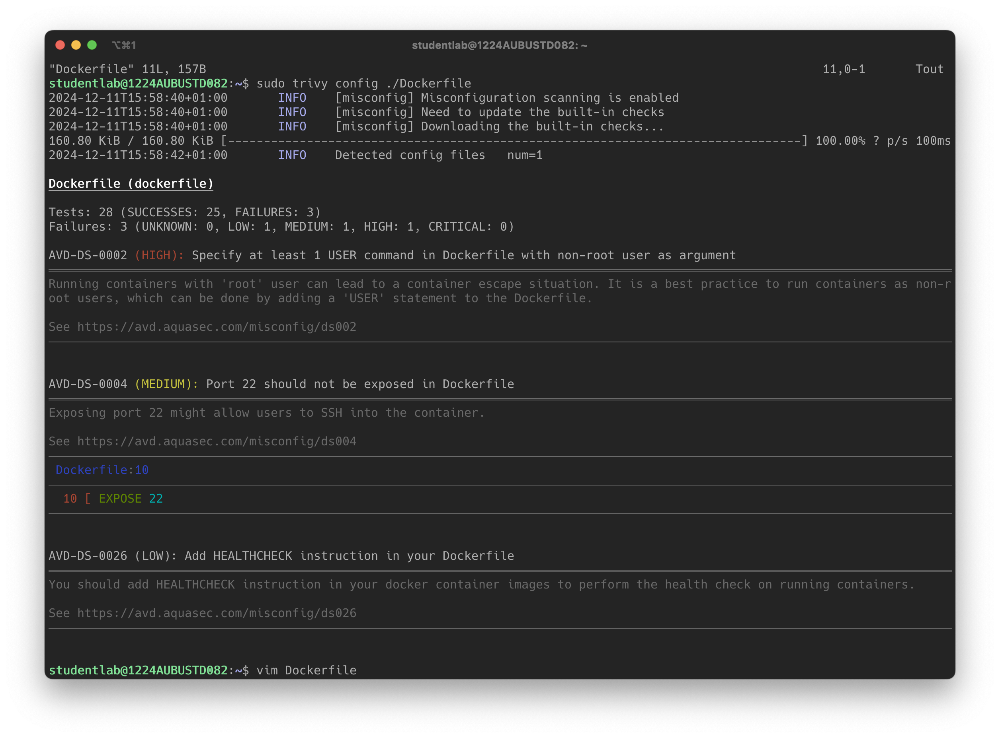
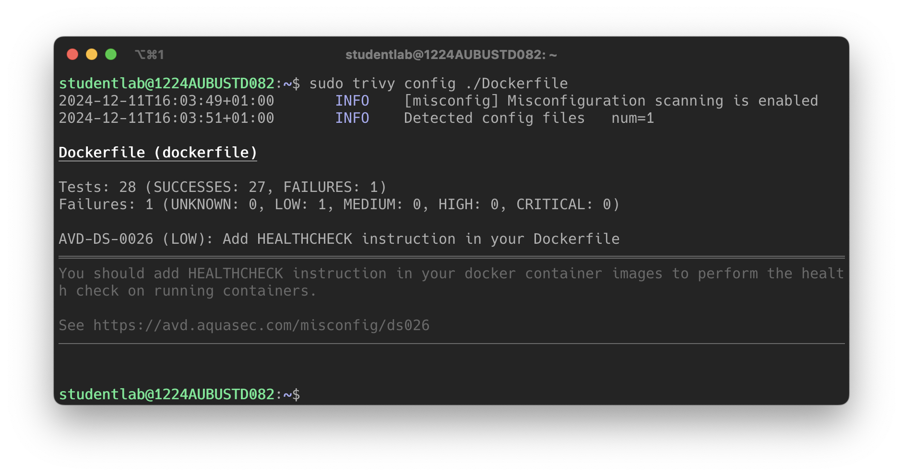

# Orchestration

Notes de cours par `Thomas PEUGNET`.

### Kubernetes Cheat Sheet

#### 1. **Concepts de Base**

- **Cluster** : Ensemble de nœuds contrôlés par Kubernetes.
- **Node** : Machine (physique ou virtuelle) dans un cluster.
- **Pod** : Plus petite unité déployable, contient un ou plusieurs conteneurs.
- **Namespace** : Isolation logique des ressources dans un cluster.
- **Deployment** : Contrôle le déploiement des Pods (scaling, rolling updates).
- **Service** : Expose les Pods à d’autres applications ou au réseau externe.

#### 2. **Composants du Cluster**

- Control Plane :
  - API Server : Interface RESTful pour interagir avec Kubernetes.
  - etcd : Base de données clé-valeur pour la configuration et l'état du cluster.
  - Scheduler : Planifie les Pods sur les nœuds disponibles.
  - Controller Manager : Contrôleurs pour gérer l’état désiré.
- Node Components :
  - kubelet : Agent sur chaque nœud pour gérer les Pods.
  - kube-proxy : Gère le réseau du cluster.
  - Container Runtime : Exécute les conteneurs (Docker, containerd, etc.).


#### 3. **Commandes kubectl Essentielles**

```bash
# Informations générales
kubectl cluster-info          # Infos sur le cluster
kubectl get nodes             # Liste des nœuds
kubectl get pods              # Liste des Pods
kubectl get svc               # Liste des Services
kubectl get deployments       # Liste des Deployments

# Débogage
kubectl describe pod <name>   # Infos détaillées sur un Pod
kubectl logs <pod>            # Logs d’un Pod
kubectl exec -it <pod> -- bash # Accès au shell dans un conteneur

# Gestion des ressources
kubectl apply -f <file>.yaml  # Applique une configuration
kubectl delete -f <file>.yaml # Supprime une ressource
kubectl scale deployment <name> --replicas=<num>  # Change le nombre de réplicas

# Namespaces
kubectl get namespaces        # Liste les namespaces
kubectl create namespace <name>  # Crée un namespace
kubectl delete namespace <name>  # Supprime un namespace
```

#### 4. **Manifest YAML Exemple**

```yaml
apiVersion: apps/v1
kind: Deployment
metadata:
  name: my-app
  labels:
    app: my-app
spec:
  replicas: 3
  selector:
    matchLabels:
      app: my-app
  template:
    metadata:
      labels:
        app: my-app
    spec:
      containers:
      - name: my-container
        image: nginx:1.21
        ports:
        - containerPort: 80
---
apiVersion: v1
kind: Service
metadata:
  name: my-service
spec:
  selector:
    app: my-app
  ports:
  - protocol: TCP
    port: 80
    targetPort: 80
  type: ClusterIP
```

#### 5. **Objets Principaux**

- **ConfigMap** : Stocke les configurations non sensibles.
- **Secret** : Stocke les informations sensibles (ex. mots de passe).
- **Ingress** : Gère l’accès HTTP/HTTPS au cluster.
- **PersistentVolume (PV)** : Définit un espace de stockage.
- **PersistentVolumeClaim (PVC)** : Requête pour un PV.

#### 6. **Networking**

- **ClusterIP** : Service interne au cluster.
- **NodePort** : Expose le Service sur un port de chaque Node.
- **LoadBalancer** : Expose le Service via un load balancer externe.
- **Ingress** : Point d’entrée unique basé sur des règles.

#### 7. **Troubleshooting**

- Vérifiez l'état des Pods :

  ```bash
  kubectl get pods --all-namespaces
  ```

- Inspectez les logs :

  ```bash
  kubectl logs <pod-name>
  ```

- Testez la connectivité :

  ```bash
  kubectl exec -it <pod-name> -- curl http://<service-name>
  ```

# Rendu TP01

Compte-rendu du TP01 effectué par `Thomas PEUGNET`.

## Préparation

Nous mettons en place notre environnement avec le script suivant.

```bash
#!/bin/bash

# Met à jour les dépôts et met à niveau les paquets
apt update && apt upgrade -y

# Installe les outils nécessaires
apt install -y open-vm-tools net-tools ca-certificates curl

truncate -s 0 /etc/machine-id
rm /var/lib/dbus/machine-id
ln -s /etc/machine-id /var/lib/dbus/machine-id

# Installe Docker
install -m 0755 -d /etc/apt/keyrings
curl -fsSL https://download.docker.com/linux/ubuntu/gpg -o /etc/apt/keyrings/docker.asc
chmod a+r /etc/apt/keyrings/docker.asc
echo "deb [arch=$(dpkg --print-architecture) signed-by=/etc/apt/keyrings/docker.asc] \
https://download.docker.com/linux/ubuntu \
$(. /etc/os-release && echo \"$VERSION_CODENAME\") stable" | tee /etc/apt/sources.list.d/docker.list > /dev/null
apt-get update -y
apt-get install -y docker-ce docker-ce-cli containerd.io docker-buildx-plugin docker-compose-plugin

# Vérifie l'installation de Docker
docker -v

# Installe Trivy
wget -qO - https://aquasecurity.github.io/trivy-repo/deb/public.key | gpg --dearmor | tee /usr/share/keyrings/trivy.gpg > /dev/null
echo "deb [signed-by=/usr/share/keyrings/trivy.gpg] https://aquasecurity.github.io/trivy-repo/deb $(lsb_release -sc) main" | tee /etc/apt/sources.list.d/trivy.list > /dev/null
apt-get update -y
apt-get install -y trivy
trivy -h

# Crée un fichier et un Dockerfile d'exemple
mkdir archive
echo "this is some text" > ./archive/file.txt
tar cvf myfile.tar archive
cat << 'EOF' > Dockerfile
FROM debian:10.0
RUN apt-get -y install bash
ADD ./myfile.tar /tmp
EXPOSE 22
EOF

# Construit une image Docker
sudo docker build -t mytestimage:0.1 ./ -f Dockerfile

# Lance le service Docker
sudo service docker start

# Vérifie les conteneurs en cours d'exécution
docker ps

# Exécute un scan Trivy sur l'image créée
trivy image -f json -o mytestimage_results_"$(date +"%H%M%S")".txt mytestimage:0.1

# Archive un historique des fichiers générés
mkdir -p /root/scan_results
mv mytestimage_results_*.txt /root/scan_results/
echo "Scan terminé. Résultats sauvegardés dans /root/scan_results."
```

Exécuter le script en `sudo`.

## Envoi des données

Nous envoyons le résultat de l'analyse sur `dbsystel.github.io`.



Nous changeons la version de Debian et faisons quelques changements sur le Dockerfile.



Notre Dockerfile, à cet instant, est le suivant.

```dockerfile
FROM debian:12

ENV DEBIAN_FRONTEND=noninteractive

RUN apt-get update && \
    apt-get upgrade -y && \
    apt-get install -y --no-install-recommends \
    bash \
    openssh-server \
    curl \
    ca-certificates && \
    apt-get clean && \
    rm -rf /var/lib/apt/lists/*

ADD ./myfile.tar /tmp

RUN useradd -ms /bin/bash appuser && \
    mkdir -p /home/appuser/.ssh && \
    chmod 700 /home/appuser/.ssh

USER appuser

EXPOSE 22

CMD ["bash"]
```

Les changements que nous avons fait:

- `apt-get update` et `apt-get upgrade` pour mettre à jour les paquets, suivi d'une installation des paquets nécessaires (`bash`, `openssh-server`, `curl`, `ca-certificates`), avec nettoyage du cache pour réduire la taille de l'image.

-  Plus une bonne pratique qu'une vulnérabilité: `myfile.tar`  déplacé à `/tmp`.

- SSH: Création de l'utilisateur `appuser`, configuration du répertoire `.ssh` et passage à cet utilisateur pour exécuter les commandes.

Puis, nous avons décidé de passer sur une image `alpine`, moins complète donc moins vulnérable.

Notre Dockerfile est à présent le suivant:

```Dockerfile
FROM alpine:3.21

RUN apk add --no-cache bash

ADD ./myfile.tar /tmp

EXPOSE 22
```

Et là nous obtenons un total de 0 vulnérabilité.



Nous avons, cette fois-ci, complètement changé notre fusil d'épaule en changeant le nom de l'image. Sans changer d'OS, nous sommes toujours sur un debian et n'avons pas impacté le fonctionnement de l'image.

Nous ne l'avons pas détaillé plus haut, mais nous effectuons systématiquement les commandes suivantes:

```bash
sudo  docker build -t mytestimage:0.6 ./ -f Dockerfile
```

```bash
sudo trivy image -f json -o mytestimage_result.json mytestimage:0.6
```

Nous envoyons ensuite le résultat json sur le site indiqué pour obtenir les informations sur les vulnérabilités.

## Analyse

Nous lançons la commande `trivy config Dockerfile` depuis notre répertoire `/hom/studenlab`.



Nous modifions notre Dockerfile pour avoir le contenu suivant.

```dockerfile
FROM alpine:3.21

RUN apk add --no-cache bash

ADD ./myfile.tar /tmp

RUN adduser -D appuser

USER appuser

CMD ["bash"]
```



Nous obtenons une seule vulnérabilité, qui est le fait d'avoir un Healthcheck sur notre Dockerfile. Étant donné que nous ne runnons aucun service et que ce conteneur est simplement une image linux qui tourne toute seule, un Healthcheck n'est pas forcément nécessaire. De plus, le résultat demeure satisfaisant même si nous n'avons pas obtenu 0 Failures..