# Théorie des graphes

# Évaluation

- Fermeture transitive
- MA et MI
- Rang
- Dikjstra et Bellman
- Ordonnancement
- Recherche de chemin
- Arbre couvrant
- Coloration
- BellaSummer, NordOuest, Marche-pied
- Ford Fulkerson, Optimisation de chemin
- Ford Fulkerson, Bellman
- Simplexe

## Définitions & Théorèmes

Un graphe $G = < S,A >$ est constitué de 

-  $S$ : un ensemble de sommets, $|S|$ = $n$ est l’ordre du graphe ; 
- $A$ : un ensemble de liaisons, des paires de sommets.

Si le graphe est valué (pondéré), il se note alors $G = < S, A, C >$ avec

- $C$ : une fonction de coût représentant les valeurs (ou coûts, poids) des liaisons $(C : A → R)$.

## Graphes orientés & non-orientés

### Graphes orientés

> Arcs, Extrémité initiale / terminale, Prédécesseur, Successeur

Graphe **orienté** `G = (V, E)`

- `V` est l'ensemble de sommets (non vide)

- `E` est l'ensemble d'arêtes (peut être vide)

  - `E`$\subseteq$ `V`

- $\sum_{x \in V} \deg⁺ (x) = \sum_{x \in V}\deg⁻ (x) = |E|$

### Graphes non-orientés

> Arête, Extrémités, Voisins, Adjacents

Graphe **non orienté** `G = (V, E)`

- Propriétés identiques
- $ \sum_{x \in V}\deg (x) = |E| \times 2$

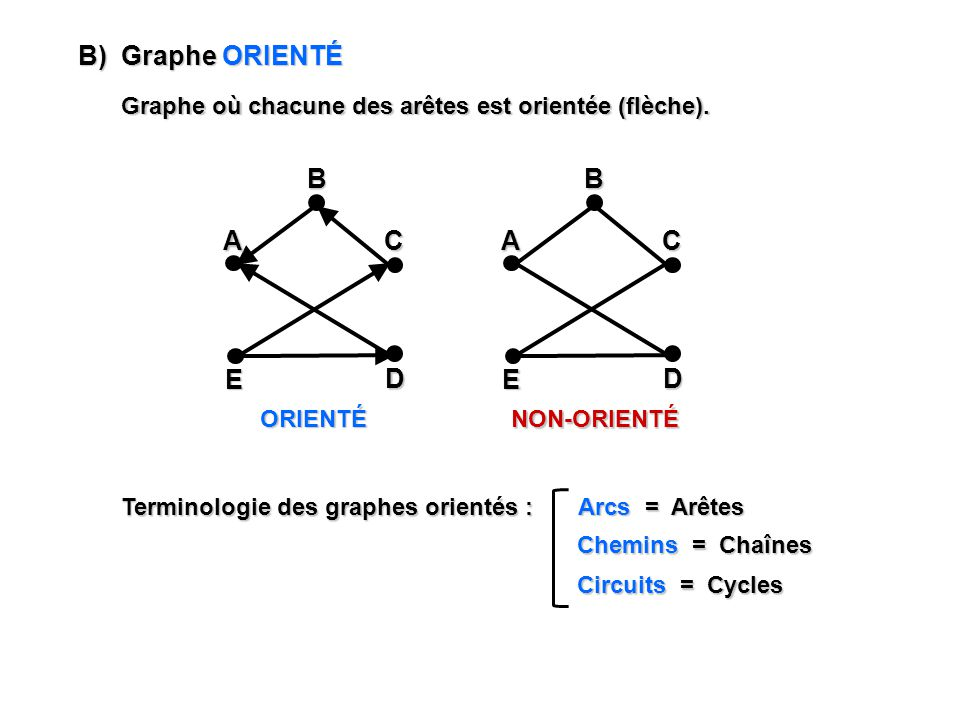

On appelle **graphe simple** un graphe sans arête multiple, et sans boucle sur un sommet.

Graphe **pondéré** (orienté ou non)  `G = (V, E)`

- $G = (V, E, \omega)$
- $\omega : E\rightarrow W$

Avec $\omega$ la `weight`, et $W$ un ensemble à définir au cas par cas.

### Application Multivoque $\Gamma$

> Cela désigne l'ensemble des successeurs du sommet $i$, noté $\Gamma$.
>
> **Fermeture transitive : ** *La fermeture transitive d'un graphe $G=(X,A)$ est la relation transitive minimale contenant la relation $(X,A)$*, noté $\widetilde{\Gamma} = \Gamma(i) \cup \Gamma(\Gamma(i)) \cup...$.

### Degré d'un graphe

> **Non-orienté :** *Le degré d'un sommet est égal au nombre d'arêtes qui le relient aux autres sommets.*
>
> **Orienté** : Le degré d'un sommet est égal au nombre d'arcs vers $x$ moins le nombre d'arcs partant de $x$.

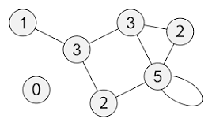

**Graphe Eulérien :** Tous les degrés pour chaque sommet sont pairs.

## Représentations

### Liste d'adjacence

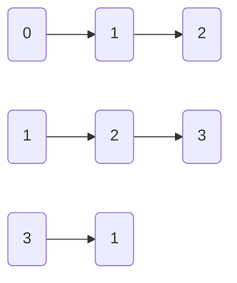

### Matrice d'adjacence

$$
\begin{vmatrix}
0 & 1 & 1 & 0\\
0 & 0 & 1 & 0\\
0 & 0 & 0 & 1\\
0 & 1 & 0 & 0
\end{vmatrix}
$$

# Parcours

## BFS

> "*Le parcours **largeur** utilise une **file** d'attente pour stocker les sommets visités.*
>
> *Dans cette méthode, l'accent est mis sur les sommets du graphe, un sommet est sélectionné en premier, puis il est visité et marqué. Les sommets adjacents au sommet visité sont ensuite visités et stockés de manière séquentielle dans la file d'attente.*
>
> *De même, les sommets stockés sont ensuite traités un par un et leurs sommets adjacents sont visités. Un nœud est entièrement exploré avant de se rendre dans un autre nœud du graphe, autrement dit, il traverse en premier les nœuds non explorés les moins profonds.*" – Internet

## DFS

> "*Le parcours en **profondeur** utilise une **pile** pour stocker les sommets visités.*
>
> *Il s'agit de la méthode basée sur les arêtes et fonctionne de manière **récursive**, les sommets étant explorés le long d'un chemin (arête).*
>
> *L'exploration d'un nœud est suspendue dès qu'un autre nœud non exploré est trouvé, et que les nœuds les plus profonds non explorés sont traversés au premier plan.*
>
> *Le parcours profondeur traverse / visite chaque sommet exactement une fois et chaque bord est inspecté exactement deux fois.*" – Internet

# Plus court chemin

## Dikjstra

### Exemple - 1

Lorsque l'on a deux coûts identiques, on choisit arbitrairement l'un des deux sommets duquel il faut repartir.

Le chemin de A vers F a donc une valeur de 3. 

Le chemin sera le suivant, `A C E F`.

### Exemple - 2

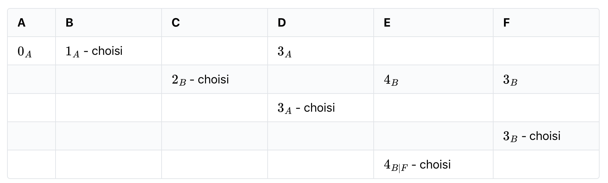

Le chemin de `A` vers `E` a donc une valeur de 4.

On a deux prédécesseurs de `E` : `B` et `F`.

Il y a deux chemins possibles, à coût égal :

- `A B F E`
- `A B E`

Le problème de Dikjstra est qu'un graphe avec des coûts négatifs va être problèmatique. Pour pallier à ça, un autre algorithme de recherche du plus court chemin, **Bellman**.

## Bellman

### Exemple - 1

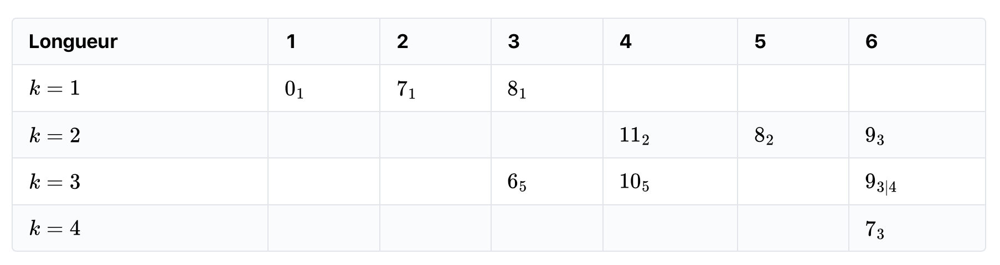

- Successeurs de $1$ : $2$ et $3$ 
- Successeurs de $2$ et $3$ : $4,5,6$
- Successeurs de $4,5,6$ : $3, 4$ - On ne sélectionne que les chemins ayant un degré inférieur
- Successeurs de $3, 4$ : $6$
- Successeurs de $6$ : $\emptyset$

Bellman possède deux conditions d'arrêt :

- $k$ s'arrête au nombre de sommets
- S'il y a deux lignes égales.

### Exemple - 2

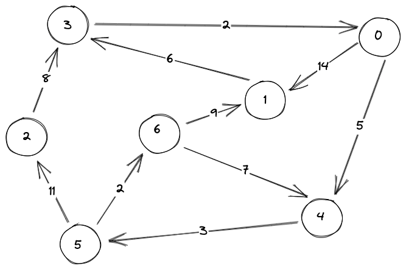

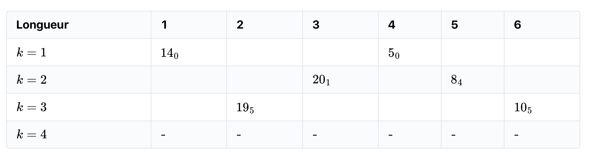

- Successeurs de $0$ = $1,4$
- Successeurs de $1,4 = 3,5$
- Successeurs de $3,5=2,6$
- Successeurs de $2,6=\emptyset$ 

À $k=4$, on arrête l'algorithme car il n'y a pas de modification d'une ligne à une autre.

### Exemple - 3

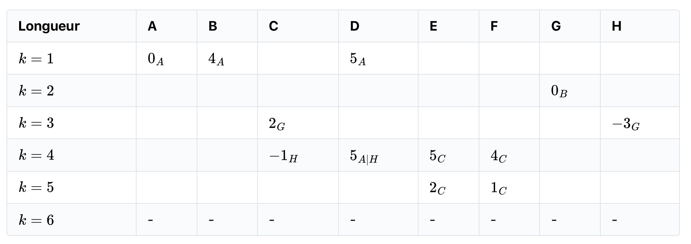

- Successeurs de `A` = `B,D`
- Successeurs de `B,D` = `G`
- Successeurs de `G` = `C,H`
- Successeurs de `C,H` = `C,E,F`
- Successeurs de `C,E,F` = `E,F`
- Successeurs de `E,F` = $\emptyset$ 

L'algorithme s'arrête car nous avons la même ligne lors de l'étape suivante.

**Note : ** Quelques erreurs sur le schéma : le `c` en haut à droite est `E`, ainsi que quelques flèches ne sont pas correctes.

## Graph absorbant

**Définition** : Circuit d'un graphe pondéré, dont la somme des poids des [arcs](https://fr.wiktionary.org/wiki/arc) est négative.

`A, C, D, E, A` est un circuit absorbant : la somme de ses valeurs est strictement négative.

| Longueur | A      | B      | C     | D     | E      |
| -------- | ------ | ------ | ----- | ----- | ------ |
| $k=1$    | $0_ A$ | $5_ A$ | $1_A$ |       |        |
| $k=2$    |        |        |       | $2_C$ | $10_B$ |
| $k=3$    |        |        |       |       | $3_D$  |
| $k=4$    | $-2_E$ |        |       |       |        |
| $k=5$    | -      | -      | -     | -     | -      |

À $k=4$, le colonne du $A$ nous apprend qu'il y a un circuit absorbant. S'il y a des modifications en $k=nb$ sommets et $k=$ nb sommets $+1$, c'est qu'il y a un circuit absorbant.

Nous détectons donc un circuit absorbant contenant `A`.	

## Ordonnancement

*Utilisons maintenant les graphes autrement. Au lieu de gérer les chemins les plus courts tels des gueux sortis du 94, nous allons nous en servir pour ordonner des tâches.*

- On travaille avec un graphe orienté.

Toutes les tâches sans prédécesseur sont liées à un état de départ commun $\alpha$.

Toutes les tâches sans successeurs sont liées à un état de fin commun $\omega$.

- On se demande s'il y a des des tâches dont on peut retarder l'exécution et quelles sont les tâches à flux tendu.

Pour cela, on dessine un tableau d'ordonnancement :

- On classe les sommets suivant leur rang **croissant**.
- On calcule les dates au **plus tôt** pur chaque sommet.
- Puis les **dates** au plus tard pour chaque sommet.
- Enfin, on calcule les **marges** pour chaque sommet, c'est à dire le retard que je peux prendre dans la réalisation de chaque tâche.

### Exercice du cours

#### Ordonnancement

| TÂCHE | LIBELLÉ      | DURÉE en SEMAINES | PRÉDÉCESSEURS |
| ----- | ------------ | ----------------- | ------------- |
| 1     | Maçonnerie   | 7                 | $\emptyset$   |
| 2     | Charpente    | 3                 | 1             |
| 3     | Toiture      | 1                 | 2             |
| 4     | Electricité  | 8                 | 2             |
| 5     | Façade       | 2                 | 3,4           |
| 6     | Fenêtre      | 1                 | 3,4           |
| 7     | Jardin       | 1                 | 3,4           |
| 8     | Plafond      | 3                 | 6             |
| 9     | Peinture     | 2                 | 8             |
| 10    | Emménagement | 1                 | 5,7,9         |

#### Graphe d'ordonnancement

Par la suite, on efface tous les sommets sans prédécesseurs, et on note le nombre de sommets "partis" pour chaque niveau, chaque rang.

On obtient donc le tableau suivant :

| Rang 1  | $\alpha$ |
| ------- | -------- |
| Rang 2  | 1        |
| Rang 3  | 2,4      |
| Rang 4  | 3        |
| Rang 5  | 5,6,7    |
| Rang 6  | 8        |
| Rang 7  | 9        |
| Rang 8  | 10       |
| Rang 9  | $\omega$ |
| Rang 10 | -        |

Le chemin avec des marges nulles est à flux tendu, on ne peut retarder aucune tâche sur ce chemin. Mais, la tâche $7$, par exemple, peut être retardée de $5$ semaines.

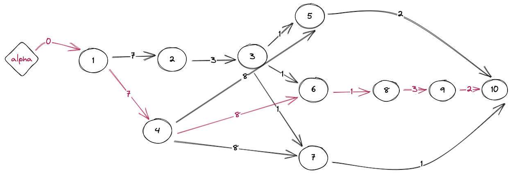

#### Exercice 2

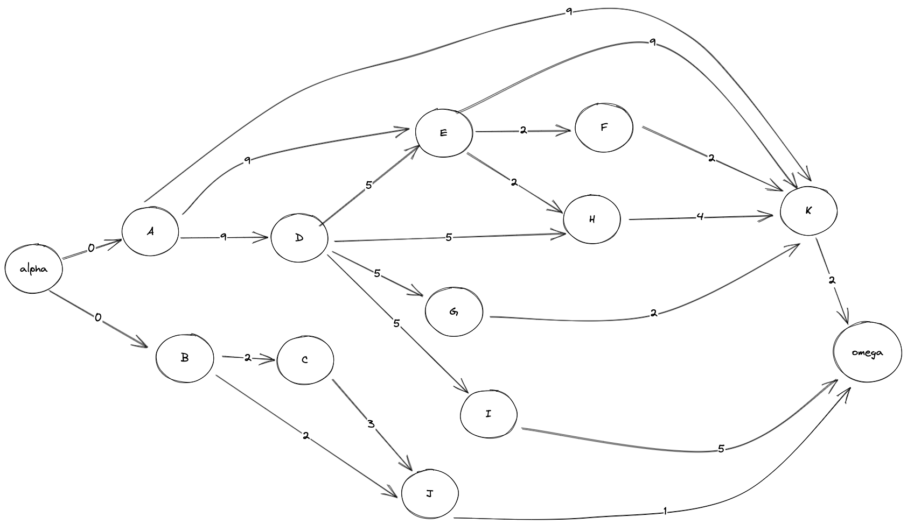

Par la suite, on efface tous les sommets sans prédécesseurs, et on note le nombre de sommets "partis" pour chaque niveau, chaque rang.

On obtient donc le tableau suivant :

| Rang 1 | $\alpha$ |
| ------ | -------- |
| Rang 2 | A,B      |
| Rang 3 | C,D      |
| Rang 4 | E,G,I,J  |
| Rang 5 | F,H      |
| Rang 6 | K        |
| Rang 7 | $\omega$ |

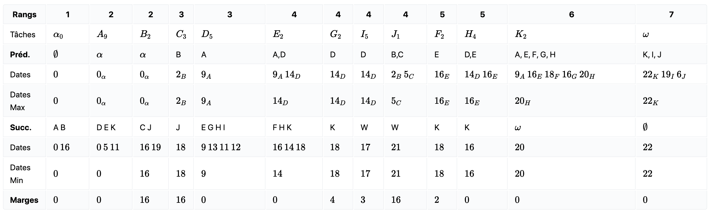

Voici le graphe avec le flux tendu.

## Arbre couvrant de poids minimum

*L'idée est de relier les sommets d'un graphe, de telle sorte à ce qu'on puisse se déplacer dans tout le graphe et que le sous-graphe généré ait un poids total de plus bas possible.*

Nous allons écrire trois algorithmes qui nous permettront de trouver l'arbre couvrant de poids minimum.

### Exemple

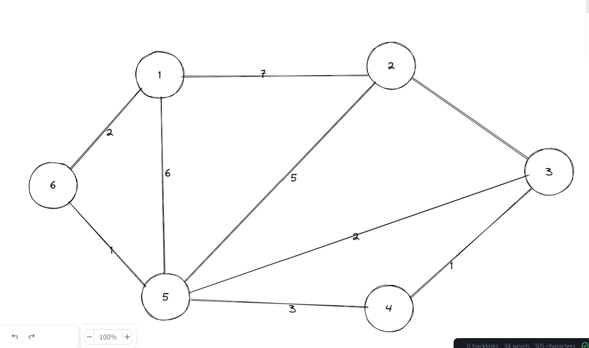

### Algorithme de Kruskal constructif

- On classe les arêtes selon un coût croissant.
- On les sélectionne dans cet ordre sans faire de cycle.
- On construit ainsi un arbre couvrant de poids minimum.

## Algorithme de Prim

*Dans l'algorithme de Prim, on part d'un sommet et on s'infiltre dans le graphe en générant un arbre couvrant. À chaque étape, on sélectionnera l'arête la moins coûteuse parmi toutes celles disponibles de sorte à faire un arbre.*

### Exemple

Il y a 9 arêtes pour l'arbre.

#### Kruskal Constructif

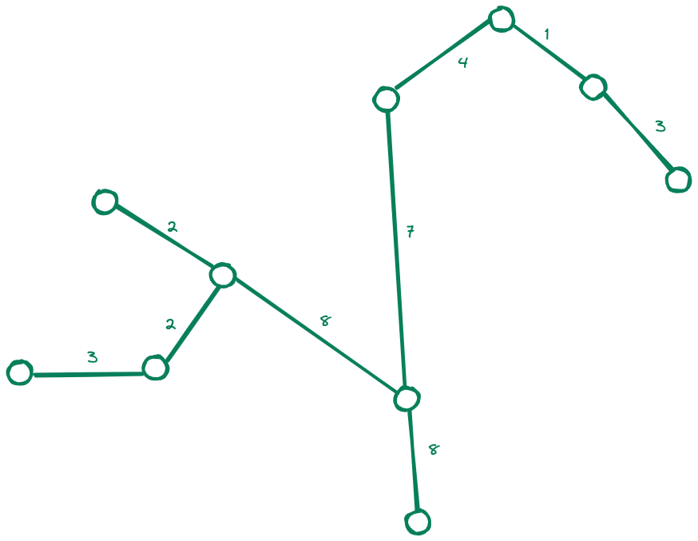

- 2 arêtes de coût 4 ne sont pas sélectionnées car il y a un cycle.
- 1 arête de coût 5 non sélectionnée car il y a un cycle.
- 1 arête de coût 6 non sélectionnée car il y a un cycle.

#### Kruskal destructif

- 18, 10, 9, 6, 5, 4

#### Prim

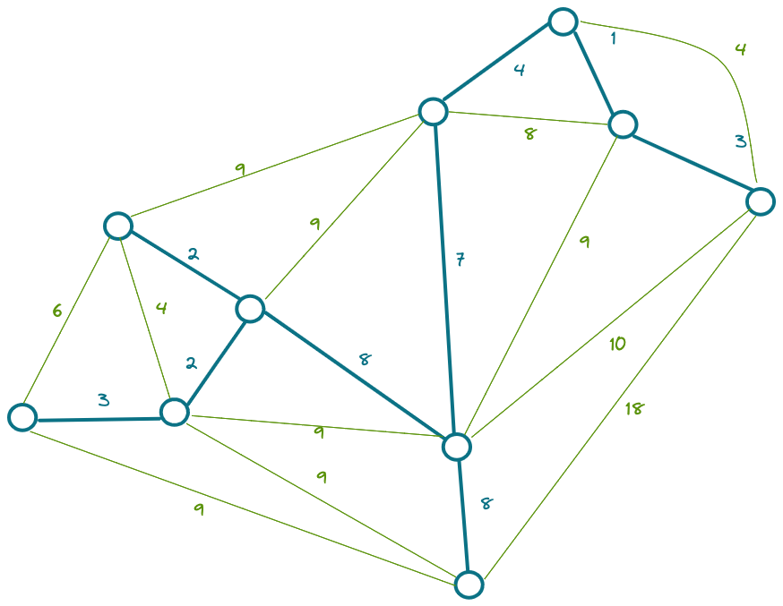

#### Dikjstra

## Nombre chromatique

L'idée est de colorier un graphe de telle façon que deux sommets distincts et adjacents aient toujours des couleurs différentes. Le nombre chromatique $X(G)$ est le plus petit nombre de couleurs pour colorier le graphe.

**Remarque :** Pour un graphe à $n$ sommets :

- $X(G) \leq n$ 
- Si le graphe est complet (Tous les liens possibles existent), alors $X(G)=n$

Dans le cas ci-dessus : $X(G)=n$

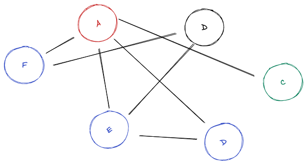

- Si le plus grand degré d'un sommet est $d$ alors $X(G) \leq d + 1$.

**Attention : ** $X(G)$ peut être beaucoup plus petit $d + 1$ 

- Si le graphe est planaire (on peut le dessiner sur une euille sans que les liens ne se croisent alors $X(G) \leq 4$ .
- Pour s'approcher de la détermination du nombre de $X(G)$,o n propose l'algo de **Welsh-Powell** :

### Welsh Powell

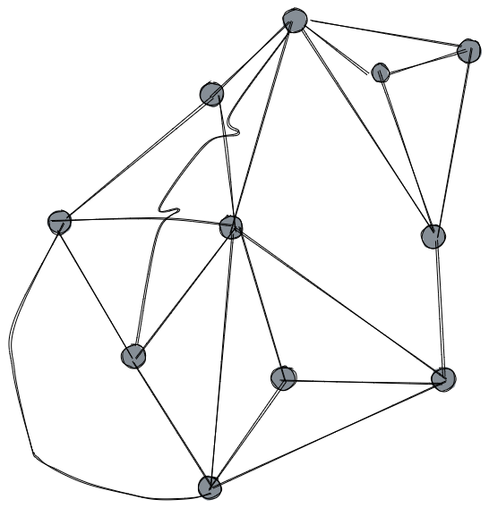

- Ecrire les degrés des sommets
- On attribue une couleur au sommet de plus haut degré
- On attribue cette couleur au smmet restant de plus haut degré
- On fait de même jusqu'à épuisement des sommets
- On répète l'opération avec une nouvelle couleur

Parfois, la coloration proposée par cet algorithme n'est pas optimale.

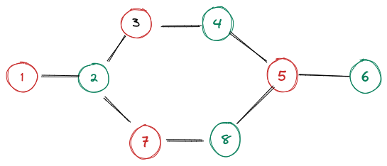

# Problèmes de transport

## Méthode Nord-Ouest

Les problèmes de transports sont des problèmes d'optimisation. Ici nous avons $n$ fournisseurs ayant des stockes et $m$ clents ayant commandé un nombre total d'objets.

L'iée dest de minimiser le coût total du transport.

|        | L1   | L2   | L3   |
| ------ | ---- | ---- | ---- |
| **S1** | 30   | 20   | 20   |
| **S2** | 10   | 50   | 20   |
| **S3** | 50   | 40   | 30   |

$S_N$ - Départ du stock

$L_N$ - Arrivée du stock

Une proposition de transport

|        | L1           | L2           | L3           |
| ------ | ------------ | ------------ | ------------ |
| **S1** | 30 - **0**   | 20 - **150** | **20 - 300** |
| **S2** | 10 - **500** | 50 - **100** | 20 - **0**   |
| **S3** | 50 - 0       | 40 - **350** | 30 - **0**   |

Coût total : $0 \times 30 + 150 \times 20 + 300 \times 20 + 500 \times 10 + 100 \times 50 + 0 \times 20 + 0 \times 50 + 350 \times 40 + 0 \times 30 = 33 000$ centimes = $330$€

*Est-ce que cette proposition est optimale ? Sinon, comment diminuer le coût ?*

Toute problématique de transport admet une proposition optimale sans cycle. Dans l'exemple, on peut essayer d'envoyer une quantité de $\Delta$ de $S_3$ vers $L_3$.

Le gain en faisant ce changement sur le coût total est de :

$30.5 - 20.5 + 20.5 -405 = -105$. Donc si $\Delta$ est $>$  à $0$ , on optimise le coût. Donc on va prendre la plus grande valeur de $\Delta$.

Compte tenu de nore situation, on peut prendre au maximum $\Delta = 300$.

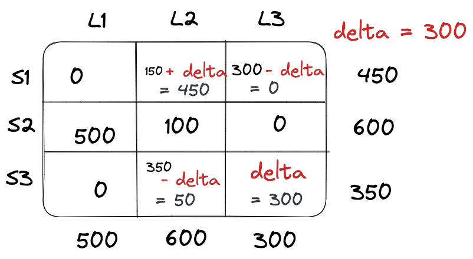

Coût total : $450 \times 20 + 500 \times 10 + 100 \times 50 + 50 \times 40 + 300 \times 30 = 30 000 = 300$. On a baissé le coût, mais la question du coût optimal se pose encore.

### Methode pour trouver la proposition optimale

D'abord, il faut se donner une premiere proposition qu'pn essayera de choisir la moins éloingée possible de la proposition optimale.

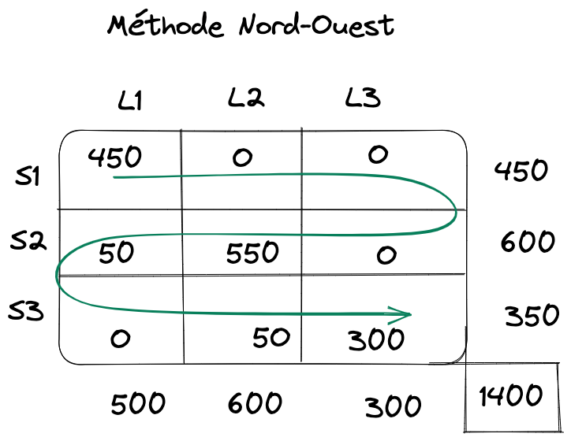

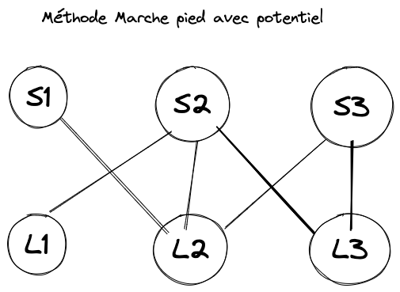

On dessine notre graphe, qui, par ailleurs, est un arbre (connexe, sans cycle) avec $n$ sommets, donc $n-1$ arêtes.

Par la suite, on fixe un potentiel à un sommet, par exemple $S_1$.

- $E(S_1) = 0$
- $E(S_1) - E(L_2) = $ coût $S_1L_2 = 20 \rightarrow E(L_2) = -20$
- $E(S_3) - E(L_2) = $ coût $S_3L_2 = 20 \rightarrow E(S_3) = 20$
- $E(S_3) - E(L_3) = 30 \rightarrow E(L_3) = -10$
- $E(S_2) - E(L_3) = 20 \rightarrow E(S_2) = 10$
- $E(S_2) - E(L_1) = 10 \rightarrow E(L_1) = 0$

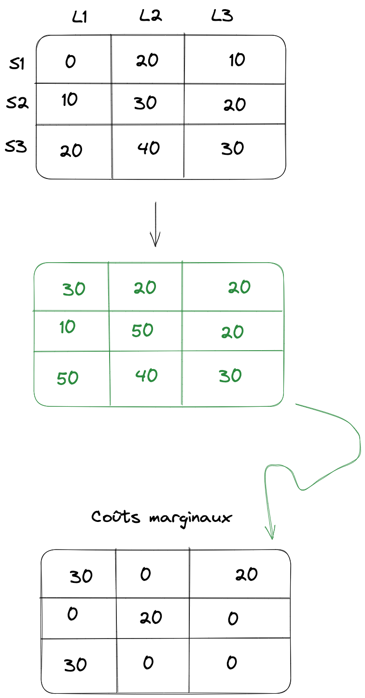

## Flot à coût maximal

Il s'agit d'un parcours en largeur et de l'algorithme de Ford Fulkerson.

## Flot à coût minimal

Cet algorithme est un mix entre Ford Fulkerson et Bellman.

### Méthode de Ford Fulkerson

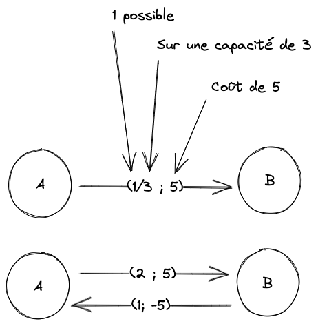

L'idée est de fixer la valeur du flot $|f|$, puis de chercher ceui à un coût minimal.

#### Exemple

**Objectif : ** Trouver un flot de valeur 4 et de coût minimal.

**Bellman** :

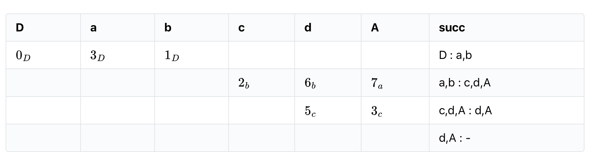

Pour aller de D à A : Le coût est de 3, et le chemin est le suivant : **D,b,c,A**.

Le flot est le suivant : 2 (Valeur minimum). Nous pouvons donc envoyer un flot de 2 sur ce chemin.

On trouve donc le graphe suivant :

Pour le coût, on fait simplement l'inverse de celui qu'on vient d'utiliser. La liaison verte correspond à la liaison initiale qui a été modifiée, les liaisons violettes sont les liaisons qui ont été crées.

**Note :** Pour le DE, seul un pas, donc l'étape qui vient d'être effectuée, sera demandé.

On refait maintenant un Bellman sur le nouveau graphe.

Le chemin pour aller de D à A est donc D, a, A, de coût 7 et de flot 1.

Il faut donc encore faire un Bellman, car nous cherchons à avoir un flot de 4 au total (actuellement $2 + 1 = 3$).

Ce qui nous donne donc le graphe suivant : 

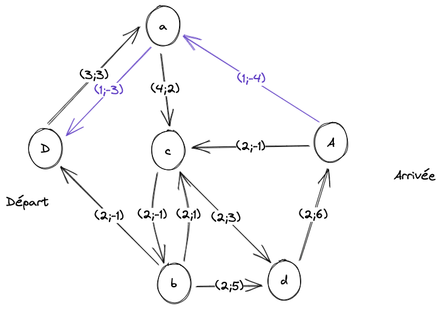

| D     | a     | b     | c     | d     | A      | succ            |
| ----- | ----- | ----- | ----- | ----- | ------ | --------------- |
| $0_D$ | $3_D$ |       |       |       |        |                 |
|       |       |       | $5_a$ |       |        | c : b,d         |
|       |       | $4_c$ |       | $8_c$ |        | b,d : c,d,A     |
|       |       |       |       |       | $14_d$ | A : $\emptyset$ |

Le chemin pour aller de D à A est donc D,a,c,d,A, de coût 14 et de flot 2.

On applique donc le fait d'envoyer un flot de 1 dans le chemin précédent, ce qui nous donne le graphe suivant.

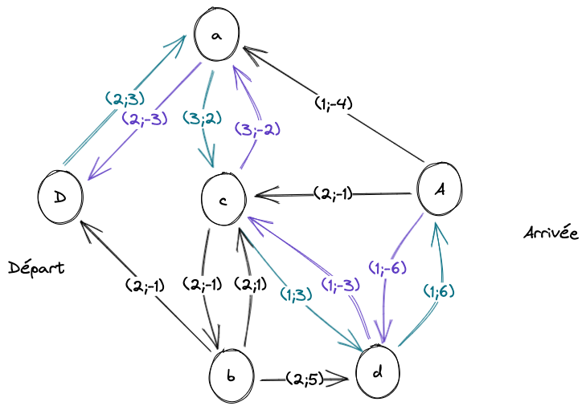

Nous pouvons donc maintenant déduire que le coût total est $2 \times 3 + 1 \times 7 + 1 \times 14 = 27$.

Ce qui nous donne le graphe initial avec des valeurs modifiées en fonction des chemins utilisés.

# Bases de la programmation linéaire

## Méthode de Simplex

**Définition:** La programmation linéaire concerne des problèmes avec des variables (quantité transportée) $x_1, x_2, x_3,...$.

Il s'agit de remplir une fonction objectif $f$ et de répondre à des contraintes (provisions, commandes, etc...).

On cherchera à maximiser $f$.

### Exemple

Considérons le programme linéaire suivant :

- Objectif : $f=5x_1 + 2x_2$

- Contraintes : 

  - $x_1 \geq 0 \space \text{et} \space x_2 \geq 0$
  - $x_2 \leq 4$
  - $-2x_1 + x_2 \leq 2$
  - $3x_1 +x_2 \leq 19$
  - $-x_1 + x_2 \geq -5$

  La première contrainte $-2x_1 +x_2 = 2$ donne le graphe suivant.

  $-2x_1 + x_2 \leq 2 \Leftrightarrow x_2 = 2x_1 + 2$

  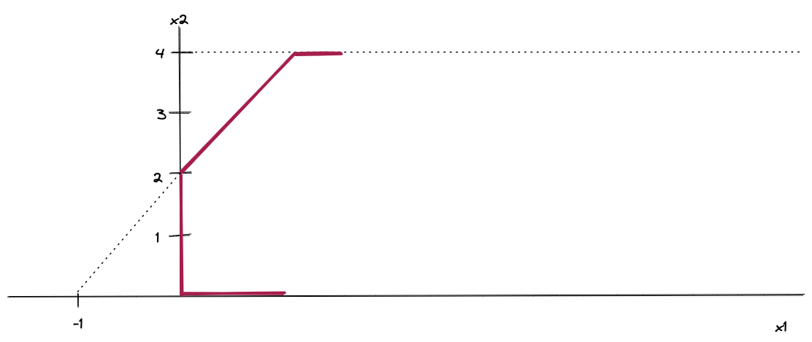

  Une fois les autres contrainets appliquées, on obtient la forme suivante :

  

- $3x_1 +x_2 \leq 19$, donc $x_1 = 6 $ et $x_2=1$ ainsi que $x_1 = 5$ donc $x_2 = 4$

- $3x_1 + x_2 \leq 19$ et $3.0+0 \leq 19$

**Maximisation de $f$ :** Maximisons $f$ dans les contraintes $f=5x_1 + 2x_2$.

On remarque qu'en fixant $f$, on obtient une droite.

Exemple : $f=1 \longrightarrow 1=5x_1 +2x_2$

- $1 - 5x_1 = 2x_2$
- $x_2=-\frac{5}{2}x_1 + \frac{1}{2}$

Généralisation : 

- $f - 5x_1 = 2x_2$
- $x_2=-\frac{5}{2}x_1 + \frac{f}{2}$

Les droites sur le graphe sont parallèles. On cherche celle ayant la plus plus grande ordonée a l'origine.

Dnas le cas général, la méthode du simplexe cherche les sommets de la forme provenant des contraintes.

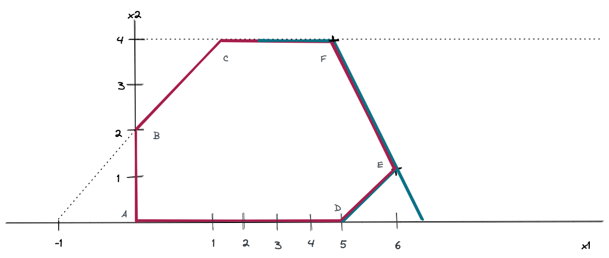

**Évaluons $f$ e nE et F** :

$f = 5x_1 + 2x_2$

- E : $x_1 = 6$ te $x_2 = 1$ nous indiquant donc : $f=32$
- F : $x_1 = 5$ et $x_2 = 4$ nous indiquant donc : $f=33$

On ne regarde que les points E et F car ce sont eux où l'ordonee à  orlneigi des droites parallèles serait la plus grande possible.

Le problème du simplexe à $n$ dimensions fera que l'algorithme se déplacera de sommet en sommet, en augmentant le plus possible $f$, jusqu'au sommet.

Il s'arrêtera au sommet où il ne pourra plus augmenter la valeur de $f$.

### Remarques

1. Si $x_1$ et $x_2$ **entiers** et que la méthode du simplexe nous amène sur des valeurs non-entières, alors l faudra évaluer les valeurs de $x_1$  et$x_2$ entières tout autour de la solution issue du simplexe, deux actions : 

- On verifie qu'elles sont dans le polyèdre
- On verifie qu'elles sont entières

2. Si on veut minimiser $f$, alors on maximisera $-f$.

### Exemple

Trouver graphiquement le maximum de $f=x+2y+2$, avec les contraintes suivantes :

- $y \geq 0$
- $x + y - 1 \geq 0$
- $x - 2y + 1 \geq 0$
- $2x + y - 6 \leq 0$

Pour respecter la première contrainte, nous obtenons le graphe suivant : 

- $x+y -1= 0$ donc $x = 0, y=1$ et $x=1, y=0$

Pour respecter la seconde contrainte, nous obtenons le graphe suivant :

- $x -2y + 1 \geq 0$, donc $x=0, y=\frac{1}{2}$ et $x=-1, y=0$

Pour respecter la troisième contrainte, nous obtenons le graphe suivant :

- $2x + y - 6=0$, donc $x=2, y=3$ et $x=3,y=0$

Nous obtenons, au final, le graphe suivant :

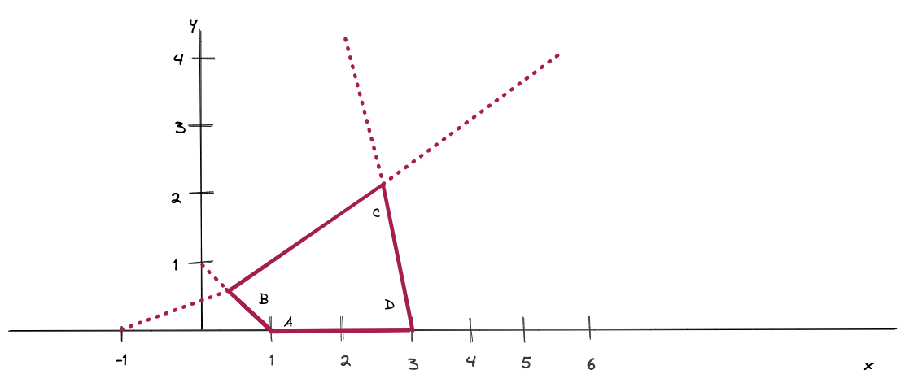

Le maximum de $f$ se trouve sur un des sommets : $A=(1;0)$.

B est à l intersection de deux droites.

- $x + y -1 = 0 \Longrightarrow x + y - 1-(x-2y+1) = 0$
- $x-2y + 1 = 0 \Longrightarrow 3y-2=0, y=\frac{2}{3}$

On obtient donc $B=(\frac{1}{3};\frac{2}{3})$.

C est à l'intersection de :

-  $x - 2y + 1 = 0$
- $2x +y -6 = 0$

Ce qui, après quelques calculs, nous donne $C(\frac{11}{5}; \frac{8}{5})$

Puis, de la même manière, $D=(3;0)$.

Efinn, évaluons $f$ ne A, B, C et D :

- $A=3$
- $B=\frac{11}{3} < 5$
- $C=\frac{37}{5} > 5$
- $D=5$

Donc, $f$ est max en $C$.
