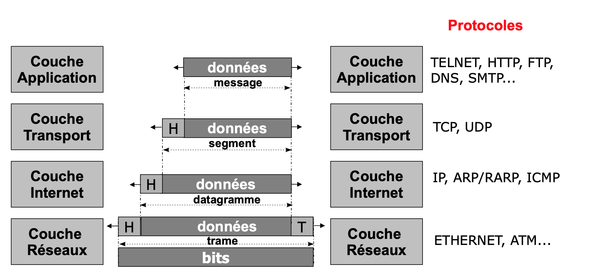
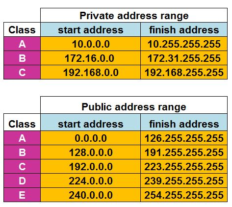
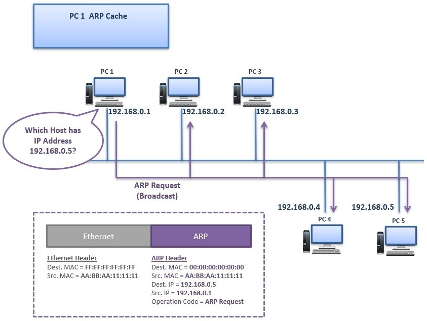
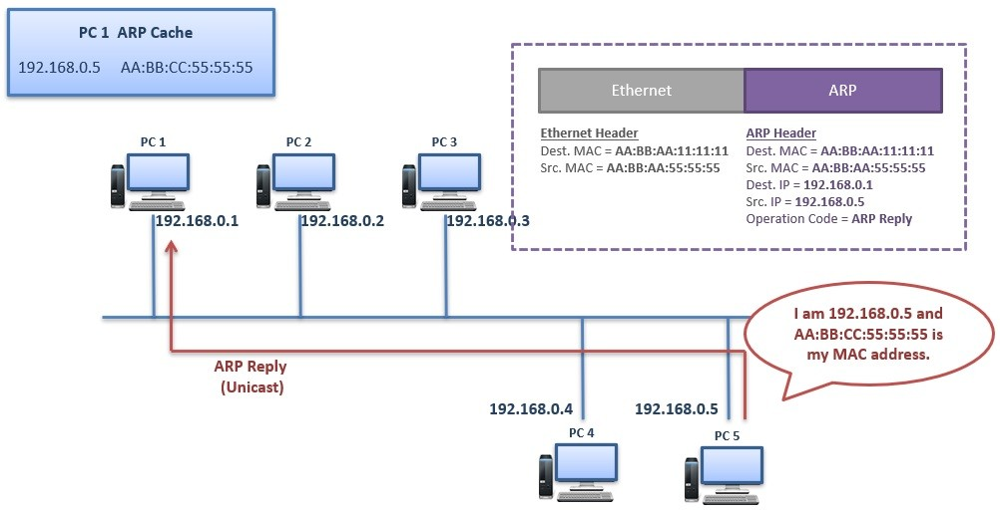
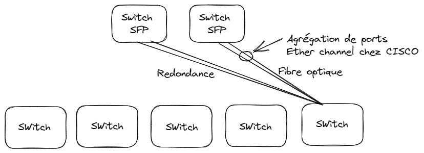
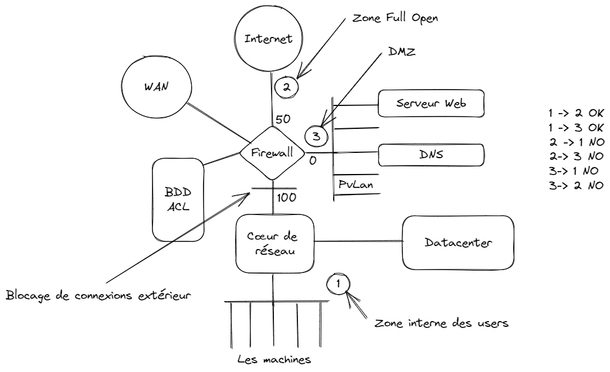
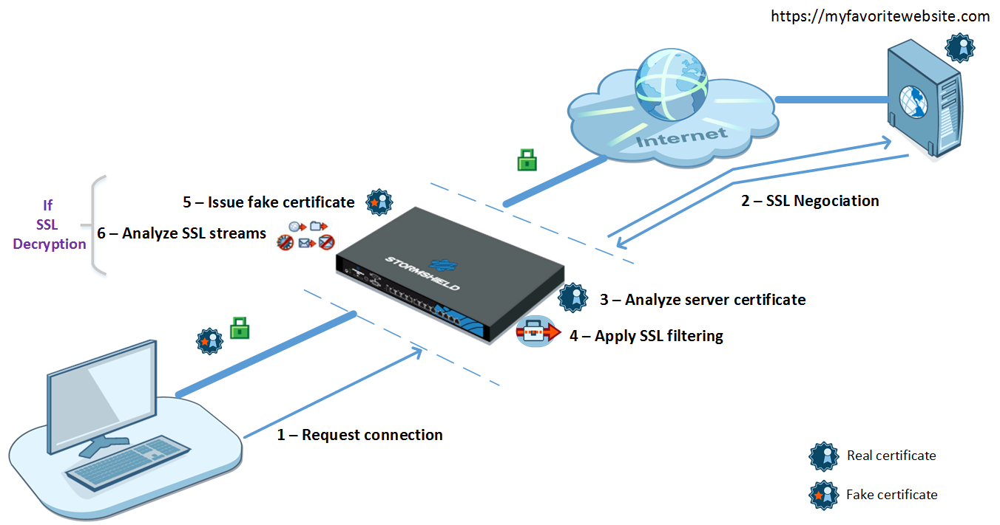
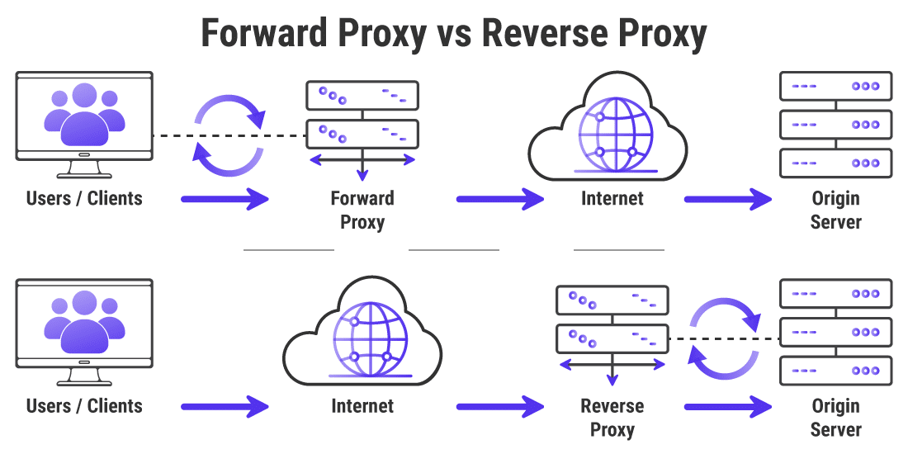
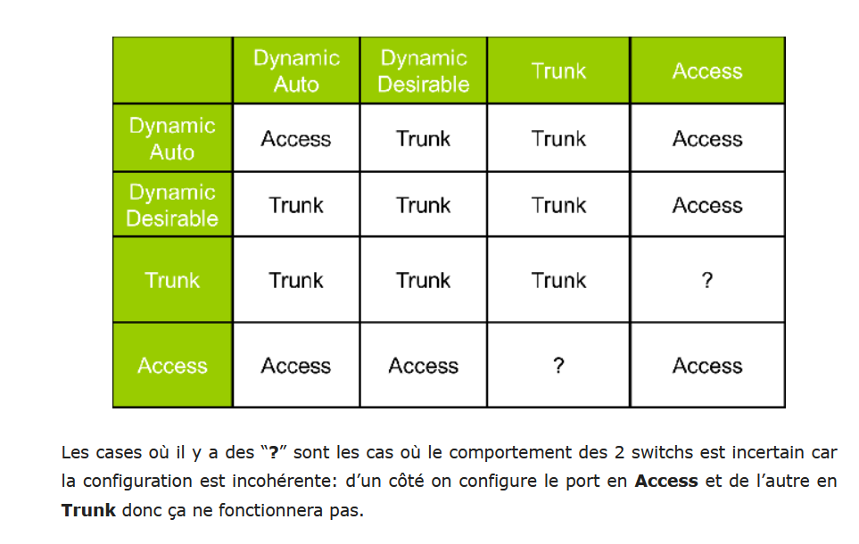

# Réseaux locaux

 Notes de cours par `Thomas PEUGNET`.

# Certifications

## CCNA

Le niveau de cette certification est décrit comme **Associate**.

Le CCNA est une certification Cisco. Une fois passée, il est possible de passer les spécialités de certification suivantes :

- Collab
- Sécurité
- Cyber
- Wireless
- Datacenter
- SP
- CCDA

## CCNP

Le niveau de cette certification est décrit comme **Professionnal**. Elle se divise en deux secteurs : Core & Edge.

## CCIE

Le niveau de certification est décrit comme **Expert**. 

# Introduction

## Liste des protocoles TCP/IP

## Fonctionnement du protocole TCP

Le protocole peut être schématisé de la façon suivante :

La taille de la fenêtre correspond au nombre d'octets qui seront envoyés par le destinataire avant que la destination n'envoie l'accusé de réception.

Le `PDU`, pour `Protocol Data Unit`, désigne le nom du type de données pour chaque couche du modèle `OSI`. 

## Adresses IPs

**Note :** Si un PC ne parvient pas à contacter le serveur DHCP pour l'obtention d'une adresse IP, il va s'en attribuer une automatiquement au sein du réseau `169.254`. Il va commencer par envoyer l'adresse qu'il vient à l'instant de générer en brodacast sur ce réseau pour demander si un autre appareil l'a déjà attribué.

## Réseau WAN/LAN

| Numéro de couche | Applicatif                                                   |
| ---------------- | ------------------------------------------------------------ |
| 1                | PC - `127.0.0.1`                                             |
| 2                | `169.254`, connexions inter appareils sans configuration préalable |
| 3                | Adresses privées                                             |
| 4                | Adresses publiques                                           |

# IPv6

On a l'adresse suivante : `2001:DB8:CAFE:1::25:1`. Elle s'écrit sur 128 bits/8=16bits/4=4bits.

Une adresse IPv6 commence toujours avec `X010` = 2 ou `X001` = 3.

- Les sites multidomiciliés ont autant d'adresses que de fournisseurs 
- Des mécanismes de renumérotation automatique permettent de changer facilement de préfixes

## Durée de vie

L’attribution d’une adresse à une interface est temporaire 

- Durée de vie : temps pendant lequel l'interface est dépositaire de l'adresse 
  - Par défaut 30 jours
- Cas particulier : une adresse lien local a une durée de vie illimitée (fe80…) 

- Renumérotation d’interface : passage d’une adresse à une autre 
- Transition via un mécanisme obsolescence
- Plusieurs adresses valides à une même interface

 

## Notation

- Cette dernière s'effectue sur 16 octets.

- En majuscules ou en minuscules ou en mixant les 2 Exemple : `2001:0db8:0000:0000:0008:0800:200C:417A`

- Par convention, on peut supprimer les `0` de poids forts non significatifs : `2001:db8:0:0:8:800:200C:417A`

- On peut abréger plusieurs champs nuls consécutifs par `::` (mais une seule fois) : `2001:db8::8:800:200C:417A`

## Exemples

# ARP

## Requête

## Réponse

# Architecture

## Switching

## Datacenter

## Fabric ACI

# Firewall

## Proxy

La différence entre un proxy et un reverse proxy est la suivante.

## Définitions

**DMZ** : *Dans le domaine des réseaux informatiques, une zone démilitarisée (**DMZ**, **Demilitarized Zone**) est un sous-réseau physique ou logique qui sépare un réseau local interne (LAN, Local Area Network) d'autres réseaux non sécurisés tels qu'Internet.*

**NAC** : Le contrôle d'accès réseau (*NAC*) 802.1X permet aux administrateurs de mettre en œuvre un contrôle d'accès uniforme sur les réseaux filaires et sans fil.

**Note :** Pour les commandes Cisco, on peut trouver une cheat sheet à [ce lien](https://www.netwrix.com/download/collaterals/PDFdownload.php?pdf=Cisco_Commands_Cheat_Sheet.pdf).

# Notes rapides

Différence entre deux types de ports : Ports taggés et non-taggés. Si un port est taggé, cela signifie qu'il se trouve entre un Switch L3 et un autre équipement de type réseau. S'il n'est pas taggé, cela signifie qu'il est relié à un appareil de fin, type PC ou serveur.

Un port qui récupère plusieurs VLAN est appelé Trunc. On peut les configurer pour qu'ils n'acceptent que certains VLANs.

*Le protocole de jonction VLAN (VTP) **réduit la gestion dans un réseau commuté**. Quand vous configurez un nouveau VLAN sur un serveur VTP, le VLAN est distribué par tous les commutateurs dans le domaine. Ceci réduit la nécessité de configurer le même VLAN partout.*

# Configuration VTP

Sur le coeur, passer en mode serveur

Sur chaque switch, activer le mode client

On configure les VLAN uniquement depuis le serveur, car pas autorisé depuis le client.

Depuis le serveur, on sélectionne le VLAN qu'on veut parametrer en tapant vlan NN, puis on tape name XXXX avec XXXX le nom du VLAN que l'on souhaite lui attribuer.

Pour voir les VLANs configurés, show vlan

Il faut maintenant assigner un port à un VLAN.

Sur le client, on peut voir que les vlans configurés sur le client sont ceux pas défaut. Ceux configurés sur le serveur ne sont pas partagés visiblement.

Ensuite, sur le serveur, il faut passer tous les ports en trunk

Enfin, on configure les ports sur chaque switch pour créer le VLAN

# Configuration Backbone

Créer 3 routeurs, relier les multilayer switch et les routeurs, créer un serveur.
