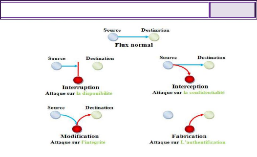
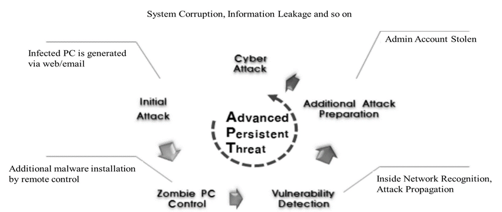
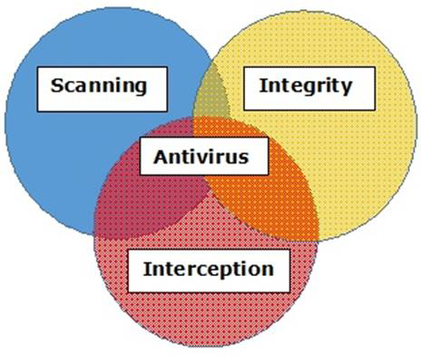
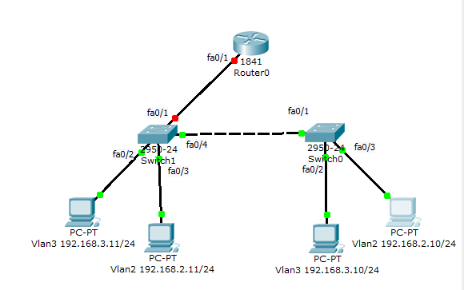
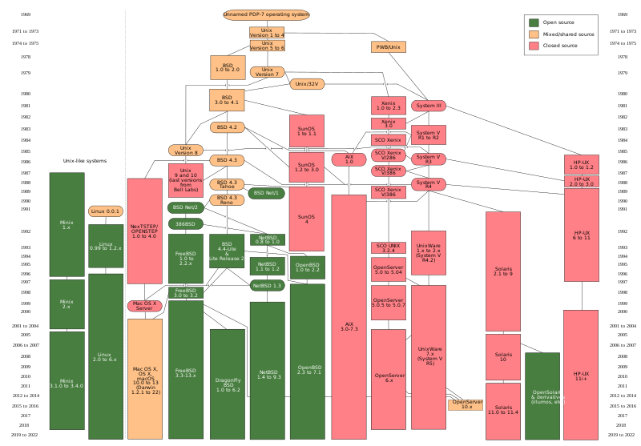
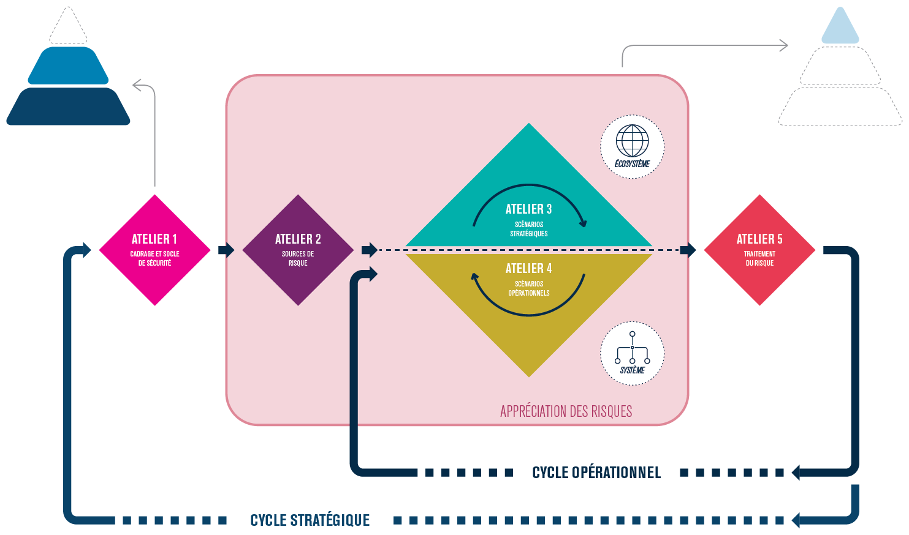
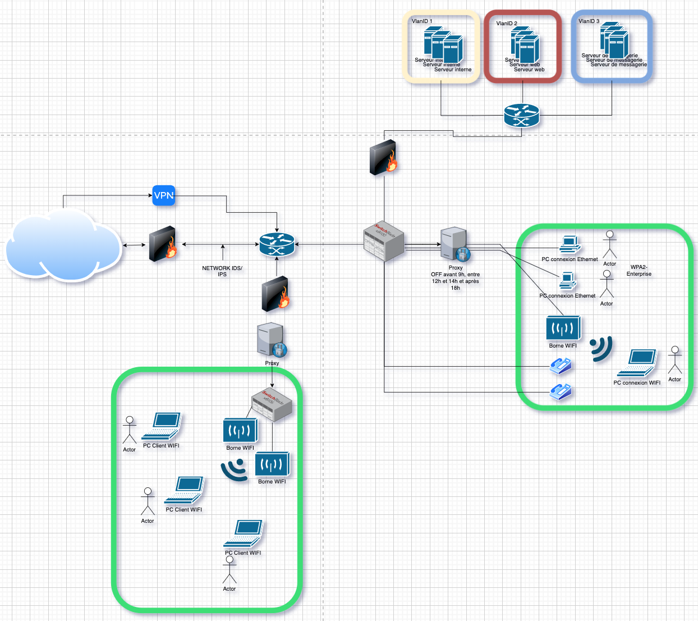

# Sécurité des systèmes d'information

Notes de cours par `Thomas PEUGNET`.

# Introduction

### Définition

*Le système d'information d'une organisation contient un ensemble d'actifs.*

- Actif : Tout élément ayant de la valeur pour l'organisme et nécessitant, par conséquent, une protection.

La sécurité des systèmes d'information est l'ensemble des moyens techniques, organisationnels et humains nécessaires et mis en place pour garantir le fonctionnement d'un système d'information, dan sl'objectif qu'il s'est donné, et protéger les actifs de l'organisation.

## Les besoins de sécurité

### Introduction aux critères DIC

- *Comment définir le niveau de sécurité d'un bien du SI ? Comment évaluer si ce bien est correctement sécurisé ?*

### Mécanismes de sécurité

**Objectif :** atteindre les besoins DICP

- **Disponibilité**
   L'information doit être continuellement disponible.
- **Intégrité**
  L'information ne doit pas être altérée.
- **Confidentialité**
  L'information doit être uniquement accessible aux personnes autorisées.
- **Preuve**
  Tous les mouvements de données doivent être tracés.

|                                                 |                                                              | D    | I    | C    | P    |
| ----------------------------------------------- | ------------------------------------------------------------ | ---- | ---- | ---- | ---- |
| **Anti-virus**                                  | Mécanisme technique permettant de détecter toute attque virale qui a déjà été identifiée par la communauté sécurité. | ✅    | ✅    | ✅    |      |
| **Cryptographie**                               | Mécanisme permettant d'implémenter du chiffrement et des signatures électroniques. |      | ✅    | ✅    | ✅    |
| **Pare-feu**                                    | Équipement permettant d'isoler des zones réseaux entre-elles et ne n'autoriser le passage que de certains flux seulement. | ✅    |      | ✅    |      |
| **Contrôle d'accès logistiques**                | Mécanismes permettant de restreindre l'accès en lecture/écriture/suppression aux ressources aux seules personnes dument habilitées. |      | ✅    | ✅    | ✅    |
| **Sécurité physique**                           | Mécanismes de protection destinés à protéger l'intégrité physique du matériel et des bâtiments/bureaux. | ✅    | ✅    | ✅    |      |
| **Capacité d'audit**                            | Mécanismes organisationnels destinés à s'assurer de l'efficacité et de la pertinence des mesures mises en oeuvre. Participe à l'amélioration continue de la sécurité du S.I. | ✅    | ✅    | ✅    | ✅    |
| **Clauses contractuelles avec les partenaires** | Mécanismes organisationnels destinés à s'assurer que les partenaires et prestataires mettent en oeuvre les mesures nécessaires pour ne pas impacter la sécurité des SI de leurs clients. | ✅    | ✅    | ✅    | ✅    |
| **Formation et sensibilisation**                | Mécanismes organisationnels dont l'objectif est d'expliquer aux utilsateurs... | ✅    | ✅    | ✅    | ✅    |

`MAC`: Mandatory Access Control (SELinux, Apparmor etc.)

`DAC`: Discretionary Access Control

### Vulnérabilités, menaces, attaques

**Vulnérabilité :** Faiblesse au niveau d'un bien, selon les critères suivant :

- Conception
- Implémentation
- Installation
- Configuration
- Utilisation

**Menace :** Cause *potentielle* d'un incident, qui pourrait entrainer des dommages sur un bien si cette menace se concrétisait.

**Attaque :** Action malveillante, destinée à porter atteinte à la sécurité d'un bien. Une attaque représente la **concrétisation** d'une menace, et nécessite **l'exploitation d'une vulnérabilité**.

**Schéma relationnel sécurité/protection** :

### Niveau de criticité

Ce niveau est noté par un CVSS, pour Common Vulnerability Scoring System.

- **Métrique de base : ** métrique intrinsèque à la vulnérabilité : vecteur d'accès, authentification, impacts DIC.
- **Métrique temporelle** : métrique dépendant de l'évolution dans le temps.
- **Métrique environnementale :** métrique évoluant en fonction de l'environnement.

### Sources d'information

Il existe plusieurs entités pouvant délivrer des informations.

- ANSSI
- CERT
- CNIL
- CLUSIF
- La presse 
  - 01Net, Clubic, Rue89 ...

# Mise en place

## Sécurité des réseaux

### Les attaques

Il existe différents types d'attaques.

**Exemple** : ARP Poisonning (Interruption)

> Les entrées dans une table ARP ayant une durée de vie, un attaquant peut simuler de très nombreux nouveaux appareils, avec des adresses mac différentes, remplaçant donc les entrées déjà existantes.

Il existe deux grands catégories d'attaques, ==passives== ou ==actives==.

### Démarche de l'attaquant

1. Reconnaissance, scan et énumération de services
2. Découverte des vulnérabilités
3. Intrusion et exploitation des vulnérabilités
4. Escalade de privilèges
5. Vol d'information, Déni de service
6. Maintien de l'accès (APT) - `Advanced Persistence Threat`
7. Destruction des traces (Furtivité)

`suid`: Super User ID - Droit maximal sur un appareil.
`r`, `x`, `w`, mais aussi `s`.

**Note : ** le fichier contenant les credentials des utilisateurs se trouve dans `/etc/Shadow`.

**Backdoor** : Numéro de port TCP ouvert dans l'objectif de faire une entrée dans le système, inconnue par la victime.

`syslog`: logiciel sous forme d'API permettant de centraliser les logs (impossible de supprimer les logs si on est pas `root`, et encore.)

#### `APT` - Advanced Persistent Threat

Source de données : MITRE Att&ck

### Sécurisation

#### Pare-feu

*Un pare-feu se définit comme un équipement en coupure entre 2 ou plusieurs réseaux. Il inspecte les paquets réseaux entrants et sortants d'un réseau à l'autre. Il implémente également un mécanisme de filtrage basé sur des règles. Il ne transmet donc que les paquets réseaux qui respectent les règles de filtrage implémentées dans a configuration du pare-feu.*

**Stateless vs Statefull** : 

Les solutions les plus connues sont les suivantes : 

- Paloalto
- Fortinet
- Check point
- Sense

#### Load-balancer

*Équipement rencontré sur les grosses infrastructures où les serveurs* *doivent faire face à de très fortes bandes passantes et charges élevées de* *trafic.*

- Équipement chargé de répartir/distribuer la charge réseau en fonction
  des caractéristiques de celui-ci et de la disponibilité des serveurs
- Sécrutié : permet de mieux se protéger contre les dénis de service distribués.

Il peut être représenté de la façon suivante.

#### Anti-virus

*Logiciel chargé de détecter et stopper les malware connus.*
*Ces logiciels fonctionnent en général avec une base de données qui contient* *les signatures des malware connus. Ils analysent en permanence les fichiers* *et les exécutables du système hébergeant l'anti-virus.*

- Limite des anti-virus : ils ne détectent (en général) que les malware déjà
  répertoriés par les éditeurs. Ainsi, les nouveaux virus ou les malware ciblés
  ne sont souvent pas détectés. D'autre part, il est impératif que l'anti-virus
  soit mis à jour quotidiennement.
- Solution : utilisation des méthodes de l'intelligence artificielle (IA)
  comme l'apprentissage machine (Machine Learning) ou l'apprentissage
  profond (Deep Learning) pour détecter les comportement anormaux.

Il doit répondre à ces trois exigences.

A noter qu'un anti-virus peut être déployé en **local** mais aussi sur un **pare-feu**, permettant d'analyser les flux réseaux. (Problèmes : performances)

Il serait à ce moment assimilé à un IDS.

**IDS** : Intrusion Detection System - **Alertes**
**IPS** : Intrusion Prevention System - **Blocages**

**Note** : Un IPS doit toujours se trouver en coupure de flux, afin d'avoir la possibilité de couper le trafic lorsque cela est nécessaire.

#### VPN

Un VPN est un réseau virtuel qui permet à deux réseaux distants de communiquer en toute sécurité, y compris si la communication s'effectue via des réseaux inconnus et auxquels nous ne faisons pas confiance. 

**Exemple** : Entreprise qui souhaite pouvoir faire faire du télétravail à ses employés.

#### Segmentation

*Un principe majeur de la Sécurité est celui du moindre privilège : **On ne doit donner les droits d'accès à une ressource qu'aux seules** **personnes/entités ayant un besoin légitime d'y accéder.*** 

*Appliqué au domaine réseau, il est donc fait recours à de la segmentation afin de séparer le réseau en différentes zones. Les droits d'accès à ces zones doivent ensuite être filtrés afin de n'autoriser que les flux nécessaires entre chaque zone.*

Exemple : VLAN : Réseau virtuel cloisoné à l'aide de switch. Chaque application tournant dans un VLAN n'a accès qu'aux applications dans ce même VLAN, rien d'autre.

## Architecture des OS

Il existe différentes architectures de noyau.

#### Noyau monolytique

**Monolytique** : Noyau en un seul bloc.
**Modulaire/non-modulaire** : Est | n'est pas modifiable à chaud, après chargement.

#### Noyau Hybride

Utilisation d'un micro noyau permet de gagner en sécurité, car la plupart des pilotes sont stockés dans le binaire. 

C'est comme ça que fonctionne macOS et Windows. Ce dernier n'est cependant pas parti d'un projet open source. macOS est parti ainsi de `freeBSD`.

#### Exo-noyau

Par la suite, l'achitecture du kernel pourrait être vue de façon différente, avec l'intégralité des pilotes stockés dans l'OS, et un kernel qui n'aurait pour fonction que de sécuriser les échanges.

#### Hierarchie des OS

#### 9 Commandements UNIX

- Conscision merveilleuse

- Programme qui font une seule chose

- Concevez le prototype des que possible

- Préférer portabilité
- -- Slide manquante --

### Distribution Linux

Le programme d'installation va s'adapter aux différents composants matériel de la machine. 
Le bootloader va déterminer comment démarrer sur la partition système.
`systemd` va s'occuper de la gestion des différents services, le tout géré par des binaires.
Le `shell` va permettre d'intéragir directement avec le système, par l'intermédiaire de commandes ou de `syscall`.

Le premier logiciel à avoir été proposé dans un magasin d'application est `gcc`.

## Durcissement des OS

Les 3 grands principes de durcissement des OS sont les suivants :

- Minimisation
- Défense en profondeur
- Moindre privilège

**Sticky bit** : `t` ajouté à la fin de `user--group--other` `t`. Il indique que le dossier/fichier, bien qu'il soit lisible par tous, n'aura pas la possibilité d'être supprimé.

**Permissions (octal)** : 

-  `r` = 4
- `w` = 2
- `x` = 1

## EBIOS Risk Manager

### Atelier 1

**Objectif :** Définir le cadre de l'étude et du projet, son périmètre métier et technique

## Gestion quotidienne et sécurité opérationnelle

## Normes et audits

# Droits des NTIC et loi RGPD

# Gestion des risques

# TDs

## TD1

Exercice 1 :

1) **Hacker** : hacker provient de l’anglais to hack signifiant bidouiller, modifier ou bricoler un système déjà existant.

    **Black hat hacker** : Black hat hacker est un pirate Informatique.

    **White Hat hacker** : white Hat hacker est un hacker éthique autoriser a pirater un système par une entreprise de manière a tester les failles d’un produit.

    **Grey Hat Hacker** : Grey Hat Hacker est un pirate informatique effectuant les mêmes activités qu’un white Hat Hacker avec les mêmes intentions mais de manière illégale sans autorisation d ‘une entreprise.

    **Red Team** : Red Team est une équipe représentant des attaquants / pirate informatique de manière légale dans une entreprise pour simuler une attaque.

   **Blue team** : Blue Team est une équipe représentant des défenseurs lors d’une attaque informatique dans une entreprise, leur but est de protéger l’entreprise de la Red team.

   **Script** **kiddies** : Script kiddies est un pirate informatique manipulant des logiciels malveillants qu’il ne maitrise pas et qui preuve causer de grave dommage.

   **carders** : Carder est un terme désignant une personne dérobant des informations bancaire, peut importe la manière.

    **phreakers** : phreakers est un terme désignant une personne utilisant de manière frauduleuse un système téléphonique.

   **Crackers** : Crackers désigne une personne casse des sécurités des système informatique par exemple : jailbreak, crack de jeu vidéo.

    **Hacktivist** : Hacktivist est un terme désignant un groupe ou une personne défendant une cause grâce au hacking, les plus connus sont par exemple les Anonymous

2) Métiers de la cybersécurité :
   - Pentester 
   - RSSI
   - Architecte en cybersécurité
   -  Gestionnaire de risques
   - Ingénieur en sécurité     

3) La Russie, La Corée du nord et les états unis sont des états nations en pointe dans le domaine du malware. Malware : Pegasus, Stuxne

4) Bien support : Usine, machine, serveur
   Exemple : CA (autorité de certification) : Certificat falsifié par des hacker, confiance anéantis, serveur a été attaquer, CA fais faillite car plus de confiance

5) Cybersécurité : 

6) Ransomware, la différence avec un crypto locker est que le ransomware garde les données à la disposition des hackers, et ils peuvent ensuite les utilisés en menaçant de les fuités.

7) Supply chain attack : orion (2020) 
   log4j : 

8) Fail de conception : Telnet, DHCP, authentification MAC (MAC changer)

    Fail d’implémentation : Heart bleed -> openssl, buffer overflow 

    Fail d’installation : mettre un serveur dans une salle non adapté (accessible, pas climatisé)
    installer apache (gère la connexion d’un serveur) dans un dossier accessible par tous.

    Fail de configuration : Mauvaise configuration d’un firewall, défaut de mot de passe.
    **Solution :** Hardening (Durcissement), configuration peut être tester sur **qualys sur ssllabs**

    Fail d’utilisation :

9) cve sur internet (Common vulnerabilities and exposures), CISA most exploited vulnerabilities

## TD2

Problèmes : 

- Switch au milieu : SPOF
- Routeur pour les VLANs 1 2 et 3 : SPOF

Solution : Ajouter des Loadbalancer type f5 ou VMware

Proposition de redondance hors site :

